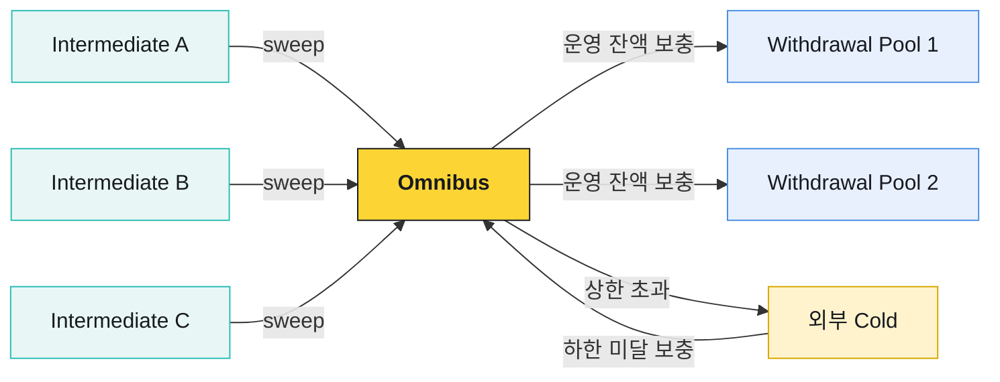
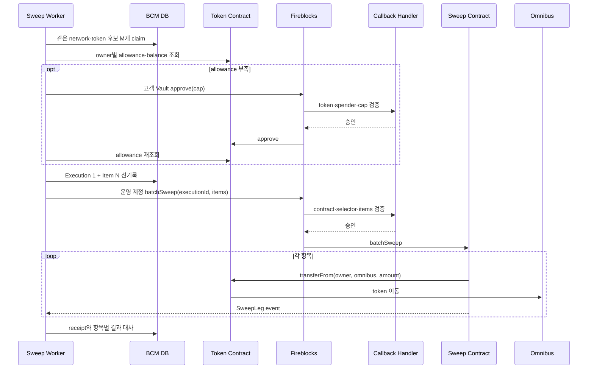

# Sweep과 Hot·Cold 배치

Sweep은 고객별 입금 Vault의 자산을 omnibus로 모으는 내부 온체인 이동이다. 고객 잔액은 DAW-CORE 원장에 이미 반영돼 있으므로 sweep 성공·실패가 고객 잔액을 다시 증감시키지 않는다.

## 세 종류의 Hot Vault

| Vault | 용도 | 고객 원장과의 관계 |
|---|---|---|
| Intermediate | 고객별 입금 식별·수신 | 입금 귀속 후 장기 보관하지 않음 |
| Omnibus | 고객 자산의 중앙 보관·treasury 기준점 | 고객 잔액 합계와 대사 |
| Withdrawal pool | 외부 출금 nonce·처리량 분산 | omnibus에서 운영 잔액 보충 |



## Sweep 트리거

입금 `FINALIZED`를 관찰하면 `(customer Vault, network, asset)`을 sweep 후보로 표시한다. 실제 실행은 주기 worker가 다음 조건을 다시 확인한다.

- 현재 Vault balance가 최소 금액·총자산 비율 기준을 넘는가
- 컴플라이언스·운영 정책상 이동 가능한 상태인가
- network·asset·sweep contract가 활성화돼 있는가
- 수수료 관측값이 운영 한도 안인가
- 같은 대상이 다른 batch에 claim되지 않았는가
- allowance와 실제 balance를 제출 직전에 다시 읽었는가

후보 표시와 실행을 분리하면 입금 폭주가 곧바로 transaction 폭주로 이어지지 않는다.

## `approve + transferFrom` 배치

고객 Vault가 token contract에 sweep contract의 allowance를 승인한 뒤, 운영 계정이 여러 Vault의 자산을 한 batch call로 모은다.



## 실행 의도

Fireblocks transaction을 만들기 전에 DB에 실행과 항목을 기록한다.

| 실행 record | 항목 record |
|---|---|
| execution ID | item sequence |
| network·token·contract | owner Vault·address |
| item count·total amount | requested amount |
| canonical calldata hash | actual amount |
| policy·config version | success·failure code |
| externalTxId·vendor tx ID | receipt log index |

Callback Handler는 실제 calldata를 선기록한 실행 의도와 비교한다. DB를 읽을 수 없거나 item 순서·금액·contract code hash가 다르면 서명하지 않는다.

## 부분 성공

최상위 contract call이 `COMPLETED`여도 모든 item이 성공한 것은 아니다. 각 `SweepLeg` event와 omnibus balance 증가를 대조한다.

- 성공 item은 source balance가 기준 아래로 내려갔는지 확인한 뒤 후보를 닫는다.
- 실패 item은 claim을 풀고 최신 balance·allowance로 다음 회차에서 다시 판단한다.
- event가 없거나 중복·순서·owner가 다르면 성공을 추정하지 않고 격리한다.
- fee-on-transfer·rebase 같은 token은 requested amount와 actual amount가 다를 수 있어 asset별 지원 정책이 필요하다.
- 같은 execution ID는 DB와 contract 양쪽에서 재사용을 막는다.

## Allowance 운영

Allowance는 반복 sweep을 가능하게 하지만 장기 인출 권한이기도 하다.

- `uint256.max` 대신 Vault·token별 operational cap을 둔다.
- 예정 sweep 금액 이상이면 재승인하지 않는다.
- cap을 바꿀 때 active batch가 없는지 확인하고 필요하면 `approve(0)` 확정 후 새 cap을 설정한다.
- spender는 현재 승인된 sweep contract 한 곳으로 제한한다.
- 잔여 allowance, cap 초과 시도, 예상 밖 spender를 상시 감시한다.
- 사고 시 transaction 차단 → contract pause → operator 제거 → 전체 Vault allowance revoke 순서로 회수한다.

Fireblocks Policy, Callback Handler, sweep contract가 같은 제한을 서로 독립적으로 확인한다. 한 계층의 설정 실수로 임의 주소 인출이 가능해지지 않도록 하는 구조다.

## Gasless와 수수료

`approve`와 `batchSweep`은 contract call이며 지원되는 경로에서는 relay가 gas를 낸다. Gasless가 자산 이동 권한이나 allowance를 대신 만드는 것은 아니다.

블록체인 매니저는 fee estimate를 주기적으로 관측하고 실제 transaction의 receipt 비용과 비교한다.

```text
예상 수수료 = fee estimate의 시점별 관측값
실제 수수료 = receipt gasUsed × effectiveGasPrice
월 대사 = 실제 수수료 합계 ↔ relay·vendor invoice
```

견적은 sweep 시점을 선택하는 입력이고 회계 증빙은 실제 receipt다. network 혼잡 때문에 fee가 한도를 넘으면 후보를 보존한 채 다음 회차로 미룬다. 장기간 지연되면 intermediate 잔액 집중 위험을 경보한다.

## Hot·Cold 밴드

Hot 자산 비율이 운영 상한을 넘으면 omnibus에서 고정된 외부 cold 주소로 이동하고, 하한 아래면 cold 운영 절차로 omnibus를 보충한다.

| 흐름 | 계산·승인 | 실행 |
|---|---|---|
| Hot → Cold | DAW-CORE Treasury/Admin이 환율·NAV·원장 snapshot으로 제안 | 블록체인 매니저가 고정 목적지·금액 검증 후 제출 |
| Cold → Hot | 외부 cold의 오프라인 승인·서명 | 입금 FINALIZED 확인 후 withdrawal pool 보충 |

블록체인 매니저는 고시환율·NAV와 규제 자산 비율의 정본을 갖지 않는다. DAW-CORE가 immutable snapshot과 이동안을 만들고, 블록체인 매니저는 승인된 수량을 멱등 제출·대사한다.

### 미정산 Delta

온램프·오프램프는 원장을 먼저 반영하고 온체인 이동을 나중에 할 수 있다. 따라서 밴드 계산과 대사에는 미정산 방향을 반영한다.

```text
규제 기준 고객자산
= 관찰한 온체인 커스터디
  + 미정산 회사→고객
  - 미정산 고객→회사
```

자산·network별로 수량을 먼저 집계하고 환율·NAV를 적용한다. 분모뿐 아니라 실제 자산이 hot·cold 어디에 있는지에 따라 분자도 같은 snapshot에서 조정한다.

## 고객 원장과의 관계

| 이동 | 고객 잔액 변화 | 큐 이벤트 |
|---|---|---|
| Intermediate → Omnibus sweep | 없음 | 없음 |
| Omnibus → Withdrawal pool 보충 | 없음 | 내부 운영 기록만 |
| Omnibus → Cold | 없음 | Treasury 실행·감사 기록 |
| Cold → Omnibus | 없음 | 입금 관찰과 Treasury 대사 |
| 고객 출금 | 있음 | `withdrawal-events` |

보관 위치를 옮기는 내부 이동과 고객 권리 변동을 구분한다. 내부 이동을 고객 거래 내역으로 노출하거나 고객 잔액을 다시 차감하지 않는다.

## 운영 점검

- [ ] 입금 확정은 실행이 아니라 sweep 후보 표시만 만든다.
- [ ] allowance·balance를 제출 직전에 온체인에서 다시 읽는다.
- [ ] Execution 1:N Item을 transaction 전에 선기록한다.
- [ ] 최상위 완료가 아니라 item event와 실제 balance로 성공을 판정한다.
- [ ] Policy·Callback·contract가 목적지·selector·금액 상한을 각각 강제한다.
- [ ] allowance revoke와 contract pause 훈련이 있다.
- [ ] 고객 원장과 내부 자금 이동을 분리한다.
