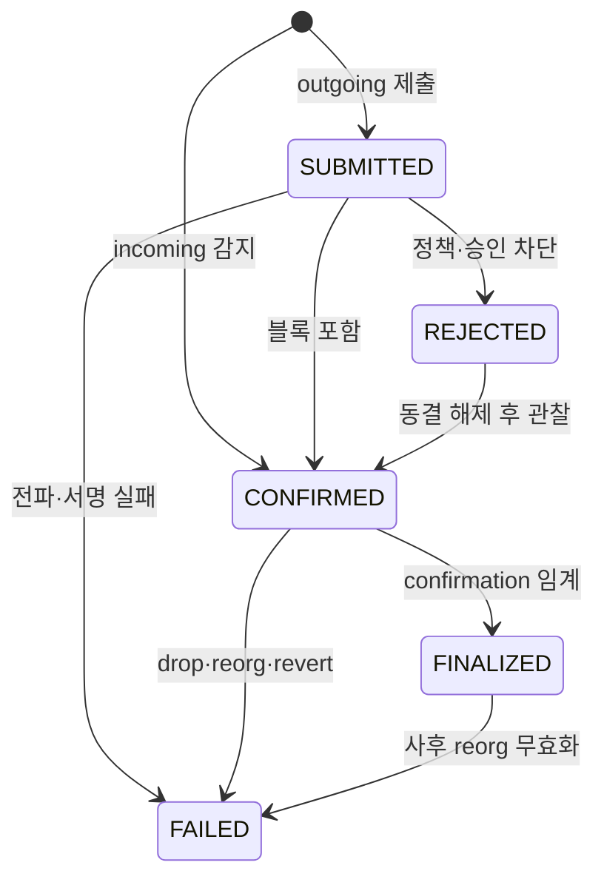
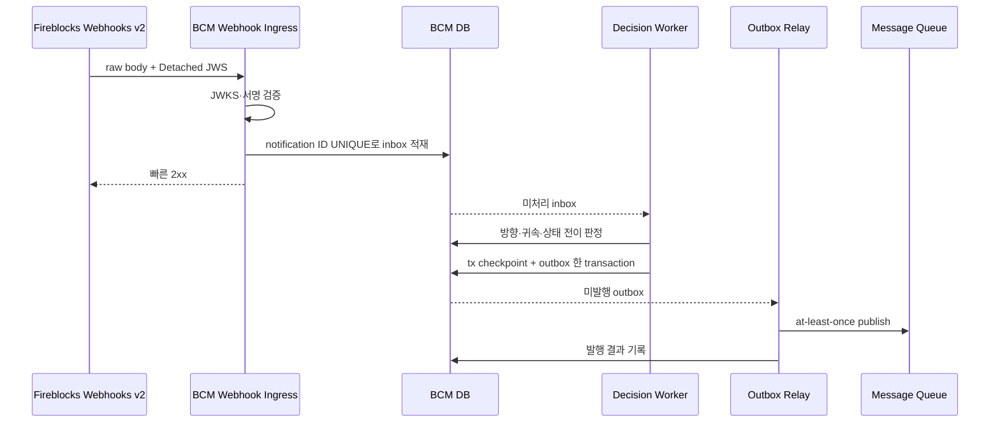
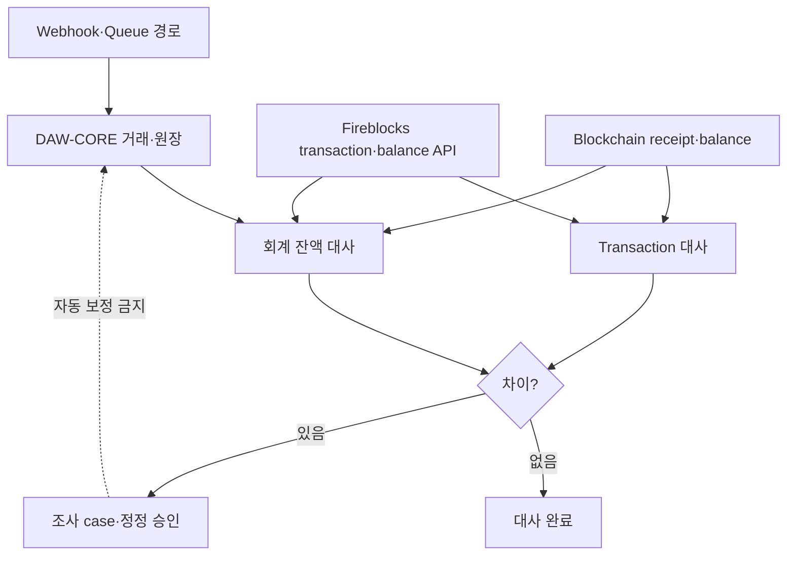

# 공통 상태와 이벤트 파이프라인

Fireblocks와 각 체인은 세부 상태가 다르다. 블록체인 매니저는 외부 상태를 다섯 개의 `TxStatus`로 번역하고, 상태 checkpoint와 outbox를 함께 기록해 DAW-CORE에 at-least-once 이벤트를 보낸다.

## TxStatus

| TxStatus | 의미 | 체인 관점 | 종결 여부 |
|---|---|---|---|
| `SUBMITTED` | 서명·승인·전파 준비 또는 broadcast 시작 | 아직 txHash가 없을 수 있음 | 아님 |
| `CONFIRMED` | 블록에 포함됐지만 confirmation 임계 전 | reorg 가능 | 아님 |
| `FINALIZED` | DCCP 운영 임계 도달 | 업무상 확정 | 정상 종결 |
| `REJECTED` | Policy·screening·사람 판단으로 차단 | 전파 전 또는 입금 동결 | 운영 해소 가능 |
| `FAILED` | drop·revert·영구 실행 실패 | txHash 유무에 따라 시점 다름 | 실패 종결 또는 보정 필요 |

`FINALIZED`는 체인 프로토콜이 정의하는 절대 finality와 같은 용어가 아니다. 운영 중인 confirmation policy의 임계에 도달했다는 뜻이다. 드문 reorg 무효화를 처리하기 위해 `FINALIZED → FAILED` 전이를 열어 둔다.

## 허용 전이



상태를 enum 순서로 비교하지 않는다. 늦게 도착한 과거 이벤트는 무시하지만, 명시적으로 허용한 무효화 전이는 처리한다. vendor 원문 status·subStatus·networkStatus는 BCM DB에 보존하고 DAW-CORE에는 공통 상태와 안정적인 reason code만 노출한다.

## Webhook 수신



수신 endpoint는 서명 검증과 영속 적재까지만 하고 빠르게 응답한다. 방향 판정·vendor 보강 조회·queue publish를 동기 응답 안에서 수행하지 않는다. Queue나 worker 장애가 vendor의 webhook delivery 실패와 endpoint 비활성화로 번지는 것을 막기 위해서다.

## 방향과 토픽

| 판정 | 토픽 | partition key |
|---|---|---|
| 외부 source → 매핑된 고객 address | `deposit-events` | 고객 accountId |
| 우리 withdrawal pool → 외부 destination | `withdrawal-events` | source pool accountId |
| 우리 account → 우리 account의 업무 internal transfer | `internal-events` | source accountId |
| 블록체인 매니저가 만든 sweep | 고객 토픽에 발행하지 않음 | BCM 내부 실행 ID |
| 외부 source → 미매핑 address | 운영 격리 채널 | vendor tx ID |

같은 transaction이 여러 상태 이벤트를 만든다. Queue event ID는 notification ID나 tx ID와 별도로 생성하고, `txId + normalized status + transition version`과 연결한다.

## 소비 규칙

- 토픽마다 전용 consumer group을 둔다.
- 원장 반영 성공 뒤에만 offset을 commit한다.
- event ID UNIQUE로 같은 publish·redelivery를 한 번만 반영한다.
- accountId partition으로 같은 계정의 순서를 유지한다.
- 처리 실패는 retry queue와 dead-letter policy를 거치며 원 event를 보존한다.
- 소비 지연은 고객 잔액 지연이므로 topic별 lag를 경보한다.

BCM은 vendor 이벤트가 역순으로 도착했을 때 필요한 이전 상태를 합성하거나 보강 조회해 DAW-CORE가 `감지 없이 확정`을 받지 않게 한다. 합성 이벤트에도 독립 event ID와 근거를 남긴다.

## 잔액 세 칸

| 업무 잔액 | Vendor 관찰 값 | 의미 |
|---|---|---|
| available | available | 지금 outgoing에 사용할 수 있는 Vault 잔액 |
| pending | pending | incoming이 확정 임계에 도달하기 전 |
| locked | lockedAmount + frozen | outgoing 처리 중 또는 AML·정책상 잠김 |

이 값은 온체인·vendor Vault 상태이며 고객별 DAW-CORE 잔액이 아니다. Omnibus 모델에서 한 Vault available을 고객들에게 나눠 보여주지 않는다.

## 세 종류의 대사



| 대사 | 비교 | 찾는 문제 |
|---|---|---|
| 이벤트 대사 | vendor transaction 목록 ↔ BCM checkpoint·outbox | 누락 webhook·미발행 event |
| 거래 대사 | internal transfer ↔ vendor ID·txHash·receipt | 금액·주소·상태·수수료 불일치 |
| 잔액 대사 | DAW-CORE 고객자산 조정 합계 ↔ 전체 custody Vault 온체인 잔액 | 원장 이중·누락 반영, 미분류 자산 |

Webhook resend는 전달 실패를 복구하고, transaction API 대사는 전달됐다고 생각했지만 내부에 없는 사건을 찾는다. 서로 대체하지 않는다.

## 대사 공식

Omnibus 구조의 기본 관계는 다음과 같다.

```text
DAW-CORE 고객 잔액 합계
- 회사가 고객에게 줄 미정산 온체인 이동
+ 고객에게서 회사로 받을 미정산 온체인 이동
= Intermediate + Omnibus + Withdrawal Pool 등 고객자산 custody 합계
```

실제 부호와 계정은 delta 원장 방향으로 계산한다. Network·asset별 최소 단위에서 먼저 맞추고 표시 통화로 환산한다. 진행 중 sweep·pool 보충·cold 이동은 custody 총합 안의 위치 이동이므로 이중 차감하지 않는다.

## 차이 처리

1. 대사 기준 시각과 vendor·chain snapshot을 고정한다.
2. Network·asset·Vault·transaction 단위로 차이를 좁힌다.
3. 진행 중 transaction과 미정산 delta를 반영한다.
4. Webhook inbox, outbox, queue offset, consumer event record를 연결한다.
5. 원인을 분류하고 운영 case를 만든다.
6. 정정이 필요하면 새 journal·event와 독립 승인을 사용한다.
7. 기존 transaction·event·journal을 삭제하거나 덮어쓰지 않는다.

금액 차이를 자동으로 고객 잔액에 더하거나 빼지 않는다. 자동 보정 코드는 침해나 mapping 오류를 전체 고객 원장으로 확산시킬 수 있다.

## 원본 보존

Webhook raw body, vendor transaction snapshot, request·response는 접근이 제한된 저장소에 보존한다. 운영 테이블에는 검색에 필요한 ID, 상태, hash, timestamp와 reason code를 둔다.

- 인증 header·API key·PII는 일반 log에 기록하지 않는다.
- raw payload의 보존기간과 삭제 정책을 정한다.
- 일 배치 archive는 처리 중 row와 법적 보존 대상에서 제외한다.
- archive 뒤에도 externalTxId·txHash·event ID 조회가 가능해야 한다.
- audit export와 DB record의 hash를 연결한다.

## 점검

- [ ] 다섯 TxStatus와 허용 전이가 코드·DB·이벤트에 동일하다.
- [ ] Webhook은 검증·inbox 저장 뒤 빠르게 2xx한다.
- [ ] checkpoint와 outbox를 한 DB transaction에 쓴다.
- [ ] Queue consumer가 event ID 멱등성과 성공 후 commit을 지킨다.
- [ ] webhook resend, transaction 대사, 잔액 대사가 각각 운영된다.
- [ ] `FINALIZED → FAILED`와 정정 journal을 시험했다.
- [ ] 대사 차이를 자동 보정하지 않는다.
