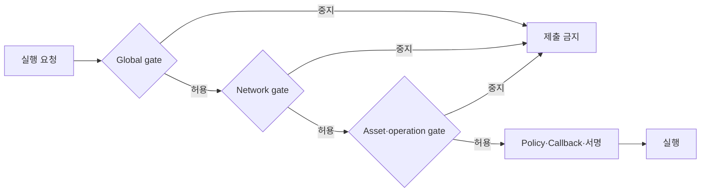
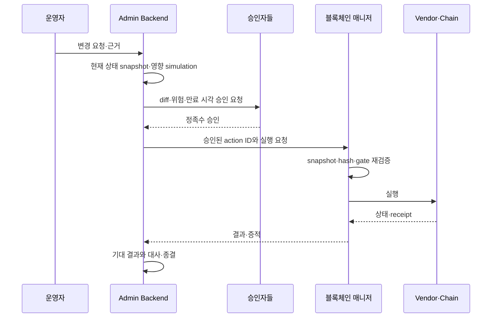

# 운영과 보안 경계

블록체인 매니저는 자산 이동을 시작할 수 있는 서비스이므로 일반 업무 API보다 강한 통제가 필요하다. 거래 제출, Policy 편집, 최종 서명, contract 관리, 회계 정정을 서로 다른 권한과 시스템에 둔다.

## 권한 분리

| 권한 | 주체 | 할 수 없는 일 |
|---|---|---|
| 거래 initiator | 블록체인 매니저 API user | Policy 편집·최종 서명·contract 관리자 변경 |
| Policy editor | 별도 정책 관리 서비스 | 일반 출금 제출·Co-signer share 행사 |
| Signer | API Co-signer·모바일 signer | DAW-CORE 승인 record 수정 |
| Callback verifier | Callback Handler | transaction 생성·DB 원장 쓰기 |
| Contract admin | 보안 관리자 multisig | 일상 batch 실행·고객 원장 변경 |
| 원장 정정 승인 | DAW-CORE Admin | Vendor Policy·key share 직접 조작 |
| 감사 | Security Auditor·SIEM | 거래 승인·설정 변경 |

한 서비스 침해로 destination allowlist, Policy, 서명, 회계 정정을 모두 바꿀 수 없어야 한다.

## API 보안

- Service와 Admin 호출자를 서로 다른 workload identity로 인증한다.
- 일반 고객 경로와 `/admin/*` endpoint를 네트워크·권한·감사 수준에서 분리한다.
- Fireblocks API user를 제출·조회·정책·compliance 용도로 나눈다.
- API RSA private key를 secret manager·HSM에 두고 rotation을 자동화한다.
- Production·Test 자격증명과 egress IP를 완전히 분리한다.
- Request ID, actor, API user, source IP, policy version을 감사 로그에 남긴다.
- 주소·raw transaction·PII·인증 header를 application log에 그대로 남기지 않는다.

## 실행 Gate

Network·asset 단위 실행을 차단할 수 있는 gate를 둔다.

Gate는 새 transaction 제출만 막고 이미 broadcast된 거래를 사라지게 하지 않는다. 중지 중에도 webhook 수신, 상태 추적, 입금 감지와 대사는 계속 동작해야 한다.

| Gate | 사용 예 | 승인 수준 |
|---|---|---|
| Global | 키 침해·중대한 vendor 장애 | 최고 비상 권한·이중 승인 |
| Network | chain halt·심각한 reorg·RPC 이상 | 운영·보안 승인 |
| Asset | token contract 사고·issuer freeze | 자산 담당·컴플라이언스 승인 |
| Operation | sweep·boost·cold 이동만 중지 | 기능별 운영 승인 |

Gate 변경은 이유, 범위, 시작·만료 시각, 승인자와 해제 조건을 가진 append-only event로 기록한다.

## 모니터링 경계

블록체인 매니저 내부 job은 transaction 막힘을 처리할 수 있지만 자기 프로세스의 죽음을 감지할 수 없다. 감시는 별도 failure domain에서 수행한다.

| 신호 | 의미 | 경보 조건 예시 |
|---|---|---|
| API availability·latency | 요청 경로 생존 | 오류율·p95 급증 |
| Webhook last received·signature failure | 수신 경로와 인증 정상 여부 | 장기 무수신 + vendor traffic 존재, 서명 실패 급증 |
| Inbox processing lag | 수신은 되지만 판단 worker 적체 | oldest unprocessed age 초과 |
| Outbox lag | DB 상태는 바뀌었지만 queue 발행 지연 | 미발행 row·재시도 증가 |
| Consumer lag | DAW-CORE 원장 반영 지연 | 토픽별 offset 차이 초과 |
| Scheduled job heartbeat | 대사·막힘·sweep worker 생존 | 실행 주기의 일정 배 초과 |
| Vendor API 429·5xx·latency | 외부 장애·한도 압박 | 기준선 대비 급증 |
| Reconciliation difference | 자산·거래 정합성 | 0이 아닌 미설명 차이 |
| Stuck transaction | chain·fee·nonce 정체 | network별 체류 임계 초과 |

모니터링 시스템은 BCM과 같은 cluster·DB 쓰기 권한에 의존하지 않는다. Vendor status와 chain 상태도 BCM을 거치지 않고 확인한다.

## 장애 시나리오

### Fireblocks API 장애

- 신규 출금·sweep 제출을 fail-close한다.
- 이미 접수된 요청은 같은 externalTxId로 조회될 때까지 새로 만들지 않는다.
- Webhook 수신이 살아 있으면 계속 적재한다.
- 조회·대사보다 고객 출금 상태 확인과 필수 제출에 rate-limit 예산을 우선한다.
- 복구 뒤 미확인 요청과 transaction을 전수 대사한다.

### Webhook 수신 장애

- Endpoint와 signature·JWKS·certificate 설정을 확인한다.
- 복구 뒤 vendor 재전송 기능으로 실패 notification을 다시 받는다.
- 기간별 transaction 조회로 누락 여부를 독립 확인한다.
- 중복 이벤트는 inbox와 event ID 멱등성으로 흡수한다.

### Queue·Consumer 장애

- Inbox·outbox는 계속 영속화한다.
- Queue가 복구되면 outbox relay가 미발행 event를 재전송한다.
- Consumer는 마지막 성공 offset부터 재개한다.
- 원장 반영과 offset commit 사이의 경계를 멱등 테스트한다.

### DB 장애

- 정본 mapping·멱등 record를 읽을 수 없으면 생성·제출을 중단한다.
- Cache나 vendor 조회만으로 우회 제출하지 않는다.
- 복구 뒤 vendor에 존재하지만 DB에 없는 account·address·transaction을 탐색한다.
- Backup restore 시점 이후 inbox·outbox·queue를 재생하고 대사한다.

## 비상 중지와 복구 순서

1. 영향 Network·asset·operation을 식별하고 가장 좁은 Gate를 닫는다.
2. 키 침해 가능성이 있으면 Workspace freeze와 credential 폐기를 검토한다.
3. Webhook 수신·입금 감시·대사는 가능한 한 유지한다.
4. Policy·allowlist·Co-signer pairing·Callback endpoint·contract code hash를 확인한다.
5. 진행 중 transaction을 전파 전·mempool·confirmed·finalized로 분류한다.
6. 원장·vendor·chain·queue를 대사한다.
7. 재개 snapshot과 승인 근거를 만들고 이중 승인으로 Gate를 연다.
8. 저위험 canary transaction 뒤 정상 처리량으로 복귀한다.

중지 해제는 원인 제거가 아니라 검증 가능한 재개 조건 충족으로 판단한다.

## 데이터 경계

| 저장소 | 정본 데이터 | 보관하지 않을 것 |
|---|---|---|
| DAW-CORE DB | 고객·계정·잔액·출금·승인·journal | Vendor secret·MPC share |
| BCM DB | account·address mapping, transaction 상태, inbox·outbox, sweep 실행 | 고객 KYC·IVMS101 평문 |
| Secret manager·HSM | API private key·암호화 key | 일반 설정 파일·DB dump |
| Vendor | Vault·transaction·Policy·Audit | 고객 원장의 단독 정본 |
| SIEM | actor·action·ID·reason·hash | 인증 header·전체 payload·PII |

Travel Rule payload는 컴플라이언스 게이트의 경계에 남긴다. BCM은 provider reference나 암호화 message를 운반할 수 있지만 개인정보를 검색·표시하지 않는다.

## Admin 작업

위험한 변경은 `요청 → simulation → 승인 → 실행 → 관찰 → 대사` 순서를 사용한다.

승인 후 대상·금액·Policy가 바뀌면 기존 승인을 사용하지 않는다. Action은 실행 전 immutable input hash를 가지고, 실행·실패·취소·재시도마다 별도 event를 남긴다.

## 배포 전 점검

- [ ] Service·Admin·Policy editor·Signer·Auditor 권한이 분리돼 있다.
- [ ] 모든 생성·제출 API가 DB 정본을 읽지 못하면 fail-close한다.
- [ ] Global·Network·Asset·Operation Gate와 만료·승인 절차가 있다.
- [ ] BCM 외부에서 API, heartbeat, queue lag, vendor status를 감시한다.
- [ ] Webhook·Queue·DB·Vendor 장애 복구와 대사를 훈련했다.
- [ ] Secret rotation, Workspace freeze, allowance revoke, contract pause를 시험했다.
- [ ] PII와 인증정보가 log·BCM DB에 남지 않는다.
- [ ] Admin action이 요청부터 receipt·대사까지 하나의 감사 사슬로 연결된다.
