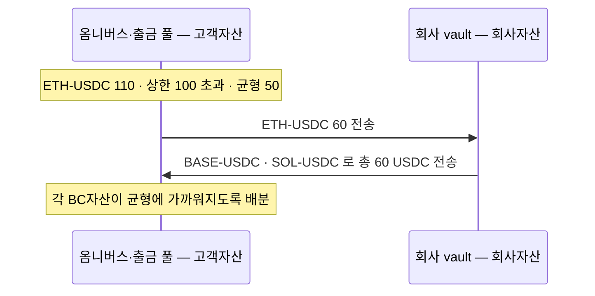

브릿징이 필요한 경우는 하나다 — **고객이 타VASP 로 송금할 때**다. 고객이 지정한 블록체인 네트워크로 자산이 나가야 하므로, 그 네트워크의 재고가 미리 준비돼 있어야 한다.

## 어느 계층에서 확보하나

**원장 계층으로는 커버할 수 없다.** 델타원장처럼 회사가 관리하는 원장에서 숫자를 맞춰도 실제로 나갈 자산이 그 네트워크에 없으면 송금이 안 된다.

**DAW 자산코어가 아니라 DAWBC 레벨이어야 한다.** 자산코어 기준으로 보유량이 충분해도 그중 콜드월렛에 있는 몫은 즉시 쓸 수 없다. 재고는 **핫월렛에 항상 유지**돼야 의미가 있다.

## 재고 기준 — 밴드C

DAWBC 의 **옴니버스·출금 풀이 합쳐서** 들고 있는 **BC자산별 보유량**에 상한·균형·하한을 둔다. BC자산은 (네트워크, 스테이블코인) 쌍이다 — ETH-USDC 와 BASE-USDC 는 같은 USDC 라도 다른 BC자산이다. 자산마다 값이 다르다. 핫·콜드 비율을 다루는 [밴드S](../../BC/설계/06-sweep.md)와는 별개 기준이다.

| BC자산 | 상한 | 균형 | 하한 |
|---|---|---|---|
| ETH-USDC | 100 | 50 | 10 |
| BASE-USDC | 200 | 100 | 20 |
| SOL-USDC | 300 | 150 | 30 |

## 수단 1 — 브릿지교환

**옴니버스·출금 풀 ↔ 회사자산 간 교환**이다. 한쪽 BC자산이 남고 다른 쪽이 부족할 때, 회사자산 vault 를 상대로 맞바꾼다.

상한을 넘은 BC자산은 **균형까지 덜어내고**, 그만큼을 부족한 BC자산들이 **각자 균형에 가까워지도록 나눠 받는다.** ETH-USDC 가 상한 100 을 넘어 110 이 된 경우:

## 수단 2 — 콜드교환

**고객자산 안에서의 교환**이다. 옴니버스·출금 풀과 콜드월렛 사이에서 맞바꾼다.

쓸 수 있는 조건이 둘이다.

- 회사자산에 재고가 부족한 경우
- 업무시간 중이라 콜드월렛 전송이 가능한 경우

콜드월렛에서 나가는 트랜잭션은 **서명 생성과 전파를 분리**한다. 옴니버스·출금 풀 → 콜드월렛 전송이 Finalized 된 뒤에 전파한다.

서명 시점에 논스가 고정되므로 **콜드교환이 진행되는 동안 그 콜드월렛의 다른 출금을 막는다.** 사이에 다른 거래가 나가면 서명해 둔 트랜잭션이 무효가 된다.

## 밴드C 와 밴드S 의 관계 — 아직 정하지 않음

두 밴드는 다루는 축이 다르다.

| | 무엇을 보나 | 단위 | 목적 |
|---|---|---|---|
| 밴드S | 핫·콜드 **비율** | 원화환산 총액의 % | 법정최대치 20% 준수 |
| 밴드C | 옴니버스·출금 풀의 **BC자산별 보유량** | 자산별 절대 수량 | 고객이 원하는 네트워크로 나갈 재고 확보 |

밴드S 는 **총량**을, 밴드C 는 **구성**을 다룬다. 브릿지교환과 콜드교환은 같은 값을 맞바꾸므로 핫월렛 총량이 변하지 않는다 — 구성만 바뀐다. 그래서 두 밴드가 평시에 서로 부딪히지는 않는다.

부딪히는 경우는 둘이다.

- **밴드C 상한 합이 밴드S 상한을 넘게 설정한 경우.** 각 BC자산이 상한까지 차면 그 순간 법정 한도를 넘는다. 설정 자체가 잘못된 것이므로 `Σ(BC자산별 상한 × 원화환산) + 받는주소최대 + 버퍼 ≤ 법정최대치` 를 설정 시점에 검증해야 한다.
- **교환이 진행되는 중간.** 콜드교환은 옴니버스·출금 풀 → 콜드월렛 전송이 Finalized 된 뒤에 반대편을 전파하므로, 그 구간에는 핫월렛이 일시적으로 줄어 있다. 밴드S 하한을 밑돌 수 있다.

제안 — **밴드S 를 상위 제약으로 두고 밴드C 는 그 안에서의 배분으로 다룬다.** 밴드S 위반은 규제 위반이고 밴드C 위반은 특정 네트워크 출금 불가라, 성질이 다르다. 판정 순서도 총량(밴드S) 먼저, 구성(밴드C) 다음이 맞다고 본다. 확정은 정책 자료와 함께 한다.

## 정리하면

| | 상대 | 자산 경계 | 조건 |
|---|---|---|---|
| 브릿지교환 | 회사자산 vault | 고객자산 ↔ 회사자산 | 회사자산에 재고가 있을 때 |
| 콜드교환 | 콜드월렛 | 고객자산 안 | 회사자산 부족 · 업무시간 |

둘 다 **온체인 브릿지를 쓰지 않는다.** 이미 어딘가에 있는 재고를 상대와 맞바꾸는 방식이다. 그래서 상대(회사자산·콜드월렛)에 재고가 없으면 성립하지 않는다.

[2장](02-options.md)에서 그 경우에 쓸 수 있는 수단을 본다.
