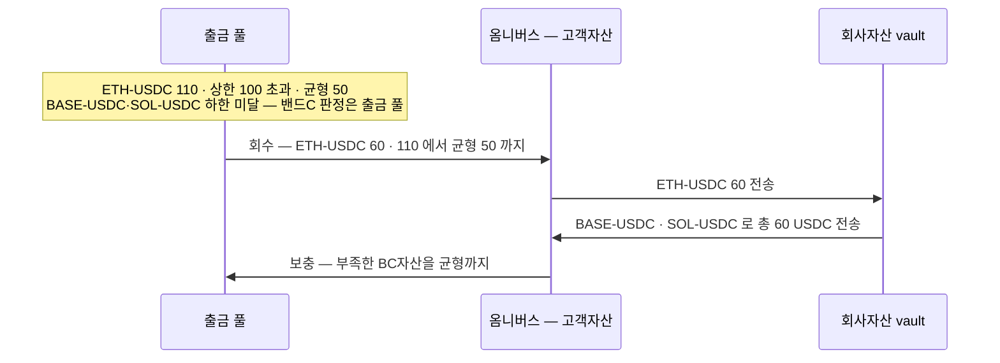
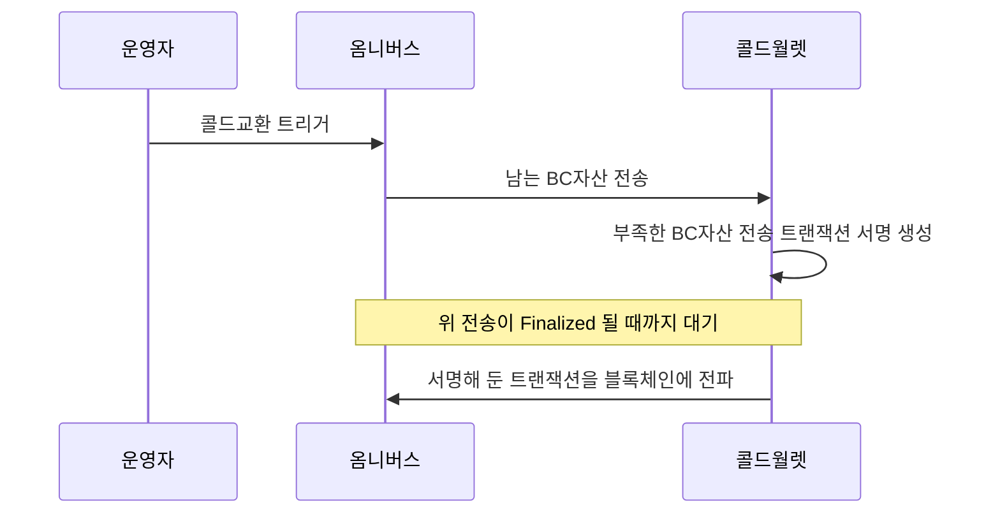

브릿징이 필요한 경우는 하나다 — **고객이 타VASP 로 송금할 때**다. 고객이 지정한 블록체인 네트워크로 자산이 나가야 하므로, 그 네트워크의 재고가 미리 준비돼 있어야 한다.

## 어느 계층에서 확보하나

**원장 계층으로는 커버할 수 없다.** 델타원장처럼 회사가 관리하는 원장에서 숫자를 맞춰도 실제로 나갈 자산이 그 네트워크에 없으면 송금이 안 된다.

**DAW 자산코어가 아니라 DAWBC 레벨이어야 한다.** 자산코어 기준으로 보유량이 충분해도 그중 콜드월렛에 있는 몫은 즉시 쓸 수 없다. 재고는 **핫월렛에 항상 유지**돼야 의미가 있다.

## 재고 기준 — 밴드C

DAWBC 의 **출금 풀**이 들고 있는 **BC자산별 보유량**에 상한·균형·하한을 둔다. 타VASP 송금이 나가는 곳이 거기라서다.

**교환의 당사자는 옴니버스다(2026-08-18 결정).** 출금 풀은 제출 전용이고, 아래 두 수단(브릿지교환·콜드교환)은 옴니버스에서 일어난다. 교환 결과는 옴니버스에 모이고, 출금 풀에는 보충(옴니버스 → 출금 풀)으로 내려간다. 그래서 재고가 출금 풀에 닿기까지 **교환 → 보충 2단**이고, 급한 출금을 보충 속도로 풀지 않는다 — **출금 한도(예: 건당 최대 출금량)로 다룬다. 수단·값은 미정.** BC자산은 (네트워크, 스테이블코인) 쌍이다 — ETH-USDC 와 BASE-USDC 는 같은 USDC 라도 다른 BC자산이다. 자산마다 값이 다르다. 핫·콜드 비율을 다루는 [밴드S](../../BC/설계/06-sweep.md)와는 별개 기준이다.

**값은 아직 정하지 않았다.** 아래는 자리와 관계를 보이기 위한 예시다.

| BC자산 | 상한 | 균형 | 하한 |
|---|---|---|---|
| ETH-USDC | 100 | 50 | 10 |
| BASE-USDC | 200 | 100 | 20 |
| SOL-USDC | 300 | 150 | 30 |

세 값이 각각 다른 것을 결정한다.

| | 무엇을 정하나 |
|---|---|
| 하한 | 이 밑으로 떨어지면 그 네트워크로 고객 출금이 못 나간다 — 보충 트리거 |
| 균형 | 보충·회수의 목표점 |
| 상한 | 넘으면 덜어낸다. 침해 시 피해 상한의 **후보**이기도 하다 — 아래 조건이 함께 서야 성립한다 |

**상한만으로는 피해 상한이 되지 않는다.** 출금 풀이 비면 보충이 들어오므로, 출금과 보충을 모두 실행할 수 있는 쪽은 소진 → 보충 → 소진을 반복할 수 있다. 상한은 **한 번에** 나갈 수 있는 양일 뿐이다.

피해 상한이 되려면 이것들이 함께 있어야 한다.

| | 무엇 |
|---|---|
| 권한 분리 | 재고를 채우는 권한과 출금을 내는 권한을 나눈다 |
| 시간·누적 한도 | 기간당 총 유출량에 상한을 둔다. 반복 보충을 막는 유일한 축이다 |
| 보충 승인 | 보충 자체에 사람 승인을 붙일지 |

그래서 이 값은 운영 편의와 보안 사이의 선택이지만, 보안 쪽은 값 하나로 끝나지 않는다.

## 수단 1 — 브릿지교환

**옴니버스 ↔ 회사자산 간 교환**이다. 한쪽 BC자산이 남고 다른 쪽이 부족할 때, 회사자산 vault 를 상대로 맞바꾼다.

판정과 실행이 다른 vault 에 있다 — 밴드C 는 출금 풀을 보고, 교환은 옴니버스에서 일어난다. **상한 초과와 하한 미달을 함께 조정하면 3단**이 된다.

| 단계 | 이동 | 무엇 |
|---|---|---|
| 회수 | 출금 풀 → 옴니버스 | 상한을 초과한 자산을 **균형까지** 회수한다 |
| 교환 | 옴니버스 ↔ 회사자산 | 남는 BC자산을 주고 부족한 BC자산을 받는다 — 각 자산이 균형에 가까워지도록 배분 |
| 보충 | 옴니버스 → 출금 풀 | 부족했던 BC자산을 **균형까지** 채운다 |

출금 풀의 ETH-USDC 가 상한 100 을 넘어 110, BASE-USDC 와 SOL-USDC 가 하한을 밑도는 경우:



출금 풀이 부족한데 **옴니버스에 그 BC자산이 이미 있으면 교환 없이 보충만** 한다. 교환은 옴니버스에도 없을 때 옴니버스를 채우는 단계다.

## 수단 2 — 콜드교환

**고객자산 안에서의 교환**이다. 옴니버스와 콜드월렛 사이에서 맞바꾼다. 판정·회수·보충 단계는 브릿지교환과 같고, 교환 상대만 콜드월렛이다.

쓸 수 있는 조건이 둘이다.

- 회사자산에 재고가 부족한 경우
- 업무시간 중이라 콜드월렛 전송이 가능한 경우

콜드월렛에서 나가는 트랜잭션은 **서명 생성과 전파를 분리**한다. 콜드로 나가는 다리(옴니버스 → treasury egress → 외부 콜드 — 실행 경로는 [sweep](../../BC/설계/06-sweep.md))가 Finalized 된 뒤에 전파한다.

서명 시점에 논스가 고정되므로 **콜드교환이 진행되는 동안 그 콜드월렛의 다른 출금을 막는다.** 사이에 다른 거래가 나가면 서명해 둔 트랜잭션이 무효가 된다.



## 밴드C 와 밴드S 의 관계 — 아직 정하지 않음

두 밴드는 다루는 축이 다르다.

| | 무엇을 보나 | 단위 | 목적 |
|---|---|---|---|
| 밴드S | 핫·콜드 **비율** | 원화환산 총액의 % | 법정최대치 20% 준수 |
| 밴드C | 출금 풀의 **BC자산별 보유량** | 자산별 절대 수량 | 고객이 원하는 네트워크로 나갈 재고 확보 |

밴드S 는 **총량**을, 밴드C 는 **구성**을 다룬다. 브릿지교환과 콜드교환은 같은 값을 맞바꾸므로 핫월렛 총량이 변하지 않는다 — 구성만 바뀐다. 그래서 두 밴드가 평시에 서로 부딪히지는 않는다.

부딪히는 경우는 둘이다.

- **밴드C 상한 합이 밴드S 상한을 넘게 설정한 경우.** 각 BC자산이 상한까지 차면 출금 풀만으로 법정 한도에 가까워진다. 설정 시점에 이걸 검증한다.

  ```
  Σ(BC자산별 상한 × 원화환산) ≤ 총자산합 × 밴드S상한
  ```

  밴드S 상한은 18% 같은 **비율**이라 양변 단위를 맞추려면 총자산합을 곱해 금액으로 환산해야 한다. 그리고 이건 **필요조건일 뿐 충분조건이 아니다** — 고객 vault·옴니버스도 핫월렛합에 들어가는데 이 식에는 없다. 실제 준수는 밴드S 가 실시간으로 잡는다.
- **교환이 진행되는 중간.** 콜드교환은 콜드로 나가는 다리가 Finalized 된 뒤에 반대편을 전파하므로, 그 구간에는 핫월렛이 일시적으로 줄어 있다. 밴드S 하한을 밑돌 수 있다.

제안 — **밴드S 를 상위 제약으로 두고 밴드C 는 그 안에서의 배분으로 다룬다.** 밴드S 위반은 규제 위반이고 밴드C 위반은 특정 네트워크 출금 불가라, 성질이 다르다. 판정 순서도 총량(밴드S) 먼저, 구성(밴드C) 다음이 맞다고 본다. 확정은 정책 자료와 함께 한다.

## 정리하면

| | 상대 | 자산 경계 | 조건 |
|---|---|---|---|
| 브릿지교환 | 회사자산 vault | 고객자산 ↔ 회사자산 | 회사자산에 재고가 있을 때 |
| 콜드교환 | 콜드월렛 | 고객자산 안 | 회사자산 부족 · 업무시간 |

둘 다 **온체인 브릿지를 쓰지 않는다.** 이미 어딘가에 있는 재고를 상대와 맞바꾸는 방식이다. 그래서 상대(회사자산·콜드월렛)에 재고가 없으면 성립하지 않는다.

[2장](02-options.md)에서 그 경우에 쓸 수 있는 수단을 본다.
