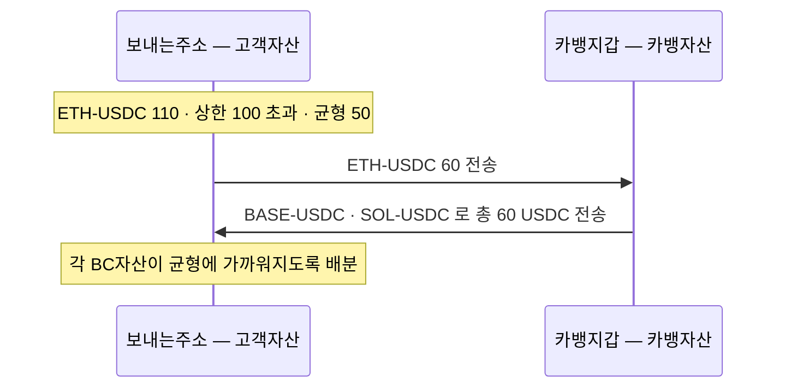

브릿징이 필요한 경우는 하나다 — **고객이 타VASP 로 송금할 때**다. 고객이 지정한 블록체인 네트워크로 자산이 나가야 하므로, 그 네트워크의 재고가 미리 준비돼 있어야 한다.

## 어느 계층에서 확보하나

**원장 계층으로는 커버할 수 없다.** 델타원장처럼 카뱅이 관리하는 원장에서 숫자를 맞춰도 실제로 나갈 자산이 그 네트워크에 없으면 송금이 안 된다.

**DAW 자산코어가 아니라 DAWBC 레벨이어야 한다.** 자산코어 기준으로 보유량이 충분해도 그중 콜드월렛에 있는 몫은 즉시 쓸 수 없다. 재고는 **핫월렛에 항상 유지**돼야 의미가 있다.

## 재고 기준 — 밴드C

DAWBC 에서 보내는주소의 **BC자산별로 상한·균형·하한**을 둔다. 자산마다 값이 다르다. 핫·콜드 비율을 다루는 [밴드S](../../BC/설계/06-sweep.md)와는 별개 기준이다.

| BC자산 | 상한 | 균형 | 하한 |
|---|---|---|---|
| ETH-USDC | 100 | 50 | 10 |
| BASE-USDC | 200 | 100 | 20 |
| SOL-USDC | 300 | 150 | 30 |

## 수단 1 — 브릿지교환

**보내는주소 ↔ 카뱅자산 간 교환**이다. 한쪽 BC자산이 남고 다른 쪽이 부족할 때, 카뱅 지갑을 상대로 맞바꾼다.

상한을 넘은 BC자산은 **균형까지 덜어내고**, 그만큼을 부족한 BC자산들이 **각자 균형에 가까워지도록 나눠 받는다.** ETH-USDC 가 상한 100 을 넘어 110 이 된 경우:

## 수단 2 — 콜드교환

**고객자산 안에서의 교환**이다. 보내는주소와 콜드월렛 사이에서 맞바꾼다.

쓸 수 있는 조건이 둘이다.

- 카뱅자산에 재고가 부족한 경우
- 업무시간 중이라 콜드월렛 전송이 가능한 경우

콜드월렛에서 나가는 트랜잭션은 **서명 생성과 전파를 분리**한다. 보내는주소 → 콜드월렛 전송이 Finalized 된 뒤에 전파한다.

## 정리하면

| | 상대 | 자산 경계 | 조건 |
|---|---|---|---|
| 브릿지교환 | 카뱅지갑 | 고객자산 ↔ 카뱅자산 | 카뱅자산에 재고가 있을 때 |
| 콜드교환 | 콜드월렛 | 고객자산 안 | 카뱅자산 부족 · 업무시간 |

둘 다 **온체인 브릿지를 쓰지 않는다.** 이미 어딘가에 있는 재고를 상대와 맞바꾸는 방식이다. 그래서 상대(카뱅자산·콜드월렛)에 재고가 없으면 성립하지 않는다.

[2장](02-options.md)에서 그 경우에 쓸 수 있는 수단을 본다.
