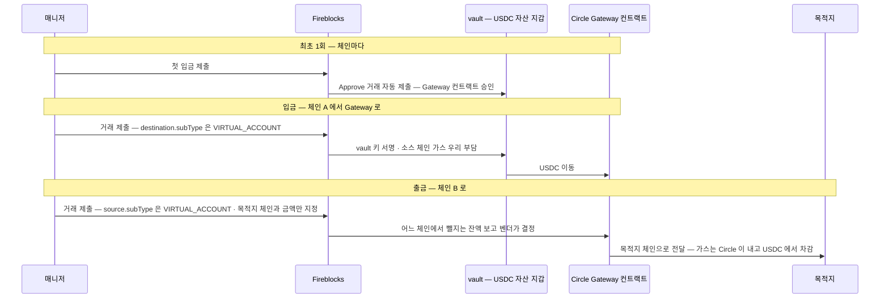

Fireblocks 가 Circle Gateway 를 감싼 기능이다. vault 의 USDC 를 체인 구분 없는 단일 잔액으로 모아 두고, 필요할 때 원하는 체인으로 인출한다. 체인마다 미리 USDC 를 깔아 둘 필요가 없어진다.

브릿지 수단으로 볼 때의 성질은 **같은 자산(USDC)을 체인 간에 옮기는 것**이다. 교환이 아니라 이동이고, 값은 1:1 에서 수수료만큼 깎인다.

## 흐름



입금·출금 모두 **표준 `POST /v1/transactions`** 로 낸다. 별도 엔드포인트가 아니라 `subType: VIRTUAL_ACCOUNT` 를 입금이면 destination, 출금이면 source 에 붙인다.

```json
// 입금 — 이더리움 USDC 를 Gateway 로
{ "assetId": "USDC_ETH_TEST5", "amount": "10",
  "source":      { "type": "VAULT_ACCOUNT", "id": "0" },
  "destination": { "type": "VAULT_ACCOUNT", "id": "0", "subType": "VIRTUAL_ACCOUNT" } }

// 출금 — Gateway 에서 목적지 체인으로
{ "assetId": "USDC_ETH_TEST5", "amount": "10",
  "source":      { "type": "VAULT_ACCOUNT", "id": "0", "subType": "VIRTUAL_ACCOUNT" },
  "destination": { "type": "ONE_TIME_ADDRESS", "oneTimeAddress": { "address": "0x…" } } }
```

출금 목적지는 우리 vault·일회성 주소·화이트리스트 주소 중 무엇이든 된다.

위 예시의 `assetId` 는 API 가이드 원문 그대로다. 설정 가이드의 자산 표에는 이더리움 Sepolia 가 `USDC_ETH_TEST5_0GER` 로 적혀 있어 표기가 다르다 — 실제 값은 자산 목록 조회로 확인한다.

## 비용

| 항목 | 부담 |
|---|---|
| 입금 | **소스 체인 가스만.** Fireblocks·Circle 수수료 없음. Gas Station 이나 Universal Gasless 가 켜져 있으면 자동 충당 |
| 출금 — Circle 이체율 | 인출액의 **0.005%** |
| 출금 — 소스 체인 가스 | 변동. 인출 시점에 Circle 이 견적하고 **Gateway 잔액에서 차감** |
| 출금 — 전달 수수료 | Circle Forwarding Service 가 목적지 체인 가스·전달을 부담하고, **전달되는 USDC 에서 차감** |

출금에는 우리 가스가 들지 않는다. 대신 USDC 로 떼인다. 수수료는 Circle 이 정하고 바뀔 수 있다.

## 지원 체인

메인넷 11 · 테스트넷 12 이며 Beta 기간에 늘 수 있다. 우리와 관계있는 것만 옮기면:

| 체인 | 메인넷 assetId | 테스트넷 assetId |
|---|---|---|
| Ethereum | `USDC` | `USDC_ETH_TEST5_0GER` |
| Base | `USDC_BASECHAIN_ETH_5I5C` | `USDC_BASECHAIN_ETH_TEST5_8SH8` |

그 밖에 Arbitrum · Avalanche · HyperEVM · OP Mainnet · Polygon PoS · Sei · Sonic · Unichain · World Chain 이 있고, 테스트넷에는 Arc 가 더 있다. 전체 표는 [설정 가이드](https://support.fireblocks.io/hc/en-us/articles/27420202963612-USDC-Gateway-Prerequisites-and-Setup-Guide) 에 있다.

## 자동 입금

vault 잔액이 임계를 넘으면 주기적으로 Gateway 로 쓸어 담는 기능이 있다.

```
POST /vault/accounts/{vaultAccountId}/virtual_asset_wallet/usdc_gateway/deposit_automation
{ "automationType": "USDC_GATEWAY_DEPOSIT",
  "assetId": "USDC_ETH",
  "timeBased": { "intervalValue": 60, "intervalUnit": "MINUTES", "balanceThreshold": "1000" } }
```

- 기본 주기 60분, 단위는 `MINUTES`·`HOURS`·`DAYS`.
- `balanceThreshold` 를 `"0"` 으로 두면 매번 전액을 쓸어 담는다.
- `assetId` 는 선택 — 빼면 지원 자산 전체가 대상이다.
- 조회는 `GET`, 주기 변경은 `PATCH`, 중단은 `DELETE`(설정은 남고 스케줄만 멈춤). `automationType` 과 `assetId` 는 만든 뒤 못 바꾼다.
- 자동 입금은 **`USDC Gateway Depositor` 라는 서비스 유저**가 제출한다. 이 유저는 제출만 하고 서명은 못 하므로 룰에 별도 서명자를 지정해야 하고, 안 하면 정책에 막혀 실패한다.

## 정책 준비

입금에는 룰 두 개가 필요하다. 없으면 활성화가 돼 있어도 정책에 막힌다.

- **Approve 룰** — 체인마다 첫 입금 때 자동으로 나가는 승인 거래용.
- **Transfer 룰** — 실제 입금용.

일회성 주소를 쓰는 워크스페이스면 Gateway 활성화 vault 에 대한 vault-to-vault 룰 두 개로 충분하다. 화이트리스트를 쓰는 구성이면 **Gateway 컨트랙트 주소를 체인마다 화이트리스트에 등록**하고 그 주소를 룰의 대상으로 지정한다. 화이트리스트 등록에는 워크스페이스의 admin quorum 승인이 붙는다.

```
메인넷 Gateway 컨트랙트   0x77777777Dcc4d5A8B6E418Fd04D8997ef11000eE
테스트넷 Gateway 컨트랙트  0x0077777d7EBA4688BDeF3E311b846F25870A19B9
```

출금은 특별한 설정이 없다 — 일반 전송과 같은 룰을 탄다.

## 걸리는 것

- **Beta 다.** 동작·엔드포인트·한도가 바뀔 수 있다. Console 의 Labs 에서 켜거나 CSM 에 요청한다.
- **USDC 전용.** 다른 자산은 이 경로를 못 쓴다.
- **자금이 Circle 컨트랙트에 있다.** Gateway 잔액은 각 체인의 Circle Gateway 스마트컨트랙트가 들고 있고 우리 vault 잔액이 아니다. 지갑을 archive 해도 자금은 그대로 남으며 재활성화하면 다시 접근된다.
- **입금 완료 표시가 앞설 수 있다.** 완료 판정이 Circle 의 잔액 반영이 아니라 우리 워크스페이스 확정 정책으로 나기 때문에, `COMPLETED` 인데 Gateway 잔액에 아직 안 잡힐 수 있다고 문서가 명시한다. Circle 의 체인별 요구 컨펌 수에 따라 지연된다.
- **vault 당 Gateway 지갑 하나.** 브릿지 창구로 쓸 vault 를 정해야 한다.
- **한도는 Fireblocks 쪽에 없다.** 다만 Circle 이 rate limit 을 걸면 그 오류가 그대로 실패로 온다.

## 아직 모르는 것

- **소요 시간.** 입금은 우리 확정 정책, 출금은 "목적지 체인 전달 확인 시 완료" 라고만 하고 실제 몇 분인지는 문서에 없다.
- **실패 시 자금 위치.** 출금이 중간에 실패하면 Gateway 잔액에 남는지, 어떤 상태로 보이는지.

## 출처

- [USDC Gateway Overview](https://support.fireblocks.io/hc/en-us/articles/27419996238620-USDC-Gateway-Overview)
- [USDC Gateway: Prerequisites and Setup Guide](https://support.fireblocks.io/hc/en-us/articles/27420202963612-USDC-Gateway-Prerequisites-and-Setup-Guide)
- [Setting up policy rules for USDC Gateway](https://support.fireblocks.io/hc/en-us/articles/28897919442588-Setting-up-policy-rules-for-USDC-Gateway)
- [USDC Gateway (API guide)](https://developers.fireblocks.com/docs/usdc-gateway)
