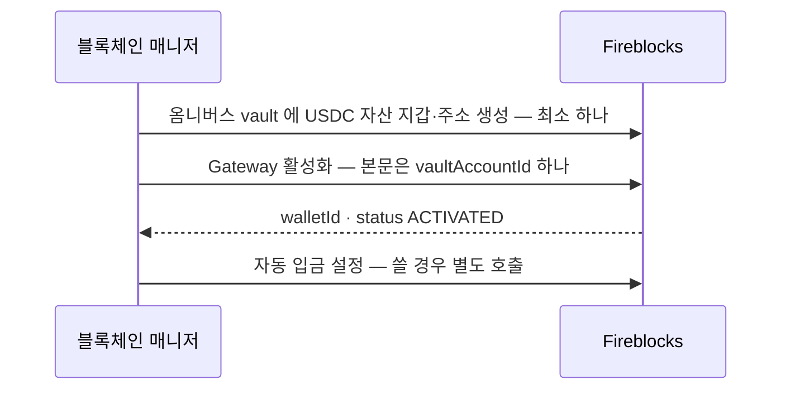
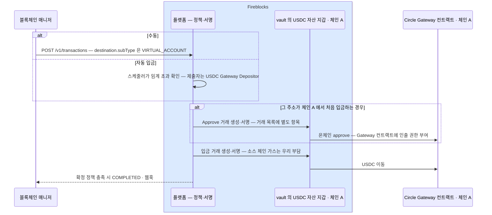
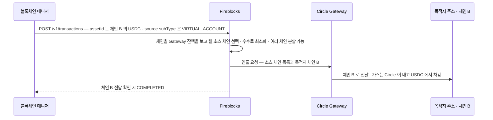

Fireblocks 가 Circle Gateway 를 감싼 기능이다. vault 의 USDC 를 체인 구분 없는 단일 잔액으로 모아 두고, 필요할 때 원하는 체인으로 인출한다. 체인마다 미리 USDC 를 깔아 둘 필요가 없어진다.

브릿지 수단으로 볼 때의 성질은 **같은 자산(USDC)을 체인 간에 옮기는 것**이다. 교환이 아니라 이동이고, 값은 1:1 에서 수수료만큼 깎인다.

Circle Gateway 쪽 구현은 이 문서에서 다루지 않는다. 우리가 보는 것은 Fireblocks 가 노출하는 면이고, 그 뒤는 벤더가 오케스트레이션한다.

## vault 와의 관계

- **Gateway 지갑은 vault account 하나에 결속된다.** 한 Gateway 지갑은 정확히 한 vault account 에 묶이고, vault account 마다 자기 Gateway 지갑을 가진다.
- **Gateway 잔액도 그 vault 단위다.** 지원 체인 전체에 걸친 단일 USDC 잔액이며, 조회하면 총액과 체인별 내역이 나온다.
- **입금은 같은 vault 안에서 일어난다.** 그 vault 의 USDC 자산 지갑에서 그 vault 의 Gateway 지갑으로 옮긴다. 거래 요청의 source 와 destination 에 **같은 vault id** 를 넣는다.
- 활성화는 설정 동작이라 자금이 움직이지 않고 온체인 상호작용도 없다. 워크스페이스의 네트워크 종류(메인넷·테스트넷)에 매인다.

## 흐름 — 활성화

이미 있는 vault 에 Gateway 지갑을 붙이는 단계다. 자금은 움직이지 않는다. 전제조건이 둘이다.

- vault account 가 존재한다
- 그 vault 에 **주소까지 생성된 USDC 자산 지갑이 최소 하나** 있다

체인별 준비는 활성화가 아니라 입금에 걸린다 — **입금할 체인마다** 그 체인의 USDC 자산 지갑과 네이티브 가스가 필요하다(Gas Station·Universal Gasless 가 켜져 있으면 가스는 자동 충당).

고객자산 쪽은 옴니버스 vault 에 붙인다([4장](04-gateway-placement.md)) — **운영 초기 1회 설정**이고 고객 vault 생성·주소 발급 흐름과는 무관하다. 회사자산 Gateway 는 4장에서 따로 다룬다.



**Gateway 활성화는 vault 단위**다 — 본문이 `vaultAccountId` 하나라 일괄 활성화가 없다. Console 에서는 vault 나 USDC 자산 지갑의 점 세 개 메뉴에서 실행한다.

**활성화 후 상태는 조회로 확인한다.** 잔액 조회 API 가 `status`(`ACTIVATED`·`DEACTIVATED`)와 `totalBalance`·`balanceBreakdown`·`assetIds` 를 준다. `assetIds` 는 그 Gateway 지갑이 커버하는 Fireblocks 자산 ID 목록이다.

자동 입금은 API 활성화 본문에 없다. Console 은 활성화 흐름에 토글을 두지만, API 로 붙이면 **활성화와 자동 입금 설정이 두 번의 호출**이다.

archive 된 지갑에 활성화를 다시 호출하면 재활성화된다.

## 흐름 — 입금 · 체인 A 의 USDC 를 Gateway 잔액으로

방아쇠는 입금 거래다. **그 vault 주소가 그 체인에서 처음 입금하는 경우에만** 벤더가 승인 거래를 먼저 끼워 넣는다.



경계는 하나다 — **우리는 Fireblocks 를 부르고, 온체인으로 나가는 것은 벤더가 vault 키로 낸다.** 위 그림에서 파란 묶음 안은 벤더 영역이라 우리가 개별 호출하는 지점이 아니다.

**온체인 USDC 이동은 수동·자동 둘 다 같은 거래다.** 자동 입금을 켜면 우리가 `POST /v1/transactions` 를 내지 않을 뿐, 그 아래 이동과 웹훅은 동일하다. 자동일 때 **입금 거래**의 제출자는 `USDC Gateway Depositor` 서비스 유저다. 첫 입금에 붙는 `APPROVE` 의 제출자는 문서에 없다.

### 몇 번 하나 — 활성화는 1회, 승인은 체인마다

| | 단위 | 횟수 |
|---|---|---|
| **활성화** | vault account | **vault 당 1회.** 본문이 `vaultAccountId` 하나뿐이고 체인을 지정하지 않는다 |
| **승인(`APPROVE`)** | (vault 주소, 체인) | **체인마다 1회.** 문서 표현이 "a one-time on-chain approval **per blockchain**" |
| 입금 거래 | (vault 주소, 체인) | 입금할 때마다 |

즉 **활성화 한 번으로 모든 체인이 열리지만, 실제로 USDC 를 넣는 체인마다 첫 입금에서 승인 거래가 한 번씩 나온다.** 체인 5개를 쓰면 승인 거래도 5건이다. 같은 체인의 두 번째 입금부터는 승인 없이 진행된다.

승인 거래는 우리가 내는 것이 아니라 **Fireblocks 가 자동으로 제출**한다. 정책에 `APPROVE` 룰이 없으면 이 자동 거래가 막혀 입금이 실패한다.

**Fireblocks 경로에서는 이 승인을 건너뛰는 방법이 문서에 없다.** Circle 의 Wallet 컨트랙트는 예치 메서드 `deposit` 에 미리 부여한 allowance 를 요구하고, 컨트랙트 주소로 일반 ERC-20 전송을 보내면 그 USDC 는 소실된다. Circle 을 직접 연동하면 서명 기반 예치(`depositWithPermit`·`depositWithAuthorization`)로 승인 없이 넣을 수 있다([참고](99-circle-gateway.md)).

## 흐름 — 출금 · Gateway 잔액을 체인 B 로



**목적지 체인은 우리가 정하고, 소스 체인은 벤더가 고른다.**

| | 정하는 쪽 | 어떻게 |
|---|---|---|
| 목적지 체인 | 우리 | `assetId` 를 **목적지 체인**의 USDC 로 넣는다 |
| 목적지 주소 | 우리 | 우리 vault·일회성 주소·화이트리스트 주소 |
| 금액 | 우리 | `amount` |
| **소스 체인** | **Fireblocks** | 체인별 Gateway 잔액을 보고 수수료가 적게 드는 쪽에서 뺀다. **한 체인으로 부족하면 여러 체인에서 나눠 뺀다** |

인출 요청 본문에 소스 체인을 넣는 자리가 없다.

## 호출하는 API

| 동작 | 경로 |
|---|---|
| 활성화 | `POST /vault/accounts/{vaultAccountId}/usdc_gateway/activate` |
| 비활성화 | `POST /vault/accounts/{vaultAccountId}/usdc_gateway/deactivate` |
| 조회 | `GET /vault/accounts/{vaultAccountId}/usdc_gateway` |
| 입금 | `POST /v1/transactions` · **destination** 에 `subType: VIRTUAL_ACCOUNT` |
| 출금 | `POST /v1/transactions` · **source** 에 `subType: VIRTUAL_ACCOUNT` |
| 자동 입금 | `POST·GET·PATCH·DELETE /vault/accounts/{vaultAccountId}/virtual_asset_wallet/usdc_gateway/deposit_automation` |

경로 체계가 두 갈래다 — 핵심 셋은 `usdc_gateway` 바로 아래인데 자동 입금만 `virtual_asset_wallet` 을 낀다. 자동 입금 4종은 **OpenAPI 스펙에 없고 API 가이드에만 있다.**

**활성화에 요청 본문이 없다.** `vaultAccountId` 는 path 파라미터다. 그래서 일괄 활성화가 없는 것은 본문 구조가 아니라 URL 구조에서 나온다 — vault 하나당 호출 하나다. (API 가이드는 본문 `{"vaultAccountId": "1267"}` 을 보여주는데 스펙과 다르다.)

### 조회 응답 — 두 문서가 다르다

| 필드 | OpenAPI | API 가이드 |
|---|---|---|
| `walletId` · `type` · `status` · `symbol` · `assetIds` | 있음 (전부 required) | 일부만 언급 |
| **`totalBalance` · `balanceBreakdown`** | **없음** | 응답 필드로 명시 |

`type` 은 provider 를 담고 예시값이 `CIRCLEGATEWAY` 다. `status` 는 `ACTIVATED`·`DEACTIVATED`.

**잔액 두 필드가 스펙에 없다.** 조회로 실제 금액을 받을 수 있는지가 확정되지 않았다는 뜻이고, Gateway 잔액을 재고·한도 계산에 넣는 설계가 여기에 걸린다([5장](05-fit.md)).

### 엔드포인트 권한

| 동작 | 허용 역할 |
|---|---|
| 활성화·비활성화·자동 입금 설정/변경/중지 | Admin · Non-Signing Admin · Signer · Approver |
| 조회·자동 입금 조회 | 위 + **Editor · Viewer** |

입금·출금은 별도 엔드포인트가 아니라 **표준 거래 생성 API** 다. `subType` 을 어느 쪽에 붙이느냐로 방향이 갈린다.

```json
// 입금 — 체인 A 의 USDC 를 Gateway 로
{ "assetId": "USDC_ETH_TEST5", "amount": "10",
  "source":      { "type": "VAULT_ACCOUNT", "id": "0" },
  "destination": { "type": "VAULT_ACCOUNT", "id": "0", "subType": "VIRTUAL_ACCOUNT" } }

// 출금 — Gateway 에서 목적지 체인으로
{ "assetId": "USDC_ETH_TEST5", "amount": "10",
  "source":      { "type": "VAULT_ACCOUNT", "id": "0", "subType": "VIRTUAL_ACCOUNT" },
  "destination": { "type": "ONE_TIME_ADDRESS", "oneTimeAddress": { "address": "0x…" } } }
```

`assetId` 는 입금이면 **소스 체인**의 USDC, 출금이면 **목적지 체인**의 USDC 를 가리킨다. 위 예시 값은 API 가이드 원문 그대로이고, 설정 가이드의 자산 표에는 이더리움 Sepolia 가 `USDC_ETH_TEST5_0GER` 로 적혀 있어 표기가 다르다 — 실제 값은 자산 목록 조회로 확인한다.

## 비용 — 우리는 어떻게 내나

**따로 청구서를 받거나 이체하는 것이 아니다.** 출금 수수료는 **USDC 에서 차감**되고, 입금에는 우리 vault 의 가스만 든다.

| 시점 | 항목 | 어떻게 빠지나 |
|---|---|---|
| 입금 | 소스 체인 가스 | vault 의 네이티브 가스 잔액에서. Gas Station 이나 Universal Gasless 가 켜져 있으면 자동 충당 |
| 입금 | Fireblocks·Circle 수수료 | **없다** — 문서가 명시한다 |
| 출금 | Circle 이체율 | 인출액의 **0.005%** · Gateway 잔액에서 차감 |
| 출금 | 소스 체인 가스 | 변동. 인출 시점에 Circle 이 견적해 **Gateway 잔액에서 차감** |
| 출금 | 전달 수수료 | Circle Forwarding Service 가 목적지 체인 가스·전달을 부담하고, **전달되는 USDC 에서 차감** |

**출금 수수료는 모두 USDC 로 뗀다.** 이체율과 소스 체인 가스는 Gateway 잔액에서, 전달 수수료는 목적지로 전달되는 USDC 에서 빠진다. 요청 `amount` 와 최종 도착액의 정확한 관계는 확인이 필요하다. 우리 가스가 드는 것은 입금뿐이다.

수수료는 Circle 이 정하고 바뀔 수 있다. Fireblocks 문서는 소스 체인 가스를 "인출 시점 견적" 이라고만 한다. Circle 직접 연동 문서에는 체인별 고정 가스표가 공개돼 있지만(이더리움 $1.00, Base·Arbitrum $0.01, OP·Polygon $0.0015 등 · 전달 수수료 정액 $0.05 + 목적지 mint 가스 · [참고](99-circle-gateway.md)), **Fireblocks 를 통한 실제 청구액이 그 표와 같은지는 확인되지 않았다.**

## 지원 체인

Beta 기간에 늘 수 있다.

**메인넷 11**

| 체인 | Fireblocks assetId |
|---|---|
| Arbitrum | `USDC_ARB_3SBJ` |
| Avalanche | `USDC_AVAX` |
| Base | `USDC_BASECHAIN_ETH_5I5C` |
| Ethereum | `USDC` |
| HyperEVM | `USDC_B64VHHFG_XX2F` |
| OP Mainnet | `USDC_OPT_9T08` |
| Polygon PoS | `USDC_POLYGON_NXTB` |
| Sei | `USDC_B68NGGMY_YSEF` |
| Sonic | `USDC_E_B7GKLA1Z_TQ94` |
| Unichain | `USDC_B7V9C52Z_CYWP` |
| World Chain | `USDC_E_B7DRHSD9_OINX` |

**테스트넷 12**

| 체인 | Fireblocks assetId |
|---|---|
| Arbitrum (Sepolia) | `USDC_ARB_SEPOLIA_V84S` |
| Arc | `USDC_ARC_TEST_G5EN` |
| Avalanche (Fuji) | `USDC_AVAX_FUJI` |
| Base (Sepolia) | `USDC_BASECHAIN_ETH_TEST5_8SH8` |
| Ethereum (Sepolia) | `USDC_ETH_TEST5_0GER` |
| HyperEVM | `USDC_B6RLTAMC_VKLF` |
| OP Mainnet (Sepolia) | `USDC_OPT_SEPOLIA_AZBE` |
| Polygon PoS (Amoy) | `USDC_AMOY_POLYGON_TEST_7WWV` |
| Sei | `USDC_B72Z7SP0_XAWM` |
| Sonic | `USDC_B64G796G_SXBE` |
| Unichain (Sepolia) | `USDC_B6Y9TTZY_0809` |
| World Chain (Sepolia) | `USDC_B6YDJ0HK_6UDW` |

## 자동 입금

매번 입금 거래를 내지 않아도 되게, **그 vault 의 USDC 자산 지갑에서 같은 vault 의 Gateway 지갑으로 주기적으로 쓸어 담는** 기능이다.

- 스케줄러가 vault 잔액을 확인하다가 **설정한 임계를 넘으면** 입금 거래를 자동으로 낸다. 임계는 vault account 마다 따로 설정한다.
- 기본 주기는 **60분**이고 API 로 낮출 수 있다. 단위는 `MINUTES`·`HOURS`·`DAYS`.
- `balanceThreshold` 를 `"0"` 으로 두면 최소 금액 없이 매번 전액을 쓸어 담는다.
- `assetId` 는 선택이다. 지정하면 그 자산만, 빼면 지원 자산 전체가 대상이다.
- Console 활성화 흐름에 토글이 있고 **기본이 켜짐**이다. 켜지 않으면 입금은 매번 수동으로 낸다.
- `automationType` 과 `assetId` 는 만든 뒤 못 바꾼다. 주기만 `PATCH` 로 바꾸고, `DELETE` 는 설정을 남긴 채 스케줄만 멈춘다.

```json
POST /vault/accounts/{vaultAccountId}/virtual_asset_wallet/usdc_gateway/deposit_automation
{ "automationType": "USDC_GATEWAY_DEPOSIT",
  "assetId": "USDC_ETH",
  "timeBased": { "intervalValue": 60, "intervalUnit": "MINUTES", "balanceThreshold": "1000" } }
```

**제출자가 우리가 아니다.** 자동 입금 거래는 `USDC Gateway Depositor` 라는 서비스 유저가 제출한다. 이 유저는 **제출만 하고 서명은 못 한다.** 그래서 정책 룰에 별도 서명자를 지정해야 하고, 안 하면 자동 입금이 "정책에 막힘" 으로 실패한다.

## 정책 준비

입금에는 룰 두 개가 필요하다. 없으면 활성화가 돼 있어도 정책에 막힌다.

- **Approve 룰** — 체인마다 첫 입금 때 자동으로 나가는 승인 거래용.
- **Transfer 룰** — 실제 입금용.

일회성 주소를 쓰는 워크스페이스면 Gateway 활성화 vault 에 대한 vault-to-vault 룰 두 개로 충분하다. 화이트리스트를 쓰는 구성이면 **Gateway 컨트랙트 주소를 체인마다 화이트리스트에 등록**하고 그 주소를 룰의 대상으로 지정한다. 화이트리스트 등록에는 워크스페이스의 admin quorum 승인이 붙는다.

```
메인넷 Gateway 컨트랙트   0x77777777Dcc4d5A8B6E418Fd04D8997ef11000eE
테스트넷 Gateway 컨트랙트  0x0077777d7EBA4688BDeF3E311b846F25870A19B9
```

자동 입금을 켜면 위 룰에 더해 **initiator 를 `USDC Gateway Depositor` 로 둔 룰**이 하나 더 필요하다. source·destination 에 Gateway 활성화 vault 를 넣고 서명자를 지정한다.

출금은 특별한 설정이 없다 — 일반 전송과 같은 룰을 탄다.

## Gateway 지갑의 정체

**Fireblocks 쪽에서는 가상 자산 지갑이다.** 문서가 `USDC Gateway virtual asset wallet` 이라 부르고, API 경로는 `virtual_asset_wallet`, 거래 요청에는 `subType: VIRTUAL_ACCOUNT` 를 쓴다. 활성화할 때 **자금이 움직이지 않고 온체인 상호작용도 없다**고 명시하니 새 온체인 주소가 생기는 것이 아니다. vault 안에 잔액을 표현하는 칸이 하나 생긴다.

**잔액의 실체는 각 체인의 Circle 컨트랙트에 있다.** 문서 표현이 "지원하는 모든 체인의 Circle Gateway 스마트컨트랙트에 걸쳐 보유된 단일 USDC 잔액" 이다. 하나의 풀이 아니라 체인마다 실제로 USDC 가 있고 그 합계를 한 숫자로 보여준다 — `balanceBreakdown` 이 체인별 내역을 주는 이유다.

**체인 무관이 되는 방식은 Circle 쪽 구조다.** 소스 체인의 비수탁 Gateway Wallet 컨트랙트에 예치하면 Circle 의 오프체인 원장에 잔액이 잡히고, 인출할 때 **목적지 체인의 Minter 컨트랙트가 USDC 를 새로 mint** 한다. 소스 체인의 burn 은 그 mint 뒤에 들어간다. 우리가 넣은 코인이 체인을 건너가는 것이 아니다. 상세는 [Circle Gateway 참고](99-circle-gateway.md).

출금 때 벤더가 소스 체인을 고를 수 있는 것도 여기서 나온다 — 고를 대상이 되는 체인별 잔액이 실제로 존재하기 때문이다.

## 고객 입금 감지와의 관계

직접 이어진 흐름은 아니다. 고객 입금은 외부 → 고객 vault 이고, Gateway 입금은 **우리가 내는 거래**(그 vault 의 USDC 자산 지갑 → 같은 vault 의 Gateway 지갑)다. 순서로 보면 고객 입금이 확정되고 sweep 으로 모인 뒤에 오는 별개 단계다.

다만 기록이 섞인다. 벤더 문서가 "입금·출금은 표준 Fireblocks 거래이며 거래 목록에 나타나고 정책 룰을 따르고 AML 스크리닝을 거치며 **다른 전송과 똑같이 웹훅을 낸다**" 고 명시한다. 첫 입금의 승인 거래도 별도 항목으로 뜬다. 우리 감지 파이프라인에 어떤 영향이 있는지는 [5장](05-fit.md).

## 걸리는 것

- **Beta 다.** 동작·엔드포인트·한도가 바뀔 수 있다. Console 의 Labs 에서 켜거나 CSM 에 요청한다.
- **USDC 전용.** 다른 자산은 이 경로를 못 쓴다.
- **자금이 Circle 컨트랙트에 있다.** Gateway 잔액은 각 체인의 Circle Gateway 스마트컨트랙트가 들고 있고 우리 vault 잔액이 아니다. Circle 은 이 컨트랙트를 비수탁으로 규정하고 7일 무신뢰 인출 경로를 둔다([참고](99-circle-gateway.md)) — 수탁 판단에서는 두 사실을 함께 봐야 한다. 지갑을 archive 해도 자금은 그대로 남으며 재활성화하면 다시 접근된다.
- **입금 완료 표시가 앞설 수 있다.** 완료 판정이 Circle 의 잔액 반영이 아니라 우리 워크스페이스 확정 정책으로 나기 때문에, `COMPLETED` 인데 Gateway 잔액에 아직 안 잡힐 수 있다고 문서가 명시한다. Circle 의 요구 컨펌 수가 체인마다 다르고 Base·이더리움 계열은 13~19분이다([참고](99-circle-gateway.md)). 그래서 `COMPLETED` 를 브릿지 가용 잔액으로 읽으면 안 되고, 잔액 조회로 확인해야 한다.
- **소스 체인을 지정할 수 없다.** 출금 요청에 소스 체인 자리가 없고 벤더가 수수료 기준으로 고른다. 어느 체인의 Gateway 재고가 줄어들지 우리가 통제하지 못한다.
- **vault 당 Gateway 지갑 하나.** 브릿지 창구로 쓸 vault 를 정해야 한다.
- **한도는 Fireblocks 쪽에 없다.** 다만 Circle 이 rate limit 을 걸면 그 오류가 그대로 실패로 온다.

위 제약이 우리 설계에 무엇을 요구하는지는 [5장](05-fit.md).

## 아직 모르는 것

- **소요 시간.** Fireblocks 문서는 입금은 우리 확정 정책, 출금은 "목적지 체인 전달 확인 시 완료" 라고만 한다. Circle 쪽은 **Base·이더리움·Arbitrum·OP·Unichain·World Chain 에서 예치가 잔액으로 잡히기까지 ~65 ETH 블록, 13~19분**이 걸리고 전송 자체는 500ms 미만이라고 밝힌다([참고](99-circle-gateway.md)). 벤더를 통했을 때 이 대기가 우리 눈에 어떻게 보이는지는 실측값이 없다.
- **자동 입금일 때 첫 승인 거래의 제출자.** 정책 문서는 `USDC Gateway Depositor` 가 initiator 가 된다고 Transfer 룰에 대해서만 밝힌다. 같은 체인 첫 입금에 붙는 `APPROVE` 도 이 서비스 유저가 내는지는 안 나온다. 승인용 정책 룰의 initiator 를 무엇으로 둘지가 여기에 걸린다.
- **조회로 잔액을 받을 수 있는지.** OpenAPI 응답 스키마에 `totalBalance`·`balanceBreakdown` 이 없고 API 가이드에는 있다. 스펙이 beta 라 뒤처진 것인지, 가이드가 앞서 적은 것인지 확인해야 한다.
- **실패 시 자금 위치.** 출금이 중간에 실패하면 Gateway 잔액에 남는지, 어떤 상태로 보이는지.
- **거래 기록 형태.** 입금·출금이 `networkRecords` 와 웹훅에 어떻게 잡히는지. 벤더 문서는 "표준 Fireblocks 거래" 라고만 한다.
- **활성화가 우리 시스템에 어떻게 보이는지.** 활성화가 웹훅을 내는지, `GET /v1/vault/accounts/{id}` 응답에 Gateway 지갑이 나타나는지. 나타나면 vault 조회만으로 활성화 여부를 알 수 있고, 안 나타나면 잔액 조회 API 를 따로 불러야 한다. 활성화 실패 사유·에러 형태도 문서에 없다.

## 출처

- [USDC Gateway Overview](https://support.fireblocks.io/hc/en-us/articles/27419996238620-USDC-Gateway-Overview)
- [USDC Gateway: Prerequisites and Setup Guide](https://support.fireblocks.io/hc/en-us/articles/27420202963612-USDC-Gateway-Prerequisites-and-Setup-Guide)
- [Setting up policy rules for USDC Gateway](https://support.fireblocks.io/hc/en-us/articles/28897919442588-Setting-up-policy-rules-for-USDC-Gateway)
- [USDC Gateway (API guide)](https://developers.fireblocks.com/docs/usdc-gateway)
- API reference 7종 + `openapi/swagger.yaml` 의 Gateway 발췌 (2026-08-12 수집)

Circle 쪽 원문은 [Circle Gateway 참고](99-circle-gateway.md)에 정리했다.
