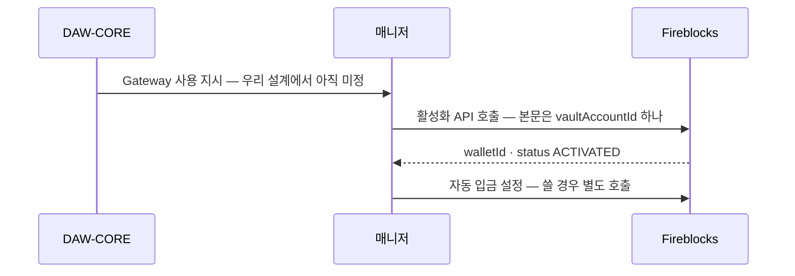
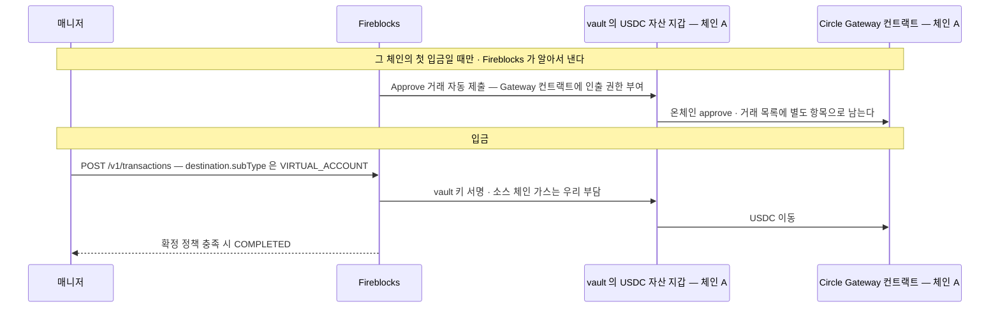
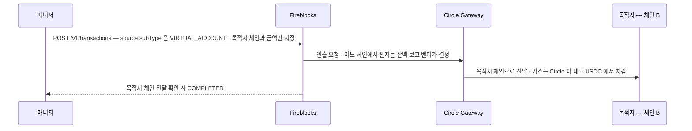

Fireblocks 가 Circle Gateway 를 감싼 기능이다. vault 의 USDC 를 체인 구분 없는 단일 잔액으로 모아 두고, 필요할 때 원하는 체인으로 인출한다. 체인마다 미리 USDC 를 깔아 둘 필요가 없어진다.

브릿지 수단으로 볼 때의 성질은 **같은 자산(USDC)을 체인 간에 옮기는 것**이다. 교환이 아니라 이동이고, 값은 1:1 에서 수수료만큼 깎인다.

Circle Gateway 쪽 구현은 이 문서에서 다루지 않는다. 우리가 보는 것은 Fireblocks 가 노출하는 면이고, 그 뒤는 벤더가 오케스트레이션한다.

## vault 와의 관계

- **Gateway 지갑은 vault account 하나에 결속된다.** 한 Gateway 지갑은 정확히 한 vault account 에 묶이고, vault account 마다 자기 Gateway 지갑을 가진다.
- **Gateway 잔액도 그 vault 단위다.** 지원 체인 전체에 걸친 단일 USDC 잔액이며, 조회하면 총액과 체인별 내역이 나온다.
- **입금은 같은 vault 안에서 일어난다.** 그 vault 의 USDC 자산 지갑에서 그 vault 의 Gateway 지갑으로 옮긴다. 거래 요청의 source 와 destination 에 **같은 vault id** 를 넣는다.
- 활성화는 설정 동작이라 자금이 움직이지 않고 온체인 상호작용도 없다. 워크스페이스의 네트워크 종류(메인넷·테스트넷)에 매인다.

## 흐름 — 활성화

이미 있는 vault 에 Gateway 지갑을 붙이는 단계다. 자금은 움직이지 않는다. 전제조건이 둘이다.

- vault account 가 존재한다
- 그 vault 에 **USDC 자산 지갑이 주소까지 생성돼** 있다

Console 에서는 vault 나 USDC 자산 지갑의 점 세 개 메뉴에서 실행한다. **vault 생성 시 자동으로 붙는 동작은 문서에 없다** — 우리가 vault 생성 흐름 끝에 활성화 호출을 붙이면 결과적으로 함께 만들어지는 모양이 되고, 그건 우리 오케스트레이션 결정이다.



**활성화 후 상태는 조회로 확인한다.** 잔액 조회 API 가 `status`(`ACTIVATED`·`DEACTIVATED`)와 `totalBalance`·`balanceBreakdown`·`assetIds` 를 준다. `assetIds` 는 그 Gateway 지갑이 커버하는 Fireblocks 자산 ID 목록이다.

자동 입금은 API 활성화 본문에 없다. Console 은 활성화 흐름에 토글을 두지만, API 로 붙이면 **활성화와 자동 입금 설정이 두 번의 호출**이다.

archive 된 지갑에 활성화를 다시 호출하면 재활성화된다.

## 흐름 — 입금 · 체인 A 의 USDC 를 Gateway 잔액으로



`APPROVE` 거래는 우리가 내는 것이 아니다. **그 체인에서 처음 입금할 때 Fireblocks 가 자동으로 제출한다.** ERC-20 승인이라 Gateway 컨트랙트가 그 주소에서 USDC 를 가져갈 수 있게 하는 것이고, 한 번 승인되면 같은 체인의 다음 입금은 승인 없이 진행된다. 정책에 `APPROVE` 룰이 없으면 이 자동 거래가 막혀 입금이 실패한다.

## 흐름 — 출금 · Gateway 잔액을 체인 B 로



목적지는 우리 vault·일회성 주소·화이트리스트 주소 중 무엇이든 된다.

## 호출하는 API

| 동작 | 호출 |
|---|---|
| 활성화 | [Activate a USDC Gateway wallet](https://developers.fireblocks.com/api-reference/vaults/activate-a-usdc-gateway-wallet) — 본문에 `vaultAccountId` |
| 입금 | `POST /v1/transactions` · **destination** 에 `subType: VIRTUAL_ACCOUNT` |
| 출금 | `POST /v1/transactions` · **source** 에 `subType: VIRTUAL_ACCOUNT` |
| 잔액 조회 | [Get USDC Gateway wallet info](https://developers.fireblocks.com/api-reference/vaults/get-usdc-gateway-wallet-info) — `status`·`symbol`·`totalBalance`·`balanceBreakdown`·`assetIds` |
| 비활성화 | [Deactivate a USDC Gateway wallet](https://developers.fireblocks.com/api-reference/vaults/deactivate-a-usdc-gateway-wallet) |
| 자동 입금 | `POST·GET·PATCH·DELETE /vault/accounts/{vaultAccountId}/virtual_asset_wallet/usdc_gateway/deposit_automation` |

입금·출금은 별도 엔드포인트가 아니라 **표준 거래 생성 API** 다. `subType` 을 어느 쪽에 붙이느냐로 방향이 갈린다.

```json
// 입금 — 체인 A 의 USDC 를 Gateway 로
{ "assetId": "USDC_ETH_TEST5", "amount": "10",
  "source":      { "type": "VAULT_ACCOUNT", "id": "0" },
  "destination": { "type": "VAULT_ACCOUNT", "id": "0", "subType": "VIRTUAL_ACCOUNT" } }

// 출금 — Gateway 에서 목적지 체인으로
{ "assetId": "USDC_ETH_TEST5", "amount": "10",
  "source":      { "type": "VAULT_ACCOUNT", "id": "0", "subType": "VIRTUAL_ACCOUNT" },
  "destination": { "type": "ONE_TIME_ADDRESS", "oneTimeAddress": { "address": "0x…" } } }
```

`assetId` 는 입금이면 **소스 체인**의 USDC, 출금이면 **목적지 체인**의 USDC 를 가리킨다. 위 예시 값은 API 가이드 원문 그대로이고, 설정 가이드의 자산 표에는 이더리움 Sepolia 가 `USDC_ETH_TEST5_0GER` 로 적혀 있어 표기가 다르다 — 실제 값은 자산 목록 조회로 확인한다.

## 비용 — 우리는 어떻게 내나

**따로 청구서를 받거나 이체하는 것이 아니다.** 출금 수수료는 **USDC 에서 차감**되고, 입금에는 우리 vault 의 가스만 든다.

| 시점 | 항목 | 어떻게 빠지나 |
|---|---|---|
| 입금 | 소스 체인 가스 | vault 의 네이티브 가스 잔액에서. Gas Station 이나 Universal Gasless 가 켜져 있으면 자동 충당 |
| 입금 | Fireblocks·Circle 수수료 | **없다** — 문서가 명시한다 |
| 출금 | Circle 이체율 | 인출액의 **0.005%** · Gateway 잔액에서 차감 |
| 출금 | 소스 체인 가스 | 변동. 인출 시점에 Circle 이 견적해 **Gateway 잔액에서 차감** |
| 출금 | 전달 수수료 | Circle Forwarding Service 가 목적지 체인 가스·전달을 부담하고, **전달되는 USDC 에서 차감** |

즉 **출금하면 목적지에 도착하는 USDC 가 요청액보다 적다.** 우리 가스는 입금에만 들고 출금에는 들지 않는다.

수수료는 Circle 이 정하고 바뀔 수 있다.

## 지원 체인

Beta 기간에 늘 수 있다.

**메인넷 11**

| 체인 | Fireblocks assetId |
|---|---|
| Arbitrum | `USDC_ARB_3SBJ` |
| Avalanche | `USDC_AVAX` |
| Base | `USDC_BASECHAIN_ETH_5I5C` |
| Ethereum | `USDC` |
| HyperEVM | `USDC_B64VHHFG_XX2F` |
| OP Mainnet | `USDC_OPT_9T08` |
| Polygon PoS | `USDC_POLYGON_NXTB` |
| Sei | `USDC_B68NGGMY_YSEF` |
| Sonic | `USDC_E_B7GKLA1Z_TQ94` |
| Unichain | `USDC_B7V9C52Z_CYWP` |
| World Chain | `USDC_E_B7DRHSD9_OINX` |

**테스트넷 12**

| 체인 | Fireblocks assetId |
|---|---|
| Arbitrum (Sepolia) | `USDC_ARB_SEPOLIA_V84S` |
| Arc | `USDC_ARC_TEST_G5EN` |
| Avalanche (Fuji) | `USDC_AVAX_FUJI` |
| Base (Sepolia) | `USDC_BASECHAIN_ETH_TEST5_8SH8` |
| Ethereum (Sepolia) | `USDC_ETH_TEST5_0GER` |
| HyperEVM | `USDC_B6RLTAMC_VKLF` |
| OP Mainnet (Sepolia) | `USDC_OPT_SEPOLIA_AZBE` |
| Polygon PoS (Amoy) | `USDC_AMOY_POLYGON_TEST_7WWV` |
| Sei | `USDC_B72Z7SP0_XAWM` |
| Sonic | `USDC_B64G796G_SXBE` |
| Unichain (Sepolia) | `USDC_B6Y9TTZY_0809` |
| World Chain (Sepolia) | `USDC_B6YDJ0HK_6UDW` |

## 자동 입금

매번 입금 거래를 내지 않아도 되게, **그 vault 의 USDC 자산 지갑에서 같은 vault 의 Gateway 지갑으로 주기적으로 쓸어 담는** 기능이다.

- 스케줄러가 vault 잔액을 확인하다가 **설정한 임계를 넘으면** 입금 거래를 자동으로 낸다. 임계는 vault account 마다 따로 설정한다.
- 기본 주기는 **60분**이고 API 로 낮출 수 있다. 단위는 `MINUTES`·`HOURS`·`DAYS`.
- `balanceThreshold` 를 `"0"` 으로 두면 최소 금액 없이 매번 전액을 쓸어 담는다.
- `assetId` 는 선택이다. 지정하면 그 자산만, 빼면 지원 자산 전체가 대상이다.
- Console 활성화 흐름에 토글이 있고 **기본이 켜짐**이다. 켜지 않으면 입금은 매번 수동으로 낸다.
- `automationType` 과 `assetId` 는 만든 뒤 못 바꾼다. 주기만 `PATCH` 로 바꾸고, `DELETE` 는 설정을 남긴 채 스케줄만 멈춘다.

```json
POST /vault/accounts/{vaultAccountId}/virtual_asset_wallet/usdc_gateway/deposit_automation
{ "automationType": "USDC_GATEWAY_DEPOSIT",
  "assetId": "USDC_ETH",
  "timeBased": { "intervalValue": 60, "intervalUnit": "MINUTES", "balanceThreshold": "1000" } }
```

**제출자가 우리가 아니다.** 자동 입금 거래는 `USDC Gateway Depositor` 라는 서비스 유저가 제출한다. 이 유저는 **제출만 하고 서명은 못 한다.** 그래서 정책 룰에 별도 서명자를 지정해야 하고, 안 하면 자동 입금이 "정책에 막힘" 으로 실패한다.

## 정책 준비

입금에는 룰 두 개가 필요하다. 없으면 활성화가 돼 있어도 정책에 막힌다.

- **Approve 룰** — 체인마다 첫 입금 때 자동으로 나가는 승인 거래용.
- **Transfer 룰** — 실제 입금용.

일회성 주소를 쓰는 워크스페이스면 Gateway 활성화 vault 에 대한 vault-to-vault 룰 두 개로 충분하다. 화이트리스트를 쓰는 구성이면 **Gateway 컨트랙트 주소를 체인마다 화이트리스트에 등록**하고 그 주소를 룰의 대상으로 지정한다. 화이트리스트 등록에는 워크스페이스의 admin quorum 승인이 붙는다.

```
메인넷 Gateway 컨트랙트   0x77777777Dcc4d5A8B6E418Fd04D8997ef11000eE
테스트넷 Gateway 컨트랙트  0x0077777d7EBA4688BDeF3E311b846F25870A19B9
```

자동 입금을 켜면 위 룰에 더해 **initiator 를 `USDC Gateway Depositor` 로 둔 룰**이 하나 더 필요하다. source·destination 에 Gateway 활성화 vault 를 넣고 서명자를 지정한다.

출금은 특별한 설정이 없다 — 일반 전송과 같은 룰을 탄다.

## 걸리는 것

- **Beta 다.** 동작·엔드포인트·한도가 바뀔 수 있다. Console 의 Labs 에서 켜거나 CSM 에 요청한다.
- **USDC 전용.** 다른 자산은 이 경로를 못 쓴다.
- **자금이 Circle 컨트랙트에 있다.** Gateway 잔액은 각 체인의 Circle Gateway 스마트컨트랙트가 들고 있고 우리 vault 잔액이 아니다. 지갑을 archive 해도 자금은 그대로 남으며 재활성화하면 다시 접근된다.
- **입금 완료 표시가 앞설 수 있다.** 완료 판정이 Circle 의 잔액 반영이 아니라 우리 워크스페이스 확정 정책으로 나기 때문에, `COMPLETED` 인데 Gateway 잔액에 아직 안 잡힐 수 있다고 문서가 명시한다. Circle 의 체인별 요구 컨펌 수에 따라 지연된다.
- **vault 당 Gateway 지갑 하나.** 브릿지 창구로 쓸 vault 를 정해야 한다.
- **한도는 Fireblocks 쪽에 없다.** 다만 Circle 이 rate limit 을 걸면 그 오류가 그대로 실패로 온다.

## 아직 모르는 것

- **소요 시간.** 입금은 우리 확정 정책, 출금은 "목적지 체인 전달 확인 시 완료" 라고만 하고 실제 몇 분인지는 문서에 없다.
- **실패 시 자금 위치.** 출금이 중간에 실패하면 Gateway 잔액에 남는지, 어떤 상태로 보이는지.
- **어느 vault 에 붙이고 언제 붙일지.** Gateway 지갑이 vault 1:1 이고 잔액도 vault 단위라, 고객 입금 vault 마다 활성화하는 구성과 한 곳만 활성화하는 구성이 갈린다. 전자면 vault 생성 흐름에 활성화를 넣는 것이 자연스럽고 후자면 생성 흐름과 무관해진다. 문서는 어느 쪽도 권하지 않는다 — 우리 구조에서 정할 사항이다.
- **거래 기록 형태.** 입금·출금이 `networkRecords` 와 웹훅에 어떻게 잡히는지. 벤더 문서는 "표준 Fireblocks 거래" 라고만 한다.
- **활성화가 우리 시스템에 어떻게 보이는지.** 활성화가 웹훅을 내는지, `GET /v1/vault/accounts/{id}` 응답에 Gateway 지갑이 나타나는지. 나타나면 vault 조회만으로 활성화 여부를 알 수 있고, 안 나타나면 잔액 조회 API 를 따로 불러야 한다. 활성화 실패 사유·에러 형태도 문서에 없다.

## 출처

- [USDC Gateway Overview](https://support.fireblocks.io/hc/en-us/articles/27419996238620-USDC-Gateway-Overview)
- [USDC Gateway: Prerequisites and Setup Guide](https://support.fireblocks.io/hc/en-us/articles/27420202963612-USDC-Gateway-Prerequisites-and-Setup-Guide)
- [Setting up policy rules for USDC Gateway](https://support.fireblocks.io/hc/en-us/articles/28897919442588-Setting-up-policy-rules-for-USDC-Gateway)
- [USDC Gateway (API guide)](https://developers.fireblocks.com/docs/usdc-gateway)
