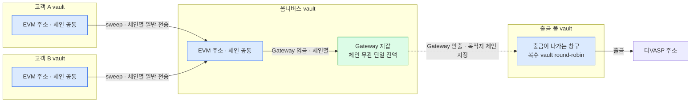
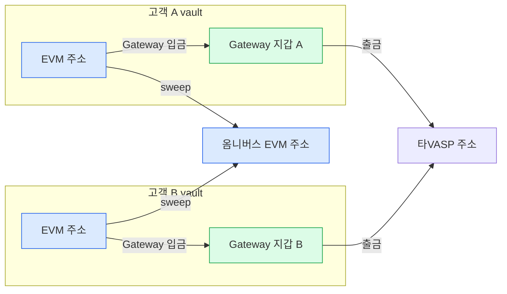

Gateway 지갑은 vault account 하나에 결속되고 잔액도 vault 단위다([3장](03-usdc-gateway.md)). 그래서 어느 vault 에 붙이느냐가 구조를 가른다.

**채택 — 옴니버스 vault 에만 활성화한다.** 고객 vault 에는 붙이지 않는다.

## 전제 — 주소는 체인이 달라도 같다

같은 vault 의 EVM 주소는 체인이 달라도 같다. vault 12 의 Base Sepolia 주소가 `0x496E…55D` 였고, 이더리움 Sepolia 배치에서도 같은 주소로 토큰이 들어왔다(2026-08-10 실측).

그래서 주소 단위로 그리면 고객 하나에 EVM 주소 하나다. 체인이 갈리는 것은 주소가 아니라 **그 주소가 어느 체인에서 무슨 자산을 들고 있는지**다.

## 채택 — 옴니버스에만 활성화

sweep 이 끝난 뒤 Gateway 입금이 붙는 2단 구조다. **점선은 조건부다** — Gateway 인출 목적지는 출금 풀 vault 로 두되, [5장](05-fit.md)의 이동 정책이 서야 확정된다.

옴니버스와 출금 풀은 다른 vault 다. 출금은 출금 풀 vault 에서 나간다([흐름](../../BC/설계/02-bcm-flow.md) 출금 절). 밴드C 는 옴니버스와 출금 풀의 합을 세고 밴드S 는 Gateway 잔액까지 한 칸으로 세므로, 셋 사이의 이동은 두 밴드 어느 값도 바꾸지 않는다([sweep](../../BC/설계/06-sweep.md) 밴드S 산식). 그래도 출금이 실제로 나가려면 재고가 출금 풀에 있어야 한다.

## 미채택 — 고객 vault 마다 활성화

같은 잔액을 sweep 과 Gateway 입금이 각자 다른 곳으로 가져가려 한다.

## 왜 그렇게 정했나

| | 채택 — 옴니버스 | 미채택 — 고객 vault |
|---|---|---|
| Gateway 지갑 수 | 1 | 고객 수만큼 |
| Gateway 잔액 | 한 곳에 모임 | **고객마다 쪼개짐** — 통합 잔액의 이점이 사라진다 |
| 승인 거래 수 | 체인 수만큼 | **고객 수 × 체인 수** |
| sweep 과의 관계 | 2단 — sweep 뒤에 Gateway 입금 | **경쟁** — 같은 잔액을 두 주체가 노린다 |
| 자동 입금 | 옴니버스 하나에 임계 설정 | 고객 vault 마다 임계 설정 |
| 활성화 호출 | 1회 | 고객 수만큼. 일괄 활성화 API 는 없다 |

승인 거래 수와 잔액 분산은 [3장](03-usdc-gateway.md)의 문서 사실에서 나온다 — 승인은 `(vault 주소, 체인)` 조합마다 1회이고 Gateway 잔액은 vault 단위다.

## 자산 경계마다 하나

위 비교는 **고객자산 안에서의 축**이다. 회사자산 vault 는 별개 축이고, 여기에도 Gateway 를 붙일 수 있다.

**Gateway 지갑은 자산 경계마다 하나씩 둔다.** 고객자산은 옴니버스에, 회사자산은 회사자산 vault 에.

| | 고객자산 Gateway | 회사자산 Gateway |
|---|---|---|
| 붙는 vault | 옴니버스 | 회사자산 vault |
| 잔액의 성격 | 고객자산 | 회사자산 |
| 밴드S | **핫으로 센다** — 옴니버스·출금 풀과 같은 칸 | **산식 밖** — 밴드S 는 고객자산 기준이다 |
| 쓸모 | 출금 풀 재고 보충 | [1장](01-problem.md) 브릿지교환의 상대편 재고를 체인 무관으로 유지 |

**Gateway 지갑 하나에서 목적지를 갈아 끼워 두 경계를 오갈 수는 없다.** 고객 옴니버스의 Gateway 잔액은 고객자산이라, 회사자산 vault 로 인출하면 대가 없이 경계를 넘는다. 경계를 넘는 이동은 브릿지교환이고, 맞바꿀 두 다리가 짝을 이뤄야 한다 — Gateway 인출 한 건으로는 표현되지 않는다.

회사자산 쪽은 밴드S·밴드C 어느 쪽도 안 건드리므로 고객자산 쪽보다 결정이 적다.

## 따라오는 것

- **활성화는 운영 초기 1회다.** 옴니버스 vault 하나에만 붙이므로 고객 vault 생성·주소 발급 흐름과 무관하다. 고객 주소를 발급하는 매니저의 입금 주소 발급 API 에 활성화를 끼워 넣을 이유가 없어진다.
- **승인 거래는 체인 수만큼**이다. 옴니버스 주소가 각 체인에서 처음 Gateway 입금을 낼 때 한 번씩.
- **자동 입금 임계는 옴니버스 하나에만** 설정한다.

## 아직 정할 것

이 배치를 전제로 남는 미결은 [5장](05-fit.md)에 모았다 — 출금 풀에 얼마를 두나, 복수 출금 풀 배분, 감지 구분, 운영 영역 분리.
