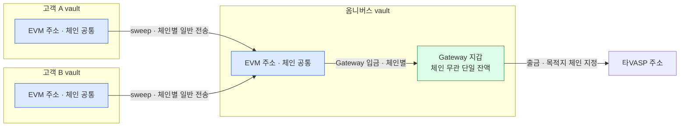
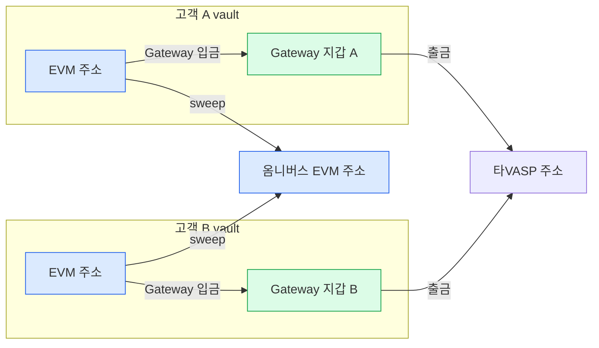

Gateway 지갑은 vault account 하나에 결속되고 잔액도 vault 단위다([3장](03-usdc-gateway.md)). 그래서 어느 vault 에 붙이느냐가 구조를 가른다.

**채택 — 옴니버스 vault 에만 활성화한다.** 고객 vault 에는 붙이지 않는다.

## 전제 — 주소는 체인이 달라도 같다

같은 vault 의 EVM 주소는 체인이 달라도 같다. vault 12 의 Base Sepolia 주소가 `0x496E…55D` 였고, 이더리움 Sepolia 배치에서도 같은 주소로 토큰이 들어왔다(2026-08-10 실측).

그래서 주소 단위로 그리면 고객 하나에 EVM 주소 하나다. 체인이 갈리는 것은 주소가 아니라 **그 주소가 어느 체인에서 무슨 자산을 들고 있는지**다.

## 채택 — 옴니버스에만 활성화

sweep 이 끝난 뒤 Gateway 입금이 붙는 2단 구조다.

## 미채택 — 고객 vault 마다 활성화

같은 잔액을 sweep 과 Gateway 입금이 각자 다른 곳으로 가져가려 한다.

## 왜 그렇게 정했나

| | 채택 — 옴니버스 | 미채택 — 고객 vault |
|---|---|---|
| Gateway 지갑 수 | 1 | 고객 수만큼 |
| Gateway 잔액 | 한 곳에 모임 | **고객마다 쪼개짐** — 통합 잔액의 이점이 사라진다 |
| 승인 거래 수 | 체인 수만큼 | **고객 수 × 체인 수** |
| sweep 과의 관계 | 2단 — sweep 뒤에 Gateway 입금 | **경쟁** — 같은 잔액을 두 주체가 노린다 |
| 자동 입금 | 옴니버스 하나에 임계 설정 | 고객 vault 마다 임계 설정 |
| 활성화 호출 | 1회 | 고객 수만큼. 일괄 활성화 API 는 없다 |

승인 거래 수와 잔액 분산은 [3장](03-usdc-gateway.md)의 문서 사실에서 나온다 — 승인은 `(vault 주소, 체인)` 조합마다 1회이고 Gateway 잔액은 vault 단위다.

## 따라오는 것

- **활성화는 운영 초기 1회다.** 옴니버스 vault 하나에만 붙이므로 고객 vault 생성·주소 발급 흐름과 무관하다. 고객 주소를 발급하는 매니저의 입금 주소 발급 API 에 활성화를 끼워 넣을 이유가 없어진다.
- **승인 거래는 체인 수만큼**이다. 옴니버스 주소가 각 체인에서 처음 Gateway 입금을 낼 때 한 번씩.
- **자동 입금 임계는 옴니버스 하나에만** 설정한다. 고객 vault 잔액과는 무관하므로 sweep 과 경쟁하지 않는다.

## 아직 정할 것

- **Gateway 잔액을 20% 한도 계산에서 뭘로 세나.** 자금이 Circle 컨트랙트에 있어 우리 vault 잔액이 아니다. 핫월렛으로 볼지 콜드로 볼지 별도 항목으로 볼지가 정해지지 않았다.
- **밴드C 와의 관계.** 밴드C 는 보내는주소의 BC자산별 재고를 다룬다([1장](01-problem.md)). Gateway 잔액은 체인 구분이 없어 밴드C 의 축과 맞지 않는다. Gateway 를 재고로 셀지, 인출해 온 뒤에만 셀지 정해야 한다.
