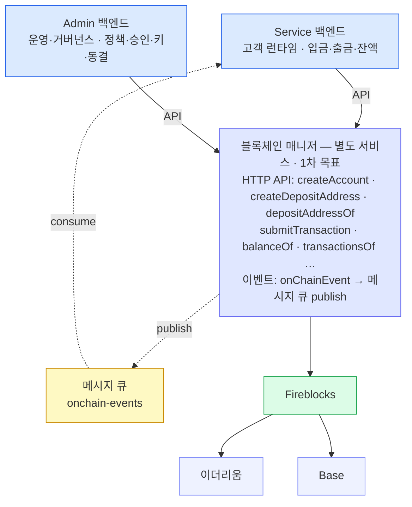
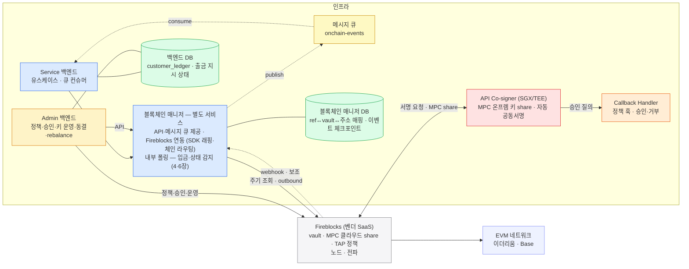

별도 서비스인 블록체인 매니저를 백엔드가 HTTP API 로 부르고 온체인 이벤트는 메시지 큐로 받는 두 층 구조와 기능 × 사용처 표를 한 장에 정리한다.
워크스루 전체의 등장인물표로, 이후 모든 장은 이 구성 요소 이름을 그대로 쓴다.

## 구조는 두 층입니다

이 시스템은 두 층입니다.

위는 **지갑 백엔드** — 항상 직접 만들고 여기서는 **물리적으로 분리된 두 개**입니다. 별도 배포·권한·감사 경계로 나뉩니다.

- **Service 백엔드** — 고객 런타임(계정·주소·입금·출금·잔액)
- **Admin 백엔드** — 운영·거버넌스(정책·승인·키 운영·동결·rebalance)

아래는 **블록체인 매니저** — 별도 배포되는 독립 서비스입니다. 두 백엔드가 **HTTP API** 로 부르고, 온체인 이벤트는 매니저가 **메시지 큐에 publish** 하고 백엔드가 **consume** 합니다.

## 어디서 도는가 — 물리 배치

위가 논리 구조라면, 구성 요소가 실제로 **어디서 도는지**도 잡아 두면 1~8페이지가 쉽습니다. Fireblocks 기준 배치는 이렇습니다 — 서명·키·노드·전파는 **벤더 안**이고 이쪽엔 **두 백엔드·블록체인 매니저(별도 서비스)·DB 둘·Co-signer**가 남습니다.

위 그림을 요약하면:

- **Service·Admin 은 물리적으로 분리**돼 각자 블록체인 매니저 API 를 부른다. Fireblocks 연동은 매니저 내부 구현이다.
- DB 는 둘 — **매핑·이벤트 체크포인트는 블록체인 매니저 DB**, **원장·출금 지시 상태는 백엔드 DB**.
- 서명은 벤더 단독이 아니다. 보안 존(SGX/TEE)의 **API Co-signer** 가 키 share 하나를 들고 공동서명하고, 서명 직전 **Callback Handler** 가 승인·거부를 건다.
- 입금·상태 감지는 **매니저 내부 폴링**(주기 조회)이고 webhook 은 보조다(4장). 감지 결과는 **메시지 큐(onchain-events)** 로 백엔드에 전달된다.

**DB 를 둘로 나눈 이유:**

- **매니저 DB (벤더 번역·운영 상태)** — vaultId·주소 매핑과 폴링 커서. 백엔드가 vaultId 를 모르게 해 벤더·매니저 교체 시 백엔드 0줄(9장) · 최빈 조회(depositAddressOf)를 벤더 왕복 없이(3장) · 벤더가 24h 뒤 못 지키는 유일성을 DB UNIQUE 로 영구 방어(1·2장).
- **백엔드 DB (회계 진실)** — customer_ledger·귀속·잔액. 벤더가 바뀌어도 남아야 하는 진실이라 분리.

## Fireblocks 기능 × 사용처 표

매니저 API 오퍼레이션들은 어디서 왔을까요. **Fireblocks 의 API 표면을 분석한 결과**입니다.

| 기능 | Fireblocks 표면 | 온보딩 | 입금 | 출금 | 운영·CS | 매니저 API | 백엔드 | 페이지 |
|---|---|---|---|---|---|---|---|---|
| 고객 계정 생성 | createVaultAccount | ● | | | | `createAccount` | S | 1장 |
| 입금 주소 **생성** | createVaultAsset · 자산 지갑 활성화 (EVM=단일) | ● | ● | | | `createDepositAddress` | S | 2장 |
| 입금 주소 **조회** | (블록체인 매니저 DB 읽기 · Fireblocks 왕복 없음 — API 1홉) | | ● | | ● | `depositAddressOf` | S | 3장 |
| 수신·확정 이벤트 | 매니저 내부 폴링 (webhook 보조) | | ● | ● | | `onChainEvent` — 메시지 큐 publish/consume | S | 4장 |
| 수수료 추정 | estimateFee | | | ● | | `estimateFee` | S | 7장 |
| 출금 제출 | createTransaction | | | ● | | `submitTransaction` | S | 6장 |
| 거래 상세 조회 | getTransactionById | | | ● | ● | `transactionOf` | S·A | 6장 |
| 막힌 출금 재촉·취소 | boost / cancel | | | ● | ● | `boost` `cancel` | A | 6장 |
| 잔액 (가용·대기·잠김) | getVaultAccountAsset | | ● | ● | ● | `balanceOf` | S·A | 8장 |
| 내 거래 이력 | 거래 목록 조회 | | | | ● | `transactionsOf` | S·A | 8장 |
| 서명 정책 (한도·화이트리스트) | co-signer · Callback Handler — 서명 직전 재검증 | | | ● | ● | (동사 없음 — 서명 관문) | A | 6장 |
| gas 조달 | Universal Gasless (대납 — 스테이블코인 전용이라 ETH 이동 없음) | | | ● | ● | (동사 없음 — 운영·설정) | A | 문서 |
