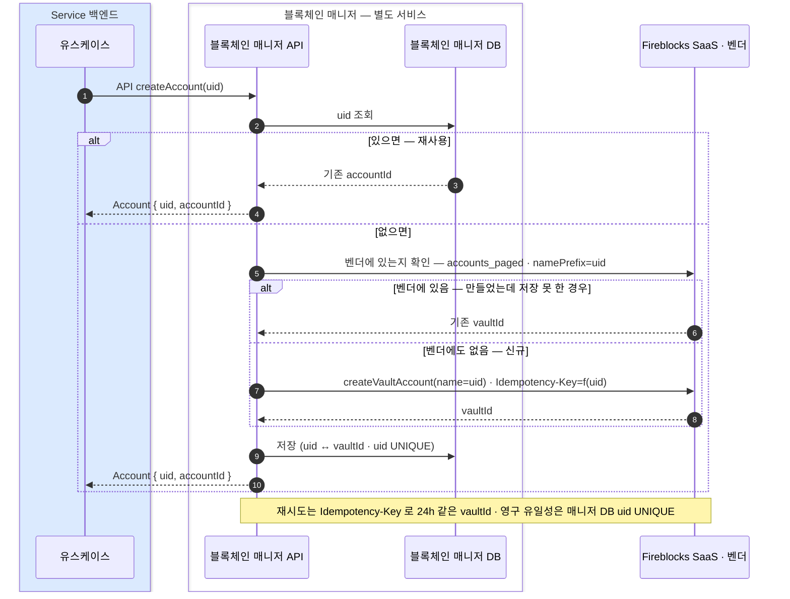

createAccount(uid) 는 블록체인 매니저 API 오퍼레이션 — Service 백엔드가 HTTP API 로 호출하면 매니저가 Fireblocks vault 를 만들고 Account { uid, accountId } 매핑을 블록체인 매니저 DB 에 저장한다.
고객당 한 번 — vault 를 만들며 재시도는 Idempotency-Key 와 블록체인 매니저 DB uid UNIQUE 로 중복을 막는다.

```
createAccount(uid) 리턴 Account { uid, accountId }
// accountId = vault 매핑 id
```

## createAccount — vault 를 만든다



### 한 번만 — 재시도·중복 방어 (결정)

- **재시도**: Idempotency-Key 로 24시간 내 재시도는 같은 vaultId (중복 vault 없음).
- **유일성**: 매니저 DB 의 uid UNIQUE 가 최종 방어 — 경합해도 이긴 값을 반환한다.
