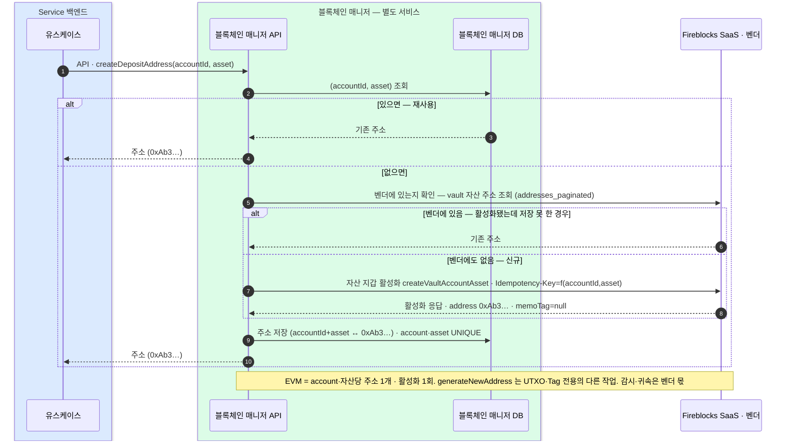

(account, asset)당 한 번 — 백엔드가 블록체인 매니저 API 를 호출하면 매니저가 자산 지갑을 활성화해 단일 주소를 얻는다. EVM 주소는 memoTag 가 null 이다.
(account, asset)↔주소 매핑은 블록체인 매니저 DB 에 저장한다. 저장 못 한 경우의 복구도 매니저 안에서 처리한다.

```kotlin
fun createDepositAddress(accountId: AccountId, asset: Asset): Address {
  return Address(value, memoTag)
}
```

## 자산 지갑 활성화



### 주소의 두 규칙 (결정)

- **추가 주소는 vault 추가로**: EVM 은 (vault, 자산)당 주소가 **하나뿐**이라, 같은 자산의 주소가 더 필요하면 **vault account 를 더 만든다**.
- **감시 등록까지가 발급**: 주소는 감시(귀속) 등록까지 끝나야 "존재"한다 — 등록 안 된 주소로 온 입금은 감지하지 못하며 입금 사고의 최다 유형이다. 이 감시·귀속은 벤더 몫(vault 가 곧 감시 범위, 입금 감지 4장).
