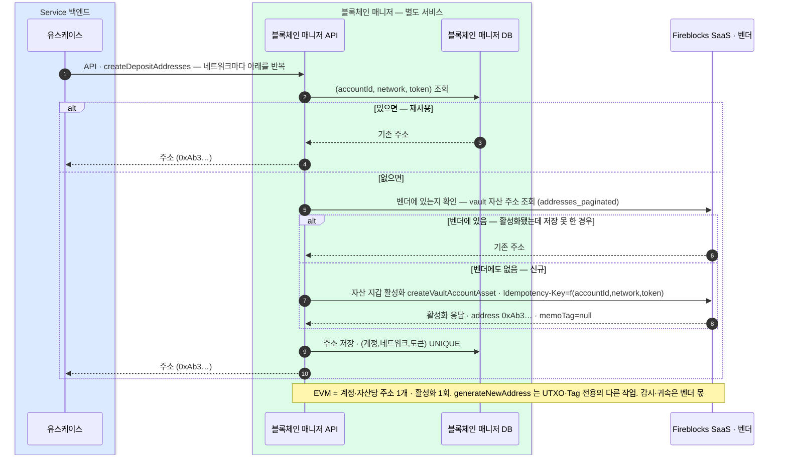

(계정, 네트워크, 토큰)당 한 번 — 백엔드가 블록체인 매니저 API 를 호출하면 매니저가 자산 지갑을 활성화해 단일 주소를 얻는다. EVM 주소는 memoTag 가 null 이다.
(계정, 네트워크, 토큰)↔주소 매핑은 블록체인 매니저 DB 에 저장한다. 저장 못 한 경우의 복구도 매니저 안에서 처리한다.

```kotlin
fun createDepositAddresses(accountId: AccountId, token: Token, networks: List<Network>): List<AddressResult>
```

발급 오퍼레이션은 이것 하나다 — 네트워크가 하나뿐이면 목록에 하나만 담아 보낸다. 단건 전용 오퍼레이션을 따로 두지 않는 이유는 완전한 부분집합이어서 구현·테스트가 두 벌이 되고 한쪽만 고쳐져 어긋나기 때문이다.

## 자산 지갑 활성화



### 주소의 두 규칙 (결정)

- **추가 주소는 vault 추가로**: EVM 은 (vault, 자산)당 주소가 **하나뿐**이라, 같은 자산의 주소가 더 필요하면 **vault account 를 더 만든다**.
- **감시 등록까지가 발급**: 주소는 감시(귀속) 등록까지 끝나야 "존재"한다 — 등록 안 된 주소로 온 입금은 감지하지 못하며 입금 사고의 최다 유형이다. 이 감시·귀속은 벤더 몫(vault 가 곧 감시 범위, 입금 감지 4장).

## 여러 네트워크를 한 요청으로

고객이 한 토큰을 **여러 네트워크로 받고 싶을 때** 쓴다. USDC 를 이더리움·폴리곤·트론에서 받으려면 세 주소가 필요하고, 그때마다 단건 발급을 세 번 호출하는 대신 토큰 하나와 네트워크 목록으로 한 번에 묶는다.

발급 규칙은 새로 생기지 않는다 — 네트워크마다 단건 발급과 결과가 같고 멱등하다. 계정은 하나이므로 vault 도 하나이고, **자산 지갑만 네트워크별로 여러 개 활성화**되는 것이다.

### 네트워크 목록은 누가 정하나 (결정)

**DAW-CORE 가 네트워크 목록을 함께 보낸다.** 매니저는 토큰 이름만 받아 네트워크를 스스로 채우지 않는다.

- 어떤 네트워크로 받을지는 **상품 결정**이다 — 같은 USDC 라도 서비스가 지원할 네트워크를 골라야 하고, 그 목록은 매니저가 알 이유가 없다.
- 매니저가 갖는 표는 **(네트워크, 토큰) → 벤더 assetId** 변환표 하나다. 토큰 하나가 어느 네트워크에서 지원되는지까지 매니저가 알면 상품 결정이 매니저로 새어 들어온다.

### 실패와 순서 (결정)

| 결정 | 값 | 이유 |
|---|---|---|
| 계정이 없을 때 | 요청 전체 404 | 계정은 경로에 하나뿐이라 네트워크별 사유가 아니다 |
| 미지원 네트워크가 섞였을 때 | **발급 전 전체 400** | 지원 여부는 매핑 표만 보면 발급 전에 안다. 시작하지 않았으니 되돌릴 것도 없다 — 흔한 실수를 부분 실패로 만들지 않는다 |
| 발급 중 실패 | 항목별 (전체 롤백 없음) | **주소 발급은 되돌릴 수 없다.** 이미 발급된 것은 벤더에도 우리 DB에도 실재하므로, 전체 실패로 응답하면 거짓이 된다. 우리 DB만 지우면 벤더에만 있는 주소가 생겨 그리로 온 입금이 귀속 불명이 된다 — 가장 나쁜 결과다 |
| 응답 순서 | 요청 순서 고정 | 호출 쪽이 자기 목록과 위치로 대응한다 |
| 중복 네트워크 | 발급 1회 · 결과는 두 항목에 동일 | 같은 네트워크가 두 번 들어와도 벤더를 두 번 부르지 않는다 |
| 한 요청 상한 | 20네트워크 | 한 토큰이 지원되는 네트워크 수를 넉넉히 담는 크기. 벤더 호출 수는 줄지 않으므로 상한은 필요하다 |

HTTP 상태는 네트워크별 결과와 무관하게 200 이고, 판단은 항목별 에러 유무로 한다. 성공분은 멱등해 같은 주소가 다시 오므로 **같은 요청을 그대로 재시도**할 수 있다. 이미 발급된 것은 매니저 DB 에서 찾아 돌려주므로 **벤더를 다시 부르지 않는다** — 재시도가 낭비가 아니다. 실패한 네트워크만 골라 보내도 결과는 같다.

**부분 실패를 없앨 수는 없지만 드물게 만들 수 있다.** 실패는 성격이 둘로 갈린다 — 미지원 네트워크처럼 **미리 아는 것**은 발급 전에 전체 400 으로 거절하고, 벤더 일시 오류처럼 **재시도로 풀리는 것**은 매니저가 흡수한다(벤더 클라이언트의 429 백오프). 그러고도 남는 실패만 항목별로 올라온다. 그래서 부분 실패는 정상 경로이되 예외적인 상황이다.

**벤더 호출 수는 줄지 않는다** — 네트워크마다 벤더를 한 번 부르므로 줄어드는 것은 백엔드↔매니저 왕복뿐이다. 순차 처리이고, 상한 20네트워크가 곧 지연의 상한이다.

**태그가 필요한 체인은 아직 못 다룬다** — 여러 네트워크를 다루면 XRP·XLM 처럼 주소 외에 태그·메모가 필요한 체인이 섞인다. 지금 `memoTag` 는 벤더 태그를 보관하지 않아 항상 null 이므로, 그런 체인을 지원하려면 태그 보관을 먼저 정해야 한다.
