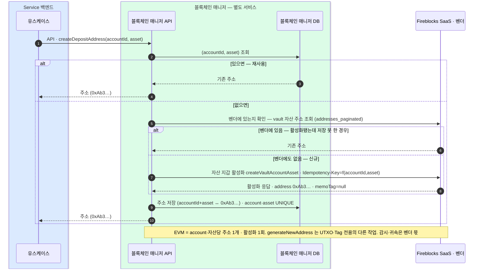

(account, asset)당 한 번 — 백엔드가 블록체인 매니저 API 를 호출하면 매니저가 자산 지갑을 활성화해 단일 주소를 얻는다. EVM 주소는 memoTag 가 null 이다.
(account, asset)↔주소 매핑은 블록체인 매니저 DB 에 저장한다. 저장 못 한 경우의 복구도 매니저 안에서 처리한다.

```kotlin
fun createDepositAddress(accountId: AccountId, asset: Asset): Address {
  return Address(value, memoTag)
}
```

## 자산 지갑 활성화



### 주소의 두 규칙 (결정)

- **추가 주소는 vault 추가로**: EVM 은 (vault, 자산)당 주소가 **하나뿐**이라, 같은 자산의 주소가 더 필요하면 **vault account 를 더 만든다**.
- **감시 등록까지가 발급**: 주소는 감시(귀속) 등록까지 끝나야 "존재"한다 — 등록 안 된 주소로 온 입금은 감지하지 못하며 입금 사고의 최다 유형이다. 이 감시·귀속은 벤더 몫(vault 가 곧 감시 범위, 입금 감지 4장).

## 일괄 발급 — createDepositAddressesBulk

여러 (계정, 자산)의 주소를 한 요청으로 발급한다. 단건을 여러 번 부른 것과 결과가 같다 — 새로운 발급 규칙이 아니라 **왕복을 줄이는 오퍼레이션**이다.

```kotlin
fun createDepositAddressesBulk(items: List<AddressRequestItem>): List<AddressResult>
```

**부분 실패를 정상 경로로 다룬다.** 100건 중 3건이 실패해도 97건은 발급된 상태로 남고, 응답은 요청과 같은 순서로 항목별 결과(주소 또는 에러 코드)를 담는다. HTTP 상태는 항목 결과와 무관하게 200 이고, 판단은 항목별 에러 유무로 한다. 전체를 되돌리지 않으므로 **같은 요청을 그대로 재시도**할 수 있다 — 성공분은 멱등하게 같은 주소가 오고 실패분만 다시 시도된다.

| 결정 | 값 | 이유 |
|---|---|---|
| 한 요청 상한 | 100건 | 벤더 호출 수가 줄지 않으므로 무제한이면 한 요청이 벤더 한도를 다 쓴다 |
| 실패 처리 | 항목별 (전체 롤백 없음) | 한 건의 실패로 나머지 99건을 다시 발급하는 것이 더 위험하다 — 발급은 멱등하지만 벤더 호출을 두 배로 쓴다 |
| 응답 순서 | 요청 순서 고정 | 호출 쪽이 자기 목록과 위치로 대응할 수 있다 |
| 중복 항목 | 발급 1회 · 결과는 두 항목에 동일 | 같은 조합이 두 번 들어와도 벤더를 두 번 부르지 않는다 |

**벤더 호출 수는 줄지 않는다.** 매니저는 항목마다 벤더를 한 번 부르므로, 줄어드는 것은 백엔드↔매니저 왕복뿐이다. 매니저는 항목을 병렬 처리하되 동시 실행 수를 제한하므로 100건 요청은 단건보다 오래 걸린다 — 호출 쪽 타임아웃을 넉넉히 잡는다.

**아직 못 정한 것** — 벤더의 쓰기 계열 분당 한도를 확답받지 못했다(거래 조회 한도만 받았다). 대량 발급을 어느 주기로 얼마나 돌릴 수 있는지는 그 답을 받고 정한다. 상한 100건은 그 전까지의 보수적 값이다.
