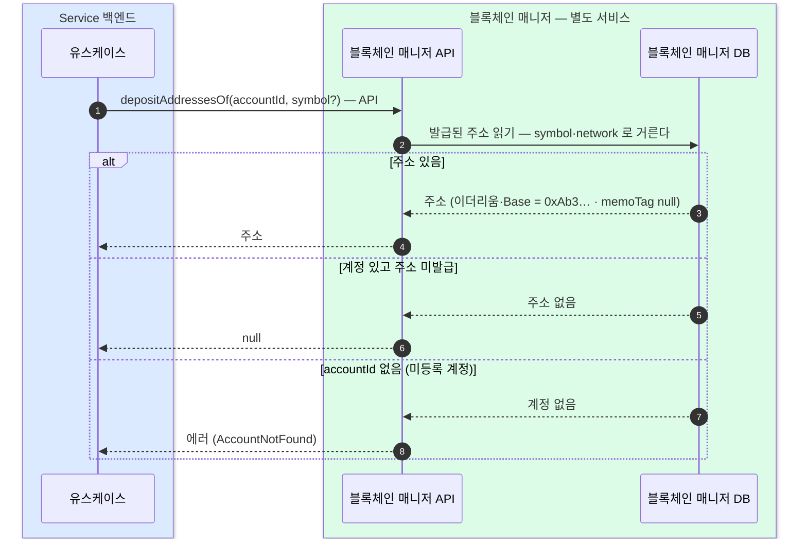

생성과 정반대인 읽기 전용 오퍼레이션 — 매니저가 블록체인 매니저 DB 에서 (accountId, network, symbol)으로 저장된 주소를 읽는다 — 발급과 같은 경로에 메서드만 다르다.
가장 자주 불리는 조회라 벤더 왕복 없이 매니저 DB 만 읽고, 백엔드는 매니저 API 1홉으로 받는다.

```kotlin
fun depositAddressesOf(accountId: AccountId, symbol: Token? = null, network: Network? = null): List<DepositAddress> {
  // accountId 없음 → 에러(AccountNotFound) · 계정 있고 주소 미발급 → null (만들지 않는다, 생성은 2장)
  return address
}
```

## 매니저가 자기 DB 에서 읽는다



### null 과 에러의 구분 (결정)

`null` 은 **계정은 있고 그 자산 주소만 아직 발급 전**이라는 뜻이다. **accountId 자체가 없으면 에러**(AccountNotFound)로 돌려 null 과 구분한다 — 잘못된 accountId 를 "발급 전"으로 오인해 엉뚱하게 새로 발급하는 일을 막는다.

### 왜 DB 읽기인가 (결정)

매니저가 **자기 DB 만 읽으므로** 벤더 API 한도·지연에 묶이지 않는다 — 벤더를 왕복하는 설계였다면 가장 잦은 호출이 가장 취약한 경로가 된다. 비용은 백엔드→매니저 내부 API 1홉이다.
