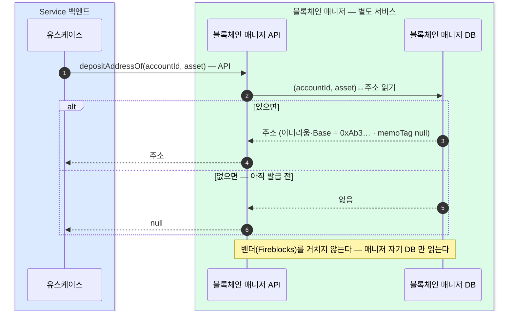

생성과 정반대인 읽기 전용 동사 — 매니저가 블록체인 매니저 DB 에서 (accountId, asset)로 저장된 주소를 읽는다.
벤더 왕복 없이 매니저 자기 DB 만 읽고, 백엔드는 매니저 API 1홉으로 받는 조회 경로의 설계 근거를 정리한다.

# 입금 주소 조회 — depositAddressOf

생성과 정반대인 읽기 전용 — 매니저가 블록체인 매니저 DB 에서 (accountId, asset)로 그 주소를 읽고, 백엔드는 매니저 API 1홉으로 받는다

```
depositAddressOf(accountId, asset) → Address?
// 읽기 · 없으면 null (만들지 않는다 — 생성은 2장)
```

## 매니저가 자기 DB 에서 읽는다 — 벤더 왕복 없음



### 왜 DB 읽기인가 (결정)

고객이 입금 화면을 열 때마다 불려, 이 문서에서 호출 빈도가 가장 높은 동사다.

매니저가 **자기 DB 만 읽으므로** 벤더 API 한도·지연에 묶이지 않는다 — 벤더를 왕복하는 설계였다면 가장 잦은 호출이 가장 취약한 경로가 된다. 비용은 백엔드→매니저 내부 API 1홉이다.
