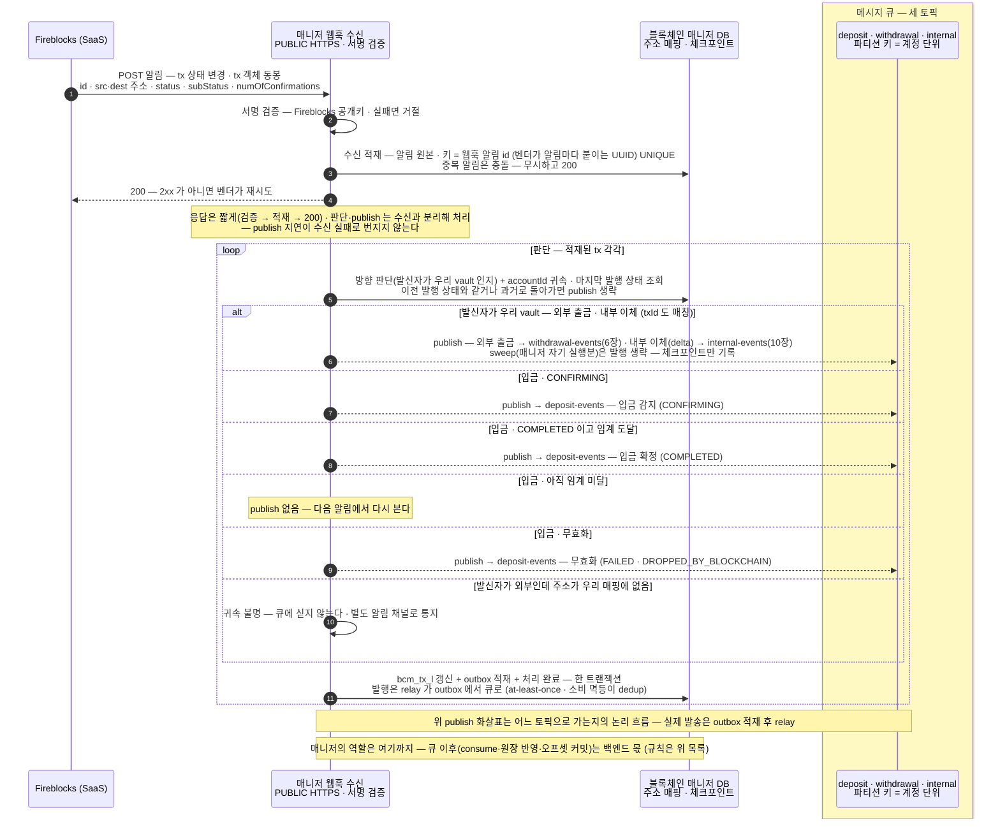
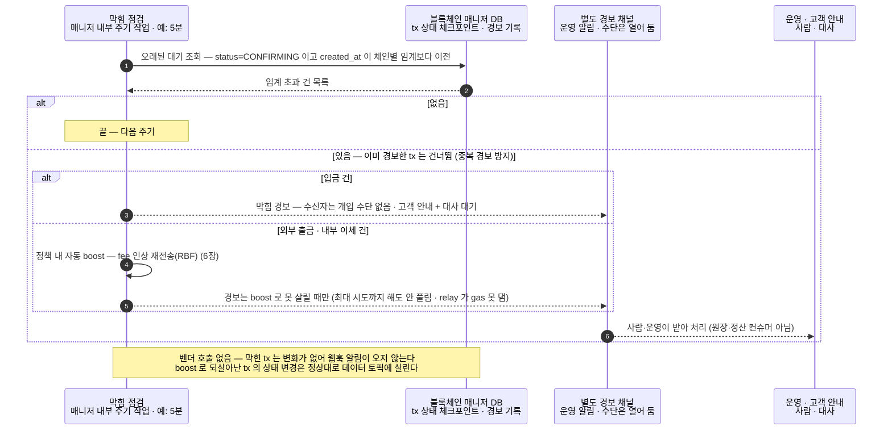

입·출금이 함께 쓰는 공통 기준 — 언제부터 믿는가, 그리고 어떻게 아는가.
블록체인 매니저(별도 서비스)가 Fireblocks 웹훅으로 워크스페이스의 입금·출금·내부 이체 변경을 받아 판단해 세 토픽(deposit·withdrawal·internal)으로 publish 하고 확정 기준(DCCP)이 언제부터 잔액에 반영할지를 정한다.

```kotlin
fun onChainEvent(topic: Topic, handler: (ChainEvent) -> Unit)

data class ChainEvent(
  val type: EventType,               // DEPOSIT · WITHDRAWAL · INTERNAL — 매니저가 체인+매핑으로 가르는 tx 분류 (INTERNAL 로 발행되는 건 delta 뿐 — sweep 은 매니저 내부 · 귀속 불명은 큐 대신 별도 알림 채널)
  val txId: String,                 // 벤더 tx id
  val txHash: String? = null,        // 온체인 거래해시 — 전파 후 채워짐(SUBMITTED 단계엔 없을 수 있음). 백엔드 대사·증빙용
  val externalTxId: String? = null,  // 우리 요청 키 (출금·내부이체) — 완료 대응·멱등
  val accountId: AccountId,          // 파티션 키 (내부이체 = 출발 계정)
  val asset: Asset,
  val to: String,                    // 목적지 주소 — 고객 입금 판별
  val status: TxStatus,              // SUBMITTED · CONFIRMING · COMPLETED · REJECTED · FAILED — DAW-CORE 는 이것으로만 판단한다
  val numOfConfirmations: Int,
)
```
벤더의 `subStatus`·`networkStatus` 는 이벤트에 싣지 않는다 — 매니저가 번역(어떤 TxStatus·이벤트를 낼지 결정)에 쓰는 내부 값이고, DAW-CORE 는 TxStatus 로만 판단하기 때문이다.

이벤트는 **세 토픽**으로 갈라 publish 합니다 — 매니저가 수신한 웹훅 알림에서 이벤트 계열을 판단해 해당 토픽에 넣고, 백엔드는 토픽마다 전용 컨슈머를 둡니다.

| 토픽 | 담는 이벤트 | 파티션 키 | 소비 |
|---|---|---|---|
| `deposit-events` | 고객 입금 감지·확정 (DEPOSIT) | 고객 accountId — 천만 계정으로 분산 | 입금 컨슈머 (5장) |
| `withdrawal-events` | 외부 출금 상태 변경 (WITHDRAWAL) | 보내는 출금 풀 vault 의 accountId | 출금 컨슈머 (6장) |
| `internal-events` | 내부 이체 완료 (INTERNAL — delta 정산만 · sweep 은 매니저 내부라 싣지 않는다) | 출발 계정 accountId | 정산 컨슈머 (10장) |

이 장은 세 토픽을 채우는 **매니저의 웹훅 수신과 확정 기준**을 정의하고, 입금(5장)·출금(6장)·내부 이체 정산(10장)이 각 토픽을 소비한다. 등록은 토픽별 한 번, publish 는 매니저가 판단할 때마다.

**처리는 백엔드 몫이고, 지켜야 할 규칙은 이렇습니다.**

- **라우팅은 매니저가 (publish 시점).** 업무 의도는 모르고, **발신자가 우리 vault 인지**로 방향을 가른다(source·dest 를 매핑과 대조):
  - **발신자가 우리 vault** — 목적지 외부면 `WITHDRAWAL`, 우리 vault 면 `INTERNAL`. 단 sweep(매니저 자신이 실행한 이동)은 발행하지 않는다 — `internal-events` 에는 delta 만 실린다(5장).
  - **발신자가 외부** — 매핑된 입금 주소면 `DEPOSIT`. 매핑에 없는 주소(귀속 불명)는 큐에 싣지 않고 **별도 알림 채널**로 통지한다 — 수동 매핑 해소 대기.
- **멱등** — 매니저는 상태 갱신과 발행 이벤트를 **한 트랜잭션(outbox)**으로 원자 기록하고, relay 가 at-least-once 로 큐에 발행한다. relay 재발송·재소비로 같은 이벤트가 두 번 와도 **이벤트 id(`evnt_id`) 로 가려** 한 번만 반영한다. **`txId` 로 가리면 안 된다** — 한 tx 가 감지·확정·무효화로 여러 이벤트를 내므로, `txId` 로 dedup 하면 확정 이벤트가 "이미 처리한 tx"로 버려진다.
- **커밋** — 처리 성공 후에만 오프셋 커밋(at-least-once). 실패하면 재소비된다.
- **컨슈머 그룹은 토픽마다 하나** — 인스턴스가 여러 대여도 분배는 큐가 한다.

## 공통 상태 다섯 (TxStatus) — 기준

Fireblocks 는 내부 상태를 여러 단계로 보내지만, 백엔드가 보는 것은 매니저가 번역한 **공통 상태 다섯**입니다. 입금(5장)·출금(6장)이 모두 이 표를 씁니다.

| 공통 상태 (TxStatus) | 뜻 | 블록체인 상태 (Pending → Confirmed → Finalized) | Fireblocks 원어 (매니저가 번역) | 함께 실리는 subStatus (대표) | 체인 레이어 (networkStatus) |
|---|---|---|---|---|---|
| **SUBMITTED** | 제출됨 — 벤더가 서명·전파 준비 중, 아직 체인 미등장 (출금에서만 관찰) | 아직 없음 → 전파되면 **Pending** (mempool 대기) | PENDING_SIGNATURE · QUEUED · BROADCASTING | — (분기할 것 없음) | 서명 단계까진 없음 → BROADCASTING (전파 시작) |
| **CONFIRMING** | 전파 후 체인에 등장, confirmation 누적 중 (아직 미확정) | **Confirmed** — 블록에 포함, finality 전 | CONFIRMING (numOfConfirmations 증가 중) | PENDING_BLOCKCHAIN_CONFIRMATIONS | CONFIRMING |
| **COMPLETED** | 확정 — DCCP(확정 정책) 임계 confirmation 도달 = finality | **Finalized** — 확정 임계 도달 | COMPLETED | CONFIRMED | CONFIRMED |
| **REJECTED** | 거부·차단 — 정책·스크리닝에 막힘. 영구 기술 실패가 아니라 사람 개입 여지 (입금 동결은 Admin unfreeze 대기 · 5장) | 출금 차단은 체인에 없음 · 입금 동결은 **Finalized** (돈은 체인에 확정 — 장부만 잠김) | REJECTED · BLOCKED | AUTO_FREEZE · FROZEN_MANUALLY · REJECTED_AML_SCREENING — 동결 3종, unfreeze 흐름 분기(5장) | 차단 시점에 따라 — 출금(전파 전 차단)은 없음 · 입금 동결은 CONFIRMED (돈은 체인에 도착, 업무만 잠김) |
| **FAILED** | 영구 실패 — 사유 동반 (수수료 부족·revert 등) | **Pending 에서 증발**(dropped) · 블록 포함 후 실행 실패(revert 는 Confirmed 이후) | FAILED | DROPPED_BY_BLOCKCHAIN — reorg 증발(5장) · SMART_CONTRACT_EXECUTION_FAILED — 컨트랙트 revert, 사유는 errorDescription 필드(6장) · 그 외 실패 사유 | FAILED (revert) · DROPPED (mempool 누락·증발) |

- 아래 표의 `subStatus`·`networkStatus` 열은 **매니저가 벤더에게서 받아 번역에 쓰는 값**이다 — 어떤 TxStatus·이벤트를 낼지 매니저가 이 값으로 가른다(예: `DROPPED_BY_BLOCKCHAIN` → 무효, 동결 3종 → REJECTED). **이벤트에는 TxStatus 만 싣고 DAW-CORE 는 그것으로만 판단한다** — subStatus·networkStatus 는 백엔드로 넘어가지 않는다.
- **REJECTED = 임시**(unfreeze 대기) **≠ FAILED = 영구** — 이 구분이 백엔드 원장·화면 처리를 가른다.
- 벤더 내부의 세부 단계(승인·서명·전파)는 SUBMITTED 로 접어 감춘다 — 이 다섯만 밖으로 나간다.

## 내부 이체 — 파티션 키·완료 대응 (결정)

큐(`internal-events`)에 실리는 내부 이체는 **delta 정산뿐**이다 — sweep 은 매니저 내부 동작이라 백엔드 제출도, 큐 이벤트도 없다(5장). delta 는 **출발 계정 accountId 를 파티션 키**로 쓴다 — 옴니버스로 몰리는 핫 파티션을 피한다.

delta 는 요청·실행·완료가 두 시스템에 걸쳐 대응돼야 한다:

- **요청** — 백엔드가 **externalTxId(우리 요청 키)** 를 실어 매니저에 보낸다.
- **실행** — 매니저는 자기 DB 상태를 **처리중(processing)** 으로 두고 내부 전송을 실행한다. 매니저가 아는 건 "이건 내부 이체(`INTERNAL`)"까지다.
- **완료** — 완료·상태 변경 이벤트가 **externalTxId 를 달고** `internal-events` 로 오고, 정산 컨슈머는 externalTxId 로 원래 요청을 찾아 **업무 기록을 닫는다**(델타 배치 완료 → 델타원장 PENDING→완료, 10장).

상태가 두 곳에 있는 셈이다 — **매니저 DB = 트랜잭션 진행**(processing→완료), **DAW-CORE DB = 업무 원장**(PENDING→완료). 둘을 잇는 열쇠가 externalTxId 다.

## 웹훅 수신 흐름 — 알림 하나가 이벤트 하나가 된다

감지는 **Fireblocks 웹훅**입니다 — **v2 로 구축한다** (v1 은 2026-06-15 지원 종료 · 신규 이벤트는 v2 만 지원). 벤더가 tx 상태 변경마다 매니저의 수신 엔드포인트로 서명된 알림을 push 하고, 매니저가 계열을 갈라 판단해 **입금은 `deposit-events`(5장), 외부 출금은 `withdrawal-events`(6장), 내부 이체(delta)는 `internal-events`(10장)**로 publish 합니다. 폴링은 두지 않습니다 — 유실은 벤더 재시도·재전송(resend)이 메우고, 남는 어긋남은 대사(8장)가 닫습니다.



| 빠뜨리면 사고 나는 지점 | 어떻게 |
|---|---|
| **서명 검증** | 모든 알림은 서명을 검증하고 통과한 것만 받는다 — PUBLIC 엔드포인트라 위조 방어의 1차 관문. 현행 스펙(공식 문서): `Fireblocks-Webhook-Signature` 헤더의 detached JWS(RS512)를 환경별 JWKS 엔드포인트의 공개키로 검증 — **키 로테이션 자동**. 구방식 `Fireblocks-Signature`(수동 키)와 병행 전송 중. 알림 `data` 에는 트랜잭션 객체 전체가 실려 판단에 보강 조회가 필요 없다. 추가 방어로 발신 IP allowlist(환경당 1개 — 공식 문서)를 겹친다. |
| **수신 확인과 벤더 재시도** | 2xx 를 돌려줘야 전달 완료다 — 아니면 벤더가 지수 백오프로 재시도한다(10·30·120·300·900·1800·3600·7200·14400초, 총 10회 실패 시 failed 마킹 — 공식 문서). 그래서 수신은 가볍게(검증 → 적재 → 200) 하고 판단·publish 는 분리해 처리한다 — publish 지연·큐 장애가 수신 실패로 번지지 않는다. **오류율이 임계를 넘는 수신 endpoint 는 벤더가 자동 비활성화한다(circuit breaker — 공식 문서)** — 즉시 2xx + 비동기 처리 분리가 그래서 필수다. |
| **유실 복구 (resend)** | 재시도로도 못 받은 알림은 재전송 API(`POST /v1/webhooks/{id}/notifications/resend_failed`)로 다시 받는다 — v2 는 원 이벤트로부터 **30일**, 같은 이벤트 재전송은 5분에 1회(공식 문서). 수신기 다운·재기동 뒤에 한 번 호출해 다운 구간을 메운다. |
| **순서 역전·중복 수신** | 알림은 중복되거나 순서가 어긋날 수 있다 — 체크포인트의 마지막 발행 상태와 비교해 **상태 전이가 앞으로 갈 때만 outbox 적재** 한다(같으면 생략 · 과거로 돌아가면 무시). |
| **원자 발행 (outbox)** | 워커가 상태 갱신과 발행 이벤트를 **한 트랜잭션(outbox)**에 함께 쓰고, relay 가 큐로 보낸다(at-least-once) — 큐·DB 이중 쓰기 문제를 outbox 로 없앤다. relay 재발송분은 소비 멱등이 흡수한다. |
| **오프셋 커밋** | 백엔드 컨슈머 그룹은 **원장 반영 성공 후에만** 오프셋 커밋. 실패하면 커밋하지 않아 재소비된다(at-least-once) — 중복은 아래 멱등이 흡수. |
| **멱등** | dedup 키는 **이벤트 id(`evnt_id`)** — 알림마다 유일한 값이라 "같은 이벤트 재도착"만 정확히 거른다. `txId` 로 가리면 한 tx 의 감지·확정·무효화가 같은 키가 되어 **확정 이벤트가 버려진다**. 재발송·재소비로 두 번 와도 잔액 이중 반영 없음 — 최후 보루. |
| **상태 반영 판정** | dedup 을 통과한 이벤트는 **허용 전이 표**(흐름 문서 상태 절)로 반영 여부를 가린다 — 늦게 온 옛 상태는 무시, **`COMPLETED → FAILED`(reorg 무효화)는 반영**. 서열로 "뒤로 가면 무시" 하면 무효화가 버려진다. |
| **reorg** | 확정으로 봤던 입금이 무효화되면 벤더가 상태 변경 알림을 보내고 매니저가 무효화 이벤트를 publish — 백엔드는 **반영해 둔 잔액만 되돌리고** 입금 기록은 보존. 신호는 FAILED + subStatus `DROPPED_BY_BLOCKCHAIN` (reorg 는 5장). 알림까지 놓치면 대사(8장)가 잡는다. |
| **입금 폭주** | 수신(적재 + 200)과 판단을 분리해 두었으므로 폭주는 판단 쪽 적체로만 나타난다 — 수신은 계속 받는다. 판단 적체 깊이는 경보 대상(11장). |
| **429 (rate limit)** | 웹훅은 받는 쪽이라 rate limit 대상이 아니다. 남는 벤더 호출(제출·boost·대사·재전송 요청)에는 기존 원칙 유지 — **지수 백오프** + 매니저의 모든 벤더 호출에 **클라이언트측 상한(token bucket) 하나**, **제출·boost > 대사** 순으로 배분(돈 나가는 경로 우선). 제출 재시도는 externalTxId 멱등이라 중복 무해. 429 율은 메트릭으로 내보내 밖에서 경보(11장). |

### 폭주 설계 · 정지·장애 시나리오

입금이 한꺼번에 몰릴 때(수신 3단계 고정·병렬 판단 워커)와 웹훅을 놓쳤을 때의 정지·장애 시나리오는 **[BC/설계 — 웹훅 감지 상세](../../BC/설계/99-detection-detail.md)** 로 옮겼다.

## 막힘 점검 — 오래 CONFIRMING 인 건 골라내기

막힘은 push 로 못 잡습니다 — 막힌 tx 는 **변화가 없어서** 웹훅 알림이 오지 않기 때문입니다. 대신 감지가 모든 CONFIRMING 을 이미 블록체인 매니저 DB 에 체크포인트로 기록해 두므로, 매니저의 느슨한 주기(예: 5분) 작업이 **자기 DB 에서 오래된 대기 건을 조회**하면 끝입니다(벤더 호출 없음).

골라낸 건은 **별도 경보 채널**로 보냅니다 — 원장·정산 컨슈머가 소비하는 데이터 토픽(입금·출금·내부)이 아니라, 사람·운영이 받는 신호 경로입니다. 어떤 수단으로 흘릴지(운영 알림·모니터링·별도 큐 등)는 열어 둡니다.



| 결정 | 어떻게 |
|---|---|
| **배치** | 별도 프로세스 불필요 — **매니저 내부의 주기 작업**(예: 5분). 막힘 점검은 boost 트리거까지 하는 **행동하는 작업**이라 매니저 안에 둔다 — 살아 있는지의 **감시는 매니저 밖**(11장). |
| **조회** | **블록체인 매니저 DB 쿼리** — `status=CONFIRMING` 이고 기록 시각이 임계보다 이전인 행. 벤더의 `status` 필터 조회는 대사·운영용으로만 남긴다(8장). |
| **막힘 판단** | 체류 시간이 **체인별 임계** 초과. 임계는 평시 confirmation 소요를 감안해 정한다. |
| **입금이 막히면** | 수신자라 개입 수단이 없다 — **별도 경보 채널로 알림 + 고객 "확인 중" 안내**가 전부이고, 해소는 체인 혼잡 해소 또는 대사가 잡는다. |
| **출금이 막히면** | 매니저가 **정책 내 자동 boost**(수수료 인상 재전송) — gas 는 relay 부담. 자동 boost 로도 못 살리면(최대 시도까지 boost 해도 안 풀리거나, relay 가 gas 를 못 대거나 거절) **별도 경보 채널로 올려** 사람이 relay 복구·수동 처리한다(cancel 은 예외). 상세 6장. |
| **경보 채널** | 원장·정산 컨슈머가 소비하는 데이터 토픽과 분리한다 — 사람·운영이 받는 신호라서. 구체 수단(운영 알림·모니터링·별도 큐 등)은 운영 설계에서 정한다. |
| **벤더·체인 헬스** | 매니저는 **자기 벤더 호출의 오류율·지연을 메트릭으로 내보내는 것까지만** — 이를 보고 경보하는 것과 **벤더 status 공지** 확인은 매니저 밖 모니터링 몫이다(11장). 매니저 안에 두면 매니저가 죽을 때 감시도 같이 죽는다. |
| **같은 건 중복 경보 방지** | 경보한 tx id 를 기록해 두고 다음 주기엔 건너뛴다. 해소(COMPLETED/FAILED 전이)되면 닫는다. |

## 감지 경로 — 웹훅(주) · 재전송(복구) · 대사(안전망 둘)

여러 겹으로 둡니다 — 백엔드는 어느 경로로 잡혔든 같은 이벤트를 큐에서 consume 합니다. 공통 원칙은 **주소를 하나씩 조회하지 않는다**는 점입니다 — 감지는 push 고, 복구·대사도 워크스페이스·시간 범위 기준이라 주소가 천만 개여도 부하는 **놓친 트랜잭션 수에 비례할 뿐 주소 수와 무관**합니다.

| 수단 | 무엇을 |
|---|---|
| **웹훅** (주 경로 · 매니저가 수신) | 벤더가 tx 상태 변경마다 서명된 알림을 push — 감지 지연이 없다. 수신·판단 흐름은 맨 위 절. 벤더도 폴링보다 웹훅을 권장한다(rate limiting 문서). |
| **재전송** (복구) | 2xx 못 받은 알림은 벤더가 재시도하고, 그래도 놓친 것은 `POST /v1/webhooks/{id}/notifications/resend_failed` 로 다시 받는다(v2 는 원 이벤트로부터 30일 · 이벤트당 5분 1회) — 수신기 다운·재기동 구간을 메운다. |
| **tx 대사** (최종 안전망 — 감지 평면) | 주기 목록 대조로 **놓친 웹훅 자체**를 잡아 복구한다 — 아래 절. |
| **잔액 대사** (안전망 — 회계 평면) | 회계 걸리는 숫자(원장 합계 vs 온체인 커스터디)를 주기·일마감으로 맞춘다 — 8장. |

세 경로가 겹칠 때의 규칙:

- 여러 경로가 같은 입금을 중복 관찰하므로, 매니저의 발행과 백엔드의 반영 모두 **이벤트 id(`evnt_id`) 기준 멱등**으로 한 번만 건다 — 없는 돈을 두 번 반영하는 것이 가장 비싼 사고다. tx 단위로 가리지 않는다(한 tx 가 여러 이벤트를 낸다).

### tx 대사 — 놓친 웹훅을 잡는 저빈도 목록 대조

주기 목록 대조로 놓친 웹훅 자체를 잡아 복구하는 최종 안전망 — 상세는 **[BC/설계 — 웹훅 감지 상세](../../BC/설계/99-detection-detail.md)** 로 옮겼다. 요지: 10분 주기로 벤더 거래 목록을 읽어 기록(`bcm_tx_l`)과 대조하고, 없거나 뒤처진 건을 웹훅과 같은 판단 경로로 흘려 복구 + 운영 알림. **대조 대상은 종결된 건만**이다(진행 중 `CONFIRMING`·`SUBMITTED` 는 웹훅 몫) — `COMPLETED` 로 거를 땐 `numOfConfirmations` 가 확정 임계 이상인지 함께 본다(아래 확정 기준 절의 zero-confirmation 함정).

## 확정 기준 — confirm 과 finality, 그리고 DCCP

> **이 문서가 붙잡는 구분 — confirm(체인 등장) vs finality(확정)**
>
> 트랜잭션 하나의 상태는 Fireblocks 안에서 **BROADCASTING → CONFIRMING → COMPLETED** 순으로 흐른다. 이 중 직접 잔액을 움직일 때 붙잡아야 할 두 지점이 **CONFIRMING** 과 **COMPLETED** 다.
>
> **CONFIRMING = confirm 상태.** 트랜잭션이 체인에 올라가 블록에 담겼고 그 위로 confirmation 이 쌓이는 중이다 — 하지만 **아직 확정 아님**. 이 단계의 자금은 고객에게 "확인 중"으로만 보여주고 available 잔액에는 넣지 않는다.
>
> **COMPLETED = finality 상태.** confirmation 이 **DCCP(확정 정책)가 정한 임계 수**에 도달했다는 뜻이고 이때부터 이 자금을 **확정(finality)**으로 보고 available 에 반영한다.
>
> 둘을 프로그램으로 가르는 방법은 두 가지다 — `status` 값(CONFIRMING 인지 COMPLETED 인지)으로 갈리거나, tx 객체의 `numOfConfirmations`(실제 누적 confirmation 수)를 finality 임계값과 비교한다. 이 판단은 매니저 내부에서 이뤄지고 백엔드는 판단이 끝난 이벤트(감지/확정)를 큐에서 consume 한다.

### DCCP — 무엇이 CONFIRMING 을 COMPLETED 로 바꾸는가

CONFIRMING 에서 COMPLETED 로 넘어가는 **임계 confirmation 수를 정하는 정책**이 **DCCP(Deposit Control and Confirmation Policy)** 입니다. "finality"는 체인이 자연히 주는 성질이 아니라 DCCP 가 정의하는 확정 기준입니다.

커스텀 DCCP 는 **Console 에서 직접 설정하는 게 아니라**, 정책 템플릿을 작성해 **Fireblocks Support 에 제출 → 검토·승인 후 반영**됩니다. 어떤 임계를 요청할지 정하는 책임은 **Admin(운영)**, 큐 이벤트를 consume 해 잔액에 반영하는 런타임은 **Service** 의 몫입니다.

> **DCCP 임계값 — 기본값과 커스텀**
>
> Fireblocks 의 DCCP 기본 임계 confirmation 수는 체인마다 다르다.
>
> - **대부분의 체인 = 1** — 블록 하나면 확정으로 본다. **이더리움·Base 도 기본 1** 에 속한다(공식 기본 정책 문서 — vault↔vault 포함).
> - **ETC(이더리움 클래식)** — 과거 reorg 리스크로 기본 372.
> - **finality 속성을 가진 체인** — 체인별로 고정(rigid)된 값을 쓴다 (변경 불가).
> - **컨트랙트 호출(contract call)** — 3 권장, 단순 전송보다 보수적으로.
> - 하드 한도: EVM 최소 1(0 불가) · 이더리움 최대 100 · 신규 EVM L2 최대 30.
>
> 이 값은 **커스텀 DCCP** 로 조정할 수 있는데, 직접 설정이 아니라 **템플릿 작성 → Fireblocks Support 제출 → 검토·승인 후 반영**이다. EVM 대상(이더리움·Base)에서 어떤 임계를 요청할지는 자산·리스크 정책에 따라 Admin 이 정하고, Service 는 그 결과로 매니저가 publish 한 확정 이벤트만 신뢰하면 된다.

> **함정 — 첫 COMPLETED 를 곧 finality 로 단정하지 말 것 (zero-confirmation)**
>
> Deposit Policy 를 **zero-confirmation** 으로 두면, COMPLETED 가 **블록에 등장하는 시점에 먼저** 뜰 수 있고 이후 알림마다 관찰값(등장 + 1차 confirm + 추가 confirm)이 계속 갱신될 수 있다. 이 설정에서는 "COMPLETED 를 처음 관찰했다"가 곧 "충분한 confirmation 이 쌓였다"를 뜻하지 않는다.
>
> 그래서 매니저의 확정 판단은 status 만 보지 말고 **`numOfConfirmations` 를 finality 임계값과 직접 비교**하는 편이 안전하다. 어떤 임계를 finality 로 볼지는 위 DCCP 와 한 몸이다.
