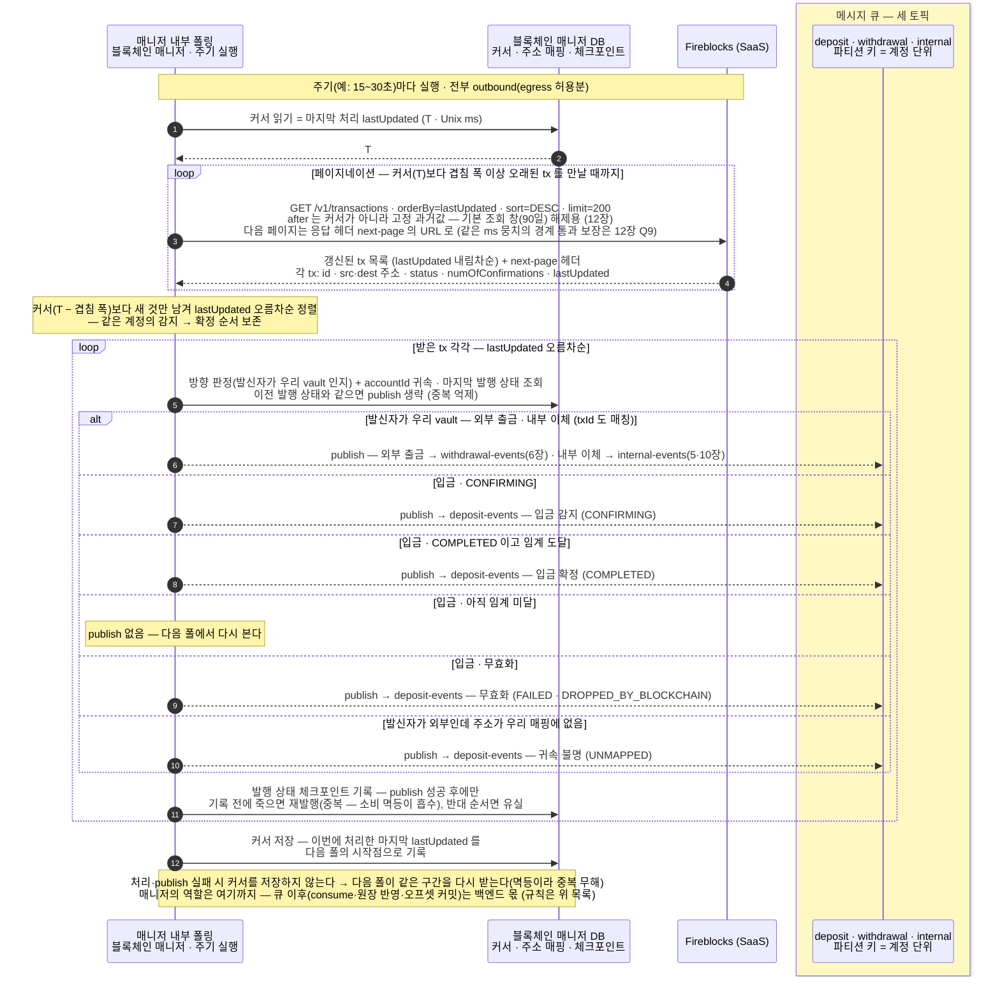
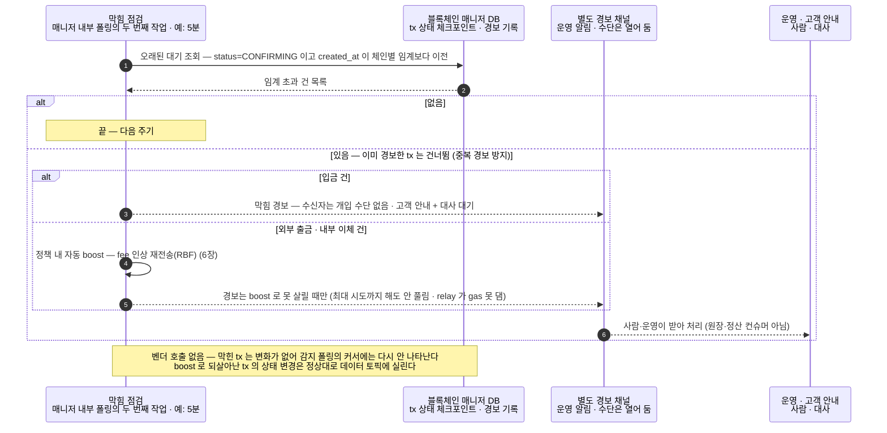

입·출금이 함께 쓰는 공통 기준 — 언제부터 믿는가, 그리고 어떻게 아는가.
블록체인 매니저(별도 서비스)가 내부 폴링으로 워크스페이스의 입금·출금·내부 이체 변경을 판정해 세 토픽(deposit·withdrawal·internal)으로 publish 하고 확정 기준(DCCP)이 언제부터 잔액에 반영할지를 정한다.

```kotlin
fun onChainEvent(topic: Topic, handler: (ChainEvent) -> Unit)

data class ChainEvent(
  val type: EventType,               // DEPOSIT · UNMAPPED · WITHDRAWAL · INTERNAL — 매니저가 체인+매핑으로 가르는 tx 분류 (sweep/delta 는 백엔드가 externalTxId 로)
  val txId: String,                 // 벤더 tx id
  val txHash: String? = null,        // 온체인 거래해시 — 전파 후 채워짐(SUBMITTED 단계엔 없을 수 있음). 백엔드 대사·증빙용
  val externalTxId: String? = null,  // 우리 요청 키 (출금·내부이체) — 완료 대응·멱등
  val accountId: AccountId,          // 파티션 키 (내부이체 = 출발 계정)
  val asset: Asset,
  val to: String,                    // 목적지 주소 — 고객 입금 판별
  val status: TxStatus,              // SUBMITTED · CONFIRMING · COMPLETED · REJECTED · FAILED
  val numOfConfirmations: Int,
  val subStatus: String? = null,     // 벤더 상세 사유(수십 종) — 예: CONFIRMED · PENDING_BLOCKCHAIN_CONFIRMATIONS · DROPPED_BY_BLOCKCHAIN · AUTO_FREEZE · FROZEN_MANUALLY · REJECTED_AML_SCREENING
  val networkStatus: String? = null, // 체인 레이어 상태(NetworkStatus) — BROADCASTING · CONFIRMING · CONFIRMED · FAILED · DROPPED
)
```

이벤트는 **세 토픽**으로 갈라 publish 합니다 — 매니저가 폴링에서 이벤트 계열을 판정해 해당 토픽에 넣고, 백엔드는 토픽마다 전용 컨슈머를 둡니다.

| 토픽 | 담는 이벤트 | 파티션 키 | 소비 |
|---|---|---|---|
| `deposit-events` | 고객 입금 감지·확정 (DEPOSIT · UNMAPPED) | 고객 accountId — 천만 계정으로 분산 | 입금 컨슈머 (5장) |
| `withdrawal-events` | 외부 출금 상태 변경 (WITHDRAWAL) | 보내는 출금 풀 vault 의 accountId | 출금 컨슈머 (6장) |
| `internal-events` | 내부 이체 완료 (INTERNAL — sweep·delta 는 백엔드가 externalTxId 로 구분) | 출발 계정 accountId | 정산 컨슈머 (5·10장) |

이 장은 세 토픽을 채우는 **매니저 내부 폴링과 확정 기준**을 정의하고, 입금(5장)·출금(6장)·내부 이체 정산(10장)이 각 토픽을 소비한다. 등록은 토픽별 한 번, publish 는 매니저가 판정할 때마다.

**처리는 백엔드 몫이고, 지켜야 할 규칙은 이렇습니다.**

- **라우팅은 매니저가 (publish 시점).** 업무 의도는 모르고, **발신자가 우리 vault 인지**로 방향을 가른다(source·dest 를 매핑과 대조):
  - **발신자가 우리 vault** — 목적지 외부면 `WITHDRAWAL`, 우리 vault 면 `INTERNAL`. sweep/delta 구분은 정산 컨슈머가 externalTxId 로.
  - **발신자가 외부** — 매핑된 입금 주소면 `DEPOSIT`, 없으면 `UNMAPPED`(귀속 불명 · 보류).
- **멱등** — 매니저가 중복을 억제해도(상태 전이 시만 publish) 같은 이벤트가 드물게 두 번 올 수 있다(publish 직후 죽는 예외 창·재소비). 이벤트 ID(tx id·externalTxId) unique 로 상태 전이만 반영한다.
- **커밋** — 처리 성공 후에만 오프셋 커밋(at-least-once). 실패하면 재소비된다.
- **컨슈머 그룹은 토픽마다 하나** — 인스턴스가 여러 대여도 분배는 큐가 한다.

## 공통 상태 다섯 (TxStatus) — 기준

Fireblocks 는 내부 상태를 여러 단계로 보내지만, 백엔드가 보는 것은 매니저가 번역한 **공통 상태 다섯**입니다. 입금(5장)·출금(6장)이 모두 이 표를 씁니다.

| 공통 상태 (TxStatus) | 뜻 | Fireblocks 원어 (매니저가 번역) | 함께 실리는 subStatus (대표) | 체인 레이어 (networkStatus) |
|---|---|---|---|---|
| **SUBMITTED** | 제출됨 — 벤더가 서명·전파 준비 중, 아직 체인 미등장 (출금에서만 관찰) | PENDING_SIGNATURE · QUEUED · BROADCASTING | — (분기할 것 없음) | 서명 단계까진 없음 → BROADCASTING (전파 시작) |
| **CONFIRMING** | 전파 후 체인에 등장, confirmation 누적 중 (아직 미확정) | CONFIRMING (numOfConfirmations 증가 중) | PENDING_BLOCKCHAIN_CONFIRMATIONS | CONFIRMING |
| **COMPLETED** | 확정 — DCCP(확정 정책) 임계 confirmation 도달 = finality | COMPLETED | CONFIRMED | CONFIRMED |
| **REJECTED** | 거부·차단 — 정책·스크리닝에 막힘. 영구 기술 실패가 아니라 사람 개입 여지 (입금 동결은 Admin unfreeze 대기 · 5장) | REJECTED · BLOCKED | AUTO_FREEZE · FROZEN_MANUALLY · REJECTED_AML_SCREENING — 동결 3종, unfreeze 흐름 분기(5장) | 차단 시점에 따라 — 출금(전파 전 차단)은 없음 · 입금 동결은 CONFIRMED (돈은 체인에 도착, 업무만 잠김) |
| **FAILED** | 영구 실패 — 사유 동반 (수수료 부족·revert 등) | FAILED | DROPPED_BY_BLOCKCHAIN — reorg 증발(5장) · 그 외 실패 사유 | FAILED (revert) · DROPPED (mempool 누락·증발) |

- 상태 이벤트에는 TxStatus 만 실리는 게 아니다 — ChainEvent 에 `subStatus`(벤더 상세 사유)·`networkStatus`(체인 레이어)가 함께 온다. **판단은 TxStatus 다섯으로** 하고, subStatus 는 위 대표값처럼 **분기가 필요한 최소 집합만** 백엔드가 보고 나머지는 로깅한다(12장 정합 항목).
- **REJECTED = 임시**(unfreeze 대기) **≠ FAILED = 영구** — 이 구분이 백엔드 원장·화면 처리를 가른다.
- 벤더 내부의 세부 단계(승인·서명·전파)는 SUBMITTED 로 접어 감춘다 — 이 다섯만 밖으로 나간다.

## 내부 이체 — 파티션 키·완료 대응 (결정)

sweep·델타처럼 우리 계정 둘이 얽히는 내부 이체는 **출발 계정 accountId 를 파티션 키**로 쓴다 — 옴니버스로 몰리는 핫 파티션을 피한다.

이런 이체는 요청·실행·완료가 두 시스템에 걸쳐 대응돼야 한다:

- **요청** — 백엔드가 **externalTxId(우리 요청 키)** 를 실어 매니저에 보낸다. sweep 인지 delta 인지 같은 **업무 의도는 백엔드가 externalTxId 기록에 쥐고 있고, 매니저에는 알리지 않는다**.
- **실행** — 매니저는 자기 DB 상태를 **처리중(processing)** 으로 두고 내부 전송을 실행한다. 매니저가 아는 건 "이건 내부 이체(`INTERNAL`)"까지다.
- **완료** — 완료·상태 변경 이벤트가 **externalTxId 를 달고** `internal-events` 로 오고, 정산 컨슈머는 externalTxId 로 원래 요청을 찾아 sweep/delta 를 가른 뒤 **업무 기록을 닫는다**(예: 델타 배치 완료 → 델타원장 PENDING→완료, 10장).

상태가 두 곳에 있는 셈이다 — **매니저 DB = 트랜잭션 진행**(processing→완료), **백엔드 DB = 업무 원장**(PENDING→완료). 둘을 잇는 열쇠가 externalTxId 다.

## 폴링 상세 흐름 — 커서 하나로 입·출금·내부 이체를 다 나른다

폴링은 **블록체인 매니저 내부 구현**입니다. 매니저가 계열을 갈라 판정하고 **입금은 `deposit-events`(5장), 외부 출금은 `withdrawal-events`(6장), 내부 이체는 `internal-events`(5·10장)**로 publish 합니다.



| 빠뜨리면 사고 나는 지점 | 어떻게 |
|---|---|
| **커서** | 마지막으로 처리한 tx 의 `lastUpdated`(Unix ms)를 **블록체인 매니저 DB** 에 영속. 커서는 **조회 필터가 아니라 중단 기준** — 최신부터(sort=DESC) 내려가다 커서보다 오래된 tx 를 만나면 그 주기 조회를 끝낸다. 재조회량은 놓친 만큼으로 한정(동일). |
| **after 를 커서로 쓰지 않는다** | `after` 는 **createdAt 기준**("transactions **created** after" — 스펙) — 커서로 쓰면 오래전 생성된 tx 의 상태 변경(막힘 해소 등)을 영영 놓친다. 그래서 after 는 **기본 조회 창(90일) 해제용 고정 과거값**으로만 쓰고, 변경분 판별은 커서 중단 기준이 한다. |
| **필터 없이 훑기** | 서버측 status 필터는 한 번에 한 상태만 걸린다 — 모든 상태 전이를 빠짐없이 받으려면 필터 없이 커서로 훑고, 받은 tx 를 매니저가 분류한다. |
| **빠짐 방지** | 커서가 시각(timestamp)이라 경계가 무르다 — **같은 ms 에 여러 tx** 가 걸리거나, 벤더 목록에 **늦게 나타나는 갱신**이 커서 뒤로 숨을 수 있다. 그래서 커서는 **처리 성공 후에만 저장** + 중단 기준에 **겹침 폭**을 둔다(커서 − 폭 까지 내려가서 멈춤). 겹쳐 받은 분은 아래 중복 억제가 거른다. 겹침 폭을 넘겨 늦게 나타나는 건 대사(8장)가 잡는다. |
| **페이지네이션** | `limit` 기본 200 · 최대 500 (스펙 확인). 중단 기준을 못 만났으면 **응답 헤더 `next-page` 의 URL 로** 다음 페이지 (스펙 확인) — 같은 lastUpdated(ms) 를 가진 tx 뭉치가 페이지 경계에 걸려도 잘리지 않는다는 전제이며, 이 보장은 벤더 확인 항목이다(12장 Q9). 한 주기에 밀린 분을 다 소진. 역할 분담: **주기 시작·재기동은 우리 timestamp 커서**(영속), **주기 안 페이지 넘김은 next-page**(일시적). 벤더 주의문: lastUpdated 정렬로 페이징 중 갱신된 tx 는 그 순회에서 빠질 수 있다 — 갱신으로 lastUpdated 가 커서보다 새 값이 되므로 **다음 주기 폴이 잡는다**. |
| **중복 억제 (publish 시점)** | 매니저가 tx 체크포인트의 이전 상태와 비교해 **상태 전이가 있을 때만 publish** — 겹쳐 받기·재폴링으로 같은 tx 를 다시 받아도 상태가 같으면 흘리지 않는다. 그래도 중복이 0 은 안 된다 — publish 성공 직후 죽어 체크포인트를 저장 못 한 창에서 한 번 더 나갈 수 있다(큐와 DB 를 원자적으로 못 묶는다). |
| **오프셋 커밋** | 백엔드 컨슈머 그룹은 **원장 반영 성공 후에만** 오프셋 커밋. 실패하면 커밋하지 않아 재소비된다(at-least-once) — 중복은 아래 멱등이 흡수. |
| **멱등** | 이벤트 ID = tx id(또는 externalTxId) unique. 위 예외 창·재소비로 같은 이벤트가 두 번 와도 백엔드는 상태 전이만 반영, 잔액 이중 반영 없음 — 최후 보루. |
| **reorg** | 확정으로 봤던 입금이 무효화되면 다음 폴에서 잡아 무효화 이벤트를 publish — 백엔드는 **반영해 둔 잔액만 되돌리고** 입금 기록은 보존. 신호는 FAILED + subStatus `DROPPED_BY_BLOCKCHAIN` (reorg 는 5장). |
| **감지 지연** | 지연 = **폴링 주기**(큐 전달 자체는 즉시). 짧게 잡으면 실시간에 근접하고 API 호출이 는다 — 확정 요건과 rate limit 사이에서 정한다. |
| **429 (rate limit)** | 한도는 **API user(키) × 엔드포인트 × 분 단위**이고 구체 값은 비공개 — CSM 문의로 확인·상향(불허 가능·추가 과금 가능, 벤더 rate limiting 문서). 폴링이 429 를 맞아도 **유실이 아니라 지연** — 커서가 안 전진하므로 다음 주기가 따라잡는다. 대응: **지수 백오프**(벤더 권장 · Retry-After 는 문서에 없음), 매니저의 모든 벤더 호출에 **클라이언트측 상한(token bucket) 하나**를 두고 **제출·boost > 감지 폴링 > 대사** 순으로 호출량을 배분(돈 나가는 경로 우선). 제출 재시도는 externalTxId 멱등이라 중복 무해. 429 율은 메트릭으로 내보내 밖에서 경보(11장). |

## 폴링 지연 — 실제로 어디가 얼마나 늦나

폴링의 구조적 단점은 **감지 지연의 상한 = 폴링 주기**라는 것이다. 다만 흐름별로 나누면 무게가 다르다:

| 흐름 | 폴링 지연의 비중 |
|---|---|
| **입금 확정** | 총 대기 = confirmation 누적(블록 간격 × DCCP 임계) + 폴링 주기 — 폴링이 지연의 **지배 항이 아니다** |
| **입금 첫 감지** ("확인 중" 표시) | **가장 아픈 곳** — 웹훅이면 즉시 뜰 표시가 최대 주기만큼 늦다. UX 문제이지 자금 안전 문제가 아니다 |
| **출금** | 제출은 동기 API 라 지연 없음 — 늦는 건 상태 표시 갱신뿐 |

실질 비용은 "입금 확인 중 표시가 최대 주기만큼 늦게 뜬다" 하나로 수렴한다. 완화 둘:

- **웹훅 보조** (아래 감지 경로) — 인바운드가 열리는 환경이면 첫 감지 지연이 사라지고, 폴링은 신뢰의 근거로 남는다. 벤더도 폴링보다 웹훅을 권장한다(rate limiting 문서).
- **주기 단축** — 폴링은 주기당 1콜이라 10초로 줄여도 분당 6콜. rate limit 한도 확인(12장) 후 가장 싼 개선이다.

## 막힘 점검 — 오래 CONFIRMING 인 건 골라내기

webhook 의 막힘 경보(stuck_confirming)를 대체합니다 — 감지 폴링이 모든 CONFIRMING 을 이미 블록체인 매니저 DB 에 체크포인트로 기록해 두므로, 같은 폴링의 느슨한 주기(예: 5분) 작업이 **자기 DB 에서 오래된 대기 건을 조회**하면 끝입니다(벤더 호출 없음).

골라낸 건은 **별도 경보 채널**로 보냅니다 — 원장·정산 컨슈머가 소비하는 데이터 토픽(입금·출금·내부)이 아니라, 사람·운영이 받는 신호 경로입니다. 어떤 수단으로 흘릴지(운영 알림·모니터링·별도 큐 등)는 열어 둡니다. 감지 루프 안에서 못 잡는 이유는 하나 — 막힌 tx 는 **변화가 없어서** lastUpdated 커서에 다시 나타나지 않기 때문입니다.



| 결정 | 어떻게 |
|---|---|
| **배치** | 별도 프로세스 불필요 — 매니저 내부 폴링의 **두 번째 주기 작업**(감지보다 느슨하게, 예: 5분). 막힘 점검은 boost 트리거까지 하는 **행동하는 작업**이라 매니저 안에 둔다 — 살아 있는지의 **감시는 매니저 밖**(11장). |
| **조회** | **블록체인 매니저 DB 쿼리** — `status=CONFIRMING` 이고 기록 시각이 임계보다 이전인 행. 벤더의 `status` 필터 조회는 대사·운영용으로만 남긴다(8장). |
| **막힘 판정** | 체류 시간이 **체인별 임계** 초과. 임계는 평시 confirmation 소요를 감안해 정한다. |
| **입금이 막히면** | 수신자라 개입 수단이 없다 — **별도 경보 채널로 알림 + 고객 "확인 중" 안내**가 전부이고, 해소는 체인 혼잡 해소 또는 대사가 잡는다. |
| **출금이 막히면** | 매니저가 **정책 내 자동 boost**(수수료 인상 재전송) — gas 는 relay 부담. 자동 boost 로도 못 살리면(최대 시도까지 boost 해도 안 풀리거나, relay 가 gas 를 못 대거나 거절) **별도 경보 채널로 올려** 사람이 relay 복구·수동 처리한다(cancel 은 예외). 상세 6장. |
| **경보 채널** | 원장·정산 컨슈머가 소비하는 데이터 토픽과 분리한다 — 사람·운영이 받는 신호라서. 구체 수단(운영 알림·모니터링·별도 큐 등)은 운영 설계에서 정한다. |
| **벤더·체인 헬스** | 매니저는 **자기 벤더 호출의 오류율·지연을 메트릭으로 내보내는 것까지만** — 이를 보고 경보하는 것과 **벤더 status 공지** 확인은 매니저 밖 모니터링 몫이다(11장). 매니저 안에 두면 매니저가 죽을 때 감시도 같이 죽는다. |
| **같은 건 중복 경보 방지** | 경보한 tx id 를 기록해 두고 다음 주기엔 건너뛴다. 해소(COMPLETED/FAILED 전이)되면 닫는다. |

## 감지 경로 — 폴링(주) · 웹훅(보조) · 대사(안전망)

세 수단을 겹쳐 둡니다 — 백엔드는 어느 경로로 잡혔든 같은 이벤트를 큐에서 consume 합니다. 공통 원칙은 **주소를 하나씩 조회하지 않는다**는 점입니다 — 아래는 모두 워크스페이스·시간 범위 기준이라, 주소가 천만 개여도 부하는 **놓친 트랜잭션 수에 비례할 뿐 주소 수와 무관**합니다.

| 수단 | 무엇을 |
|---|---|
| **폴링** (주 경로 · 매니저 내부) | 트랜잭션 목록을 **갱신 시각 커서로 변경분만** 당겨 온다 — 감지의 기본. 루프 상세는 맨 위 절. |
| **웹훅** (보조 · 환경 허용 시 · 매니저가 수신) | 인바운드가 열린 환경이면 push 로 지연을 줄인다. 놓친 알림은 `POST /v1/webhooks/{id}/notifications/resend_failed` 로 재전송(v2 는 일정 기간 내). 누락·지연이 있어도 폴링이 메우므로 **신뢰의 근거는 아니다**. |
| **대사** (최종 안전망) | 그래도 어긋나면 주기 대사가 벤더 값과 기록을 맞춰 닫는다(회계 걸리는 숫자만 · 8장). |

세 경로가 겹칠 때의 규칙:

- 여러 경로가 같은 입금을 중복 관찰하므로, 매니저의 publish 와 백엔드의 반영 모두 **이벤트 ID = tx id(또는 externalTxId) unique 기준 멱등**으로 한 번만 건다 — 없는 돈을 두 번 반영하는 것이 가장 비싼 사고다.
- `status=COMPLETED` 로 거를 땐 `numOfConfirmations` 가 확정 임계 이상인지 함께 본다(아래 확정 기준 절의 zero-confirmation 함정).
- 폴링만으로도 완결되며 감지 지연은 **폴링 주기**만큼이다.

## 확정 기준 — confirm 과 finality, 그리고 DCCP

> **이 문서가 붙잡는 구분 — confirm(체인 등장) vs finality(확정)**
>
> 트랜잭션 하나의 상태는 Fireblocks 안에서 **BROADCASTING → CONFIRMING → COMPLETED** 순으로 흐른다. 이 중 직접 잔액을 움직일 때 붙잡아야 할 두 지점이 **CONFIRMING** 과 **COMPLETED** 다.
>
> **CONFIRMING = confirm 상태.** 트랜잭션이 체인에 올라가 블록에 담겼고 그 위로 confirmation 이 쌓이는 중이다 — 하지만 **아직 확정 아님**. 이 단계의 자금은 고객에게 "확인 중"으로만 보여주고 available 잔액에는 넣지 않는다.
>
> **COMPLETED = finality 상태.** confirmation 이 **DCCP(확정 정책)가 정한 임계 수**에 도달했다는 뜻이고 이때부터 이 자금을 **확정(finality)**으로 보고 available 에 반영한다.
>
> 둘을 프로그램으로 가르는 방법은 두 가지다 — `status` 값(CONFIRMING 인지 COMPLETED 인지)으로 갈리거나, tx 객체의 `numOfConfirmations`(실제 누적 confirmation 수)를 finality 임계값과 비교한다. 이 판정은 매니저 내부에서 이뤄지고 백엔드는 판정이 끝난 이벤트(감지/확정)를 큐에서 consume 한다.

### DCCP — 무엇이 CONFIRMING 을 COMPLETED 로 바꾸는가

CONFIRMING 에서 COMPLETED 로 넘어가는 **임계 confirmation 수를 정하는 정책**이 **DCCP(Deposit Control and Confirmation Policy)** 입니다. "finality"는 체인이 자연히 주는 성질이 아니라 DCCP 가 정의하는 확정 기준입니다.

커스텀 DCCP 는 **Console 에서 직접 설정하는 게 아니라**, 정책 템플릿을 작성해 **Fireblocks Support 에 제출 → 검토·승인 후 반영**됩니다. 어떤 임계를 요청할지 정하는 책임은 **Admin(운영)**, 큐 이벤트를 consume 해 잔액에 반영하는 런타임은 **Service** 의 몫입니다.

> **DCCP 임계값 — 기본값과 커스텀**
>
> Fireblocks 의 DCCP 기본 임계 confirmation 수는 체인마다 다르다.
>
> - **대부분의 체인 = 1** — 블록 하나면 확정으로 본다. **이더리움·Base 도 기본 1** 에 속한다(공식 기본 정책 문서 — vault↔vault 포함).
> - **ETC(이더리움 클래식)** — 과거 reorg 리스크로 기본 372.
> - **finality 속성을 가진 체인** — 체인별로 고정(rigid)된 값을 쓴다 (변경 불가).
> - **컨트랙트 호출(contract call)** — 3 권장, 단순 전송보다 보수적으로.
> - 하드 한도: EVM 최소 1(0 불가) · 이더리움 최대 100 · 신규 EVM L2 최대 30.
>
> 이 값은 **커스텀 DCCP** 로 조정할 수 있는데, 직접 설정이 아니라 **템플릿 작성 → Fireblocks Support 제출 → 검토·승인 후 반영**이다. EVM 대상(이더리움·Base)에서 어떤 임계를 요청할지는 자산·리스크 정책에 따라 Admin 이 정하고, Service 는 그 결과로 매니저가 publish 한 확정 이벤트만 신뢰하면 된다.

> **함정 — 첫 COMPLETED 를 곧 finality 로 단정하지 말 것 (zero-confirmation)**
>
> Deposit Policy 를 **zero-confirmation** 으로 두면, COMPLETED 가 **블록에 등장하는 시점에 먼저** 뜰 수 있고 이후 폴마다 관찰값(등장 + 1차 confirm + 추가 confirm)이 계속 갱신될 수 있다. 이 설정에서는 "COMPLETED 를 처음 관찰했다"가 곧 "충분한 confirmation 이 쌓였다"를 뜻하지 않는다.
>
> 그래서 매니저의 확정 판정은 status 만 보지 말고 **`numOfConfirmations` 를 finality 임계값과 직접 비교**하는 편이 안전하다. 어떤 임계를 finality 로 볼지는 위 DCCP 와 한 몸이다.
