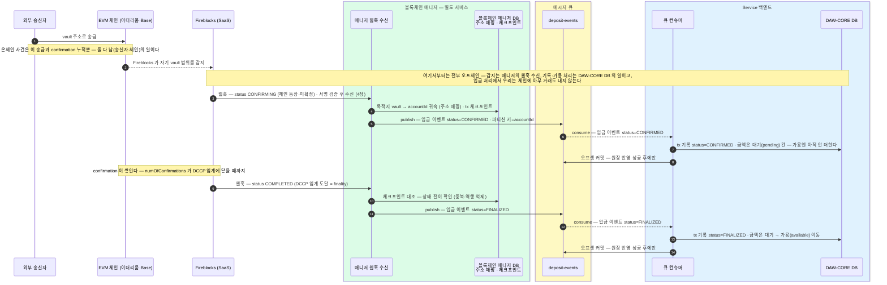
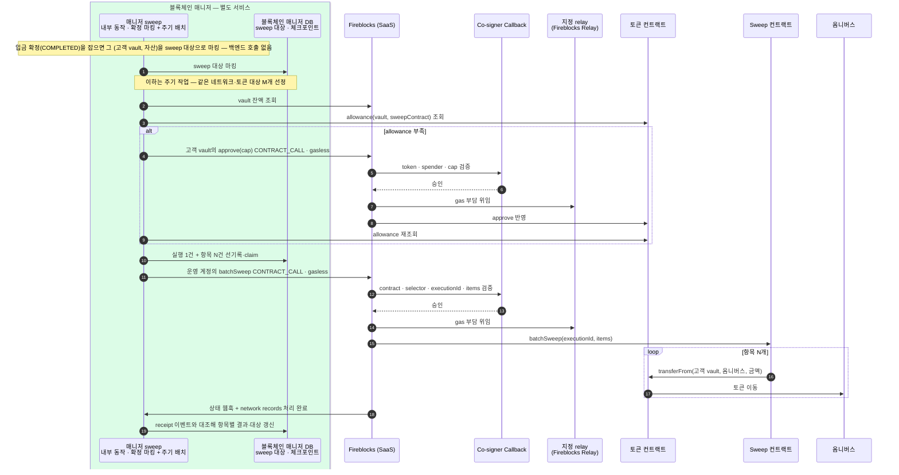

큐에 publish 된 입금 이벤트가 대기를 거쳐 가용이 되고 고객 vault 에서 옴니버스로 모이기까지를 다룬다.
감지는 블록체인 매니저의 웹훅 수신, 원장 반영은 백엔드 큐 컨슈머의 일이다. 감지·판단 기준은 4장을 그대로 쓴다. 입금이 지나는 상태 넷, reorg 예외, sweep 과 원장 반영 순서를 정리한다.

## 입금 한 건이 흐르는 길 — 매니저가 감지해 큐에 publish, 백엔드가 consume 해 확정까지

오프셋 커밋을 **원장 반영에 성공한 뒤에만** 하므로, 처리에 실패하면 커밋이 안 되고 큐가 그 이벤트를 다시 보낸다(그래서 최소 한 번은 반영된다 — at-least-once). 같은 이벤트를 두 번 받아도 원장이 **이벤트 ID 에 unique 제약**을 걸어 두 번째는 무시하니 잔액이 이중으로 더해지지 않는다. 같은 계정의 이벤트는 파티션 키가 accountId 라 감지 → 확정 순서도 뒤집히지 않는다.

## 입금에서 보는 상태·하위 상태

상태·subStatus 의 기준은 [4장 "공통 상태 다섯 (TxStatus)"](04-detect-confirm.md#공통-상태-다섯-txstatus-기준) 한 곳에 모았다. 여기서는 입금 쪽 특이사항만:

- 입금이 실제로 지나는 상태는 다섯 중 **넷** — CONFIRMED(대기 pending 으로 잡힘) · FINALIZED(임계 확인 후 가용 available) · REJECTED · FAILED. SUBMITTED 는 출금 쪽 단계라 입금에선 안 본다.
- COMPLETED 는 zero-confirmation 설정이면 여러 번 관찰될 수 있다(4장 함정).
- **REJECTED 의 동결 3종**(`AUTO_FREEZE` · `FROZEN_MANUALLY` · `REJECTED_AML_SCREENING`)은 **Admin 의 unfreeze 운영**이 걸린다 — unfreeze 까지 자산 잠금, 잔액 반영 보류.
- **동결은 온체인 사건이 아니다** — 돈은 이미 vault 주소에 도착·확정돼 있고(체인 레이어 CONFIRMED), 벤더 장부의 잠금(8장 잔액의 `frozen` 칸)이라 출금에 못 쓸 뿐이다.
- **해제(unfreeze)는 Admin 이 벤더 콘솔에서 한다** — 콘솔은 벤더 UI 라 매니저를 거치지 않는다. 백엔드의 보류 해제는 Admin 의 해제 처리 자체가 트리거다(자기가 한 행위라 매니저 이벤트를 기다릴 필요 없음). 쓰기는 콘솔이어도 관찰은 그대로 매니저의 웹훅 수신 — 상태가 바뀌면 평소처럼 잡힌다.
- FAILED + `DROPPED_BY_BLOCKCHAIN` 은 reorg 증발 — 반영해 둔 잔액을 되돌린다(아래 절).

## 예외 — reorg 로 믿었던 입금이 뒤집히면

이더리움·Base 는 체인 끝이 드물게 교체(reorg)될 수 있다. Fireblocks 의 reorg 거동은 확답으로 정리됐다.

- **1차 방어는 4장의 DCCP 임계(finality)** — 임계만큼 confirmation 이 쌓인 뒤에만 확정으로 본다. 그보다 얕은 reorg 는 확정 판단에 닿지 못한다.
- **CONFIRMING 은 BROADCASTING 으로 되돌아가지 않는다** — reorg 가 나도 마찬가지다. reorg 로 거래가 블록에서 빠져 취소되면 Fireblocks 는 broadcasting 회귀가 아니라 **FAILED(또는 취소·만료) + subStatus `DROPPED_BY_BLOCKCHAIN`** 으로 표시한다(Fireblocks Support 백엔드 팀 확답).
- 매니저는 이 신호를 큐에 publish 하고, 무효화 처리는 백엔드 몫이다(원장 반영은 8장).
- 최종 안전망은 **주기 대사**.

## 입금 다음 — 고객 vault 에서 옴니버스로 (sweep)

고객별 vault 는 **입금 식별용**입니다 — EVM 은 vault·자산당 주소가 하나뿐이라(2장), 고객마다 vault 를 만들어야 "누가 보냈나"가 주소로 갈립니다. 하지만 **자산을 거기 두지 않습니다** — 입금이 확정되면 **매니저가 내부에서 옴니버스 vault 로 옮깁니다(sweep)**. 실행 방식은 `approve + transferFrom`이다. 확정 관찰은 그 (고객 vault, 자산)을 대상으로 마킹하고, 주기 작업이 allowance를 준비한 뒤 같은 네트워크·토큰의 여러 vault를 `batchSweep` 한 건으로 모은다. 백엔드는 sweep 을 호출하지 않고 큐 이벤트도 받지 않는다 — 고객 원장 불변(회계 이벤트 아님)이라 백엔드가 알 일이 없다.

고객별 잔액은 DAW-CORE DB 원장이 관리하므로, 온체인 보관은 집약할수록 키·운영 관리가 단순해집니다. 10장의 "온체인 지갑은 둘뿐" 모델이 이 sweep 을 전제로 합니다.

| vault | 역할 |
|---|---|
| **고객별 vault** (intermediate) | 1·2장에서 만든 고객당 vault — 입금 식별·수신 전용, 보관처 아님. |
| **옴니버스 vault** (omnibus deposits) | sweep 으로 모인 중앙 보관처 — 10장의 "고객 자산 지갑"이 이것. |
| **출금 풀** (withdrawal pool) | 출금 전용 vault — EVM 은 vault 당 nonce 가 직렬이라 **복수 vault round-robin** 으로 병렬화(6장 출금이 여기서 나간다). |

세 역할 분류는 Fireblocks 공식 omnibus 구조 그대로다(intermediate / omnibus deposits / withdrawal pool).

이 한 건에서 누가 무엇을 하는지 역할로 나누면:

| 역할 | 하는 일 |
|---|---|
| **고객 (최종 사용자)** | **등장하지 않는다** — sweep 은 고객 요청 없이 도는 내부 운영이고, 고객 잔액은 DB 원장에 그대로다. 고객은 이 vault 의 키도, 존재도 모른다. |
| **Service 백엔드** | **등장하지 않는다** — sweep 을 호출하지 않고 큐 이벤트도 받지 않는다. 고객 원장이 불변이라 알 일이 없다. |
| **블록체인 매니저** | 입금 확정을 트리거로 allowance 확인·approve·batch 실행 의도를 만들고 Fireblocks에 제출한다. 정책 편집·최종 서명·컨트랙트 관리자 권한은 갖지 않는다. |
| **고객별 vault (EOA)** | 최초·보충 approve의 발신 계정. allowance가 유효한 동안 개별 sweep마다 새 MPC 서명을 만들지 않는다. |
| **Sweep 운영 계정** | 최상위 `batchSweep` CONTRACT_CALL의 Fireblocks source. 목적지는 화이트리스트된 sweep 컨트랙트로 제한한다. |
| **지정 relay** | approve와 batch 호출의 gas를 지불한다(월말 인보이스). 자산 이동 권한은 relay가 아니라 allowance와 sweep 컨트랙트에 있다. |

approve 시에는 고객 vault의 MPC 서명이 필요하고, 이후 batch마다 운영 계정의 서명이 필요하다. Co-signer Callback은 두 거래의 calldata를 선기록한 의도와 대조한다. Universal Gasless는 이 거래들의 gas만 대납하며 allowance를 대신 만들지 않는다.

| 결정 | 내용 |
|---|---|
| **트리거·제출** | 입금 확정 = 대상 마킹 · 주기 작업 = allowance 준비 → 실행 1건/항목 N건 선기록 → 운영 계정 batch 제출. 제출 직전 잔액과 allowance를 온체인에서 다시 읽는다. |
| **대상 삭제 기준** | 최상위 tx 제출·`COMPLETED`가 아니라 **항목 성공 뒤 vault 잔액이 최소 미만임을 확인**했을 때 지운다. 실패·잔액 잔존 항목은 claim을 풀어 재선정한다. |
| **배치 값** | 주기 · 최소 금액 · allowance cap · 건별/총액 상한 · 최대 M · 블록 gas limit 대비 운영 상한 · 제출 속도 상한. 모두 승인된 운영 설정이며 반복 실패는 경보한다. |
| **gas** | 고객 vault의 approve와 운영 계정의 batch 호출을 **Universal Gasless**로 요청한다. 지원 여부·정책 매칭은 출시 전 실측한다. |
| **서명 자동화** | API Co-Signer + fail-closed Callback. token·spender·cap 또는 contract·selector·executionId·items가 실행 의도와 다르면 거부한다. |
| **고객 잔액** | **불변** — 고객별 잔액은 DAW-CORE DB 원장 몫이고, sweep 은 온체인 보관 위치만 옮긴다(회계 이벤트 아님). |
| **관찰·실패** | `transaction.network_records.processing_completed`와 receipt의 항목별 이벤트를 요청 N건과 대조한다. 최상위 `COMPLETED`를 항목 전체 성공으로 보지 않는다. **internal-events에는 싣지 않는다.** |

감지·판단 기준(웹훅 수신·DCCP·막힘 점검)은 [4. 감지와 확정](04-detect-confirm.md), 잔액의 세 칸(available·pending·locked)과의 맞물림은 [8. 잔액과 내역 조회](08-balance-history.md), 출금 쪽 상태 전이는 [6. 출금](06-withdrawal.md)에서 이어집니다.
