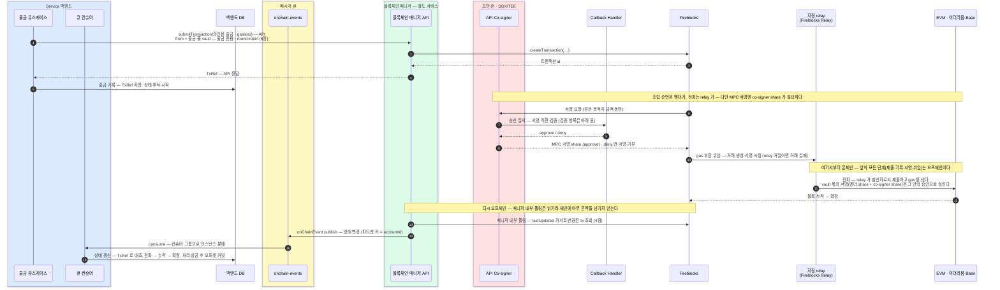
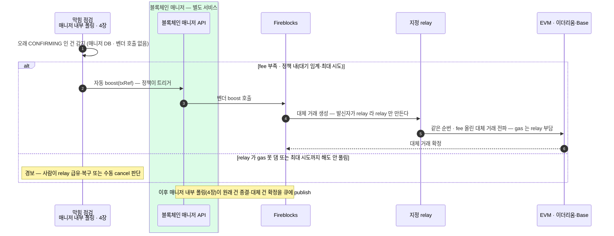

승인된 출금 지시가 블록체인 매니저(별도 서비스)를 지나 확정되기까지 — 제출·서명·전파, 메시지 큐 상태 추적, 그리고 막혔을 때.
서명 두 겹(vault 승인·relay 거래)과 서명 직전 검증, 막힘 자동 boost, 공통 상태 번역을 다룬다.

업무 승인이 끝난 출금 지시를 Service 백엔드가 매니저 API 로 넘깁니다(제출).

```kotlin
fun submitTransaction(request: TransactionRequest): TxRef {
  return TxRef(id) // id = 벤더 트랜잭션 id
}

data class TransactionRequest(
  val externalTxId: String,             // 벤더에 남기는 우리 쪽 거래 식별자 — 재제출 중복 차단 · 우리 키로 벤더 거래 조회
  val fromAccountId: AccountId,         // 보내는 vault — 우리 계정
  val to: Destination,                  // 목적지 — type 으로 갈래 구분 (벤더 TransferPeerPathType 으로 매핑)
  val asset: Asset,
  val amount: BigDecimal,
  val note: String? = null,             // 벤더 거래 기록에 남는 메모
  val travelRule: TravelRule? = null,   // 해외(Notabene) 경로 — 게이트가 만든 암호화 메시지. 매니저는 운반만, 내용은 모름
)

data class Destination(
  val type: PeerType,                   // ADDRESS · ACCOUNT · WHITELISTED
  val address: String? = null,          // type=ADDRESS     — 온체인 주소 (외부 출금 → ONE_TIME_ADDRESS)
  val accountId: AccountId? = null,     // type=ACCOUNT     — 우리 계정 (sweep 등 내부 이동 → VAULT_ACCOUNT)
  val walletId: WalletId? = null,       // type=WHITELISTED — 사전 등록 지갑 (→ EXTERNAL_WALLET)
)
```

## 출금 제출 — 파이프라인이 벤더 안으로 들어간다



## 서명은 두 겹 — 안쪽 승인(vault)과 바깥 거래(relay)

다이어그램의 서명 관문(6~9)과 relay 구간(10~11)은 **별개의 서명 두 개**를 만듭니다:

| 서명 | 누가 · 무엇에 | 무엇을 막나 |
|---|---|---|
| **안쪽 — vault 의 승인 서명** (6~9) | 출금 vault(옴니버스·출금 pool)의 MPC 서명 — 벤더 share + **co-signer share**. co-signer 는 Callback Handler 재검증을 통과한 건에만 자기 share 를 보탠다. | 침해된 백엔드의 위조 지시 — 목적지·금액이 정책에 어긋나면 서명 자체가 만들어지지 않는다. |
| **바깥 — relay 의 거래 서명** (10~11) | relay 가 자기 계정으로 바깥 거래를 서명·제출하고 gas 를 낸다. | relay 가 정할 수 있는 건 "낼지 말지"뿐 — 내용 위조는 불가. 위임된 지갑 코드가 안쪽 서명을 온체인에서 검증하기 때문. |

행위자를 우리 모델로 매핑하면 — **고객은 온체인에 등장하지 않습니다**. 고객의 "출금해 주세요"는 업무 승인 단계에서 끝납니다.

온체인의 발신 vault(옴니버스·출금 pool)·키(MPC)·제출자(relay)는 전부 수탁자 쪽입니다. 위임·실행 메커니즘의 상세는 가스 대납 문서 9장.

## 서명 직전 검증 — Callback Handler 가 보는 것

제출 다이어그램 7번(승인 질의)에서 확인하는 항목입니다. 하나라도 어긋나면 co-signer 가 자기 share 를 보태지 않아 **서명 자체가 만들어지지 않습니다**.

| 항목 | 확인하는 것 |
|---|---|
| **원문 일치** | 서명 요청의 chain·자산·금액·발신 vault·목적지가 **우리가 접수·승인한 출금 지시와 같은가** — 제출 전에 기대값을 기록해 두고 서명 직전에 대조한다. |
| **목적지 화이트리스트** | 등록된 활성 주소인가. |
| **한도** | 건별·기간 누적 한도 안인가. |
| **요청 유효성** | 대응하는 출금 요청이 존재하고, 승인 완료 상태이며, 만료되지 않았는가. |
| **1회성** | 같은 요청(externalTxId)으로 이미 서명이 나가지 않았는가 — 서명 허용 시 **한 번만 소비**하고, 소비된 뒤 들어온 질의는 거절한다. |
| **운영 차단 상태** | 동결·비상 중지·체인 비활성 같은 운영 상태에 걸리지 않는가. |

이 검증의 요점은 규칙 검사가 아니라 **사전 등록 대조**다 — 침해된 백엔드가 임의 거래를 만들어도, 접수·승인 기록에 없는 payload 면 서명이 나오지 않는다. 기대값의 기록·대조·소비 상태는 백엔드 DB 가 아니라 Callback Handler 쪽 저장소에 두어야 방어선이 분리된다.

## 막혔을 때 — 자동 boost

확정한 수수료가 시세보다 낮으면 거래가 mempool 에 걸려 **막힙니다**. Gasless Relay 는 stuck 을 스스로 bump 하지 않으므로(auto-boost 미지원), 감지·재촉이 우리 몫입니다.

- **자동 boost** — 막힘 점검(4장)이 오래 CONFIRMING 인 건을 잡으면 매니저가 **Admin 정책(대기 임계·최대 시도) 안에서 자동으로 boost**(같은 순번, 수수료만 올린 재전송 · RBF)한다. 인상된 gas 는 **relay 가 부담**하고, 인상 폭·상한은 relay 설정이다.
- **cancel(철회)** — 기본 흐름에선 쓰지 않는다. 자동 boost 를 최대 시도까지 해도 못 살린 예외에서만 **수동 최후수단**으로 판단한다.

fee 부족이 아니라 **relay 가 gas 를 못 대거나 거절**(잔고 소진 등)이면 boost 로 안 풀리므로, 경보를 올려 사람이 relay 급유·복구로 넘긴다. relay 가 stuck 을 자동 처리하는지 등 벤더 확인 항목은 11장.



막힌 출금의 처리를 요약하면:

- **감지** — 매니저 내부 폴링의 막힘 점검이 매니저 DB 에서 골라낸다(4장).
- **자동 boost** — fee 부족이면 정책 내에서 매니저가 boost 를 자동 트리거한다. 대체 거래는 발신자인 relay 가 만들어 전파하고 gas 도 relay 가 낸다.
- **예외** — relay 가 gas 를 못 대거나(거절 포함), boost 를 최대 시도까지 해도 안 풀리면 경보한다 — 사람이 relay 복구·수동 처리. cancel 은 이때의 최후수단이다.

## 상태 한 장 — Fireblocks 필드를 공통 어휘로

Fireblocks 는 내부 상태를 여러 단계로 보냅니다. 백엔드가 보는 것은 **매니저가 번역한 공통 상태** 하나입니다 — 아래 넷이 밖으로 나갑니다.

상태 변경 이벤트(onChainEvent)는 메시지 큐(onchain-events 토픽)에서 consume 하고, transactionOf 는 필요할 때 단건 확인하는 API 조회로 남습니다.

| 공통 상태 (TxStatus) | 뜻 | Fireblocks 원어 (매니저가 번역) |
|---|---|---|
| **SUBMITTED** | 제출됨 — 벤더가 서명·전파 준비 중, 아직 체인 미등장 | PENDING_SIGNATURE · QUEUED · BROADCASTING |
| **CONFIRMING** | 전파 후 체인에 등장, confirmation 누적 중 (아직 미확정) | CONFIRMING (numOfConfirmations 증가 중) |
| **COMPLETED** | 확정 — DCCP(확정 정책) 임계 confirmation 도달 = finality, 이후 불변 | COMPLETED |
| **FAILED** | 영구 실패 — 사유 동반 (수수료 부족·거절·revert 등) | FAILED · REJECTED · BLOCKED |

- confirm(체인 등장)↔finality(확정) 판정 기준은 **4장과 같다**(numOfConfirmations vs DCCP 임계).
- 이 문서는 이 넷만 밖으로 내보낸다 — 벤더 내부의 세부 단계는 SUBMITTED 로 접어 감춘다.
- 입금 쪽 상태 흐름은 5장.

상태 이름과 확정 정책(DCCP)은 벤더 안에 있고 그것을 공통 어휘 넷으로 번역하는 것은 매니저 내부입니다. 막힘 대응의 자동 boost 는 매니저가 실행하되, 어떤 정책(대기 임계·최대 시도)으로 boost 할지는 Admin 이 미리 정합니다 — cancel 은 예외적 수동입니다.
