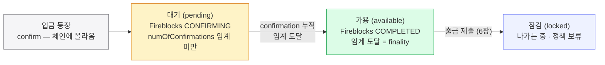
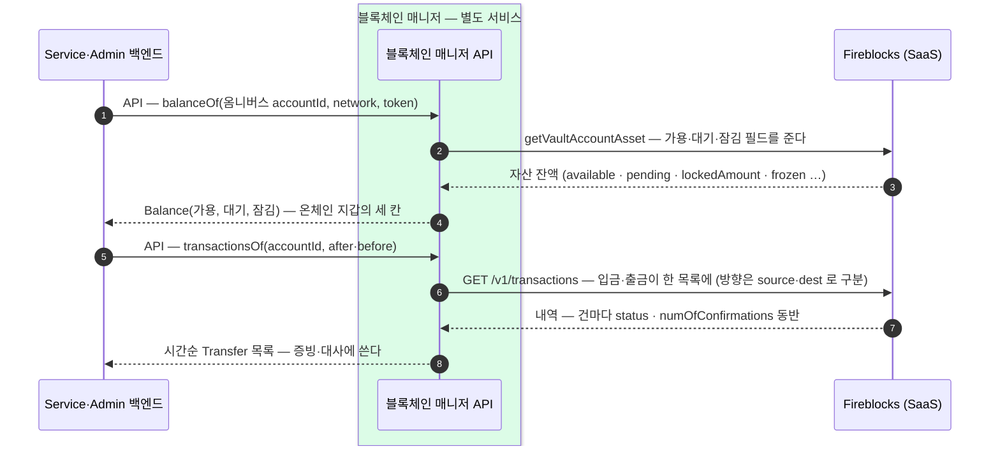
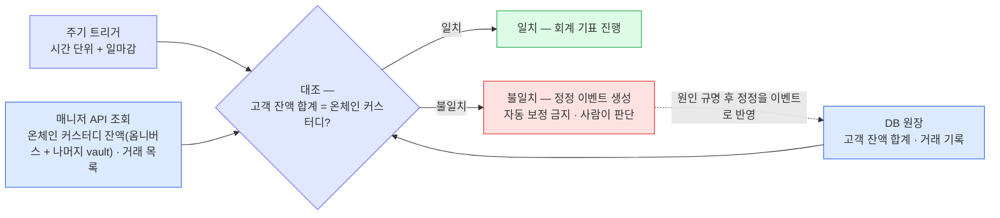

온체인 사건의 진실은 벤더 기록에 있고 매니저 API 로 읽는다.
가용·대기·잠김 세 칸을 가르는 confirm 과 finality, 매니저 API 조회의 쓰임, 두 장부를 맞추는 대사 절차를 확정한다.

**가용**(available — 출금에 쓸 수 있는 돈), **대기**(pending — 들어왔지만 아직 확정 전), **잠김**(locked — 나가는 중이거나 정책상 묶인 돈).

```kotlin
// 블록체인 매니저 API 오퍼레이션 — 백엔드가 HTTP 로 호출
// 온체인 지갑(옴니버스 · sweep 전 고객 vault) 조회 — 운영·대사용
fun balanceOf(accountId: AccountId, network: Network, token: Token): Balance {
  return Balance(available, pending, locked)
}

// 온체인 내역 — 증빙·대사·운영용. 고객 화면 내역은 DAW-CORE DB 기록에서 나온다
// status 로 걸러 받기(한 번에 한 상태) — 예: FINALIZED = 대사 · CONFIRMED = 막힌 출금 점검
fun transactionsOf(
  accountId: AccountId,
  after: Instant,
  before: Instant,
  status: TxStatus? = null,
): List<Transfer> {
  return transfers
}

data class Transfer(
  val txId: String,                 // 벤더 tx id
  val txHash: String? = null,        // 온체인 거래해시 — 전파 후 채워짐. 대사·증빙용 (4장 ChainEvent 와 동일)
  val externalTxId: String? = null,  // 우리 요청 키 (출금·내부이체) — 기록과 대조용
  val network: Network,
  val token: Token,
  val amount: BigDecimal,
  val from: String,                  // 발신 주소
  val to: String,                    // 목적지 주소 — 방향은 from·to 로 가른다
  val status: TxStatus,              // 4장 공통 상태 다섯
  val numOfConfirmations: Int,
  val createdAt: Instant,            // 거래 생성 시각 — after·before 필터의 기준 (벤더 스펙 · 4장)
  val lastUpdated: Instant,          // 마지막 상태 변경 시각
)
```

after·before 는 벤더 거래 목록 API(`GET /v1/transactions`)의 시간 필터 그대로다 — **거래 생성 시각(createdAt) 기준**, Unix 밀리초 타임스탬프(4장 "after 는 createdAt 기준" 스펙 확인분과 동일). 매니저의 웹훅 감지와는 별개 경로다. 미지정 시 벤더 기본 조회 창이 적용된다.

## 세 칸을 가르는 선 — confirm 과 finality

대기와 가용을 나누는 것은 **확정**이다 — 체인 **등장(confirm)**이 아니라 임계 **도달(finality)**에서 가용이 되고(4장), 그 근거는 벤더가 확정 정책(DCCP)대로 계산해 주는 상태·confirmation 카운트다.



위 그림을 요약하면:

- 세 칸을 가르는 건 **confirm(체인 등장) → finality(임계 도달)** 전이 하나다.
- "곧 들어올 입금"은 **대기** 칸에 머물다가, 확정 정책 임계에 도달해 finality 가 나면 **가용**으로 옮겨간다 — Fireblocks 상태로는 **CONFIRMING → COMPLETED**.
- 경계 판단은 **numOfConfirmations** 가 확정 정책 임계를 넘었는지로 한다.
- 출금을 제출하면 그만큼이 가용에서 **잠김**으로 빠진다.

온체인 지갑(옴니버스·출금 풀 등)을 조회할 때 매니저는 `getVaultAccountAsset` 응답 필드를 세 칸으로 접어 돌려준다:

| 업무 타입 | Fireblocks 필드 | 뜻 |
|---|---|---|
| **가용** (available) | `available` | 확정되어 지금 출금에 쓸 수 있는 잔액 (= 블록체인 잔액 − 잠김분) |
| **대기** (pending) | `pending` | 들어오는 중이지만 아직 확정 전 — 확정 임계에 도달하면 가용으로 옮겨간다 |
| **잠김** (locked) | `lockedAmount` + `frozen` | 나가는 중(전파 전 출금)이거나 정책상 묶인(AML freeze) 돈 |

- Fireblocks 응답 필드는 `available` / `pending` / `frozen`(AML freeze) / `lockedAmount`(전파 전 출금) / `staked`(일부 체인 전용) 등이다.
- 이 중 **가용·대기·잠김** 세 칸만 업무 타입으로 노출하고, 잠김은 `lockedAmount` 와 `frozen` 을 합쳐 본다.
- EVM(이더리움·Base)에는 staking 칸이 없어 세 칸으로 충분하다.

## 매니저 API 조회의 경로 — 운영·대사·증빙



위 그림을 요약하면:

- 매니저 API 조회는 **온체인 지갑의 잔액(1~4)과 온체인 내역(5~8)**을 나른다.
- 벤더가 입·출금을 다 기록하므로 온체인 사건의 수집은 이 한 곳이면 된다 — 단 **고객별 귀속은 DAW-CORE DB 몫**이다.
- 매니저가 하는 일은 벤더 필드를 세 칸으로 **접는 것**과 벤더 상태(CONFIRMING/COMPLETED)를 5·6장의 공통 어휘로 **번역하는 것**뿐이다.

## 상태로 걸러 조회 (운영·대사 경로)

| 언제 | 무엇을 | 조회 형태 |
|---|---|---|
| **대사** (실행은 Service 배치) | 확정분만 받아 기록과 대조 — 회계 기표 전(아래 절) | `status=FINALIZED` + 기간 |
| **막힌 출금 점검** (Admin) | 자동 boost(매니저)로 안 풀린 건의 수동 처리 판단(6장) — DB 쿼리(4장)와 병행하는 벤더측 교차 확인 | `status=SUBMITTED`(미채굴) + 오래된 것 |

## 대사 — 두 장부를 주기적으로 맞춘다

잔액·내역의 숫자는 결국 **두 장부**에서 나온다. 하나는 기록(DAW-CORE DB), 다른 하나는 바깥의 진실인 **Fireblocks 의 값**이다.

웹훅 알림 누락·큐 consume 지연·이쪽 반영 버그는 생기게 마련이라, 회계가 걸리는 숫자는 **주기적으로 둘을 직접 대조**한다. 이 대사는 큐 경로와 무관하게 도는 **독립적 안전장치**다. (놓친 웹훅 자체의 복구는 4장의 **tx 대사** — 10분 주기 목록 대조 — 가 맡고, 이 절은 회계 숫자를 맞춘다.)

|  | 대사 |
|---|---|
| **무엇을** | ① **DB 원장의 고객 잔액 합계 vs 온체인 커스터디 총합**(옴니버스 + 나머지 vault — 미sweep 고객 vault·출금 풀) — 옴니버스 모델의 대사 공식, 나머지 vault 계상의 정밀 형태는 정산 워크스루 ② 거래 기록 vs 벤더 거래 목록 (표본은 온체인 탐색기로 교차 확인) |
| **언제** | 주기(예: 시간 단위) + 일마감 — 회계 기표 전 필수 |
| **누가** | **실행(주기 대조 배치)은 Service** — sweep 과 같은 자리의 워커. 벤더측 값은 매니저 API(balanceOf·transactionsOf)로 받는다. **불일치의 판단·정정 승인과 감사·기표 확인은 Admin**. |
| **어긋나면** | **자동 보정 금지** — 정정 이벤트를 만들어 사람이 본다 (없는 돈을 만들거나 지우는 코드가 가장 위험) |



위 그림(대사 한 사이클)을 요약하면:

- 옴니버스 모델의 공식은 대략 **"DB 원장의 고객 잔액 합계 = 온체인 커스터디(옴니버스 + 나머지 vault)"**이다 — 나머지 vault(미sweep 고객 vault·출금 풀)까지 계상해야 정밀하고, 상세는 정산 워크스루.
- 두 장부가 서로 독립적으로 쌓이므로(하나는 큐에서 consume 한 이벤트 반영, 하나는 체인), 일치하면 매니저의 웹훅 감지·큐 publish/consume·백엔드 반영 경로 전체가 **정상 동작했다는 뜻**이다.
- 불일치면 **자동으로 고치지 않는다** — 정정도 반드시 이벤트로 남겨 사람이 판단한다.
