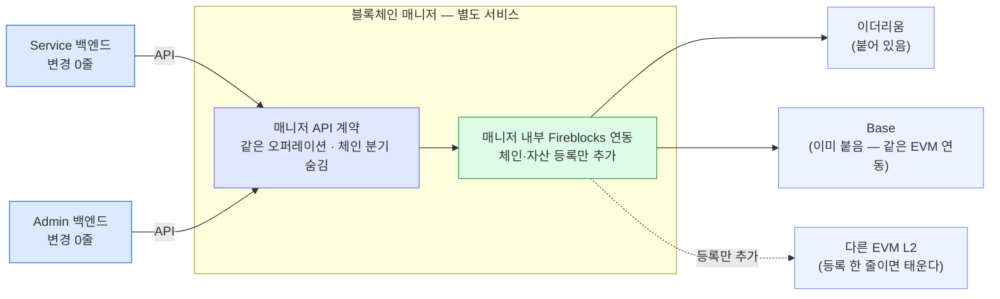
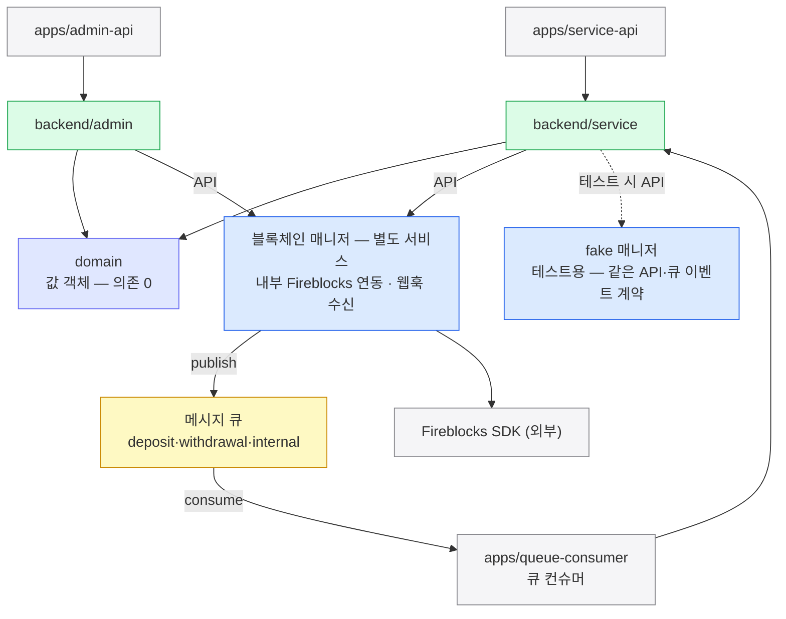
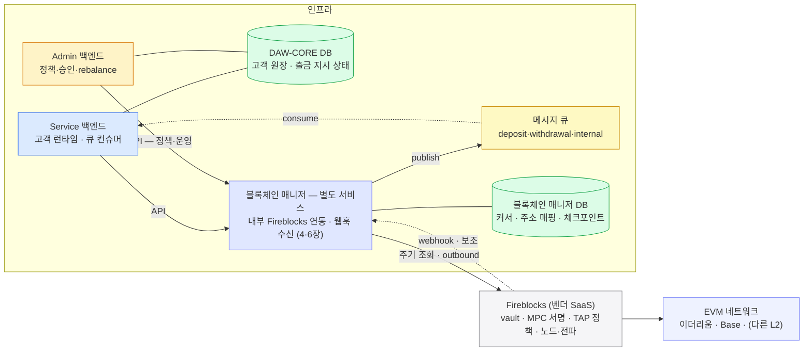

블록체인 매니저의 API 계약이 EVM 체인 확장과 매니저 교체를 흡수하는 법 — Service·Admin 백엔드 변경 0줄.
매니저 내부에 체인·자산 등록만 추가하면 새 L2 를 태운다. 벤더 교체는 코드가 아니라 자금 이전(sweep)이 비용의 전부다.

## EVM 체인 확장 — Base 는 이미 붙었다

## EVM 이 아닐 때 — Solana 를 붙인다면

| 다시 봐야 하는 것 | EVM 전제 | Solana 를 붙일 때의 결정 |
|---|---|---|
| **주소 형식 검증** (validateAddress) | 0x + 체크섬 — 로컬 규칙 하나 | 주소 형식이 다르다 — 로컬 규칙(AddressRules)에 그 체인의 형식을 추가해야 검증이 선다 |
| **체인 특화 파라미터** | ChainSpecific = Evm(nonce) 하나 | 새 타입을 추가한다 — sealed 라 추가만 하고 기존 EVM 의미는 안 바뀐다 |
| **막힘 대응** (6장 boost·cancel) | 같은 순번 재전송(RBF) 전제 | 같은 의미의 동작이 그 체인에 있는지부터 확인 — 없으면 **기능 부재로 선언**(capability 미구현)하고 막힘 운영 절차를 따로 설계 |
| **확정 판단** (4장) | confirmation 누적 ≥ DCCP 임계 | 그 체인의 확정 개념을 벤더가 어떤 상태·카운트로 번역해 주는지 확인하고 임계를 다시 정한다 |
| **입금 주소 모델** (2장) | vault·자산당 단일 주소 · memoTag null | 주소·memoTag 정책이 체인마다 다르다 — 2장의 단일 주소 전제를 재확인 |
| **gas 조달** | Universal Gasless — EIP-7702 기반, EVM 전용 | 그대로 이식되지 않는다 — 그 체인의 수수료 조달(네이티브 토큰 보유 여부 포함)을 별도로 결정 |

노드·서명·전파는 여전히 벤더 몫이다 — 위 목록은 전부 블록체인 매니저 쪽 경계(매니저 내부 등록·로컬 규칙·정책)의 결정이고, 백엔드의 API 계약은 그대로다. Solana 열의 각 항목은 적용 전 벤더 문서로 확인한다.

## 매니저(벤더) 교체 — 코드는 매니저 구현, 비용은 자금 이전

지금 매니저 내부 연동은 Fireblocks 이지만 DAW-CORE는 매니저의 API·큐 이벤트 스키마 계약만 보므로 **다른 벤더로 바꾸거나 vault 구성을 재편해도** DAW-CORE는 그대로여야 합니다. 코드 관점에서 벤더 교체는 **배포 수준**의 일입니다 — 같은 API 계약을 지키고 같은 토픽들(deposit·withdrawal·internal)에 같은 이벤트 스키마를 publish 하는 다른 매니저 구현으로 바꾸면 됩니다.

그런데 **한 가지는 설정으로 안 됩니다.** 벤더 A 의 주소는 A 의 키에서, 벤더 B 의 주소는 B 의 키에서 나옵니다(2장).

그래서 **주소와 그 위의 잔액은 이전되지 않습니다.** vault 를 재구성할 때도 마찬가지입니다 — 새 vault 의 주소는 새 키에서 나오니까요.

즉 **코드 교체는 싸고 자금 이전(sweep)이 비용의 전부**입니다.

위 벤더 교체(또는 vault 재구성) 운영 타임라인을 요약하면:

- 파랑은 값싼 코드·설정 작업, **노랑 구간이 비용의 전부**다.
- 그 비용은 **구 주소 수와 잔액에 비례**한다 — 옮길 돈이 많을수록 sweep 출금 건수·수수료가 는다.
- 늦은 입금을 놓치지 않도록 **구 주소 watch-list 를 한동안 유지**하다가, 잔액을 새 vault 로 출금(6장 출금 그대로)하고 DB 에 주소의 세대를 기록해 닫는다.
- 벤더 정책(TAP)에 있던 화이트리스트·한도도 **새 벤더의 정책 체계로 이관**하고 동등성을 검증하는 것까지가 교체다(6장). 서명 직전 검증(Callback Handler)도 벤더 특화 컴포넌트라 새 벤더의 대응물로 다시 세운다.

## 코드 구조 — 이 문서를 모노레포로 옮기면

지금까지의 구성 요소(0장)와 성질이 코드에서 강제되려면 **서비스 경계가 곧 설계 경계**여야 합니다.

백엔드 안에서는 **의존 방향**이 전부 안쪽(domain)을 향합니다. 백엔드와 블록체인 매니저 사이에는 모듈 의존이 없습니다 — 경계는 **HTTP API·큐 이벤트 스키마 계약**이고 Fireblocks SDK 는 매니저 안에만 있습니다.

## 인프라 — 무엇이 어디서 도는가

0장에서 본 배치를 확장 관점으로 다시 봅니다.

- Fireblocks 기준이라 서명·키·노드·전파는 **벤더 안**이고, 이쪽엔 **DAW-CORE와 블록체인 매니저, 둘로 나뉜 DB**만 남습니다.
- Fireblocks 웹훅 수신·상태 판단은 전부 매니저 내부이고, 매니저가 메시지 큐(deposit·withdrawal·internal)에 publish 한 이벤트를 백엔드가 consume 합니다.
- 직접 노드·HSM·인덱서를 운영하지 않으므로, 새 EVM 체인이 붙어도 **인프라 배치는 그대로**입니다 — 벤더가 그 체인을 지원하기만 하면 됩니다.

