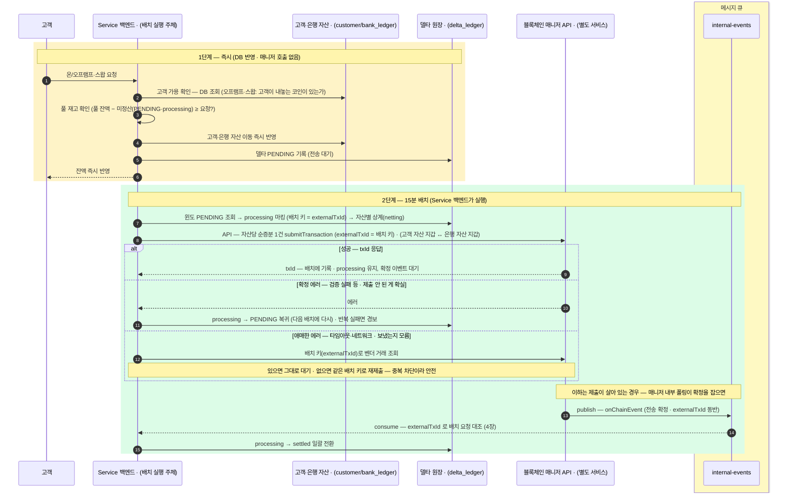
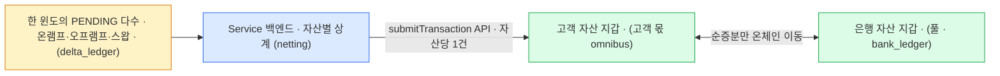

충전·환전·스왑도 이 지갑 백엔드의 흐름이다 — 새 매니저 기능이 아니라 1~8장의 입금·출금이 사전 민팅 재고 풀·델타 원장과 만나 조립된 것.
그 조립에서 별도 서비스인 블록체인 매니저가 어디에 들어오는지만 요약한다. 원장·회계·대사 상세는 정산 워크스루.

## 매니저가 실제로 하는 일 — 세 거래

세 거래 모두 **DB 는 즉시, 블록체인 전송은 15분 배치**라는 2단계로 돕습니다.

매니저(별도 서비스)는 **2단계의 블록체인 전송·감지**에서만 등장합니다. 1단계(DB 반영)엔 매니저 API 호출이 없습니다.

| 거래 | 매니저(별도 서비스)가 하는 일 | 쓰이는 입금·출금 |
|---|---|---|
| **온램프** (법정통화→코인) | 풀→고객 wallet 코인 **전송(출금 실행)**을 15분 배치로. 재고 보충(rebalance)이면 발행사가 vault 로 보낸 코인의 **입금 감지**도. | submitTransaction API 호출(6장) · onChainEvent 큐 consume(4장) |
| **오프램프** (코인→법정통화) | 고객→풀 wallet 코인 **회수 전송**을 15분 배치로. rebalance 면 vault→발행사 주소 **출금 실행**. | submitTransaction API 호출(6장) · onChainEvent 큐 consume(4장) |
| **스왑** (코인↔코인) | 고객↔은행 풀 사이 **양방향 전송**(회수+할당) 2건을 15분 배치로. 두 자산 재고가 다 있어야 함. | submitTransaction API ×2(6장) · onChainEvent 큐 consume(4장) |

즉 세 거래에서 매니저가 새로 배우는 API 오퍼레이션은 없습니다 — 6장의 **submitTransaction**(출금 실행) API 호출과 4장의 **입금 감지** 큐 이벤트 consume 을 조합할 뿐입니다. 스왑만 전송이 두 다리(보내는 코인·받는 코인)라 델타가 두 줄로 잡힙니다.

## 2단계 골격 — 매니저는 초록 단계에만



위 그림을 요약하면:

- **노랑 = 1단계**는 매니저를 안 부른다 — 순수 DB 반영 + 델타 PENDING 적재다.
- 확인은 두 겹 — **고객 가용**(DB 조회 — 오프램프·스왑에서 고객이 내놓는 코인)이 없는 돈 거래를, **풀 재고**(실제 풀 잔액 − 미정산(PENDING·processing))가 풀 부족 초과 거래를 막는다.
- **초록 = 2단계**에서만 이 문서의 매니저가 등장 — 6장의 submitTransaction API 호출, 4장의 onChainEvent 큐 consume 그대로다.
- 발행사·거래소는 이 그림에 없다(풀 rebalance 때만 들어온다).
- 스왑은 전송이 두 다리라 초록 단계가 두 번 잡힌다.
- 완료 대조의 열쇠는 **externalTxId** — 매니저는 이 전송이 델타 배치인 걸 모르고(`INTERNAL` 까지만), 정산 컨슈머가 externalTxId 로 원래 배치를 찾아 닫는다(4장).
- **processing 마킹이 이중 제출을 막는다** — 전송 확정 전에 다음 윈도가 돌아도 PENDING 만 집으므로 안 겹친다. 재시작 시엔 "processing + 배치 키" 행으로 벤더 제출 여부를 확인해 잇는다 — 애매한 에러(타임아웃)와 같은 복구 경로다.
- **제출 응답 세 갈래** — 성공(txId 기록·이벤트 대기) · 확정 에러(PENDING 복귀 — 안 보내진 게 확실할 때만) · 애매한 에러(벤더 조회 후 대기 또는 같은 키 재제출). 온체인에서 실패(FAILED 이벤트)로 끝난 경우도 확정 에러처럼 PENDING 복귀 또는 경보다.

## 배치를 효율적으로 — Service 백엔드가 두 지갑 사이를 상계한다

건별로 전송하면 N건이지만 **자산별로 방향을 상계(netting)**하면 **자산당 순증분 1건**이면 됩니다.



위 그림을 요약하면:

- 배치 실행 주체는 **Service 백엔드**다.
- 온체인 지갑이 **고객 자산 지갑 · 은행 자산 지갑** 둘뿐이라, 한 윈도의 모든 PENDING 은 이 둘 사이 이동으로 모인다.
- 자산별로 상계하면 **온체인 전송이 거래 건수가 아니라 자산 수에 비례**한다(자산당 순증분 1건).
- 15분 주기가 곧 상계 창 — 주기를 늘리면 상계율이 오르지만 정산 지연도 는다.

### 상계 예시 — 여러 건이 쌓여도 자산당 1건

```
USDC · 15분 윈도
  온램프 할당(은행→고객)   합 100 USDC
  오프램프 회수(고객→은행)  합  60 USDC
  ─────────────────────────────
  순증분 = 은행→고객 40 USDC  → 온체인 전송 1건
```

- 건별이면 여러 건이지만 상계 후엔 자산당 **순 방향 1건**입니다.
- 상계는 **온체인 순포지션**만 줄일 뿐, 고객별 배분은 고객 원장이 그대로 기록하므로 **분별관리는 유지**됩니다.
- 스왑은 두 자산이 걸리므로 자산별로 각각 상계됩니다(그래서 델타가 두 줄).

이 배치 전송의 gas 는 **Universal Gasless 로 대납**한다 — 선택지·도입 요건은 가스 대납 문서.

## 수수료 — 고객에게 보여주는 값은 선계산 고정값

수수료는 두 층으로 갈립니다.

- **매니저 층** — 수수료 견적(매니저 내부 · 7장)은 **변동 네트워크 실비**를 추정할 뿐, 실비를 미리 고정하지 않습니다.
- **고객에게 보여주는 수수료** — 그 위층(회계·비즈니스)이 **선계산해 고정한 값**입니다. 자산별 고정 출금 수수료·% 매매 요율 같은 고정 스케줄이죠.
- 위층이 고정값을 약속할 수 있는 건, 변동 실비와의 **차액을 수수료수익/손익으로 흡수**하기 때문입니다.

정산·회계 처리는 정산 워크스루에서 다룹니다.

### 이 장의 경계 — 요약까지, 상세는 정산 워크스루

여기서는 **매니저가 어디에 들어오는지**까지만 봤습니다.

고객/은행 자산 분리(분별관리), 델타 원장의 부호 규약, 총계정 변화, rebalance 조달 채널(발행사·Circle·거래소), 실패·대사는 정산 워크스루가 온램프·오프램프·스왑을 거래 한 건씩 따라가며 다룹니다. 매니저 경계 자체는 정산 흐름과 블록체인 매니저의 경계 문서가 표로 정리합니다.
