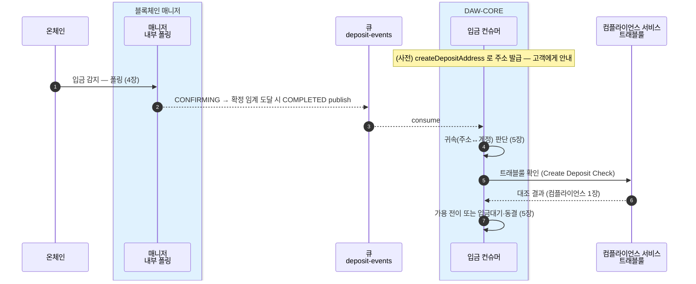

DAW-CORE가 블록체인 매니저를 호출하는 계약을 한 장으로 조립한다. DAW-CORE는 벤더(Fireblocks)를 모른다 — 아는 것은 아래 API·이벤트·TxStatus 뿐이다.
이 장은 원천 장들(0·4·5·6·7·8장·[14장 레퍼런스](14-api-reference.md))의 결론만 모은 것이다 — **원천이 바뀌면 이 장을 함께 갱신한다.**

## 설계 원칙

- **응답은 접수, 진행은 이벤트로** — `submitTransaction` 응답은 벤더 tx id 까지다. 상태 진행(위 다섯)은 큐 이벤트로 따라간다.
- **멱등** — 생성 계열은 멱등키: `createAccount` = f(ref), `createDepositAddress` = f(accountId, asset) — 24시간 안의 재시도는 같은 결과. 제출은 `externalTxId`(DAW-CORE 출금 건 식별자)가 중복을 막고, 완료 이벤트에 그대로 실려 되돌아온다.
- **boost·cancel 은 DAW-CORE 몫이 아니다** — 막힌 출금은 매니저가 자동 boost 로 접어 처리하고, DAW-CORE는 같은 상태 흐름만 본다(6장).

## API — DAW-CORE → 매니저 (7개)

시그니처·타입·열거형의 기준은 [14장](14-api-reference.md). 여기는 무엇이 있는지만.

| 오퍼레이션 | 무엇 | 상세 |
|---|---|---|
| `createAccount(ref)` | 계정 생성 — ref↔accountId 매핑 (멱등) | [1장](01-create-account.md) |
| `createDepositAddress(accountId, asset)` | 자산 지갑 활성화·입금 주소 발급 (멱등) | [2장](02-issue-deposit-address.md) |
| `depositAddressOf(accountId, asset)` | 발급된 주소 조회 — DB 읽기, 벤더 왕복 없음 | [3장](03-address-of.md) |
| `balanceOf(accountId, asset)` | vault 잔액 — 대사에 쓰는 값, 고객별 귀속 잔액 아님 | [8장](08-balance-history.md) |
| `transactionsOf(accountId, after, before, status?)` | 기간·상태로 거래 목록 | [8장](08-balance-history.md) |
| `transactionOf(txId)` | 단건 조회 | [8장](08-balance-history.md) |
| `submitTransaction(request)` | 출금·이체 제출 — `externalTxId`·(트래블룰 대상이면) travelRuleMessage 를 싣는다 | [6장](06-withdrawal.md) |

## 이벤트 — 매니저 → DAW-CORE (큐)

토픽마다 전용 컨슈머, 같은 계정의 순서는 파티션이 보장한다. 이벤트 본문(ChainEvent)·소비 규칙은 [14장](14-api-reference.md)·[4장](04-detect-confirm.md).

| 토픽 | 담는 이벤트 | 파티션 키 |
|---|---|---|
| `deposit-events` | 고객 입금 감지·확정 (DEPOSIT · UNMAPPED) | 고객 accountId |
| `withdrawal-events` | 외부 출금 상태 변경 (WITHDRAWAL) | 출금 풀 vault 의 accountId |
| `internal-events` | 내부 이체 완료 (INTERNAL — sweep·delta 는 externalTxId 로 가른다) | 출발 계정 accountId |

막힘(오래 안 풀리는 건)은 이벤트가 아니라 별도 경보 채널이다([4장 막힘 점검](04-detect-confirm.md#막힘-점검-오래-confirming-인-건-골라내기)).

## TxStatus — DAW-CORE가 보는 공통 상태 다섯

벤더 내부 상태는 매니저가 이 다섯으로 번역한다. 뜻·원어 대응·subStatus 는 [4장 기준 표](04-detect-confirm.md#공통-상태-다섯-txstatus-기준)가 원천이다.

| TxStatus | 뜻 |
|---|---|
| `SUBMITTED` | 제출됨 — 벤더가 서명·전파 준비 중, 아직 체인 미등장 (출금에서만 관찰) |
| `CONFIRMING` | 체인에 등장, confirmation 누적 중 — 아직 미확정 |
| `COMPLETED` | 확정 — 확정 정책(DCCP) 임계 도달 |
| `REJECTED` | 거부·차단 — 정책·스크리닝에 막힘. **임시**(사람 개입 여지 — 입금 동결은 unfreeze 대기) |
| `FAILED` | **영구 실패** — 사유 동반 (수수료 부족·revert 등) |

## 시퀀스 — 출금 한 사이클

```mermaid
sequenceDiagram
    autonumber
    box rgb(224,242,254) DAW-CORE
    participant BE as 출금 유스케이스
    end
    participant CP as 컴플라이언스 서비스<br/>트래블룰
    participant MQC as 큐<br/>compliance 토픽
    box rgb(224,242,254) 블록체인 매니저
    participant BM as 매니저<br/>API · 내부 폴링
    end
    participant MQ as 큐<br/>withdrawal-events
    participant FB as Fireblocks<br/>정책 · Co-signer 서명 · 전파

    BE->>CP: 트래블룰 확인 (Create Withdrawal Check · 거래소 선택 출금)
    CP-->>BE: PENDING (접수)
    CP-->>MQC: withdrawal-check.settled 발행 — verdict · travelRuleMessage (컴플라이언스 1장)
    MQC-->>BE: consume — verdict 로 진행
    Note over BE: APPROVED 여야 제출로 · REJECTED 면 반려
    BE->>BM: submitTransaction — externalTxId · (대상이면) travelRuleMessage
    BM->>FB: 제출 — 정책 통과 → Co-signer 공동서명 → 전파 (6장)
    BM-->>BE: 접수 — 벤더 txId
    loop 내부 폴링 (4장)
        BM->>FB: 변경된 tx 조회
        BM-->>MQ: 상태 이벤트 publish — SUBMITTED → CONFIRMING → …
    end
    MQ-->>BE: consume — externalTxId 로 우리 출금 건 대응
    alt COMPLETED
        BE->>BE: 출금 완료 처리
    else REJECTED · FAILED
        BE->>BE: 임시(개입 대기) / 영구 실패 — 구분 처리 (4장)
    end
```

## 시퀀스 — 입금 한 사이클

