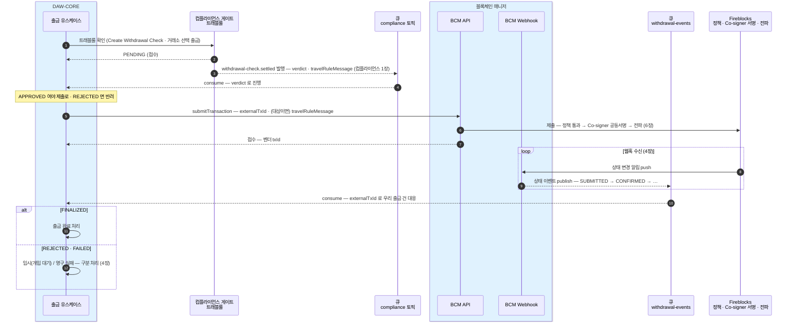
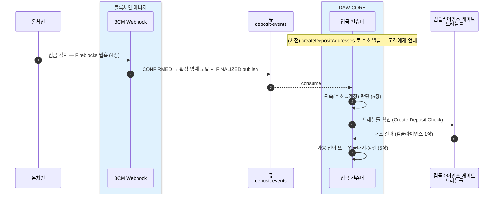

DAW-CORE가 블록체인 매니저를 호출하는 계약을 한 장으로 조립한다. DAW-CORE는 벤더(Fireblocks)를 모른다 — 아는 것은 아래 API·이벤트·TxStatus 뿐이다.
이 장은 원천 장들(0·4·5·6·7·8장·[14장 레퍼런스](14-api-reference.md))의 결론만 모은 것이다 — **원천이 바뀌면 이 장을 함께 갱신한다.**

## API — 호출 쪽 → 매니저 (9개)

시그니처·타입·열거형의 기준은 [14장](14-api-reference.md). 여기는 무엇이 있는지만.

| 오퍼레이션 | 무엇 | 상세 |
|---|---|---|
| `createAccount(accountType, ref)` | 계정 생성 — ref↔accountId 매핑 (유형+ref 로 멱등) | [1장](01-create-account.md) |
| `createDepositAddresses(accountId, symbol, networks)` | 한 토큰을 여러 네트워크로 — 최대 20네트워크, 네트워크별 결과 (부분 성공) | [2장](02-issue-deposit-address.md) |
| `depositAddressesOf(accountId, symbol?, network?)` | 발급된 주소 조회 — DB 읽기, 벤더 왕복 없음. 미발급은 빈 배열 | [3장](03-address-of.md) |
| `balancesOf(accountId, network?, symbol?)` | 자산별 vault 잔액 — 대사에 쓰는 값, 고객별 귀속 잔액 아님 | [8장](08-balance-history.md) |
| `transactionsOf(accountId, after, before, status?)` | 기간·상태로 거래 목록 | [8장](08-balance-history.md) |
| `transactionOf(txId)` | 단건 조회 | [8장](08-balance-history.md) |
| `submitTransaction(request)` | 출금·이체 제출 — `externalTxId`·(트래블룰 대상이면) travelRuleMessage 를 싣는다 | [6장](06-withdrawal.md) |
| `requestSweeps(externalSweepRequestId, network, symbol, items)` | 계정 1..N개 batch sweep 요청 — 각 item은 accountId와 처리 완료한 deposit FINALIZED eventId 목록 | [BC sweep](../../BC/설계/06-sweep.md) |
| `completeEvent(eventId)` | DAW-CORE 업무 반영 완료 확인 — eventId로 멱등, txId는 사용하지 않음 | [BC 흐름](../../BC/설계/02-bcm-flow.md) |

## 이벤트 — 매니저 → DAW-CORE (큐)

토픽마다 전용 컨슈머, 같은 계정의 순서는 파티션이 보장한다. 이벤트 본문(ChainEvent)·소비 규칙은 [14장](14-api-reference.md)·[4장](04-detect-confirm.md).

| 토픽 | 담는 이벤트 | 파티션 키 |
|---|---|---|
| `deposit-events` | 고객 입금 감지·확정 (DEPOSIT) | 고객 accountId |
| `withdrawal-events` | 외부 출금 상태 변경 (WITHDRAWAL) | 출금 풀 vault 의 accountId |
| `internal-events` | 내부 이체 완료 (INTERNAL — delta 정산만 · sweep 은 매니저 내부라 싣지 않는다) | 출발 계정 accountId |
| `sweep-events` | DAW 요청 sweep 항목의 체인 상태와 항목별 결과 | 고객 accountId |

일반 거래 세 토픽의 본문은 같은 `ChainEvent` 모양이고 `type`·`status`로 가른다. 모든 이벤트의 `eventId`는 BCM이
발급하는 상태 전이별 UUID v7이며 소비 dedup·처리 완료 확인 키다. `txId`는 논리 거래 상관키다. 필드 정의는
[14장 ChainEvent](14-api-reference.md).

```json
{
  "type": "WITHDRAWAL",
  "txId": "1a2b3c...",
  "txHash": "0x9f3a...",
  "externalTxId": "WD-000123",
  "accountId": "acct_01H8X",
  "network": "ETHEREUM",
  "symbol": "ETH",
  "to": "0x896B...0b9b",
  "status": "FINALIZED",
  "numOfConfirmations": 12
}
```

`sweep-events`는 요청·실행·항목 관계와 부분 성공을 표현하는 별도 `SweepEvent`를 쓴다.

```json
{
  "eventId": "0198f9f2-6de2-7e5d-8bb0-8d65fb6e7891",
  "sweepRequestId": "0198f9ed-9e8d-7cc1-932a-a9f4b4733134",
  "sweepItemId": "0198f9ee-6bfb-7915-bd0b-f23ea35b23be",
  "executionId": "0198f9f0-f2ce-7558-b51c-bf33fb94612a",
  "txId": "43e06303-1a77-4e02-a8e6-03e111d45b0a",
  "accountId": "acct_01H8X",
  "network": "BASE",
  "symbol": "USDC",
  "requestedAmount": "125.000000",
  "actualAmount": "0.000000",
  "chainStatus": "FINALIZED",
  "itemOutcome": "FAILED",
  "failureCode": "INSUFFICIENT_ALLOWANCE"
}
```

DAW-CORE는 일반 거래와 sweep 이벤트 모두 자기 업무 트랜잭션을 커밋한 뒤
`PUT /events/{eventId}/completion`을 호출하고, 성공 응답 뒤 Kafka offset을 커밋한다. 같은 eventId 재호출은 최초 완료
결과를 돌려준다. 한 tx의 CONFIRMED·FINALIZED·reorg FAILED는 각각 다른 eventId라 각각 완료 확인한다.

막힘(오래 안 풀리는 건)은 이벤트가 아니라 별도 경보 채널이다([4장 막힘 점검](04-detect-confirm.md#막힘-점검-오래-confirmed-인-건-골라내기)).

## TxStatus — DAW-CORE가 보는 공통 상태 다섯

벤더 내부 상태는 매니저가 이 다섯으로 번역한다 — 이벤트엔 `status` 만 싣는다. 뜻·원어 대응(subStatus·networkStatus 는 매니저 내부 값)은 [4장 기준 표](04-detect-confirm.md#공통-상태-다섯-txstatus-기준)가 원천이다.

| TxStatus | 뜻 | 블록체인 상태 (Pending → Confirmed → Finalized) |
|---|---|---|
| `SUBMITTED` | 제출됨 — 벤더가 서명·전파 준비 중, 아직 체인 미등장 (출금에서만 관찰) | 아직 없음 → 전파되면 Pending |
| `CONFIRMED` | 체인에 등장, confirmation 누적 중 — 아직 미확정 | Confirmed — 블록에 포함, finality 전 |
| `FINALIZED` | 확정 — 확정 정책(DCCP) 임계 도달 | Finalized |
| `REJECTED` | 거부·차단 — 정책·스크리닝에 막힘. **임시**(사람 개입 여지 — 입금 동결은 unfreeze 대기) | 출금 차단은 체인에 없음 · 입금 동결은 Finalized |
| `FAILED` | **영구 실패** — 사유 동반 (수수료 부족·revert 등) | Pending 에서 증발 · revert 는 Confirmed 이후 |

## 시퀀스 — 출금 한 사이클



## 시퀀스 — 입금 한 사이클


