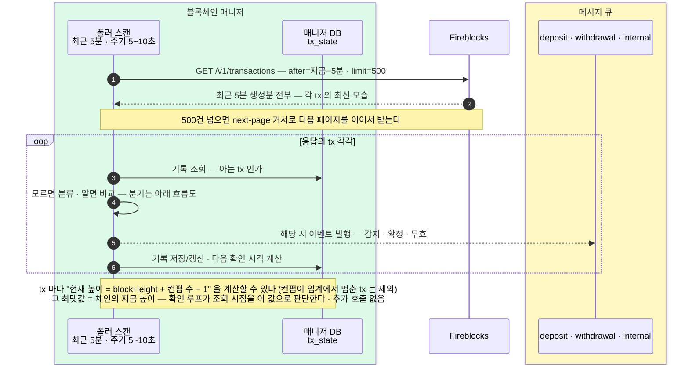
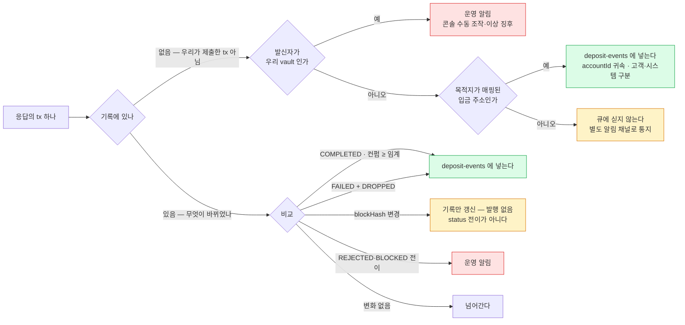
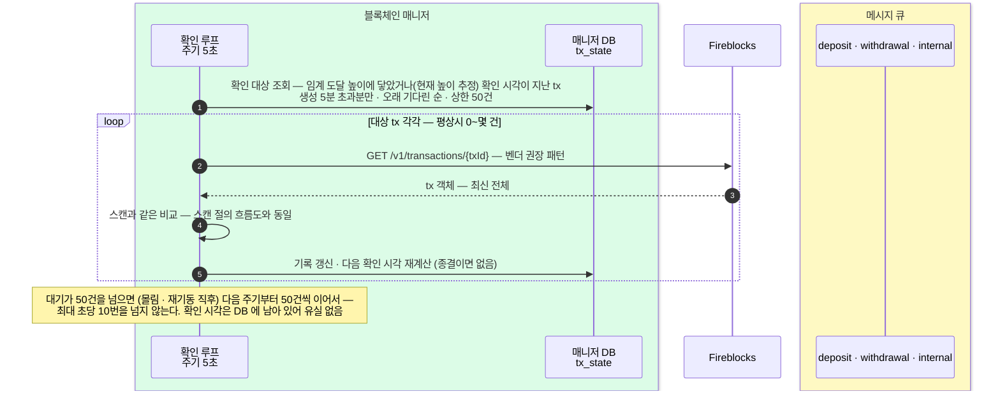

웹훅 없이 `GET /v1/transactions` 폴링만으로 감지 평면을 대체하는 설계. **스캔(최근 5분, 5~10초 주기)이 신규 감지와 빠른 확정을 맡고, 5분을 넘긴 건은 확인 시각을 정해 둔 단건 조회로 마무리한다.**
웹훅 감지([4. 감지와 확정](04-detect-confirm.md))의 **대안 검토안 — 웹훅 수신이 불가한 환경(보안 정책 등)에 대비해 완성해 둔 설계.** 토픽 publish·큐 계약은 [블록체인 매니저 — 흐름](../../BC/설계/02-bcm-flow.md)을 그대로 쓰고, 수신부만 웹훅 수신기에서 폴러로 바꾼다 — 이 문서에서 "02장"은 그 흐름 문서를 가리킨다. 웹훅 사용이 허용되어 채택은 보류(2026-07-23) — 감지 속도(실시간 push)가 결정 사유. 스캔 방식은 tx 대사(4장)의 구현체로 재사용된다. 벤더도 이 폴링 문의 회신(2026-07)에서 웹훅을 best practice 로 재확인했고, 폴링은 인바운드 웹훅이 막힌 환경(은행 보안 정책 등)의 **검증된 대안**으로 지원한다고 답했다.

## 근거 — 무엇이 확인된 사실인가

이 설계는 Fireblocks 공식 SDK 스펙과 담당자 확답(2026-07) 위에서만 세웠다.

| 확인된 사실 | 출처 |
|---|---|
| `after`/`before` 는 항상 **생성 시각(createdAt) 기준** 필터 — `orderBy` 와 무관 | 담당자 확답 |
| `orderBy` 를 지정하면 **next-page 커서가 반환되지 않는다** — 지정하지 않는다 | 담당자 확답 |
| `numOfConfirmations` 는 **단조 증가** — reorg 로 블록이 교체돼도 감소하지 않고 멈춰 있다. 자산별 요구 컨펌 수가 상한 | 담당자 확답 |
| reorg 재채굴 시 **blockInfo(blockHash·blockHeight)는 새 블록으로 갱신** — status 는 CONFIRMING 유지 | 담당자 확답 |
| 재채굴되지 못하고 탈락하면 `FAILED` + subStatus `DROPPED_BY_BLOCKCHAIN` 로 전이 | 담당자 확답 |
| 특정 tx 의 갱신 추적은 **단건 조회가 벤더 권장 패턴** — "요청량이 최소이고 rate limit 안에 넉넉히 든다" | 담당자 확답 |
| **종결 이후에도 tx 객체(blockInfo 포함)는 갱신된다** — 확정·실패로 끝난 tx 도 체인에서 변화가 생기면 객체가 고쳐진다 | 담당자 확답 |
| EVM/UTXO 는 API 표면에서 동작 동일 — 체인 타입 분기 불필요 | 담당자 확답 |
| account 기반 체인(EVM — 이더·Base)의 입금 **통지는 채굴(mined) 시점에 생성**된다. 통지 payload 와 목록 응답이 같은 객체이므로 이력 등장 시점도 같다고 본다 | 공식 문서 |
| `limit` 기본 200 · 최대 500. `after` 미지정 시 기본 조회 범위는 "지난 90일"이며 바뀔 수 있다 — 항상 명시 | 공식 SDK 스펙 |
| 조회 엔드포인트는 Viewer 권한까지 허용 — 폴러는 읽기 전용 API user 로 분리. **단 rate 예산은 따로 받지 않는다** — 워크스페이스 총량을 모든 API user 가 공유 | 담당자 확답 (2026-07) |
| rate limit 은 **결정론적 per-60초 요청 카운터** — 이상 트래픽·스파이크 감지, 적응형 스로틀, 임시 밴·누적 페널티가 **모두 없다.** 꾸준한 폴링은 "이상"으로 취급되지 않고, 닿을 수 있는 건 정적 분당 한도뿐 | 담당자 확답 (2026-07) |
| 두 엔드포인트는 **독립 카운터** — 목록 `GET /v1/transactions` **1,000/분**, 단건 `GET /v1/transactions/{txId}` **1,500/분**, 서로 경쟁 안 함. **최고 tier(더 높은 건 없음)** — 이 값을 천장으로 설계. 계약 후 계정 설정 시 부여(현재 기본값 아님) | 담당자 확답 (2026-07) |
| 모든 응답(성공·거절)에 `X-RateLimit-Limit·Remaining·WindowSize`·`Retry-After` 헤더 — `Remaining`·`Retry-After` 로 선제 페이싱, 429 지수 백오프는 보조 | 담당자 확답 (2026-07) |

이 사실들이 만드는 설계 결론:

- `after` 가 생성 시각 필터이므로, **"최근 5분에 생성된 tx"를 매 주기 다시 읽을 수 있다.** 응답의 각 항목은 그 tx 의 최신 모습 전체라, 반복해서 읽는 것 자체가 상태 추적이 된다. Base(수 분, 컨펌 단위 확인 전 기준)의 확정은 이 5분 안에 끝난다.
- 5분을 넘기는 것 — 이더 확정(임계 64 면 약 13분)·정체된 확정·동결 — 은 **단건 조회가 벤더 권장 패턴**이고, 블록 간격이 고정된 체인에서는 **확정이 언제 될지 계산할 수 있으므로** 그 시각에 맞춰 조회하면 건당 1~3번, 스캔 관찰로 얻는 현재 높이 추정으로 조회 시점을 잡으면 거의 1번으로 끝난다.
- 종결 후에도 객체가 갱신되므로, **확정 처리 후 시간을 두고 한 번 더 조회하면 확정 이후의 깊은 reorg 도 확인할 수 있다.**

## 구조

용어부터:

| 용어 | 뜻 |
|---|---|
| 스캔 | 목록 폴링 한 바퀴 — `GET /v1/transactions?after=지금−5분&limit=500` 호출 한 번(500건 넘으면 다음 페이지를 이어서 받는다). 02장의 **sweep(집금)** 과는 무관한 별개 동작 |
| 진행 중 | 종결 상태(COMPLETED·FAILED·CANCELLED)에 아직 도달하지 않은 tx |
| 조회 범위 | 스캔 한 번이 읽는 생성 시각 범위 — **"지금−5분 ~ 현재"로 고정.** 커서 없음 |
| 다음 확인 시각 | 5분을 넘긴 tx 를 언제 단건 조회할지 tx 마다 정해 둔 시각. `지금 + (임계 − 현재 컨펌 수) × 블록 간격` — 매 확인마다 실제 컨펌 수로 다시 계산한다. 현재 높이 추정이 신선하면 시간 대신 **높이 도달**로 선별한다 |
| 현재 높이 추정 | 스캔이 방금 읽은 **임계 미달** tx 들로 계산한 체인별 최신 블록 높이 — `max(blockHeight + numOfConfirmations − 1)`. 추가 호출 없이 매 스캔 갱신된다 (임계에 닿은 tx 는 컨펌 수가 임계에서 멈춰 못 쓴다) |
| tx_state | 매니저 DB 테이블. tx 별 "마지막으로 본 모습"의 사본 + 다음 확인 시각 — 이번 응답과 비교해서 무엇이 바뀌었는지 알아내는 기준. 종결된 행도 지우지 않는다 |
| createdAt · after 값 | 모두 Unix epoch 밀리초 — 날짜와 시각을 함께 담은 절대 시점(13자리 숫자) |

| 구성 요소 | 역할 | 호출 |
|---|---|---|
| 스캔 (최근 5분 · 주기 5~10초) | 신규 감지 + 5분 내의 갱신·확정 — Base 확정은 대부분 여기서 끝난다 | 주기당 1번 (5분 내 생성 500건 이하 — 일 14만 건 수준까지) |
| 확인 루프 (주기 5초) | **5분을 넘긴 진행 중 tx** 를 임계 도달 높이 또는 다음 확인 시각에 단건 조회 — 이더 확정 · 정체 · 동결(10분 간격) · 확정 후 재확인. 대기가 쌓이면 **주기당 상한(50건)씩 오래 기다린 순서로** 나눠 처리 | 건당 1번 안팎 — 높이 추정이 없으면 1~3번 (+ 확정 후 1번) · 최대 초당 10번 |
| 정체 경보 | CONFIRMING 지속 시간이 임계를 넘으면 운영 알림 — DB 만 보고 판단, 호출 없음 | 0 |

이벤트를 만든 뒤의 처리(토픽 publish·중복 반영 방지)는 02장 수신·발행 규칙을 그대로 쓴다.

**전제 하나 — 벤더 임계 정렬.** 확정으로 보는 기준은 `COMPLETED && 컨펌 수 ≥ 임계` 인데, `numOfConfirmations` 가 Fireblocks 자산별 임계 이상으로는 늘지 않고 COMPLETED 도 그 임계에서 뜬다. 우리 임계를 크게 쓰려면 Fireblocks 쪽 임계를 같은 값으로 올려야 한다(자산별 {{DCCP::Deposit Control & Confirmation Policy — 입금을 확정으로 볼 컨펌 수를 정하는 Fireblocks 정책}} 설정 또는 tx 단위 `set_confirmation_threshold`). 임계 값은 환경설정으로 두고 자산·망별로 넣는다 — 값은 Fireblocks 와 논의 후 확정.

**전제 둘 — 지원 자산.** 스테이블코인 전용, 체인은 이더리움 · Base — 솔라나는 지금 범위에서 뺐다(추가하려면 상수·임계 설정과 이력 등장 시점 확인이 필요). 다음 확인 시각 계산에 **체인별 블록 간격 상수**(이더 약 12초 · Base 약 2초 — Base 컨펌 단위는 미확정 절)를 쓴다 — 예상이 어긋나도 재확인이 보정하므로 정확할 필요는 없다. 새 체인 추가 = 상수·임계 설정 추가.

**"5분"의 근거** — 설정값이다. 신규 감지의 신선도를 위한 짧은 폭이면서, Base 의 확정이 이 안에 끝나 확인 루프로 넘어가지 않도록 잡았다. 이더 임계가 12 수준(확정 약 2분)으로 협의되면 이더 확정도 이 안에 끝나 확인 루프가 거의 한산해진다. 페이지 조건은 `5분 내 생성 ≤ 500건` — 일 14만 건 규모까지 1페이지이며, 계산은 일 평균이 아니라 **피크 시간대 기준**으로 본다.

## 스캔 — 신규 감지 + 5분 내 확정

스캔 한 바퀴의 통신 흐름:



초록 = 매니저 내부, 노랑 = 큐. 조회 범위가 고정이라 커서 관리가 없고, 같은 tx 가 5분 동안 매 스캔 다시 실려 오는 것이 의도다 — 그 반복 관찰이 상태 추적이고, 변화 없으면 아무것도 안 한다.

tx 한 건의 분류·비교 분기:



발행은 02장 규칙(앞으로 가는 상태 전이만)을 따른다 — blockHash 변경은 status 가 CONFIRMING 그대로라 발행할 전이가 없고, 확정이 늦어지는 것은 정체 경보가 잡는다. 확정 뒤의 +30분 재확인에서 관찰된 이동·탈락은 운영 알림으로 보낸다 — 확인 루프 절의 표 참조.

분류 규칙 — 모르는 txId 는 "우리가 제출한 tx 가 아니다"가 확정이므로 3분기면 된다. 출금(`WITHDRAWAL`)·delta(`INTERNAL`)·집금은 매니저가 `POST /transactions` 로 제출하면서 그 자리에서 기록 등록 + 감지 이벤트 발행(집금은 발행 생략, 02장)까지 끝낸다:

| 모르는 txId 의 분류 | 처리 |
|---|---|
| 발신자가 우리 vault | 자동 분류하지 않는다 — **운영 알림.** 매니저를 거치지 않고 나간 tx (콘솔 수동 조작 또는 이상 징후). 제출 직후 죽어 기록 못 한 틈새는 멱등 키(externalTxId) 대조로 복구 |
| 목적지가 매핑된 입금 주소 | `DEPOSIT` → deposit-events. accountId 귀속 — 고객 계정인지 시스템 계정인지는 DAW-CORE 가 계정 생성 때 받아 둔 accountId 매핑에서 가른다 |
| 그 외 | 큐에 싣지 않는다 — 귀속 불명, 별도 알림 채널 (02장) |

**이벤트 계약** — 소비자에게 주는 큐 이벤트는 계열별 **감지 · 확정 · 무효** 다. 중간 전이(컨펌 진행·승인 변화)는 발행하지 않는다 — 기록에만 반영한다. **사람이 처리해야 하는 사건 — 동결 · 귀속 불명 · 우리 vault 에서 나간 예상 밖 tx · 확정 후의 reorg 와 탈락 — 은 큐가 아니라 운영 알림 채널로** 나간다. 컨펌 진행 표시가 필요한 화면은 호출 없이 경과 시간으로 어림해 채운다(표시용 — 판단에는 쓰지 않는다).

## 확인 루프 — 5분을 넘긴 건의 마무리

5분을 넘기고도 종결하지 못한 tx 는 tx 마다 정해 둔 **다음 확인 시각**에 단건 조회한다. 비교·발행은 스캔과 같은 함수를 쓴다.

```
다음 확인 시각 = 지금 + (임계 − 현재 컨펌 수) × 블록 간격

예)  이더 · 임계 64 · 컨펌 25 → 약 8분 뒤 확인   (5분 시점에 조회 범위를 벗어나며 등록된 값)
     매 확인마다 실제 컨펌 수로 다시 계산 — 예상이 어긋나도 자동 보정
```

**높이 기준 보정 — 단건 조회를 더 줄인다.** 스캔이 방금 읽은 tx 들에서 체인의 현재 높이를 추가 호출 없이 추정할 수 있다 — `현재 높이 ≈ max(blockHeight + numOfConfirmations − 1)`. 단, `numOfConfirmations` 는 자산 임계가 상한이므로(담당자 확답) **임계 미달인 관찰 tx 만** 추정에 쓴다. reorg 는 이 추정을 몇 블록 흔들 수 있지만(blockInfo 가 새 블록으로 바뀌는데 컨펌 수는 멈춰 있는 동안), 추정은 **조회 시점 힌트일 뿐**이라 틀려도 조회가 한 번 이르거나 늦어질 뿐이다 — 확정 판단은 항상 단건 조회로 받은 벤더 값으로만 한다. 추정이 신선하면(최근 스캔에 그 체인 tx 가 있었음) 확인 루프는 시간 추정 대신 **"임계 도달 높이에 닿았는가"로 조회 시점을 잡아** 빗나간 재확인을 없앤다 — 건당 조회가 거의 1번으로 준다. 신선한 관찰이 없으면 위의 시간 추정으로 후퇴한다 — 그 경우는 확인 대상 자체가 적다.

| 확인 시점의 상태 | 다음 동작 |
|---|---|
| COMPLETED · 컨펌 수 ≥ 임계 | 확정 이벤트 발행 → **+30분에 재확인 1번 예약** (확정 후 깊은 reorg 감시) → 재확인까지 끝나면 관찰 종료. 재확인에서 블록 이동만 보이면 자금 영향이 없으므로 **기록 + 운영 알림** (큐에 싣지 않는다) |
| FAILED + DROPPED_BY_BLOCKCHAIN | 확정 전이면 무효 이벤트 · 확정 후면 사고 — 운영 알림 · 원장 조정은 사람이 → 관찰 종료 |
| 아직 CONFIRMING | 남은 컨펌으로 재계산 — 예상 시각을 지났는데 미확정이면 지수 백오프(30초 → 1분 → 5분 → 15분 → 1시간)로 재확인, 1시간에서 저빈도 유지 · 정체 경보가 운영에 통지 |
| 채굴 전 — blockHash 없음 | 1분 뒤 재확인 — 승인 대기 등으로 미채굴인 출금이 주로 여기 온다 |
| BLOCKED · 출금 REJECTED (최종) | 전이 시 운영 알림 → **관찰 종료** — 자금이 반환/차단으로 끝나 더는 안 본다 (담당자 확답) |
| 입금 REJECTED (동결·보류) | **전이 시 운영 알림 발행** → 10분 저빈도 재확인 — Admin 해제(unfreeze)까지. 해제도 웹훅/조회에 반영되므로 재확인이 잡는다. 운영 처리 완료 시 기록을 닫는 절차가 짝 (닫지 않으면 조회 대상이 계속 쌓인다) |



**스캔과의 중복 처리 방지** — 생성 5분 경계를 막 넘는 tx 등에서 스캔과 확인 루프가 같은 tx 를 같은 순간에 볼 수 있다. 두 겹으로 막는다: ① **tx 단위 잠금**으로 처리 자체를 직렬화한다 — 활성 폴러가 1대라 프로세스 안 잠금으로 충분하고, 뒤에 온 경로는 잠금 안에서 기록을 다시 읽으므로 이미 발행된 전이는 "변화 없음"이 된다. ② 그래도 남는 중복(발행 직후 기록 전에 죽는 창)은 소비 멱등이 흡수한다(02장) — 이 최후 보루는 재기동·장애까지 덮는 원래 있는 장치다.

초록 = 매니저 내부, 노랑 = 큐. 주기당 상한이 속도 제한을 겸한다 — 입금이 한꺼번에 몰리거나 폴러가 오래 죽었다 재기동해 밀린 확인이 쌓여 있어도, 최대 초당 10번(50건/5초)으로 오래 기다린 것부터 차례로 소화하고 평상시 동작으로 복귀한다.

## TypeScript pseudocode

```typescript
// ── 영속 상태 ──────────────────────────────────────────────

interface TxState {
  txId: string;                   // Fireblocks tx id (PK)
  createdAt: number;              // 생성 시각 — epoch 밀리초
  assetId: string;
  status: string;                 // Fireblocks 원어
  subStatus: string;
  numOfConfirmations: number;
  blockHash: string | null;       // 바뀌면 reorg 신호. 채굴 전이면 null
  blockHeight: number | null;     // 마지막으로 본 블록 높이 — 아래 임계 도달 높이 계산용. 채굴 전 null
  thresholdHeight: number | null; // 임계 도달 높이 = blockHeight + 임계 − 1 — 이 높이에 닿으면 확정 예상 (확인 루프의 높이 선별 기준)
  approvalHash: string;           // 승인 필드 묶음의 해시 — 발행에는 안 쓰고 기록용 (이벤트 계약: 중간 전이 미발행)
  finalized: boolean;             // 확정 이벤트를 발행했는가 — 중복 발행 방지 + 확정 후 탈락 구분
  closed: boolean;                // 관찰 종료 여부 — 동결 건의 운영 처리 완료 시에도 이 값으로 닫는다 (행은 지우지 않는다)
  nextCheckAt: number | null;     // 다음 확인 시각 — null 이면 확인 루프 대상 아님
  retries: number;                // 예상 시각 초과 후 재확인 횟수 — 간격 늘리기·경보용
  confirmingSince: number | null; // 정체 경보용 — CONFIRMING 진입 시점에 한 번만 기록, 이탈하면 null
}

// toTxState(tx, prev) 규칙:
// - confirmingSince 는 prev 의 값을 이어받는다 — 매 갱신마다 새로 찍으면 정체 경보가 영원히 울리지 않는다.
//   CONFIRMING 이탈 시 null 로 리셋
// - retries 도 prev 값을 유지한다 — 갱신 주체는 확인 루프뿐, 스캔은 건드리지 않는다
// - blockHeight · thresholdHeight(= blockHeight + 임계 − 1)도 함께 기록한다 — 확인 루프의 높이 선별 기준

const LOOKBACK_MS = 5 * 60_000;         // 스캔 조회 범위 — 신규 감지 + Base 확정이 이 안에 끝난다
const PAGE_LIMIT = 500;
const CLOSED_STATUSES = new Set(["COMPLETED", "FAILED", "CANCELLED"]);   // 종결 상태 — toTxState 가 closed 여부를 정할 때 쓴다
const FREEZE_SUBSTATUSES = new Set(["AUTO_FREEZE", "FROZEN_MANUALLY", "REJECTED_AML_SCREENING"]);  // 입금 동결=보류(최종 아님) — 해제까지 저빈도 재확인 (담당자 확답 2026-07)
const STALL_MS = 30 * 60_000;           // 정체 경보 임계 — 운영 조정값
const CHECK_BATCH_LIMIT = 50;           // 확인 루프 주기당 상한 — 밀려도 최대 초당 10번(50건/5초)으로 제한
const RECHECK_AFTER_FINAL_MS = 30 * 60_000;  // 확정 후 재확인 — 깊은 reorg 감시. 체인별 설정으로 끌 수 있다
declare function thresholdOf(assetId: string): number;       // 자산별 확정 임계 — 벤더 임계와 정렬 (전제)
declare function blockIntervalOf(assetId: string): number;   // 블록 간격 ms — 이더 12_000 · Base 2_000
declare function chainOf(assetId: string): string;           // 자산 → 체인
declare function progressed(prev: TxState, tx: FbTransaction): boolean;  // 진전 — 컨펌 수 증가 또는 status·subStatus 변화
declare function withTxLock(txId: string, fn: () => Promise<void>): Promise<void>;
// 같은 tx 의 처리를 한 번에 하나로 직렬화 — 스캔·확인 루프가 같은 tx 를 같은 순간에 겹쳐 처리하지 않게 한다.
// 활성 폴러가 1대(leader lock)라 프로세스 안 잠금으로 충분하다

// ── 현재 높이 추정 — 스캔 관찰로 갱신 · 추가 호출 없음 ──────

const heightEst = new Map<string, { height: number; seenAt: number }>();  // 체인별 최신 추정
const HEIGHT_EST_FRESH_MS = 60_000;   // 이보다 오래된 추정은 버린다 — 시간 추정으로 후퇴

function updateHeightEst(tx: FbTransaction): void {
  // numOfConfirmations 는 임계가 상한 — 상한에 닿은 tx 는 현재 높이를 말해 주지 않는다
  if (!tx.blockInfo?.blockHeight || tx.numOfConfirmations >= thresholdOf(tx.assetId)) return;
  const h = tx.blockInfo.blockHeight + tx.numOfConfirmations - 1;
  const cur = heightEst.get(chainOf(tx.assetId));
  if (!cur || h > cur.height) heightEst.set(chainOf(tx.assetId), { height: h, seenAt: now() });
}

function freshHeights(): Map<string, number> {               // 신선한 추정만 — 확인 루프의 높이 선별 입력
  const out = new Map<string, number>();
  for (const [chain, e] of heightEst) if (now() - e.seenAt <= HEIGHT_EST_FRESH_MS) out.set(chain, e.height);
  return out;
}

// ── 스캔 — 신규 감지 + 5분 내 확정 (주기 5~10초) ────────────

async function scan(): Promise<void> {
  let next: string | undefined;
  do {
    const page = await fb.getTransactions({ after: now() - LOOKBACK_MS, limit: PAGE_LIMIT, next });
    for (const tx of page.transactions) {
      updateHeightEst(tx);                         // 임계 미달 tx 로 체인 현재 높이 추정 갱신
      await withTxLock(tx.id, async () => {        // 확인 루프와의 동시 처리 차단 — tx 단위 직렬화
        const prev = await db.findTxState(tx.id);  // 잠금 안에서 읽는다 — 다른 경로가 방금 갱신했을 수 있다
        if (!prev) {
          const kind = await classifyAndPublish(tx);   // 3분기 분류 — 운영 알림 / DEPOSIT / 귀속 불명
          // 발견 시점에 이미 종결이면 (재기동 등) 확정/무효도 이 자리에서 발행 — 미루면 유실될 수 있다
          const finalized = kind === 'DEPOSIT' && isFinal(tx);
          if (finalized) await publishFinalized(tx);
          else if (kind === 'DEPOSIT' && isDroppedByChain(tx)) await publishDropped(tx);
          await db.insertTxState({ ...toTxState(tx, null), finalized, nextCheckAt: nextCheckAt(null, tx, 0, finalized) });
        } else {
          await diffAndPublish(prev, tx);
          const finalized = prev.finalized || isFinal(tx);
          await db.updateTxState({ ...toTxState(tx, prev), finalized, nextCheckAt: nextCheckAt(prev, tx, 0, finalized) });
        }
      });
    }
    next = page.nextPageCursor;              // 500건 넘으면 다음 페이지를 이어서 받는다
  } while (next);
}

// ── 다음 확인 시각 — 확인 루프가 언제 볼지를 정한다 ──────────

function nextCheckAt(prev: TxState | null, tx: FbTransaction, retries: number, finalized: boolean): number | null {
  if (finalized)
    return prev?.finalized
      ? null                                              // 이미 확정 상태였다 = 이번이 +30분 재확인 — 관찰 종료
      : now() + RECHECK_AFTER_FINAL_MS;                   // 방금 확정으로 전이 — 재확인 1번 예약
    // "재확인을 했는가"는 벤더 객체가 아니라 우리 기록에만 있는 정보 — 전이(prev.finalized)로 판별한다
  if (CLOSED_STATUSES.has(tx.status)) return null;        // 무효 등으로 끝남 — 더 안 본다
  if (tx.status === 'BLOCKED') return null;               // BLOCKED = 최종(출금 정책 차단·자금 반환) — 관찰 종료 (담당자 확답)
  if (tx.status === 'REJECTED')
    return FREEZE_SUBSTATUSES.has(tx.subStatus)
      ? now() + 10 * 60_000                               // 입금 동결 = 보류 — Admin 해제까지 10분 저빈도. 해제도 웹훅/조회에 반영된다
      : null;                                             // 출금 REJECTED = 최종(자금 즉시 반환) — 관찰 종료

  if (!tx.blockInfo?.blockHash) return now() + 60_000;    // 채굴 전 — 1분 뒤 다시

  const remaining = thresholdOf(tx.assetId) - tx.numOfConfirmations;
  if (remaining > 0)                                      // 확정까지 남은 컨펌 → 시계로 예측
    return now() + remaining * blockIntervalOf(tx.assetId);
    // 매 확인마다 실제 컨펌 수로 재계산 — 예상이 어긋나도 자동 보정

  // 예상 시각을 지났는데 아직 미확정 — 지수 백오프로 간격을 늘린다
  // (벤더 필수요건: stuck tx 를 고정 주기로 계속 조회하면 진행 중 집합이 누적돼 정상 사용량을 밀어올린다)
  const BACKOFF = [30_000, 60_000, 300_000, 900_000, 3_600_000]; // 30s → 1m → 5m → 15m → 이후 1시간 고정(저빈도 대사)
  return now() + BACKOFF[Math.min(retries, BACKOFF.length - 1)];  // 1시간 상한에서 저빈도 유지 · 정체 경보가 운영에 통지
}

// ── 확인 루프 — 5분을 넘긴 건 (주기 5초) ────────────────────

async function checkDue(): Promise<void> {
  // due = "임계 도달 높이에 닿았다(신선한 높이 추정 기준 — 빗나간 재확인이 없다)"
  //       또는 "다음 확인 시각이 지났다(높이 추정이 없을 때의 후퇴 · 동결·채굴 전·재확인도 이쪽)"
  const due = await db.findDueTxStates({
    chainHeights: freshHeights(),            // 체인별 현재 높이 추정 — thresholdHeight ≤ 추정 높이면 due
    nextCheckAtBefore: now(),
    createdAtBefore: now() - LOOKBACK_MS,    // 5분 이내는 스캔 담당 — 여기선 안 본다
    orderBy: 'nextCheckAt ASC',              // 확인 시각이 지난 것부터 — 백오프로 stuck tx 는 간격이 길어 자연히 뒤로 밀리고, 갱신 가능성 높은 최근 건이 먼저 뽑힌다 (벤더 권고: 최근·변화 가능성 우선)
    limit: CHECK_BATCH_LIMIT,                // 몰림·재기동 직후에도 주기당 이만큼씩만 — 나머지는 다음 주기
  });

  for (const item of due) {
    const tx = await fb.getTransactionById(item.txId);    // 단건 조회 — 벤더 권장 패턴
    await withTxLock(item.txId, async () => {             // 스캔과의 동시 처리 차단 — tx 단위 직렬화
      const prev = await db.findTxState(item.txId) ?? item;  // 잠금 안에서 다시 읽는다 — 스캔이 방금 갱신했을 수 있다
      await diffAndPublish(prev, tx);
      const finalized = prev.finalized || isFinal(tx);
      const overdue = !progressed(prev, tx);
      await db.updateTxState({
        ...toTxState(tx, prev),
        finalized,
        retries: overdue ? prev.retries + 1 : 0,          // 진전이 있었으면 리셋
        nextCheckAt: nextCheckAt(prev, tx, overdue ? prev.retries + 1 : 0, finalized),
      });
    });
  }
}

// ── 분류 — "우리가 만든 tx 는 제출 순간 기록에 있다" 불변식으로 3분기 ──
// 출금·집금·delta 는 매니저가 POST 제출 → 기록 등록 + 감지 이벤트 발행까지 그 자리에서 끝낸다.

async function classifyAndPublish(tx: FbTransaction): Promise<'ALERTED' | 'DEPOSIT' | 'UNATTRIBUTED'> {
  if (await db.isOurVault(tx.source)) {
    await alertUnexpectedOutbound(tx);       // 매니저를 거치지 않고 나간 tx — 사람이 알아야 하는 사건
    return 'ALERTED';
  }
  const dst = await db.lookupDepositAddress(tx.destination);
  if (dst.mapped) {
    await mq.publish('deposit-events', { ...detected('DEPOSIT', tx), accountId: dst.accountId, accountRef: dst.ref });
    return 'DEPOSIT';                        // 확정/무효 후속 이벤트는 DEPOSIT 으로 분류된 tx 에만 나간다
  }
  await notifyUnattributed(tx);              // 귀속 불명 — 큐에 싣지 않고 별도 알림 채널 (02장)
  return 'UNATTRIBUTED';
}

// ── diff — 스캔·확인 루프 공용. prev = 마지막으로 본 모습, tx = 방금 받은 최신 ──

function isFinal(tx: FbTransaction): boolean {
  // status 만 믿지 않고 컨펌 수를 임계와 직접 비교한다 (02장 규칙)
  return tx.status === 'COMPLETED' && tx.numOfConfirmations >= thresholdOf(tx.assetId);
}

function isDroppedByChain(tx: FbTransaction): boolean {
  return tx.status === 'FAILED' && tx.subStatus === 'DROPPED_BY_BLOCKCHAIN';
}

async function diffAndPublish(prev: TxState, tx: FbTransaction): Promise<void> {
  const blockHash = tx.blockInfo?.blockHash ?? null;

  // reorg 재채굴 — 유일한 감지 신호. 컨펌 수는 이월될 수 있음(정상) — 정합 검증 금지.
  // 확정 전에는 발행하지 않는다 — status 가 CONFIRMING 그대로라 발행할 전이가 없다 (02장: 전이만 발행).
  // 기록 갱신만으로 충분하고, 확정 지연은 정체 경보가 잡는다. 확정 후의 이동만 운영 알림
  if (prev.blockHash && blockHash && prev.blockHash !== blockHash && prev.finalized)
    await notifyReorgAfterFinal(tx);

  // 동결 — 전이 시 운영 알림 (큐에 싣지 않는다). 해제·반환 등 운영 처리의 출발점 —
  // 이 알림이 없으면 "운영 처리 후 기록 닫기" 절차가 시작될 수 없다
  const frozenNow = tx.status === 'REJECTED' || tx.status === 'BLOCKED';
  const frozenBefore = prev.status === 'REJECTED' || prev.status === 'BLOCKED';
  if (frozenNow && !frozenBefore) await notifyFrozen(tx);

  // 탈락 — 확정 전이면 입금 무효, 확정 후면 깊은 reorg 사고 (원장 조정은 사람이).
  // 가드는 "종결 여부"가 아니라 "DROPPED 로의 전이" 로 건다 — 확정된 tx 는 이미 종결이라
  // "종결 전에만" 조건으로 걸면 사고 알림 분기에 영원히 못 들어간다. 전이 조건이 중복 발행 방지도 겸한다
  if (isDroppedByChain(tx) && prev.subStatus !== 'DROPPED_BY_BLOCKCHAIN')
    prev.finalized ? await alertIncident(tx) : await publishDropped(tx);

  // 확정 — deposit-events 에 확정 이벤트를 넣는다. 한 번만 발행. 이후 처리(원장·집금)는 소비자 몫
  if (!prev.finalized && isFinal(tx))
    await publishFinalized(tx);

  // 그 외 변화(컨펌 진행·승인 등)는 기록에만 반영 — 이벤트 계약: 감지·확정·무효만 발행
}

// ── 정체 경보 — 호출 없이 DB 만 본다 (주기 60초) ──

async function alertStalledConfirming(): Promise<void> {
  const stalled = await db.findTxStates({ status: 'CONFIRMING', confirmingSinceBefore: now() - STALL_MS });
  for (const s of stalled) await notifyOps(s);
  // reorg 중 컨펌 수는 감소 대신 정체한다 — 별도 규칙 없이 이 경보가 함께 잡는다
}

// ── 실행부 ─────────────────────────────────────────────────

async function main(): Promise<void> {
  await acquireLeaderLock();                     // 다중 인스턴스 배치면 활성 1대만
  schedule(scan,                      7_000);    // 스캔 — 신규 감지 + 5분 내 확정
  schedule(checkDue,                  5_000);    // 확인 루프 — 5분 넘긴 건만 · 주기당 상한 50건
  schedule(alertStalledConfirming,   60_000);    // 경보 — 호출 없음
}
// schedule = "이전 실행이 끝난 뒤 N ms 후 다음 실행" — 무거워지면 주기가 늘어질 뿐 겹치지 않는다
```

## 호출량

| 경로 | 호출 |
|---|---|
| 스캔 | 주기당 1번 — 5분 내 생성 500건(일 14만 건 수준)까지 1페이지 |
| 확인 루프 | **5분을 넘긴 건만** — 이더 건당 1번 안팎(높이 추정 선별 · 없으면 1~3번) + 확정 후 재확인 1번. Base 는 평상시 0. 동결은 건당 6번/시간 |
| 몰림·재기동 | 주기당 상한 50건씩 나눠 처리 — 스캔 페이지 포함 **합산 최대 초당 10번을 넘지 않는다** (밀린 만큼 소화 시간이 늘어날 뿐) |

이더 임계가 12 수준으로 협의되면 이더 확정도 5분 안에 끝나 확인 루프가 거의 0이 된다 — 그 경우 이 설계의 평상시 호출은 **스캔 주기당 1번이 전부**다(주기 7초 기준 하루 약 12,300번, 평균 0.14회/초). 임계 64 라면 이더 입금 건당 1번 안팎이 더해진다. 어느 쪽이든 신규 감지에 필수인 목록 조회 1번 외의 추가 호출이 "5분 안에 안 끝난 건"으로만 한정된다.

정리하면 벤더 쪽에서 보는 요청 속도는 두 숫자다 — **평상시 초당 0.1~0.2회 · 피크 합산 최대 초당 10회**(클라이언트측 상한). **우리 계산으로는** 목록 카운터 분당 ~120회(한도 1,000/분)·단건 카운터 최대 ~600회(한도 1,500/분)로 흩어져 **두 한도 모두에 여유 있게 든다**. 벤더도 **우리가 문의에 적어 보낸 사용량이 한도 내로 든다**고 확인해 줬다(2026-07 회신 — 구체 분당 수치는 우리 추정이지 벤더가 준 값은 아니다). 추가로 응답 헤더(`X-RateLimit-Remaining`·`Retry-After`)로 **선제 페이싱**하고(남은 예산이 얕아지면 다음 주기를 미룬다), 429 는 지수 백오프로 받는다.

## 입금이 한꺼번에 몰릴 때

이벤트·에어드랍처럼 짧은 시간에 입금이 폭주하는 경우 — 예: **10분에 1만 건** — 를 기준으로 보면:

```
스캔:      조회 범위(5분)에 최대 5,000건 → 주기당 10페이지 = 호출 10번
확인 루프: 5분을 넘겨 넘어온 건들을 주기당 50건씩 — 최대 초당 10번으로 제한
```

- **밀릴 뿐 터지지 않는다** — 실행 규칙이 "이전 실행이 끝난 뒤 N초"이고, 폴러의 모든 호출(스캔 페이지 + 단건 조회)은 **클라이언트측 상한 하나로 묶어 합산 초당 10번**을 넘지 않는다. 무거워지면 처리가 늦어질 뿐 호출률이 상한을 넘지 않는다 — 감지 지연이 수십 초로 늘어나는 것이 폭주의 대가 전부다.
- **소화 시간은 밀린 건수에 비례한다** — 이더 입금 1만 건이 확인 루프로 넘어오면 상한 속도(초당 10번)로 약 17분에 걸쳐 소화한다. 확정 이벤트가 그만큼 늦어지는 것이고, 유실은 아니다. 이 소화 시간이 자주 부담되는 물량이 되면 "접은 대안"(목록 일괄)을 다시 저울질한다.
- **유실이 없다** — 스캔 조회 범위가 고정이고 커서가 없어서, 밀린 주기·실패한 호출·429 로 건너뛴 주기는 다음 스캔이 같은 범위를 그대로 다시 읽는다. 폴러가 5분 넘게 정지했다 재기동한 경우만 **첫 스캔 한 번 조회 범위를 마지막 성공 스캔 시각까지 넓혀** 읽는다(after 가 생성 시각 필터라 가능). 확인 루프의 다음 확인 시각도 DB 에 남아 있어 재기동하면 오래 기다린 것부터 이어진다.
- 운영 장치 하나를 짝으로 둔다: **스캔 소요 시간·페이지 수·확인 대기 건수 메트릭 + "주기 초과 지속" 경보** — 폭주는 지연으로 흡수되는데, 그것이 벌어지고 있음을 사람이 알아야 한다.

## 접은 대안 — 목록 일괄 조회 계열

5분 이후를 목록 조회로 덮는 두 안을 검토했다 접었다:

- **느린 스캔 (최근 1시간 목록을 30~60초마다 반복)** — 호출 수가 물량과 무관하게 고정되는 장점이 있으나, 매회 대부분 변화 없는 객체 전체를 다시 받아 전량 비교하는 낭비가 상시 발생한다.
- **몰림 시 목록 전환 (확인 대기가 쌓이면 단건 대신 목록 1번)** — 폭주 시 호출을 아끼지만, 두 경로가 공존하는 복잡함을 더한다.

둘 다 접고 **단건 조회 하나로 통일**했다 — 단순하고, 벤더 권장 패턴이며, 주기당 상한(50건)이 폭주 속도 제한을 겸한다. 트레이드오프는 몰릴 때 소화 시간이 건수에 비례하는 것(1만 건 ≈ 17분)이고, 이를 수용한다.

> **벤더 재검토 여지 (2026-07 회신).** 담당자는 오히려 **목록 창(`after`)을 예상 확정 시간에 맞춰 넓히기**를 권했다 — 목록 조회는 객체가 몇 건이든 **페이지당 1콜**이라 "낭비"는 rate 비용이 아니라 비교 비용일 뿐이고, 넓은 스캔이 진행 중 tx 를 싸게 다시 잡아 단건 조회를 소수의 꼬리로 줄인다. 확인 루프 호출이 상시 수천 건/일을 넘거나 몰림 소화 시간이 자주 문제 되면 이 계열(특히 **창 넓히기**)을 우선 다시 저울질한다.

## 웹훅 이벤트별 대체 매핑

| 웹훅 이벤트 | 폴링 대체 |
|---|---|
| `transaction.created` | 스캔 — 모르는 txId → 분류 → DEPOSIT (출금·내부는 제출 시점에 매니저가 등록·발행) |
| `transaction.status.updated` | 스캔(5분 내) · 확인 루프(이후)의 비교 — 발행은 확정·무효만, 중간 전이는 기록 반영만 |
| `transaction.approval_status.updated` | 〃 |
| `transaction.alert.stuck` | 막힘 경보 (Beta) — 수동 개입 필요 |

감지 지연은 스캔 주기(5~10초)만큼 추가된다 — tx 가 이력에 등장하는 시점 자체는 웹훅과 같다 — 이더·Base 입금은 채굴 시점(공식 문서).

## 이 설계의 책임 경계

이 설계가 하는 일은 **이벤트를 큐에 싣는 것까지**다 — 확정 이벤트를 deposit-events 에 넣으면 끝이고, 그 이후(원장 반영·집금 sweep 시작 등)는 이 문서에서 정하지 않는다. 02장의 원칙 하나만 물려받는다: **확정 전 입금에는 집금을 걸지 않는다** — 미확정 자금을 옮기면 reorg·탈락 처리와 충돌한다.

## 미확정 — 벤더 확인 대기

- **자산별 확정 임계 값** — Fireblocks 와 논의 후 환경설정으로 확정 (테스트넷 3, 메인넷은 협의 값). Base 의 컨펌 단위(무엇을 1로 세는지)와 블록 간격 상수의 유효성도 이때 함께 확인. **임계가 12 수준이면 확인 루프가 거의 한산해지고, 64 수준이면 이더 건당 1번 안팎이 더해진다.**