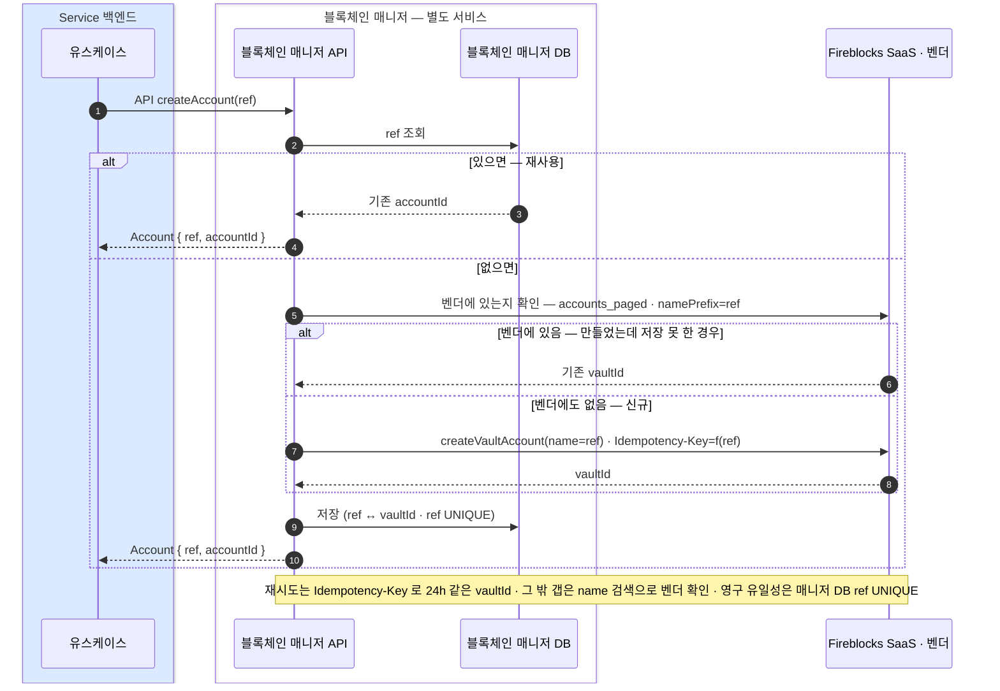

createAccount(ref) 는 블록체인 매니저 API 오퍼레이션 — Service 백엔드가 HTTP API 로 호출하면 매니저가 Fireblocks vault 를 만들고 Account { ref, accountId } 매핑을 블록체인 매니저 DB 에 저장한다.
고객당 한 번 — 체인과 무관한 vault 를 만들며, 재시도는 Idempotency-Key 와 매니저 DB ref UNIQUE 로 중복을 막는다.

# 계정 생성 — createAccount

고객당 한 번 — 체인과 무관한 vault 를 만든다

```
createAccount(ref) → Account { ref, accountId }
// accountId = vault 매핑 id
```

## createAccount — vault 를 만든다 (EVM 공통)



### 한 번만 — 재시도·중복 방어 (결정)

- **재시도 멱등**: createVaultAccount 에 `Idempotency-Key=f(ref)` — 24시간 내 재시도는 벤더가 **같은 vaultId** 를 돌려준다(중복 vault 없음).
- **영구 유일성**: **블록체인 매니저 DB 의 ref UNIQUE** — 중복 row 를 막고, 경합 시 이긴 값을 **읽어 그대로 반환**한다(에러 아님).
- **name 은 라벨**: 벤더가 vault name 유일성을 강제하지 않으므로(중복 생성 가능), name(namePrefix) 검색은 DB·멱등키가 다 놓친 경우에 **벤더에 있는지 확인하는 fallback**일 뿐이다.
