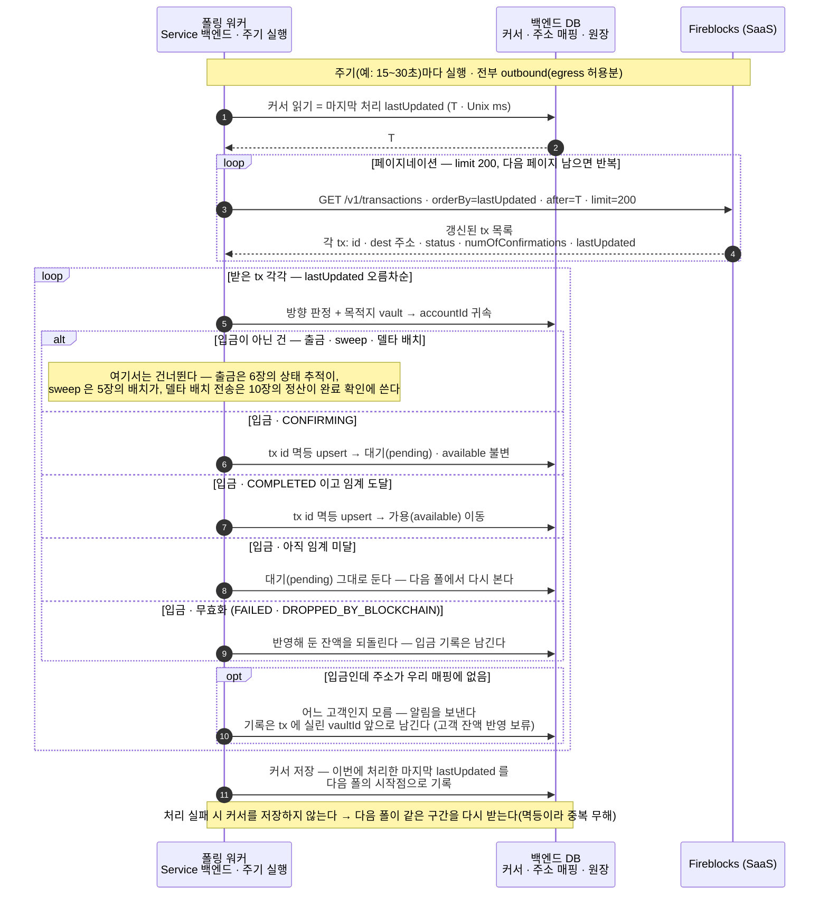
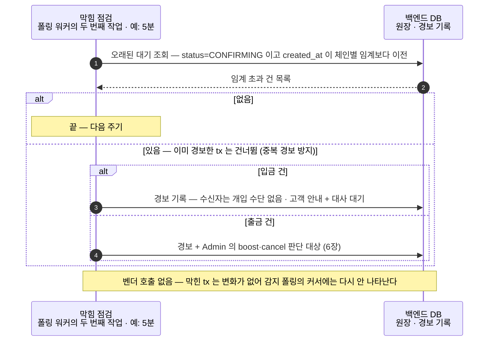

입·출금이 함께 쓰는 공통 기준 — 언제부터 믿는가, 그리고 어떻게 아는가.
폴링 스트림 하나가 워크스페이스의 입·출금 변경을 전부 나르고, 확정 기준(DCCP)이 언제부터 잔액에 반영할지를 정한다.

```kotlin
onChainEvent(handler)
// 어댑터가 폴링으로 채워 handler 에 전달
// ChainEvent { status, numOfConfirmations, networkStatus }
```

**폴링 스트림 하나**가 워크스페이스의 입·출금 변경을 전부 나릅니다. 이 페이지는 그 스트림과 확정 기준(언제부터 믿는가)을 정의하고, **입금(5장)·출금(6장)이 이것을 소비**합니다.

사용법은 **"등록은 한 번, 호출은 어댑터가"**입니다 — 부팅 시 handler 를 등록해 두면, 어댑터의 폴링 루프(아래 절)가 이벤트마다 불러줍니다.

```kotlin
// Service 백엔드 부팅 시 1회 — handler 등록
manager.onChainEvent { event ->
    when {
        // ① 우리가 낸 건 — 외부 출금(6장) · sweep(5장) · 델타 배치(10장)
        //    이 판별이 먼저다: sweep 의 옴니버스 수신이 입금으로 오인되지 않게
        submitted.contains(event.txRef) -> submittedTracker.apply(event)   // TxRef 로 대조해 상태 갱신

        // ② 고객 입금 — 목적지가 고객 입금 주소 매핑에 있는 수신
        depositAddresses.contains(event.to) -> depositLedger.apply(event)  // 대기→가용 (5장)

        // ③ 그 외 — 매핑 없는 수신
        else -> alert(event)   // 알림 (아래 절)
    }
}
// handler 는 멱등이어야 한다 — 같은 이벤트가 두 번 올 수 있다 (겹쳐 받기·재시도)
// handler 가 실패하면 커서가 저장되지 않아 다음 폴에 같은 이벤트가 다시 온다 (at-least-once)
```

## 폴링 상세 흐름 — 커서 하나로 입·출금을 다 나른다

루프가 방향을 갈라 **입금은 원장 반영(5장), 출금은 상태 추적(6장)**으로 넘깁니다. 상태 필터는 대사·표적 조회(8장)에서 씁니다.



| 빠뜨리면 사고 나는 지점 | 어떻게 |
|---|---|
| **커서** | 마지막으로 처리한 tx 의 `lastUpdated`(Unix ms)를 DB 에 영속. 주기마다 `after=커서`로만 받아 재조회량을 놓친 만큼으로 한정. |
| **필터 없이 훑기** | 서버측 status 필터는 한 번에 한 상태만 걸린다 — **모든 상태 전이를 빠짐없이 받으려면 필터 없이 커서로** 훑고, 받은 tx 를 이쪽에서 분류한다. |
| **빠짐 방지** | 커서는 **처리 성공 후에만 저장** + 경계를 **살짝 겹쳐 받기**(after 를 조금 이전으로). 겹침은 멱등 upsert 가 흡수. |
| **페이지네이션** | `limit`(기본 200)이 가득 차면 다음 페이지 계속 — 한 주기에 밀린 분을 다 소진. |
| **멱등** | tx id(또는 externalTxId) unique. 같은 tx 를 여러 번 받아도 상태 전이만 반영, 잔액 이중 반영 없음. |
| **reorg** | 확정으로 봤던 입금이 무효화되면 다음 폴에서 잡아 **반영해 둔 잔액만 되돌리고** 입금 기록은 보존 — 신호는 FAILED + subStatus `DROPPED_BY_BLOCKCHAIN` (reorg 는 5장). |
| **감지 지연** | 지연 = **폴링 주기**. 짧게 잡으면 실시간에 근접하고 API 호출이 는다 — 확정 요건과 rate limit 사이에서 정한다. |

webhook 이벤트 중 폴링으로 못 보는 것은 **막힘 경보(stuck_confirming) 하나뿐**이고, 그것도 오래 CONFIRMING 인 건을 골라내는 조회로 대체된다(아래 절). 나머지 이벤트의 payload 는 폴링으로 읽는 tx 객체와 같다. EVM 입금은 **mined 시점부터** 관찰된다.

## 막힘 점검 — 오래 CONFIRMING 인 건 골라내기

webhook 의 막힘 경보(stuck_confirming)를 대체합니다. **별도 배치는 필요 없습니다** — 감지 폴링이 모든 CONFIRMING 을 이미 DB 에 기록해 두므로, 같은 워커의 느슨한 주기(예: 5분) 작업이 **우리 DB 에서 오래된 대기 건을 조회**하면 끝입니다(벤더 호출 없음). 감지 루프 안에서 못 잡는 이유는 하나 — 막힌 tx 는 **변화가 없어서** lastUpdated 커서에 다시 나타나지 않기 때문입니다.



| 결정 | 어떻게 |
|---|---|
| **배치** | 별도 프로세스 불필요 — 같은 폴링 워커의 **두 번째 주기 작업**(감지보다 느슨하게, 예: 5분). |
| **조회** | **우리 DB 쿼리** — `status=CONFIRMING` 이고 기록 시각이 임계보다 이전인 행. 벤더의 `status` 필터 조회는 대사·운영용으로만 남긴다(8장). |
| **막힘 판정** | 체류 시간이 **체인별 임계** 초과. 임계는 평시 confirmation 소요를 감안해 정한다. |
| **입금이 막히면** | 수신자라 개입 수단이 없다 — **경보 + 고객 "확인 중" 안내**가 전부이고, 해소는 체인 혼잡 해소 또는 대사가 잡는다. |
| **출금이 막히면** | Admin 의 **boost(수수료 인상 재전송)·cancel** 판단 대상으로 넘긴다(6장). |
| **같은 건 중복 경보 방지** | 경보한 tx id 를 기록해 두고 다음 주기엔 건너뛴다. 해소(COMPLETED/FAILED 전이)되면 닫는다. |

## 워커 생존 감시 — 죽은 워커는 자기 죽음을 못 알린다

남은 구멍 하나. 위의 어느 장치도 **폴링 워커 자체가 죽은 것**은 못 잡습니다 — 막힘 점검은 "tx 가 막힘"을 보지 "워커가 멈춤"을 보지 않고, 워커 안에서 올리는 경보는 워커가 죽는 순간 같이 멈춥니다. 그래서 생존 감시는 **워커 밖(모니터링 시스템)**이 두 신호를 봅니다.

| 신호 | 무엇을 말하나 | 판정 |
|---|---|---|
| **heartbeat** (매 주기 실행 완료 시각을 DB 에 기록) | 워커가 **살아서 주기를 돌고 있나** | now − heartbeat 가 폴 주기의 몇 배(예: 5분)를 넘으면 **워커 정지 경보**. tx 가 없어도 매 주기 갱신되므로 오경보 없음. |
| **커서 랙** (now − 커서 lastUpdated) | 처리가 **밀리고 있나** | 임계 초과면 **밀림 경보**. 단 커서는 갱신된 tx 가 있어야 앞으로 가므로, 조용한 시간대엔 자연히 커진다 — **heartbeat 와 함께 봐야** 오경보를 거른다. |

복구는 자동이다 — 워커를 재시작하면 **커서부터 따라잡는다**: 멈춘 동안의 변경분이 페이지네이션으로 전부 소진되고, 멱등 upsert 라 겹쳐 받아도 안전하다(위 급소 표). 즉 워커 정지의 피해는 유실이 아니라 **지연**이고, 생존 감시의 몫은 그 지연을 빨리 아는 것이다.

## 감지 경로 — 폴링(주) · 웹훅(보조) · 대사(안전망)

세 수단을 겹쳐 둡니다. 공통 원칙은 **주소를 하나씩 조회하지 않는다**는 점입니다 — 아래는 모두 워크스페이스·시간 범위 기준이라, 주소가 천만 개여도 부하는 **놓친 트랜잭션 수에 비례할 뿐 주소 수와 무관**합니다.

| 수단 | 무엇을 |
|---|---|
| **폴링** (주 경로) | 트랜잭션 목록을 **갱신 시각 커서로 변경분만** 당겨 온다 — 감지의 기본. 루프 상세는 맨 위 절. |
| **웹훅** (보조 · 환경 허용 시) | 인바운드가 열린 환경이면 push 로 지연을 줄인다. 놓친 알림은 `POST /v1/webhooks/{id}/notifications/resend_failed` 로 재전송(v2 는 30일 창). 누락·지연이 있어도 폴링이 메우므로 **신뢰의 근거는 아니다**. |
| **대사** (최종 안전망) | 그래도 어긋나면 주기 대사가 벤더 값과 기록을 맞춰 닫는다(회계 걸리는 숫자만). |

여러 경로가 같은 입금을 중복 전달하므로, 반영은 **tx id(또는 externalTxId) 기준 멱등 upsert** 로 한 번만 건다 — 없는 돈을 두 번 반영하는 것이 가장 비싼 사고다. `status=COMPLETED` 로 거를 땐 `numOfConfirmations` 가 확정 임계 이상인지 함께 본다(위 zero-confirmation 함정). 폴링만으로도 완결되며, 감지 지연은 **폴링 주기**만큼이다.

## 확정 기준 — confirm 과 finality, 그리고 DCCP

> **이 문서가 붙잡는 구분 — confirm(체인 등장) vs finality(확정)**
>
> 트랜잭션 하나의 상태는 Fireblocks 안에서 **BROADCASTING → CONFIRMING → COMPLETED** 순으로 흐른다. 이 중 직접 잔액을 움직일 때 붙잡아야 할 두 지점이 **CONFIRMING** 과 **COMPLETED** 다.
>
> **CONFIRMING = confirm 상태.** 트랜잭션이 체인에 올라가 블록에 담겼고, 그 위로 confirmation 이 쌓이는 중이다 — 하지만 **아직 확정 아님**. 이 단계의 자금은 고객에게 "확인 중"으로만 보여주고 available 잔액에는 넣지 않는다.
>
> **COMPLETED = finality 상태.** confirmation 이 **DCCP(확정 정책)가 정한 임계 수**에 도달했다는 뜻이고, 이때부터 이 자금을 **확정(finality)**으로 보고 available 에 반영한다. 둘을 프로그램으로 가르는 방법은 두 가지다 — `status` 값(CONFIRMING 인지 COMPLETED 인지)으로 갈리거나, tx 객체의 `numOfConfirmations`(실제 누적 confirmation 수)를 finality 임계값과 비교한다.

### DCCP — 무엇이 CONFIRMING 을 COMPLETED 로 바꾸는가

CONFIRMING 에서 COMPLETED 로 넘어가는 **임계 confirmation 수를 정하는 정책**이 **DCCP(Deposit Control and Confirmation Policy)** 입니다. "finality"는 체인이 자연히 주는 성질이 아니라 DCCP 가 정의하는 확정 기준입니다. 커스텀 DCCP 는 **Console 에서 직접 설정하는 게 아니라**, 정책 템플릿을 작성해 **Fireblocks Support 에 제출 → 검토·승인 후 반영**됩니다. 어떤 임계를 요청할지 정하는 책임은 **Admin(운영)**, 이벤트를 받아 잔액에 반영하는 런타임은 **Service** 의 몫입니다.

> **DCCP 임계값 — 기본값과 커스텀**
>
> Fireblocks 의 DCCP 기본 임계 confirmation 수는 체인마다 다르다.
>
> - **대부분의 체인 = 1** — 블록 하나면 확정으로 본다.
> - **ETC(이더리움 클래식) = 372** — 과거 reorg 리스크가 커 임계가 매우 높다.
> - **finality 속성을 가진 체인** — 체인별로 고정(rigid)된 값을 쓴다.
> - **컨트랙트 호출(contract call) = 최소 3 권장** — 단순 전송보다 보수적으로.
>
> 이 값은 **커스텀 DCCP** 로 조정할 수 있는데, 직접 설정이 아니라 **템플릿 작성 → Fireblocks Support 제출 → 검토·승인 후 반영**이다. EVM 대상(이더리움·Base)에서 어떤 임계를 요청할지는 자산·리스크 정책에 따라 Admin 이 정하고, Service 는 그 결과로 도착한 COMPLETED 만 신뢰하면 된다.

> **함정 — 첫 COMPLETED 를 곧 finality 로 단정하지 말 것 (zero-confirmation)**
>
> Deposit Policy 를 **zero-confirmation** 으로 두면, COMPLETED 가 **블록에 등장하는 시점에 먼저** 뜰 수 있고 이후 폴마다 관찰값(등장 + 1차 confirm + 추가 confirm)이 계속 갱신될 수 있다. 즉 이 설정에서는 "COMPLETED 를 처음 관찰했다"가 곧 "충분한 confirmation 이 쌓였다"를 뜻하지 않는다. 그래서 잔액 반영 판정은 status 만 보지 말고 **`numOfConfirmations` 를 finality 임계값과 직접 비교**하는 편이 안전하다. 어떤 임계를 finality 로 볼지는 위 DCCP 와 한 몸이다.

이 기준을 소비하는 쪽 — 입금의 잔액 반영·동결·reorg 는 5. 입금, 출금의 상태 추적·boost·cancel 은 6. 출금, 잔액 세 칸과의 맞물림은 8. 잔액과 내역 조회.

---
출처: [wallet-design-walkthrough/04-detect-confirm.html](https://wiki-docs.pages.dev/wallet-design-walkthrough/04-detect-confirm.html)
