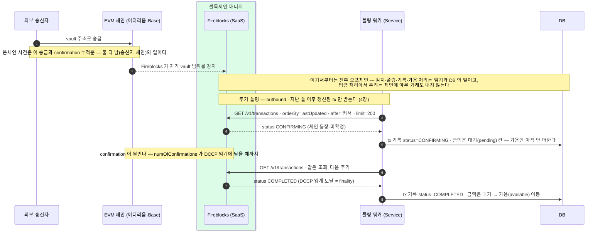
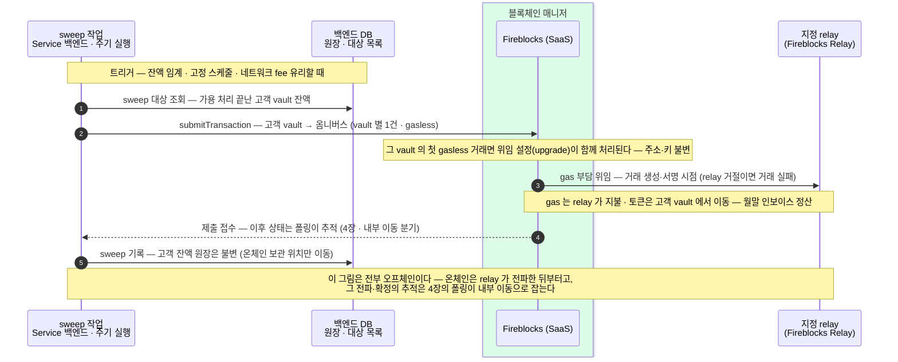

폴링이 실어 온 입금이 대기를 거쳐 가용이 되고, 고객 vault 에서 옴니버스로 모이기까지를 다룬다.
감지·판정 기준은 4장을 그대로 쓴다. 입금이 지나는 상태 넷, reorg 예외, 스위핑과 원장 반영 순서를 정리한다.

## 입금 한 건이 흐르는 길 — 폴링으로 감지, 확정까지

## 입금에서 보는 상태·하위 상태

Fireblocks 트랜잭션 상태는 전부 17가지지만 대부분은 출금 쪽 단계(제출·승인·서명·전파)이고 — 그쪽은 6페이지의 "상태 한 장" 표가 맡습니다 — **입금이 실제로 지나는 것은 아래 넷**입니다.

| status | 뜻 | 고객 잔액에는 |
|---|---|---|
| `CONFIRMING` | 체인 등장, confirmation 누적 중 | 대기(pending)로 잡힌다 |
| `COMPLETED` | DCCP 임계 도달 = finality (final). zero-confirmation 설정이면 여러 번 관찰될 수 있음(4장 함정) | 임계 확인 후 가용(available)에 더해진다 |
| `REJECTED` | AML 거절 또는 동결 — **입금은 Admin 이 unfreeze 할 때까지 자산 잠금** | 반영하지 않는다 — Admin unfreeze 대기 |
| `FAILED` | 영구 실패 (final) | 반영하지 않는다 |

각 status 는 `subStatus` 로 사유가 세분됩니다 — 폴링 워커가 분기하는 `status`·`numOfConfirmations` 에 사유를 더해주는 필드입니다. 입금 관련은 아래가 전부이고, 특히 **REJECTED 의 동결 3종은 Admin 의 unfreeze 운영**이 걸립니다.

| 상위 | subStatus | 뜻 |
|---|---|---|
| CONFIRMING | `PENDING_BLOCKCHAIN_CONFIRMATIONS` | confirmation 대기 중 |
| COMPLETED | `CONFIRMED` | 필요한 confirmation 도달 |
| REJECTED | `AUTO_FREEZE` | 스크리닝 정책이 자동 동결 — Admin unfreeze 까지 잠금 |
| REJECTED | `FROZEN_MANUALLY` | Console/API 사용자가 수동 동결 — 동일 |
| REJECTED | `REJECTED_AML_SCREENING` | AML 고위험 판정 — 동일 |
| FAILED | `DROPPED_BY_BLOCKCHAIN` | 블록에 실렸다가 떨어짐(깊은 reorg 등) — 반영해 둔 잔액을 되돌린다(아래 절) |

전체 subStatus(실패 사유 수십 종)는 출금·운영 영역이라 벤더 레퍼런스의 몫이고, 여기엔 입금에서 관찰되는 것만 실었다.

## 예외 — reorg 로 믿었던 입금이 뒤집히면

여기까지가 확정으로 가는 정상 경로였고, 예외가 하나 남습니다. 이더리움·Base 는 체인 끝이 드물게 교체(reorg)될 수 있습니다. **1차 방어는 4장의 DCCP 임계 그 자체입니다** — 임계만큼 confirmation 이 쌓인 뒤에만 가용 처리하므로, 그보다 얕은 reorg 는 잔액에 닿지 못합니다. 임계보다 깊은 reorg(극히 드묾)로 거래가 블록에서 떨어지면 Fireblocks 는 즉시 **FAILED(또는 취소·만료) + subStatus `DROPPED_BY_BLOCKCHAIN`** 으로 표시합니다 — BROADCASTING 으로 되돌아가지 않습니다(Fireblocks Support 확인). 이 신호를 받으면 **반영해 둔 잔액만 되돌리고 입금 기록은 보존**합니다. 잠깐 빠졌다 재편입되는 얕은 reorg 는 CONFIRMING 에 머물며 confirmation 수만 다시 셉니다. 최종 안전망은 여전히 **주기 대사**입니다.

## 입금 다음 — 고객 vault 에서 옴니버스로 (sweep)

고객별 vault 는 **입금 식별용**입니다 — EVM 은 vault·자산당 주소가 하나뿐이라(2장), 고객마다 vault 를 만들어야 "누가 보냈나"가 주소로 갈립니다. 하지만 **자산을 거기 두지 않습니다** — 가용 처리가 끝난 자산은 주기적으로 **옴니버스 vault 로 모읍니다(sweep)**. 고객별 잔액은 백엔드 DB 원장이 관리하므로, 온체인 보관은 집약할수록 키·운영 관리가 단순해집니다. 10장의 "온체인 지갑은 둘뿐" 모델이 이 sweep 을 전제로 합니다.

| vault | 역할 |
|---|---|
| **고객별 vault** (intermediate) | 1·2장에서 만든 고객당 vault — 입금 식별·수신 전용, 보관처 아님. |
| **옴니버스 vault** (omnibus deposits) | sweep 으로 모인 중앙 보관처 — 10장의 "고객 자산 지갑"이 이것. |
| **출금 풀** (withdrawal pool) | 출금 전용 vault — EVM 은 vault 당 nonce 가 직렬이라 **복수 vault round-robin** 으로 병렬화(6장 출금이 여기서 나간다). |

세 역할 분류는 Fireblocks 공식 omnibus 구조 그대로다(intermediate / omnibus deposits / withdrawal pool).

이 한 건에서 누가 무엇을 하는지 역할로 나누면:

| 역할 | 하는 일 |
|---|---|
| **고객 (최종 사용자)** | **등장하지 않는다** — sweep 은 고객 요청 없이 도는 내부 운영이고, 고객 잔액은 DB 원장에 그대로다. 고객은 이 vault 의 키도, 존재도 모른다. |
| **Service 백엔드** | 대상 조회 → 제출 → 기록. 주기 실행이라 사람 개입이 없다. |
| **고객별 vault (EOA)** | 토큰이 빠져나가는 발신 계정. **키는 수탁자 몫**(MPC — 벤더 share + co-signer share)이다. 첫 gasless 거래면 이 vault 의 위임 설정(upgrade)이 함께 처리된다. |
| **지정 relay** | 바깥 거래의 발신자 — 제출하고 gas 를 낸다(월말 인보이스). 내용은 위조하지 못한다 — vault 서명의 검증은 위임된 지갑 코드가 온체인에서 한다. |

서명이 두 겹이다 — vault 몫의 승인 서명(안쪽)과 relay 의 바깥 거래 서명. 이 구조는 출금(6장)과 같고, 메커니즘 상세는 가스 대납 문서 9장.

| 결정 | 내용 |
|---|---|
| **트리거** | 잔액 임계 · 고정 스케줄 · 네트워크 fee 가 유리할 때 — sweep 은 시간에 급하지 않아 **낮은 fee 로 보낼 수 있다**. |
| **gas** | **Universal Gasless 로 대납** — 고객 vault 에 ETH 를 배포하지 않는다. 상세는 가스 대납 문서. |
| **서명 자동화** | API Co-Signer — 주기 실행이라 사람 개입 없이 서명까지 자동. |
| **고객 잔액** | **불변** — 고객별 잔액은 DB 원장 몫이고, sweep 은 온체인 보관 위치만 옮긴다(회계 이벤트 아님). |
| **관찰·실패** | sweep tx 는 폴링에 **내부 이동**으로 잡혀 같은 경로로 상태 추적·막힘 점검·boost 를 탄다(4장). |

감지·판정 기준(폴링 루프·DCCP·막힘 점검)은 4. 감지와 확정, 잔액의 세 칸(available·pending·locked)과의 맞물림은 8. 잔액과 내역 조회, 출금 쪽 상태 전이는 6. 출금 에서 이어집니다.
