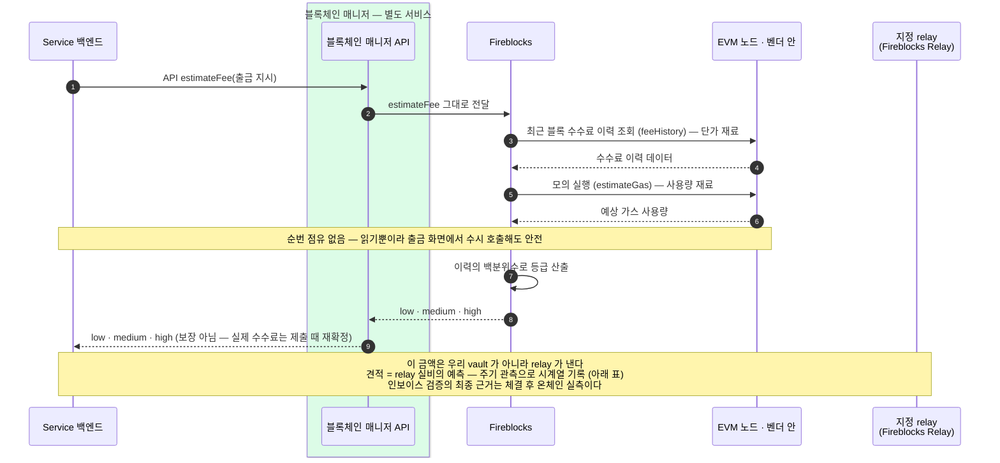

제출 전에 한 번 읽어 보는 매니저 API 오퍼레이션. 대납(Universal Gasless) 구성에서 이 값은 "우리가 낼 돈"이 아니라 "relay 가 낼 실비"의 예측이다.
언제 부르는지(주기 관측 · sweep 타이밍 · 고객 화면)와 무엇으로 검증하는지(온체인 실측)를 정리한다.

```
estimateFee(출금 지시) → FeeEstimate { low, medium, high }
```

## estimateFee — 단가 × 사용량을 계산하고, 그 돈은 relay 가 낸다



## 언제 부르고, 무엇으로 검증하나

gas 는 지정 relay 가 내고, Fireblocks Relay 면 **월말 통합 인보이스**(gas 실비 + 구독료)로 정산됩니다. 이 구성에서 estimateFee 가 서는 자리는 셋입니다:

| 부르는 시점 | 하는 일 |
|---|---|
| **주기 관측** — 예: 매니저 내부 폴링과 같은 주기 | 견적을 **시계열로 기록**한다. 우리 거래는 스테이블코인 전송으로 균질해서 견적이 건이 아니라 **시간의 함수**다 — 건마다 부르면 같은 시세를 중복 기록할 뿐이다. 제출 건에는 **제출 시각으로 그때 시세를 대응**시키고, 시세가 비정상적으로 튀는 시간대의 감지도 이 시계열 대비로 한다. |
| **sweep 타이밍 판단** | sweep 은 시간 민감도가 낮아 **fee 가 유리할 때 모아 보낼 수 있다** — 견적이 그 판단의 입력이다. relay 가 내는 돈도 결국 인보이스로 돌아오므로, 싼 때 보내는 것이 그대로 우리 절감이다. |
| **고객 화면** (선택) | 고객에게 보여주는 수수료는 회계 층이 선계산해 고정한 값이라 실시간 견적 표시는 필수가 아니다 — 과금 산정의 참고 재료로만 쓴다. 정산·회계는 정산 워크스루. |

**검증은 실측으로 합니다.** 거래가 체결되면 relay 가 실제로 낸 금액은 체인에 정확히 남습니다 — 사용량(gasUsed) × 체결 단가를 receipt 에서 계산할 수 있습니다. 월말 인보이스의 gas 실비는 이 **온체인 실측의 합계**와 맞추고, 견적 시계열은 예측 대비 실측의 편차를 추적하는 보조 자료입니다. 견적으로 인보이스를 검증하면 추정 대 추정이라 오차 시비가 남습니다.

대납의 선택지·도입 요건·메커니즘(EIP-7702)은 가스 대납 문서, 조립 시 수수료 설정과 인상 재전송은 가이드 4장을 참고하세요.
