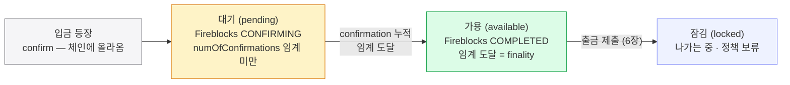
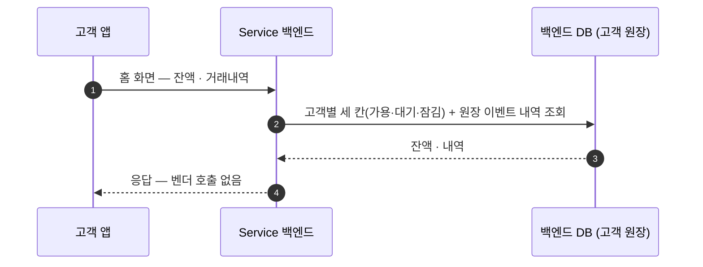
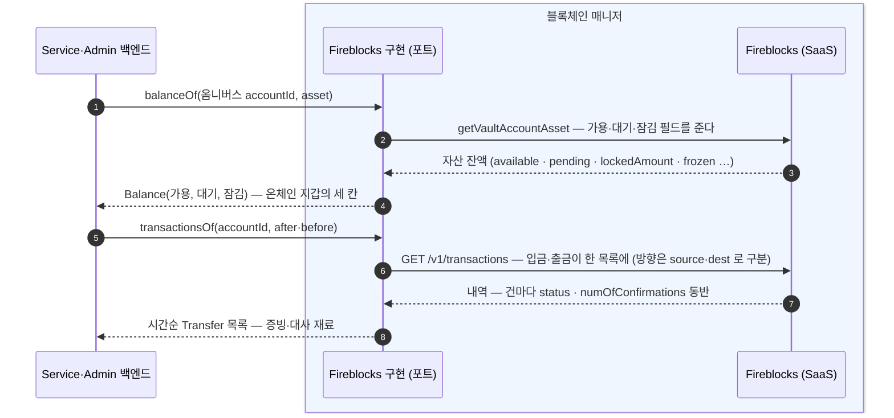
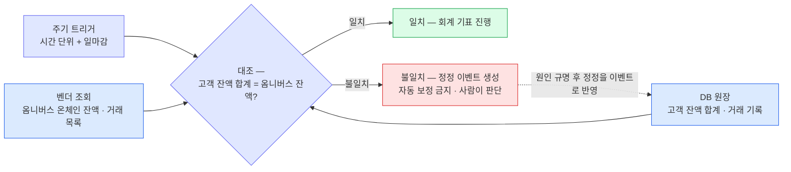

고객 화면의 두 숫자 — 고객별 진실(잔액·귀속)은 DB 원장에, 온체인 사건의 진실은 벤더 기록에 있다.
가용·대기·잠김 세 칸을 가르는 confirm과 finality, 고객 화면·벤더 조회의 역할 분담, 두 장부를 맞추는 대사 절차를 확정한다.

**가용**(available — 출금에 쓸 수 있는 돈), **대기**(pending — 들어왔지만 아직 확정 전), **잠김**(locked — 나가는 중이거나 정책상 묶인 돈).

```
// 온체인 지갑(옴니버스 · sweep 전 고객 vault) 조회 — 운영·대사용
balanceOf(accountId, asset) → Balance { available, pending, locked }
// 온체인 내역 — 증빙·대사·운영용. 고객 화면 내역은 DB 기록에서 나온다
transactionsOf(accountId, after, before, status?) → List<Transfer>
// status? — 상태로 걸러 받기 (한 번에 한 상태 · 아래 절)
//   예: COMPLETED = 대사 · CONFIRMING = 막힌 출금 점검
```

after·before 는 벤더 거래 목록 API(`GET /v1/transactions`)의 시간 필터 그대로다 — **Unix 밀리초 타임스탬프**로, 4장 폴링 커서와 같은 형식이다. 미지정 시 기본 조회 창은 최근 90일이다.

## 세 칸을 가르는 선 — confirm 과 finality

대기와 가용을 나누는 것은 **확정**입니다 — 체인 **등장(confirm)**이 아니라 임계 **도달(finality)**에서 가용이 되고(4장), 그 근거는 벤더가 확정 정책(DCCP)대로 계산해 주는 상태·confirmation 카운트입니다.



세 칸을 가르는 건 **confirm(체인 등장) → finality(임계 도달)** 전이 하나다. "곧 들어올 입금"은 대기 칸에 머물다가, 확정 정책 임계에 도달해 finality 가 나면 가용으로 옮겨간다. Fireblocks 상태로는 **CONFIRMING**(대기) 에서 **COMPLETED**(가용) 로의 전이이고, 그 경계 판단은 **numOfConfirmations** 가 확정 정책 임계를 넘었는지로 한다. 출금을 제출하면 그만큼이 가용에서 **잠김**으로 빠진다.

온체인 지갑(옴니버스·재고 풀 등)을 조회할 때는 `getVaultAccountAsset` 응답 필드를 세 칸으로 접습니다:

| 업무 타입 | Fireblocks 필드 | 뜻 |
|---|---|---|
| **가용** (available) | `available` | 확정되어 지금 출금에 쓸 수 있는 잔액 (= 블록체인 잔액 − 잠김분) |
| **대기** (pending) | `pending` | 들어오는 중이지만 아직 확정 전 — 확정 임계에 도달하면 가용으로 옮겨간다 |
| **잠김** (locked) | `lockedAmount` + `frozen` | 나가는 중(전파 전 출금)이거나 정책상 묶인(AML freeze) 돈 |

Fireblocks 응답 필드는 `available` / `pending` / `frozen`(AML freeze) / `lockedAmount`(전파 전 출금) / `staked`(일부 체인 전용) 등이다. 이 중 **가용·대기·잠김** 세 칸만 업무 타입으로 노출하고, 잠김은 `lockedAmount` 와 `frozen` 을 합쳐 본다. EVM(이더리움·Base)에는 staking 칸이 없어 세 칸으로 충분하다.

## 고객 화면의 경로 — DB 로 끝난다



## 벤더 조회의 경로 — 운영·대사·증빙



벤더 조회는 온체인 지갑의 잔액(1~4)과 온체인 내역(5~8)을 나른다. 벤더가 입·출금을 다 기록하므로 온체인 사건의 수집은 이 한 곳이면 된다 — 단 **고객별 귀속은 DB 몫**이다. 포트 구현이 하는 일은 벤더 필드를 세 칸으로 **접는 것**과 벤더 상태(CONFIRMING/COMPLETED)를 5·6페이지의 공통 어휘로 **번역하는 것**뿐이다.

## 상태로 걸러 조회 (운영·대사 경로)

| 언제 | 무엇을 | 조회 형태 |
|---|---|---|
| **대사** (실행은 Service 배치) | 확정분만 받아 기록과 대조 — 회계 기표 전(아래 절) | `status=COMPLETED` + 기간 |
| **막힌 출금 점검** (Admin) | 오래 CONFIRMING 인 건을 골라 boost·cancel 판단(6장) — DB 쿼리(4장)와 병행하는 벤더측 교차 확인 | `status=CONFIRMING` + 오래된 것 |

## 대사 — 두 장부를 주기적으로 맞춘다

잔액·내역의 숫자는 결국 **두 장부**에서 나옵니다. 하나는 기록(DB), 다른 하나는 바깥의 진실인 **Fireblocks 의 값**입니다. 벤더 조회가 아무리 정확해도 폴링 누락·지연·이쪽 반영 버그는 생기게 마련이라, 회계가 걸리는 숫자는 **주기적으로 둘을 직접 대조**합니다.

|  | 대사 |
|---|---|
| **무엇을** | ① **DB 원장의 고객 잔액 합계 vs 옴니버스 온체인 잔액** — 옴니버스 모델의 대사 공식 ② 거래 기록 vs 벤더 거래 목록 (표본은 온체인 탐색기로 교차 확인) |
| **언제** | 주기(예: 시간 단위) + 일마감 — 회계 기표 전 필수 |
| **누가** | **실행(주기 대조 배치)은 Service** — 폴링·sweep 과 같은 자리의 워커. **불일치의 판단·정정 승인과 감사·기표 확인은 Admin**. |
| **어긋나면** | **자동 보정 금지** — 정정 이벤트를 만들어 사람이 본다 (없는 돈을 만들거나 지우는 코드가 가장 위험) |



대사 한 사이클. 옴니버스 모델의 공식은 **"DB 원장의 고객 잔액 합계 = 옴니버스 온체인 잔액"**이다 — 두 장부가 서로 독립적으로 쌓이므로(하나는 폴링 반영, 하나는 체인), 일치가 곧 폴링·반영 경로 전체의 건강 증명이 된다. 불일치면 자동으로 고치지 않는다 — 정정도 반드시 이벤트로 남겨 사람이 판단한다.

더 깊이: 확정 정책(DCCP)과 confirmation lifecycle · 잔액 필드 계약은 컴포넌트 가이드의 추상화 편 참고 (본 워크스루는 가이드 없이 읽힙니다).
