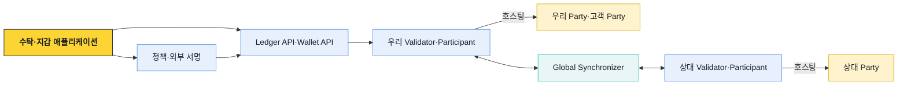
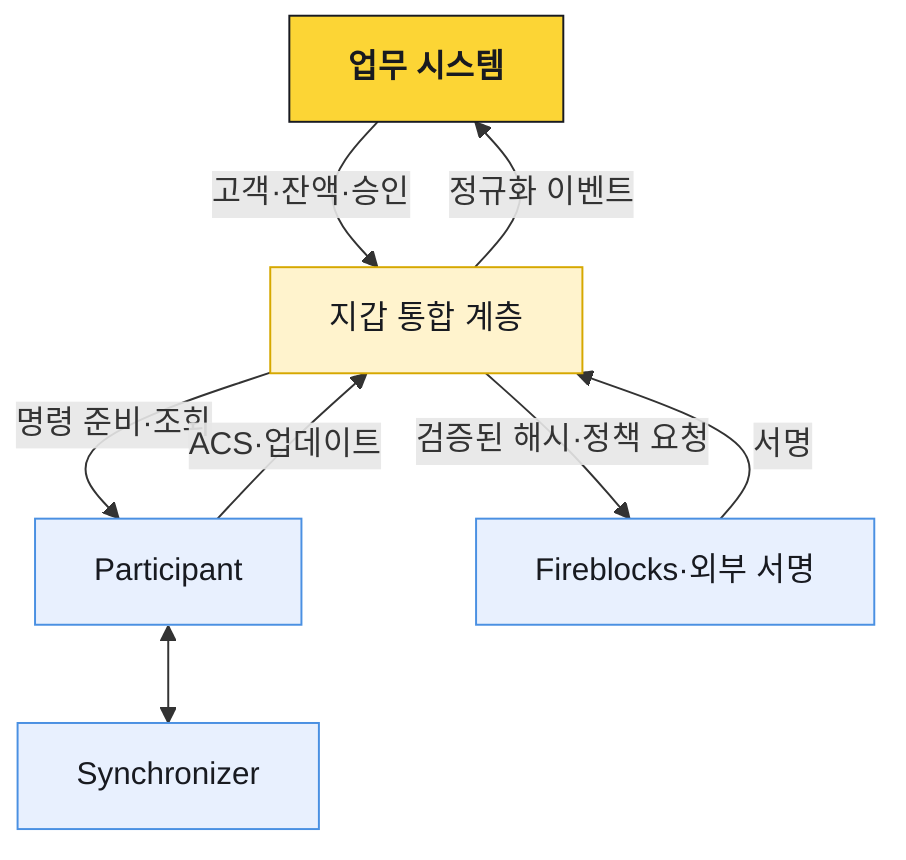

# Canton Network 업무 구조

Canton은 모든 참여자가 같은 거래 원문을 복제하는 네트워크가 아니다. Daml 계약이 정한 당사자에게 필요한 트랜잭션 뷰만 전달하고, 관련 Participant들이 그 뷰를 검증해 하나의 결과로 확정한다. 수탁 시스템은 이 차이 때문에 주소·잔액·블록 탐색기 중심의 퍼블릭 체인 모델을 그대로 적용할 수 없다.

## 전체 구조

`Validator`는 Canton Network에 참여하기 위한 배포·운영 역할을 가리키고, 그 안의 `Participant`는 Party를 호스팅하며 Daml 원장을 저장·검증하는 핵심 노드다. 공식 설명처럼 Participant는 자신이 호스팅하는 Party에 관련된 계약 데이터만 보유한다. Synchronizer는 암호화된 메시지 순서와 원자적 커밋을 조정하며 업무 데이터 전체를 공개 원장처럼 저장하는 주체가 아니다.

## 핵심 용어

| 용어 | 의미 | 구현에서 구분할 것 |
|---|---|---|
| Party | 원장 위에서 권리와 의무를 갖는 신원 | 로그인 사용자·계정·주소와 같지 않음 |
| Participant | Party를 호스팅하고 관련 계약을 실행·저장·검증하는 노드 | Synchronizer와 다름 |
| Validator | Participant와 Canton Network 연동 서비스를 포함한 운영 묶음 | 프로토콜의 단일 노드 타입으로만 보지 않음 |
| Synchronizer | 암호화 메시지의 순서와 확인을 조정하는 계층 | 모든 계약 원문을 보관하지 않음 |
| Contract | Daml template로 만든 불변 원장 객체 | 변경 대신 소비와 새 생성으로 상태 전이 |
| ACS | 현재 활성 상태인 계약들의 집합 | 업무 DB 잔액과 계속 대사할 원장 정본 |
| Holding | 토큰 보유분을 나타내는 활성 계약 | 주소의 단일 잔액이 아니라 여러 조각일 수 있음 |

## 퍼블릭 체인 가정과의 차이

| 질문 | 일반적인 EVM 모델 | Canton 모델 |
|---|---|---|
| 누가 거래를 보는가 | 전체 노드가 거래·상태를 복제 | Daml 권한상 관련된 Party의 Participant만 해당 뷰를 수신 |
| 현재 상태는 무엇인가 | 계정·스토리지의 가변 값 | 활성 계약의 집합 |
| 잔액은 무엇인가 | 주소의 숫자 | Party가 소유한 Holding들의 합 |
| 상태를 어떻게 바꾸는가 | 스토리지 갱신 | 계약 행사·소비와 새 계약 생성 |
| 거래를 어디서 조회하는가 | 공개 RPC·블록 탐색기 | Party 권한을 적용한 ACS·업데이트 스트림 |
| 서명자는 무엇을 확인하는가 | 체인별 직렬화 payload | 준비된 Daml 트랜잭션의 전체 원장 효과 |

## 문서 구성

| 문서 | 다루는 범위 |
|---|---|
| [프라이버시와 원장 모델](./01-privacy-and-ledger-model.md) | Daml 계약, signatory·observer·controller, 트랜잭션 뷰, ACS |
| [Party와 노드](./02-party-participant-synchronizer.md) | Party 호스팅, Participant·Validator·Synchronizer 책임, 외부 Party |
| [토큰과 전송](./03-token-and-transfer-flow.md) | Holding, TransferInstruction, 수락·거절·철회, 확정과 traffic |
| [수탁 연동과 운영](./04-custody-integration-and-operations.md) | 고객 매핑, 입금·출금, 서명 검증, 대사, 노드 운영 |

## 시스템 경계

업무 시스템은 고객 주문과 내부 원장의 정본이다. Participant는 Daml 원장 상태의 정본이고, 서명자는 승인된 트랜잭션에 키 권한을 행사한다. 세 계층의 성공을 하나의 상태로 축약하지 않는다. 정책 승인이 끝났어도 Daml 검증은 실패할 수 있고, 원장 커밋이 끝났어도 내부 계정 귀속과 대사가 끝나지 않았을 수 있다.

## 설계 원칙

- Party, 고객 계정, Participant, API 사용자를 각각 별도 식별자로 관리한다.
- 잔액 숫자뿐 아니라 그 잔액을 구성하는 Holding과 contract ID를 추적한다.
- 원장 이벤트는 중복·재연결·재처리를 전제로 offset과 멱등 키를 둔다.
- 서명 전에 준비된 트랜잭션의 Party·자산·금액·상대·원장 효과를 독립 검증한다.
- Synchronizer 연결 성공을 고객 업무 성공으로 해석하지 않는다.
- DevNet·TestNet에서 관측한 지연과 기능을 MainNet의 보장값으로 사용하지 않는다.
