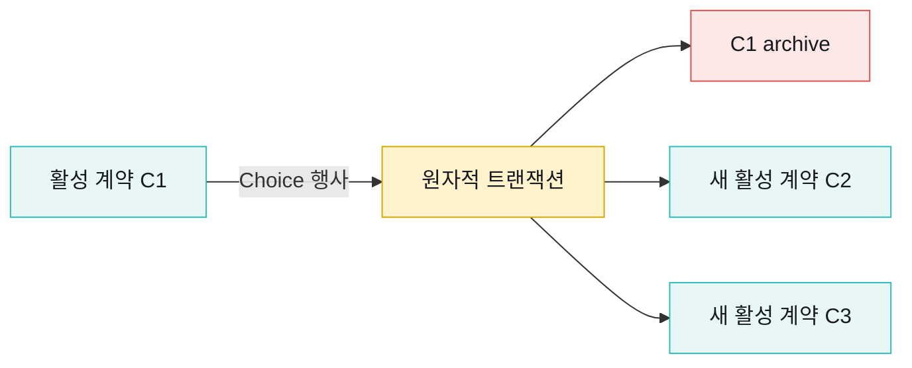
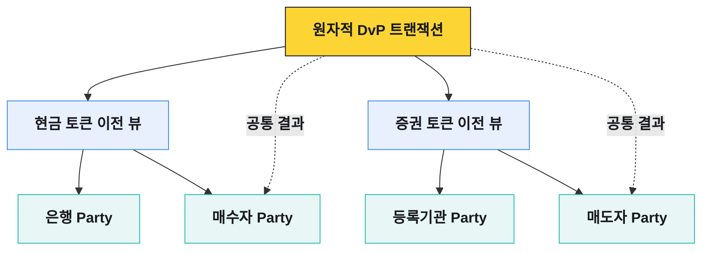

# 프라이버시와 Daml 원장

Canton의 프라이버시는 네트워크 밖에서 데이터를 숨기는 부가기능이 아니다. Daml 계약에 참여자와 권한을 정의하고, 트랜잭션을 필요한 하위 뷰로 나눠 권한 있는 Participant에만 전달하는 실행 모델이다.

## 계약의 권한

| 역할 | 계약을 보는가 | 할 수 있는 일 |
|---|---|---|
| Signatory | 항상 본다 | 계약 생성에 동의하고 계약의 핵심 책임을 진다 |
| Observer | 본다 | 관찰하지만 그 사실만으로 choice 실행 권한을 갖지는 않는다 |
| Controller | 해당 choice와 결과를 본다 | 특정 choice를 행사한다 |
| Stakeholder | 해당 | signatory와 observer를 합친 용어다 |

`본다`와 `행동한다`를 구분해야 한다. 계약을 조회할 수 있는 운영자라고 해서 자산 이전 choice를 실행할 수 있는 것은 아니다. 애플리케이션 RBAC도 이 차이를 보존해야 한다.

## 불변 계약과 상태 전이

Daml 계약은 생성 후 필드를 제자리에서 바꾸지 않는다. choice를 행사하면 기존 계약이 소비되어 archive되고, 필요한 새 계약이 생성된다.

현재 상태는 ACS(Active Contract Set)다. 과거에 존재했지만 소비된 계약은 거래 이력에 남지만 현재 잔액을 구성하지 않는다. 업무 DB는 ACS를 해석하고 고객·상품과 연결하는 계층이지, Participant와 독립된 또 하나의 원장으로 만들지 않는다.

## 트랜잭션 뷰

복합 트랜잭션은 하나의 평면 payload가 아니라 권한이 다른 하위 뷰의 트리다. 각 Participant는 호스팅 Party가 볼 수 있는 뷰만 전달받는다.

원자적 결과를 함께 확정한다고 해서 모든 당사자가 모든 자산 다리의 상세를 아는 것은 아니다. 실제 공개 범위는 template의 signatory·observer, choice controller, 하위 호출과 데이터 의존관계로 결정한다.

## `fetch`와 divulgence

프라이버시는 `observer` 목록만 확인해서 끝나지 않는다. 트랜잭션 안에서 기존 계약을 `fetch`하면 실행 검증에 필요한 당사자에게 계약 내용이 공개될 수 있다. 이 공개를 divulgence라고 부른다.

Daml 리뷰에서는 다음을 확인한다.

- 이 choice의 controller가 입력 계약 전체를 알아야 하는가?
- 검증에 필요한 최소 데이터만 별도 계약이나 인자로 전달할 수 있는가?
- 하위 choice가 상위 트랜잭션의 당사자를 불필요하게 informee로 만드는가?
- 상업적으로 민감한 가격·상대·포지션이 공통 뷰에 들어가 있지 않은가?
- 오류 메시지와 애플리케이션 로그가 원장보다 더 넓게 데이터를 노출하지 않는가?

## Participant가 검증하는 것

관련 Participant는 전달받은 뷰에 대해 다음을 검증한다.

- 제출 Party가 choice를 실행할 권한이 있는가
- 필요한 signatory와 controller의 권한이 충족됐는가
- 입력 계약이 활성 상태이며 중복 소비되지 않았는가
- Daml 패키지와 계약 키, 시간 제약이 유효한가
- 자신이 확인해야 하는 원장 효과가 결정적으로 계산되는가

검증에 참여하지 않는 노드는 트랜잭션 전체를 받아 재실행하지 않는다. 이것이 공개 블록체인의 전역 실행·복제 모델과 가장 큰 차이다.

## 조회 모델

애플리케이션은 Party 권한을 지정해 ACS와 업데이트를 읽는다. 같은 Participant API를 호출해도 조회 Party가 다르면 보이는 계약이 다르다.

| 조회 | 목적 | 주의점 |
|---|---|---|
| ACS snapshot | 시작 시점의 현재 활성 계약 확보 | snapshot을 읽는 동안 발생한 update와 경계를 맞춘다 |
| update stream | 생성·행사·archive를 순서대로 반영 | offset을 영속화하고 재연결 시 이어 읽는다 |
| transaction tree | 업무 결과와 하위 원장 효과 분석 | 호출자에게 허용된 뷰만 보인다는 전제 유지 |
| contract lookup | 특정 contract ID 확인 | archive된 계약과 미가시 계약을 구분한다 |

권장 초기화 흐름은 `snapshot 기준점 확보 → ACS 적재 → 기준점 이후 update 재생 → 실시간 전환`이다. API 재시도 때문에 같은 update를 다시 받아도 업무 잔액이 두 번 바뀌지 않도록 contract ID와 offset 기반 멱등 처리가 필요하다.

## 프라이버시 테스트

기능 성공 시나리오만으로 프라이버시를 검증할 수 없다. 테스트 Party와 Participant를 분리해 관찰 범위를 직접 확인한다.

1. 거래 당사자 A·B와 무관한 C를 서로 다른 Participant에 호스팅한다.
2. A·B가 참여하는 전송과 복합 DvP를 실행한다.
3. C의 ACS·update stream·transaction 조회에서 계약·금액·상대가 보이지 않는지 확인한다.
4. Observer를 추가했을 때 의도한 계약만 보이는지 비교한다.
5. `fetch`와 하위 choice를 추가한 변형 모델에서 공개 범위가 넓어지는지 확인한다.
6. 애플리케이션 로그·메트릭·에러 추적 도구에서도 같은 경계가 지켜지는지 확인한다.

네트워크 프로토콜의 선택적 공개와 우리 애플리케이션의 데이터 최소화는 별개 통제다. 원장에서는 보이지 않는 정보를 통합 DB나 로그가 전체 사용자에게 노출하면 프라이버시 설계는 실패한다.
