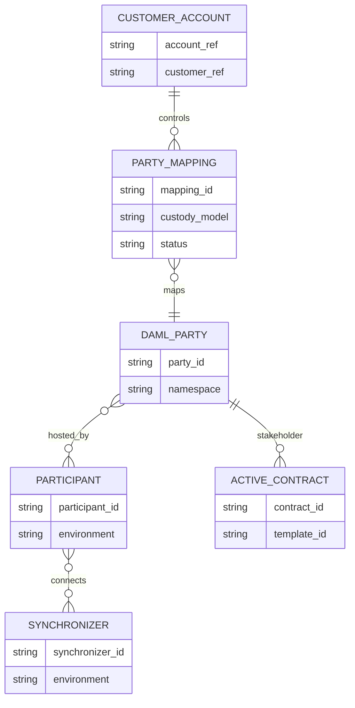
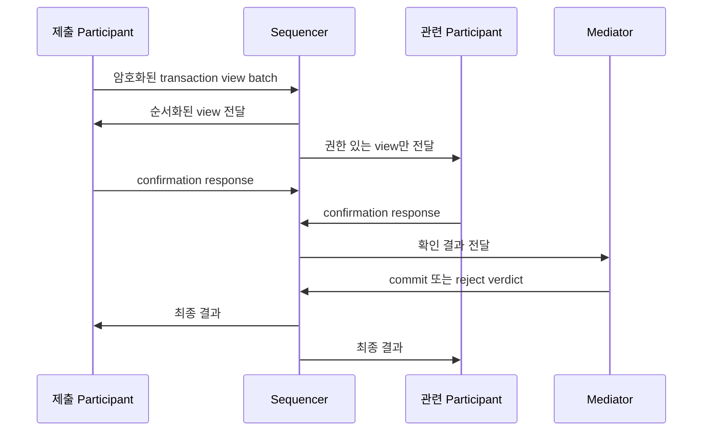
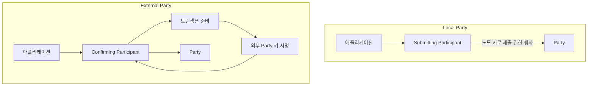

# Party와 노드 책임

Canton에서 Party는 업무 신원이고 Participant는 그 Party의 원장 상태를 보관·검증하는 노드다. 하나의 Party를 여러 Participant가 호스팅할 수 있고, 하나의 Participant도 여러 Party를 호스팅할 수 있다.

## 식별자 관계

고객 이메일이나 내부 계정 번호를 Party ID로 직접 사용하지 않는다. Party ID는 네트워크 신원이고, 내부 식별자는 변경·병합·탈퇴 같은 고객 수명주기를 관리한다. 둘 사이에는 명시적인 매핑과 상태가 필요하다.

## Participant의 책임

[Digital Asset 공식 Participant 설명](https://docs.digitalasset.com/operate/3.4/overview/index.html)에 따르면 Participant는 다음 역할을 한다.

- Daml 명령 해석과 계약 생성·행사 실행
- 호스팅 Party에게 공개된 private contract store 유지
- 권한, 활성 입력, 원장 효과 검증과 확인 응답
- 하나 이상의 Synchronizer 연결과 트랜잭션 라우팅
- gRPC·JSON Ledger API를 통한 명령·조회·update 제공

Participant는 고객 KYC, 내부 원장, 출금 승인 정책까지 대신하지 않는다. 반대로 애플리케이션 DB만으로 contract의 활성 여부나 원장 커밋을 확정하지 않는다.

## Validator라는 운영 묶음

Canton Network 통합 문서에서는 네트워크에 서비스를 제공하려면 Party를 호스팅할 Validator가 필요하다고 설명한다. 배포판의 Validator는 Participant와 네트워크 앱·관리 API 등 운영 구성요소를 묶는 표현이다. 따라서 문서와 장애 대응에서 `Validator`와 `Participant`를 무조건 같은 프로세스 이름으로 쓰지 않는다.

| 관점 | Validator | Participant |
|---|---|---|
| 범위 | 네트워크 참여·앱 연동을 위한 배포·운영 묶음 | Canton 프로토콜의 원장 실행·호스팅 노드 |
| 장애 확인 | 배포 서비스, scan·wallet API, ingress, synchronizer 연결 | Ledger API, DB, ACS, command·update 처리 |
| 데이터 | 구성에 따라 여러 서비스 상태 | 호스팅 Party의 private contract state |
| 운영 선택 | 자체 호스팅 또는 node-as-a-service | Validator 구조 안에서 관리됨 |

## Synchronizer 내부 역할

Synchronizer는 Participant가 보내는 메시지를 직접 업무 로직으로 실행하지 않는다. Sequencer와 Mediator가 순서와 원자적 결과를 조정한다.

Sequencer는 인증된 메시지에 순서와 시각을 부여해 수신자에게 전달한다. payload는 프로토콜 계층에서 암호화되며 Sequencer가 업무 원문 전체를 읽는 구조가 아니다. Mediator는 필요한 확인을 모아 기한 안에 commit 또는 reject 결과를 낸다.

## 호스팅 권한

Party 호스팅은 관찰·확인·제출 권한을 구분할 수 있다.

| 권한 | 할 수 있는 일 | 운영 의미 |
|---|---|---|
| Observing | 관련 상태를 기록하고 읽기 제공 | 조회 복제와 감사에 사용 가능 |
| Confirming | 유효한 트랜잭션의 확인 응답 | threshold 구성으로 복원력·통제 강화 가능 |
| Submitting | Party를 대신해 명령 제출 | 노드가 Party 행동을 시작할 수 있는 강한 신뢰 |

확인 Participant의 threshold를 높이면 하나의 손상 노드가 승인하기 어려워지지만 더 많은 노드가 온라인이어야 한다. 보안과 가용성의 교환관계를 RTO·RPO 및 키 운영 모델과 함께 정한다.

## Local Party와 External Party

Local Party는 제출 권한을 가진 Participant가 Party를 대신해 명령을 제출한다. 자동화가 단순하지만 Party가 호스팅 노드를 강하게 신뢰한다.

External Party는 독립 signing key로 namespace와 제출 권한을 통제하고, Participant는 준비·확인·기록을 담당한다. Participant가 Party를 대신해 일방적으로 제출하지 않으며 외부 키 소유자의 서명이 필요하다. [공식 Local·External Party 설명](https://docs.digitalasset.com/overview/3.4/explanations/canton/external-party.html)은 이 호스팅 관계와 권한 차이를 상세히 구분한다.

수탁사가 Fireblocks 같은 외부 signer를 쓰는 경우에도 external-party 서명 payload의 의미를 독립 검증해야 한다. 키가 Participant 밖에 있다는 사실만으로 악의적이거나 잘못 준비된 트랜잭션을 막을 수는 없다.

## 환경 분리

Canton Network는 DevNet·TestNet·MainNet 환경을 운영하며 업그레이드가 잦다. 공식 통합 안내는 운영자가 세 환경에서 노드를 운영해 새 버전과 앱 통합을 검증하는 방식을 권고한다.

- Party·Participant·Synchronizer ID를 환경과 함께 저장한다.
- 환경 사이에 signing key와 API credential을 재사용하지 않는다.
- Daml package version과 노드 release 호환성을 배포 전에 검증한다.
- DevNet의 빠른 변경을 먼저 받고 TestNet 회귀 후 MainNet으로 승격한다.
- 네트워크 onboarding secret과 허용 IP 같은 일회성 운영값을 장기 설정으로 취급하지 않는다.

## 운영 점검

- [ ] 고객 계정과 Party ID 매핑의 생성·정지·이관 절차가 있다.
- [ ] Party별 호스팅 Participant와 권한·threshold를 조회할 수 있다.
- [ ] Participant DB 백업과 복구 뒤 ACS·offset 정합성을 검증한다.
- [ ] Synchronizer 연결 장애와 Ledger API 장애를 별도로 감지한다.
- [ ] Party를 다른 Participant로 이동·추가 호스팅할 때 키와 topology 승인 절차가 있다.
- [ ] Local·External Party 모델이 상품별 서명 책임과 일치한다.
