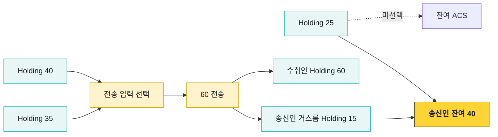
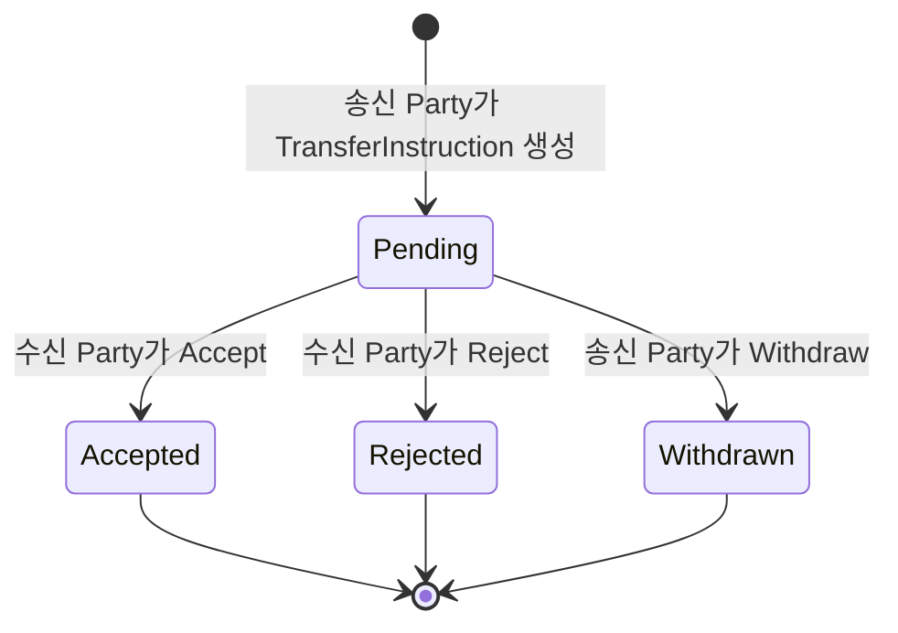
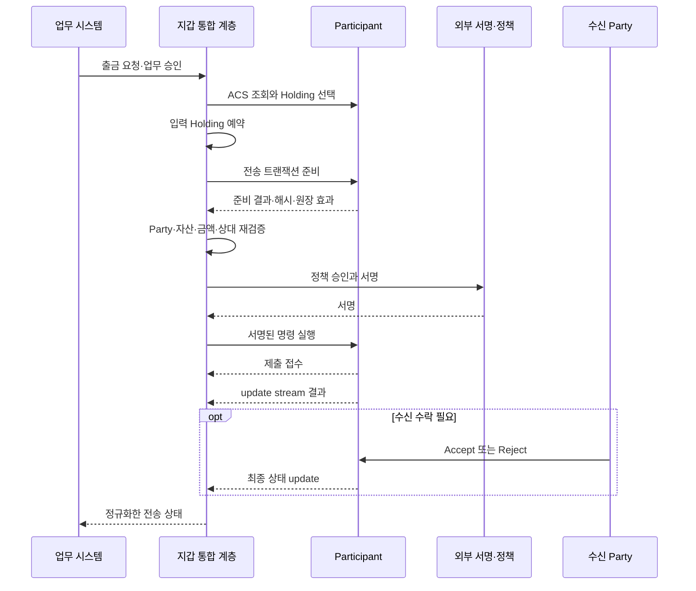

# Holding 기반 자산 흐름

Canton Token Standard의 자산은 주소에 저장된 숫자 하나가 아니다. 활성 `Holding` 계약들이 Party의 보유분을 구성하고, 전송은 필요한 Holding을 입력으로 소비해 수신자와 잔여분의 새 Holding을 만드는 원자적 상태 전이다.

## 잔액 구성

출금 준비기는 단순히 `balance >= amount`만 확인해서는 안 된다. 사용할 contract ID를 선택하고 다른 동시 요청이 같은 Holding을 소비하지 않도록 예약해야 한다. 커밋이 거절되거나 업무가 만료되면 예약을 해제하고 현재 ACS를 다시 확인한다.

## 전송 지시 수명주기

수신자의 사전 승인이 없는 전송은 제안과 수락이 분리될 수 있다.

Pending인 동안 선택된 입력 보유분은 다른 전송에 사용할 수 없다. 수신자가 Accept하면 새 Holding이 생기고, Reject하면 전송은 종료되며, 송신자는 수락 전에 Withdraw할 수 있다. Withdraw는 완료된 전송을 되돌리는 기능이 아니다. 완료 후 반환은 반대 방향의 새 전송이다.

사전 승인(pre-approval)이 설정된 경로는 사용자 상호작용 없이 전송을 완료할 수 있다. 그렇더라도 자산 구현, 수신 Party, 승인 범위와 유효기간을 확인해야 한다.

## 전송 시퀀스

Participant의 동기 응답은 제출 접수 또는 초기 검증 결과일 수 있다. 고객 업무를 완료로 바꾸는 시점은 update stream에서 의도한 계약 생성·소비와 최종 상태를 확인한 뒤다.

## 상태 정규화

우리 시스템은 제품과 Daml template의 원문 상태를 보존하면서 공통 상태로 번역한다.

| 공통 상태 | 원장 상황 | 고객 처리 |
|---|---|---|
| `PREPARING` | Holding 선택·트랜잭션 준비 중 | 출금액 잠금, 제출 전 |
| `SIGNING` | 정책 승인·외부 서명 대기 | 취소 정책에 따라 대기 |
| `SUBMITTED` | Participant가 명령을 접수 | 원장 결과 추적 |
| `PENDING_ACCEPTANCE` | TransferInstruction이 수신 수락 대기 | 고객 완료로 보지 않음 |
| `COMPLETED` | 의도한 새 Holding과 archive 확인 | 내부 원장 확정·대사 |
| `REJECTED` | Daml 검증·Mediator·수신자가 거절 | 예약·잠금 해제, 사유 기록 |
| `WITHDRAWN` | Pending 제안을 송신자가 철회 | 입력 Holding 복원 확인 |

API에서 보이는 `OFFER`, `ACCEPT`, `REJECT`, `WITHDRAW` 같은 이름이 모든 Canton 토큰의 프로토콜 enum이라고 가정하지 않는다. 표준 개념, 특정 token implementation, Fireblocks API의 표현을 구분한다.

## 입금 귀속

하나의 omnibus Party가 여러 고객 입금을 받는 모델에서는 전송 metadata의 memo 같은 식별자가 필요하다. 주소 하나만 발급해 고객을 나누는 퍼블릭 체인 모델과 다르다.

- 고객에게 Party·자산·memo를 하나의 입금 지시로 제시한다.
- memo 누락·오류 입금은 자동 가용 처리하지 않는다.
- TransferInstruction ID, Holding contract ID, Party, 자산, 금액, memo를 대조한다.
- 같은 원장 update를 재처리해도 한 번만 입금되도록 멱등 키를 둔다.
- 수신 Accept가 필요한 자산은 귀속·컴플라이언스 확인 뒤 수락한다.

고객별 Party 모델을 쓰면 memo 의존도를 줄이고 프라이버시 경계를 세밀하게 만들 수 있지만 Party 수명주기와 호스팅 비용이 늘어난다. omnibus 모델은 운영이 단순해 보이지만 귀속 오류와 정보 공개 범위를 별도로 설계해야 한다.

## 확정과 원자성

관련 Participant들은 각자 권한 있는 뷰를 검증하고 Mediator의 verdict로 함께 commit 또는 reject한다. 복합 DvP에서 한 자산 다리만 성공하고 다른 다리만 실패하는 중간 상태를 업무 결과로 만들지 않는 것이 핵심이다.

네트워크 지연을 고정된 블록 confirmation 수로 모델링하지 않는다. Participant 제출, 외부 서명, Sequencer 전달, 확인 응답, Mediator verdict, 수신자 수락이 서로 다른 대기 원인이다. 단계별 timestamp와 timeout을 기록한다.

## Traffic

Synchronizer 메시지는 Participant의 traffic 잔고를 소비한다. 비용은 메시지 크기와 수신 범위의 영향을 받고, 추가 traffic은 네트워크 운영 방식에 따라 미리 구매·충전한다.

| 감시 항목 | 이유 |
|---|---|
| 현재 traffic 잔고 | 부족하면 정상 트랜잭션 제출이 멈출 수 있음 |
| 자동 top-up 결과 | 결제·설정 실패를 조기에 탐지 |
| 업무별 traffic 사용량 | 수신자가 많은 거래와 비정상 증가 분석 |
| 구매 간격·상한 | 급격한 소진과 과도한 자동 구매 통제 |

가격·무료 할당량·파라미터를 애플리케이션 코드에 고정하지 않는다. 환경별 동적 설정과 운영 대시보드에서 관리한다.

## Holding 운영 점검

- [ ] 잔액 계산에 활성 Holding만 포함한다.
- [ ] 출금별 입력 contract ID와 예약 상태를 보관한다.
- [ ] 동시에 같은 Holding을 선택하지 못하도록 DB와 원장 오류를 함께 처리한다.
- [ ] 작은 Holding 조각이 쌓일 때 병합 기준과 비용을 정의한다.
- [ ] Pending 전송의 수락·거절·철회 권한과 만료 정책이 있다.
- [ ] 완료 판단은 동기 API 응답이 아니라 update와 ACS 변화로 확인한다.
- [ ] 반환은 원 거래 취소가 아니라 새 전송으로 감사 연결한다.
