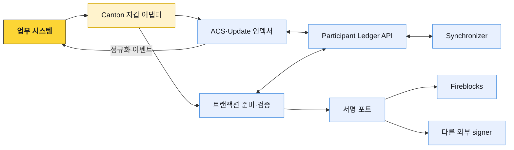
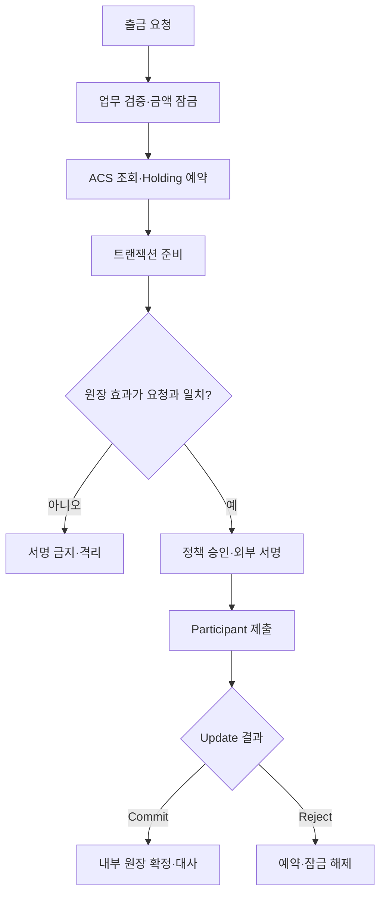

# 수탁 시스템 연동

Canton 연동의 핵심은 API 한 번으로 코인을 보내는 것이 아니다. 고객 계정과 Party를 연결하고, ACS에서 Holding을 선택하며, 준비된 Daml 트랜잭션을 정책과 키 계층에서 검증·서명한 뒤, update stream 결과를 내부 원장에 멱등하게 반영하는 일이다.

## 권장 컴포넌트 경계

블록체인 매니저가 Canton을 지원하더라도 Daml contract와 Party 권한을 체인 공통 DTO로 억지로 축약하지 않는다. 공통 계층에는 고객 업무에 필요한 transfer reference와 상태만 노출하고, Canton 어댑터가 contract ID·template ID·Party·offset을 보존한다.

## 고객과 Party 매핑

상품별로 다음 모델 중 하나를 명시한다.

| 모델 | 장점 | 비용·위험 |
|---|---|---|
| 고객 계정당 Party | 귀속과 프라이버시 경계가 명확 | Party 생성·호스팅·키 수명주기 증가 |
| 고객 지갑당 Party | 상품·지갑 분리가 쉬움 | 한 고객의 Party 수가 늘고 통합 조회 필요 |
| omnibus Party + memo | 노드·Party 운영이 단순 | memo 오류, 내부 귀속, 공동 가시성 통제가 중요 |

기본 원칙은 안정적인 Party를 재사용하는 것이다. 입금마다 임시 Party를 만들지 않는다. Party를 폐기·이관해도 과거 contract와 감사 기록이 어느 고객에게 속했는지 추적할 수 있어야 한다.

## 출금 처리

1. 업무 시스템이 고객 상태, 가용 잔액, 목적 Party, 컴플라이언스를 확인하고 금액을 잠근다.
2. 지갑 어댑터가 최신 ACS 기준으로 필요한 Holding을 선택·예약한다.
3. Participant 또는 Wallet SDK에 전송 트랜잭션 준비를 요청한다.
4. 준비 결과의 Party, 자산, 금액, 상대, synchronizer, 시간 제약, 생성·소비 계약을 재계산·검증한다.
5. 승인된 업무 요청 해시와 준비 결과를 연결해 정책 계층과 signer에 보낸다.
6. 서명된 트랜잭션을 Participant에 제출한다.
7. update stream에서 commit·reject와 TransferInstruction 후속 상태를 추적한다.
8. 새 Holding과 소비된 입력을 확인한 뒤 내부 원장을 확정하고 예약을 종료한다.

## 서명 전 검증

외부 Party와 Fireblocks 연동에서는 Participant가 만든 해시에 키가 서명할 수 있다. 해시가 암호학적으로 올바르다는 것과 업무 의미가 올바르다는 것은 다르다.

- 준비 응답을 신뢰 가능한 SDK·스키마로 해석한다.
- 원장 효과에서 입력·출력 contract와 exercising choice를 확인한다.
- 고객이 요청한 Party, 수신 Party, instrument ID, 금액이 정확히 일치하는지 비교한다.
- 예상하지 않은 observer·controller·추가 signer가 들어갔는지 확인한다.
- 거래 해시를 독립적으로 다시 계산해 signer에 전달된 값과 비교한다.
- 승인된 업무 요청 ID와 prepared transaction hash를 변경 불가능한 감사 기록으로 연결한다.
- 서명 유효기간이 지나거나 준비 결과가 바뀌면 다시 승인·서명한다.

## Fireblocks 연결 선택

Fireblocks는 Canton 네이티브 지원과 외부 signing provider라는 서로 다른 경로로 등장할 수 있다.

| 경로 | 데이터·노드 경계 | 확인할 항목 |
|---|---|---|
| Fireblocks 관리형 Canton | Fireblocks API와 Fireblocks가 제공하는 Canton 연결을 사용 | 지원 token·network, Party 모델, 전송 API 상태, webhook, 데이터 접근 범위 |
| 자체 Validator + Fireblocks signer | Participant·원장 데이터는 우리 환경, 키 정책·서명은 Fireblocks | Wallet SDK signing provider, prepared hash 검증, 장애·재시도, 키 복구 |

Fireblocks 정책과 Canton 검증은 독립 방어선이다. Fireblocks policy가 허용해도 잘못 준비된 Daml 효과에는 서명하지 않아야 하고, 기술적으로 유효한 Daml 트랜잭션도 고객 승인·한도·컴플라이언스가 없으면 제출하지 않는다.

## 인덱싱과 대사

업무 DB에는 최소 다음을 저장한다.

| 데이터 | 필드 예시 |
|---|---|
| Party 매핑 | customer ref, account ref, party ID, participant ID, custody model |
| Contract 인덱스 | contract ID, template ID, stakeholder Party, active flag, created·archived offset |
| Holding | instrument ID, amount, owner Party, lock·reservation, transfer reference |
| 명령 | command ID, submission ID, prepared hash, signer reference, status |
| 업데이트 | offset, update ID, record time, processing state, payload reference |
| 대사 | ACS snapshot point, internal total, ledger total, difference, resolvedAt |

Participant pruning은 현재 ACS를 없애지 않는다. 자체 DB가 필요한 이유는 현재 잔액을 Participant 대신 보존하기 위해서가 아니라 고객 매핑, 검색 가능한 이력, 오프레저 상태, 멱등 처리와 대사를 위해서다.

대사는 세 수준으로 수행한다.

1. contract 수준: 내부 active flag와 ACS의 contract ID가 일치하는가
2. Party·instrument 수준: 활성 Holding 합계가 내부 수탁 잔액과 일치하는가
3. 고객 수준: omnibus memo·계정 배분 합계가 Party 전체 보유분과 일치하는가

## 노드 운영

| 영역 | 감시·운영 항목 |
|---|---|
| Participant | Ledger API 가용성, DB, ACS 크기, command 오류, update 지연 |
| Synchronizer 연결 | 연결 상태, sequenced event 지연, traffic 잔고 |
| 패키지 | Daml package 업로드·vetting 상태와 호환 버전 |
| Topology | Party 호스팅, 권한, key·namespace 변경 |
| 인덱서 | 마지막 offset, 재연결 횟수, 미처리·중복 update |
| 서명 | 준비-서명 지연, 정책 거절, 해시 불일치, signer 가용성 |

노드 장애와 업무 장애를 분리한다. Ledger API가 잠시 끊겨도 이미 받은 update와 내부 상태를 삭제하지 않는다. 복구 뒤 저장한 offset에서 다시 읽고, 만료된 명령은 새 command ID와 재승인 정책에 따라 처리한다.

## PoC 검증 시나리오

- 두 자산 다리의 DvP가 함께 commit하거나 함께 reject하는지 확인한다.
- 무관한 Party·Participant의 ACS와 update에 거래 상세가 나타나지 않는지 확인한다.
- 동일 Holding을 동시에 소비하는 두 요청 중 하나만 성공하는지 확인한다.
- update stream을 끊고 재연결해도 입금·출금이 중복 반영되지 않는지 확인한다.
- memo 누락 입금이 자동으로 고객 가용 잔액이 되지 않는지 확인한다.
- 준비 결과의 수취 Party·금액을 변조했을 때 서명 전 검증이 차단하는지 확인한다.
- Fireblocks·signer 장애 중 제출을 우회하지 않고 복구 후 안전하게 재개하는지 확인한다.
- traffic 부족과 Daml package 미vetting을 서로 다른 장애로 식별하는지 확인한다.

PoC의 지연시간과 노드 구성은 운영 SLA가 아니다. 검증 결과에는 네트워크 환경, 노드·SDK·Daml package 버전, Party 호스팅 구조를 함께 기록한다.

## 운영 준비 점검

- [ ] 고객·계정·Party 매핑과 omnibus memo 정책이 확정돼 있다.
- [ ] Holding 선택·예약·해제·병합의 동시성 규칙이 있다.
- [ ] prepared transaction의 원장 효과를 signer 앞에서 독립 검증한다.
- [ ] update offset과 contract ID로 재처리 멱등성을 보장한다.
- [ ] ACS·Party·고객 수준 대사와 차이 해소 절차가 있다.
- [ ] Participant, Synchronizer, signer 장애를 분리해 경보한다.
- [ ] DevNet·TestNet·MainNet의 키·Party·설정을 격리한다.
