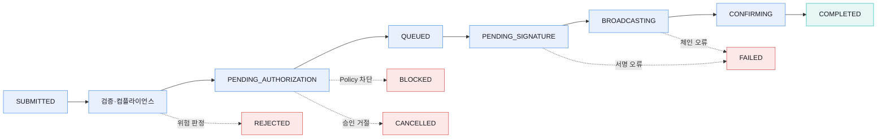
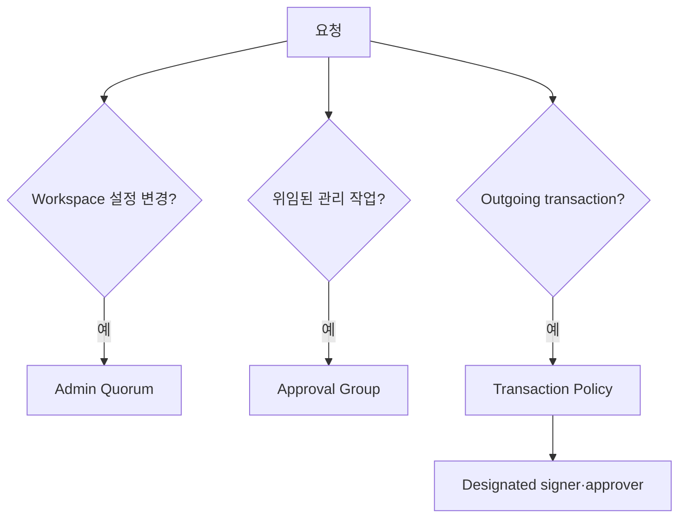
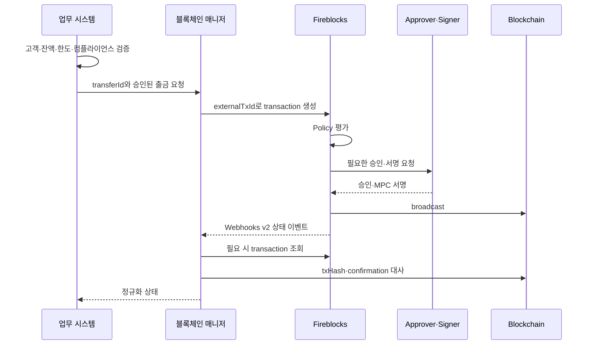

# 거래 수명주기와 승인 통제

Fireblocks transaction은 생성 즉시 블록체인으로 전파되지 않는다. 컴플라이언스, Policy, 승인, 서명, broadcast와 confirmation 단계를 거치며 실패 원인도 단계별로 다르다.

## 수명주기



실제 transaction type·자산·네트워크에 따라 건너뛰거나 추가되는 상태가 있다. 상태 문자열만으로 회계를 결정하지 않고 `subStatus`, error, txHash, confirmation과 webhook event를 함께 본다.

| 상태 계열 | 해석 | 우리 처리 |
|---|---|---|
| 승인·서명 대기 | 아직 체인에 제출되지 않음 | 고객 금액 잠금, 취소 가능성 관리 |
| Broadcasting·Confirming | 체인 전파 또는 확정 대기 | 중복 제출 금지, 체인 조회 병행 |
| Completed | Fireblocks의 confirmation 정책 충족 | 내부 대사 뒤 고객 업무 완료 |
| Blocked | Policy rule이 차단 | rule ID·정책 버전과 사유 기록 |
| Rejected | 컴플라이언스 또는 외부 판정 거절 가능 | provider 원인과 후속 절차 확인 |
| Cancelled | 승인·서명·서드파티 단계에서 취소 | 체인 전파 전인지 확인하고 잠금 해제 |
| Failed | 입력·서명·vendor·chain 오류의 넓은 범주 | subStatus별 재시도·종결 구분 |

## 역할

| 역할 | 관리 | 거래 시작·승인 | MPC 서명 |
|---|---|---|---|
| Owner | 핵심 거버넌스·복구 | 가능 | 가능 |
| Admin | 관리·승인 | 가능 | 가능 |
| Non-Signing Admin | 관리·승인 | 가능 | 불가 |
| Signer | 제한적 | 가능 | 가능 |
| Approver | 제한적 | 시작·승인 | 불가 |
| Editor | 일부 편집 | 조건부 시작 | 불가 |
| Viewer | 조회 | 불가 | 불가 |
| Security Auditor | 보안·정책 감사 조회 | 불가 | 불가 |
| Security Admin | 보안 설정 관리 | 불가 | 불가 |

역할명만 보고 허용 행동을 추정하지 않는다. Workspace 종류, transaction type, Policy designated signer, Approval Group에 따라 실제 동작이 달라진다. API user도 Owner를 제외한 역할을 부여받을 수 있으므로 사람 역할과 같은 최소권한 검토가 필요하다.

## 세 승인 계층



| 통제 | 보호 대상 | 예시 |
|---|---|---|
| Admin Quorum | Workspace 신뢰 경계·중요 설정 | 사용자·주소·연결·보안 설정 변경 |
| Approval Group | 특정 관리 작업의 승인 주체 | 주소 등록, Policy·사용자 관리 위임 |
| Transaction Policy | 개별 outgoing transaction | source·destination·asset·amount별 허용·승인·차단 |

한 계층을 설정했다고 다른 계층이 자동으로 적용되는 것은 아니다. Policy가 강해도 과도한 Admin 권한이 Policy 자체를 바꿀 수 있고, Admin Quorum이 있어도 transaction의 고액 승인 rule이 없으면 일상 거래 통제는 약하다.

## Policy 평가

[Fireblocks 공식 Policy 안내](https://developers.fireblocks.com/docs/set-transaction-authorization-policy)는 rule이 정의된 순서대로 평가된다고 설명한다. 넓은 허용 rule이 먼저 일치하면 아래의 고액·고위험 rule은 실행되지 않는다.

```text
1. 제재·금지 destination → Block
2. 고액 또는 누적 한도 초과 → 재무·보안 2인 승인
3. 승인된 상대 + 업무 시간 + 일상 한도 → 운영 1인 승인
4. 내부 treasury sweep → 지정 API Co-signer
5. 그 밖의 모든 거래 → Block
```

Policy 설계에서는 다음을 확인한다.

- 가장 구체적이고 제한적인 rule을 넓은 rule보다 앞에 둔다.
- source Vault, destination 유형, asset, amount와 initiator를 함께 좁힌다.
- 한 건 한도와 누적·시간 한도를 구분한다.
- 수수료·gas station·contract call·raw signing 같은 별도 transaction type을 빠뜨리지 않는다.
- 모든 허용 경로가 예상 designated signer나 approval group으로 끝나는지 검증한다.
- 마지막 차단 경로가 실제로 미일치 거래를 막는지 negative test를 한다.

## Policy 변경 관리

Policy API는 active policy 직접 게시와 draft 검토·게시 흐름을 제공한다. 운영 환경은 draft를 사용해 기계 검증과 사람 리뷰를 거친 뒤 publish하는 방식을 기본으로 한다.

1. 현재 active policy와 버전을 export한다.
2. 변경 요청에 업무 근거, 영향 Workspace, 시작·종료 시각을 기록한다.
3. draft를 만들고 정적 검사로 shadowed rule, 빈 승인자, 넓은 wildcard를 찾는다.
4. 대표 거래와 경계값·미일치·금지 시나리오를 시뮬레이션한다.
5. 독립 승인자가 diff와 테스트 결과를 검토한다.
6. publish 뒤 active policy를 다시 읽어 의도한 버전인지 확인한다.
7. webhook·audit log와 실제 거래를 감시하고 rollback 조건을 유지한다.

긴급 허용 rule을 영구 Policy에 남기지 않는다. 만료 시각과 자동 복원 절차를 두며, 비상 변경도 Admin Quorum과 감사 근거를 우회하지 않는다.

## 업무 시스템과의 연결



Fireblocks Policy에는 우리 고객 잔액과 전체 업무 맥락이 없다. 업무 시스템이 출금 가능성을 먼저 판단하고, Fireblocks는 독립된 두 번째 제한선으로 사용한다.

## 멱등성과 재시도

- `externalTxId`를 내부 transfer ID와 1:1로 연결한다.
- create transaction 타임아웃 뒤 같은 거래를 새 ID로 만들기 전에 조회한다.
- 동일 transfer의 재제출은 원 transaction의 종결 상태와 온체인 txHash를 확인한다.
- destination·asset·amount가 바뀌면 기존 승인을 재사용하지 않는다.
- 수수료 대체·가속 transaction은 원 거래와 별도 ID로 연결한다.
- `FAILED`를 모두 자동 재시도하지 않고 subStatus별 안전성을 정의한다.

## 운영 점검

- [ ] 역할과 조직 직무의 매핑·정기 재인증 절차가 있다.
- [ ] Owner 부재·퇴사 시 승계 절차가 있다.
- [ ] Admin Quorum, Approval Group, Transaction Policy의 담당자가 분리돼 있다.
- [ ] Policy의 rule 순서와 경계값을 자동 테스트한다.
- [ ] 모든 허용 rule의 designated signer가 실제 운영 가능하다.
- [ ] Policy publish와 rollback이 Audit Log·변경 요청에 연결된다.
- [ ] Fireblocks 완료와 내부 회계 완료를 별도 상태로 관리한다.
