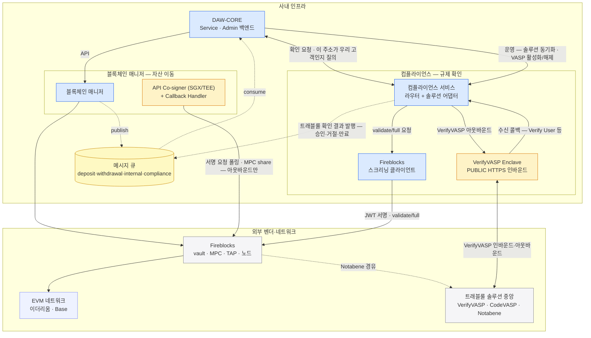

DAW-CORE·블록체인 매니저·컴플라이언스의 배포 단위를 한 장에 모은다.

## 한 장 그림

파랑 = 직접 만들고 운영하는 서비스, 노랑 = 벤더가 강제해서 우리 인프라 안에 두는 설치물, 회색 = 외부 벤더·네트워크. 메시지 큐는 매니저·컴플라이언스가 함께 쓰는 공용 인프라라 묶음 밖에 둔다.

## 별도 서비스 둘 — 정의와 나눈 이유

**블록체인 매니저 — 자산 이동의 벤더 연동 전담.** DAW-CORE가 온체인 자산 이동(계정·주소 발급·제출·감지·확정)을 요청하는 단일 창구다. 벤더(Fireblocks) SDK·폴링을 안에 감추고, 벤더 원어를 공통 어휘(TxStatus)로 번역해 API 응답과 큐 이벤트로 넘긴다 — 백엔드는 벤더를 모른다.

**컴플라이언스 서비스 — 규제 확인의 솔루션 연동 전담.** 출금·입금의 트래블룰 확인을 요청하는 창구이자, 상대 VASP 발 사전 검증 기록을 보관·대조하는 곳이다. 솔루션(VerifyVASP·CODE·Notabene) 원어를 공통 어휘(TrVerdict)로 번역한다 — DAW-CORE는 어느 솔루션인지 모른다. 트래블룰 게이트가 첫 모듈이고, **AML 스크리닝(Chainalysis·Elliptic)·OFAC 제재 주소 차단이 다음 모듈 후보다** — 지금은 벤더(Fireblocks) 안 별개 통합으로 남는다([컴플라이언스 0장](../../컴플라이언스/설계/00-scope.md)).

**DAW-CORE에서 떼어낸 이유** — 둘 다 "번역 경계를 서비스 경계로" 원칙이되, 흡수하는 변화가 다르다:

- 매니저 — **벤더 교체를 흡수한다**. 커스터디 벤더가 바뀌어도 백엔드와 회계 진실(DAW-CORE DB)은 그대로 남는다. 자산을 움직이는 자격(거래 제출 API user)도 이 한 서비스에 격리된다.
- 컴플라이언스 — **규제·솔루션 변경 흡수 + 회사 단위 자원 + 노출 성격**([트래블룰 8장](../../트래블룰/설계/08-gate-port.md)). Enclave·솔루션 회원 자격은 회사 단위라 다른 상품도 같은 스택을 쓰고, 규제·솔루션 변경이 DAW-CORE 배포를 만들지 않으며, 기관 간 인바운드 노출은 고객 트래픽과 장애 도메인이 다르다.

**둘을 하나의 "벤더 연동 서비스"로 합치지 않은 이유**:

- **경로 분리** — 자산이 움직이는 경로(제출·서명)와 움직이지 않는 검증 경로(validate/full)는 물리적으로 섞이지 않는다(아래 경계의 요점).
- **자격 분리** — 거래 제출(매니저)과 스크리닝 전용·서명 능력 없음(컴플라이언스)은 벤더 API user 부터 다르다 — 한쪽이 장악돼도 자산 이동 자격으로 번지지 않는다.
- **바뀌는 시점·이유가 서로 다르다** — 커스터디 벤더 교체와 트래블룰 솔루션·규제 변경은 따로 온다. 합치면 한쪽 변경이 다른 쪽 배포를 만든다.
- **노출이 다르다** — PUBLIC 인바운드는 컴플라이언스 쪽(Enclave)에만 열린다. 자산 이동 서비스에는 PUBLIC 인바운드가 없다.

## 경계의 요점

- **PUBLIC 인바운드는 VerifyVASP Enclave 하나뿐** — 상대 VASP 발신은 Enclave 가 받아 컴플라이언스 서비스의 수신 콜백 엔드포인트를 내부망으로 호출한다. 나머지 사내 구성 요소는 전부 아웃바운드만 연다.
- **벤더 API user 자격은 서비스마다 분리** — 매니저(거래 제출)·정책 관리(정책 편집)·스크리닝 클라이언트(validate/full). 한 서비스가 장악돼도 다른 자격으로 번지지 않는다.
- **자산 이동 경로와 트래블룰 검증 경로는 분리** — validate/full 호출은 제출·전파 경로를 타지 않는다.
