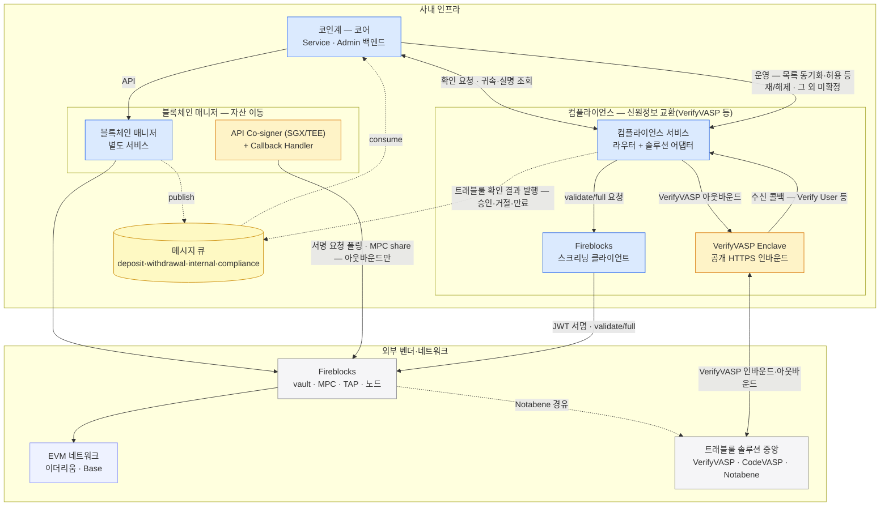

월렛 백엔드·블록체인 매니저·컴플라이언스의 배포 단위를 한 장에 모은다. 각 배치의 근거는 해당 시스템 장에 있고, 이 장은 그 결론만 조립한다.
구역은 사내 인프라와 외부 벤더·네트워크 둘이다.

## 한 장 그림

파랑 = 직접 만들고 운영하는 서비스, 노랑 = 벤더가 강제해서 우리 인프라 안에 두는 설치물, 회색 = 외부 벤더·네트워크. 메시지 큐는 매니저·컴플라이언스가 함께 쓰는 공용 인프라라 묶음 밖에 둔다.

## 별도 서비스 둘 — 정의와 나눈 이유

**블록체인 매니저 — 자산 이동의 벤더 연동 전담.** 지갑 백엔드가 온체인 자산 이동(계정·주소 발급·제출·감지·확정)을 요청하는 단일 창구다. 벤더(Fireblocks) SDK·폴링을 안에 감추고, 벤더 원어를 공통 어휘(TxStatus)로 번역해 API 응답과 큐 이벤트로 넘긴다 — 백엔드는 벤더를 모른다.

**컴플라이언스 서비스 — 규제 확인의 솔루션 연동 전담.** 출금·입금의 트래블룰 확인을 요청하는 창구이자, 상대 VASP 발 사전 검증 기록을 보관·대조하는 곳이다. 솔루션(VerifyVASP·CODE·Notabene) 원어를 공통 어휘(TrVerdict)로 번역한다 — 월렛은 어느 솔루션인지 모른다.

**월렛 백엔드에서 떼어낸 이유** — 둘 다 "번역 경계를 서비스 경계로" 원칙이되, 흡수하는 변화가 다르다:

- 매니저 — **벤더 교체를 흡수한다**. 커스터디 벤더가 바뀌어도 백엔드와 회계 진실(백엔드 DB)은 그대로 남는다. 자산을 움직이는 자격(거래 제출 API user)도 이 한 서비스에 격리된다.
- 컴플라이언스 — **규제·솔루션 변경 흡수 + 회사 단위 자원 + 노출 성격**([트래블룰 8장](../../트래블룰/설계/08-gate-port.md)). Enclave·솔루션 회원 자격은 회사 단위라 다른 상품도 같은 스택을 쓰고, 규제·솔루션 변경이 월렛 배포를 만들지 않으며, 기관 간 인바운드 노출은 고객 트래픽과 장애 도메인이 다르다.

**둘을 하나의 "벤더 연동 서비스"로 합치지 않은 이유**:

- **경로 분리** — 자산이 움직이는 경로(제출·서명)와 움직이지 않는 검증 경로(validate/full)는 물리적으로 섞이지 않는다(아래 경계의 요점).
- **자격 분리** — 거래 제출(매니저)과 스크리닝 전용·서명 능력 없음(컴플라이언스)은 벤더 API user 부터 다르다 — 한쪽이 장악돼도 자산 이동 자격으로 번지지 않는다.
- **바뀌는 시점·이유가 서로 다르다** — 커스터디 벤더 교체와 트래블룰 솔루션·규제 변경은 따로 온다. 합치면 한쪽 변경이 다른 쪽 배포를 만든다.
- **노출이 다르다** — 공개 인바운드는 컴플라이언스 쪽(Enclave)에만 열린다. 자산 이동 서비스에는 공개 인바운드가 없다.

## 배포 단위 목록

| 시스템 | 배포 단위 | 무엇 | 상세 |
|---|---|---|---|
| 월렛 백엔드 | Service 백엔드 | 고객 런타임 — 계정·주소·입금·출금·잔액 | [블록체인매니저 0장](../../블록체인매니저/설계/00-cast.md) |
| 월렛 백엔드 | Admin 백엔드 | 운영·거버넌스 — Service 와 물리 분리(배포·권한·감사 경계) | [블록체인매니저 0장](../../블록체인매니저/설계/00-cast.md) |
| 블록체인 매니저 | 블록체인 매니저 | 벤더 연동 전담 별도 서비스 — API 제공 · 내부 폴링 · 큐 publish | [블록체인매니저 0장](../../블록체인매니저/설계/00-cast.md) |
| 공용 | 메시지 큐 | 토픽 4개(deposit·withdrawal·internal·compliance) + 막힘 경보는 별도 채널 | [블록체인매니저 4장](../../블록체인매니저/설계/04-detect-confirm.md) |
| 정책 관리 | 정책 관리 서비스 | 벤더 정책 편집·게시 대행 — 거래 제출 자격과 분리 | [정책관리 0장](../../정책관리/설계/00-scope.md) |
| 블록체인 매니저 | API Co-signer + Callback Handler | 보안 존(SGX/TEE) 설치물 — 키 share 공동서명 · 서명 직전 승인·거부. 서명 요청도 벤더를 폴링해 당겨온다(아웃바운드만 — 벤더 공식) | [블록체인매니저 6장](../../블록체인매니저/설계/06-withdrawal.md) |
| 컴플라이언스 | 컴플라이언스 서비스 | 신원정보 교환 전담 — 라우터 + 솔루션 어댑터. 트래블룰 게이트가 첫 모듈. 1차 대조(사전 검증 기록 — 컴플라이언스 DB)는 이 서비스, 귀속·가용 전이는 월렛 백엔드 | [트래블룰 8장](../../트래블룰/설계/08-gate-port.md) · [12장](../../트래블룰/설계/12-physical-layout.md) |
| 컴플라이언스 | VerifyVASP Enclave | 벤더 강제 설치물 — 키·PII · 공개 HTTPS | [트래블룰 12장](../../트래블룰/설계/12-physical-layout.md) |
| 컴플라이언스 | Fireblocks 스크리닝 클라이언트 | 전용 API user 로 validate/full 호출 — 자격은 시크릿 스토어/KMS 격리 | [트래블룰 8장](../../트래블룰/설계/08-gate-port.md) |
| 컴플라이언스 | CODE-Cipher | **조건부** — CODE 직접 어댑터를 붙일 때만 설치 | [트래블룰 6장](../../트래블룰/설계/06-verifyvasp-parallel-gate.md) |

## 저장소

| 저장소 | 소유 | 담는 진실 |
|---|---|---|
| 백엔드 DB | 두 백엔드 | 회계 진실 — 고객 원장·귀속·출금 지시 상태. 벤더가 바뀌어도 남는다 |
| 매니저 DB | 블록체인 매니저 | 벤더 번역·운영 상태 — ref↔vault↔주소 매핑 · 폴링 커서 · 거래 추적 · finalize 원본. 테이블은 [블록체인매니저 17장](../../블록체인매니저/설계/17-database.md) |
| 컴플라이언스 DB | 컴플라이언스 서비스 | 거래소 목록 · check 상태 · 사전 검증 기록(입금 도착 시 대조로 답한다). 테이블은 [컴플라이언스 2장](../../컴플라이언스/설계/02-database.md) |
| 시크릿 스토어/KMS | 인프라 공통 | 전용 API user 자격(API키·RSA 서명키) — 서비스 밖 격리 |

## 경계의 요점

- **공개 인바운드는 VerifyVASP Enclave 하나뿐** — 상대 VASP 발신은 Enclave 가 받아 컴플라이언스 서비스의 수신 콜백 엔드포인트를 내부망으로 호출한다. 나머지 사내 구성 요소는 전부 아웃바운드만 연다.
- **벤더 API user 자격은 서비스마다 분리** — 매니저(거래 제출)·정책 관리(정책 편집)·스크리닝 클라이언트(validate/full). 한 서비스가 장악돼도 다른 자격으로 번지지 않는다.
- **자산 이동 경로와 트래블룰 검증 경로는 분리** — validate/full 호출은 제출·전파 경로를 타지 않는다.

## 열린 결정

1. **런타임 환경** — 사내 구성 요소의 실행 기반(컨테이너 오케스트레이션·클라우드/온프렘)은 아직 어느 장에도 없다.
2. **큐 구현체** — 토픽·파티션 키(계정 단위)·오프셋 커밋은 확정, 제품 선정은 미정.
3. **정책 관리 코드베이스** — 완전 별도 vs 매니저와 같은 코드베이스의 별도 배포 단위 ([정책관리 0장](../../정책관리/설계/00-scope.md) 열린 결정).

## 관련

- [블록체인매니저 0장 — 구성 요소](../../블록체인매니저/설계/00-cast.md)
- [트래블룰 12장 — 물리 배치](../../트래블룰/설계/12-physical-layout.md)
- [정책관리 0장 — 범위와 경계](../../정책관리/설계/00-scope.md)
