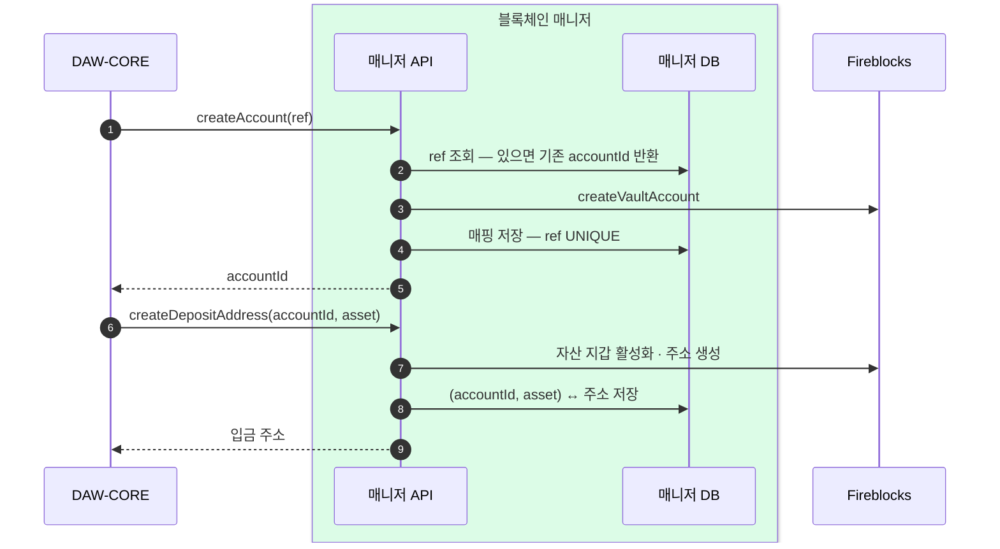
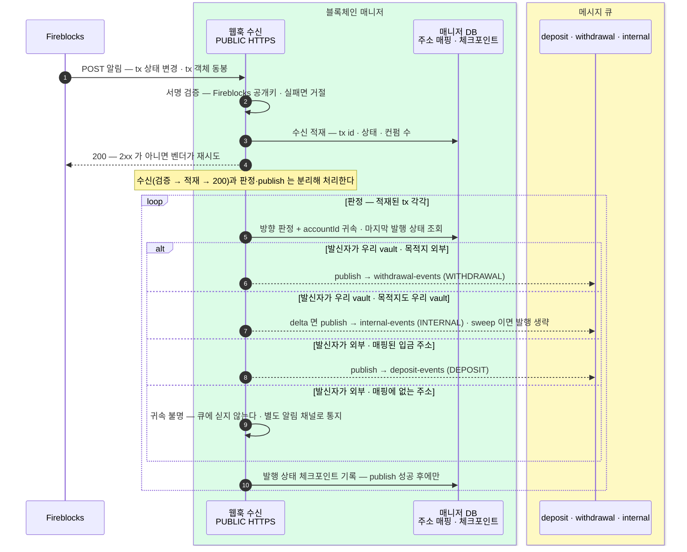
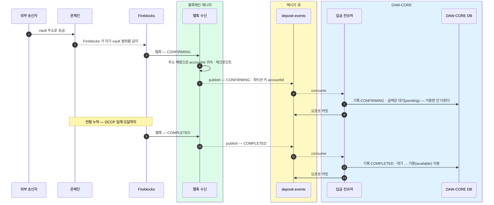
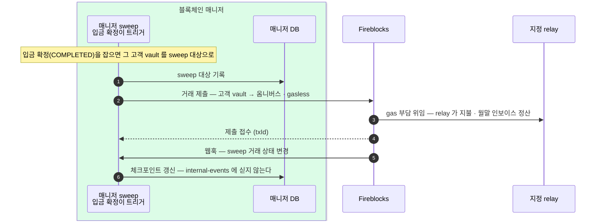
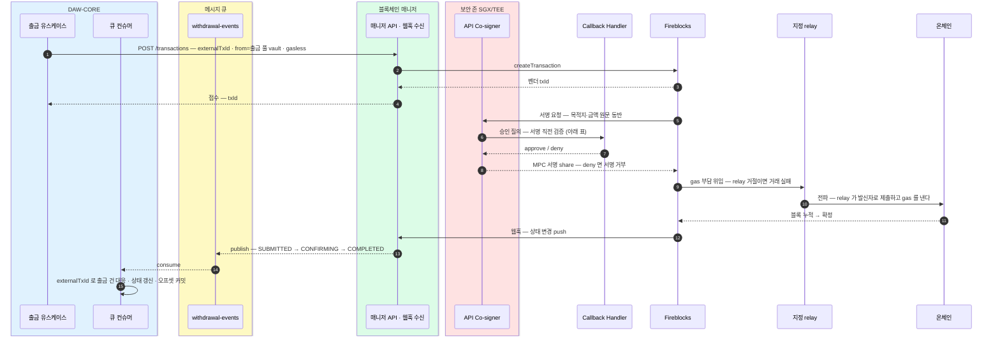
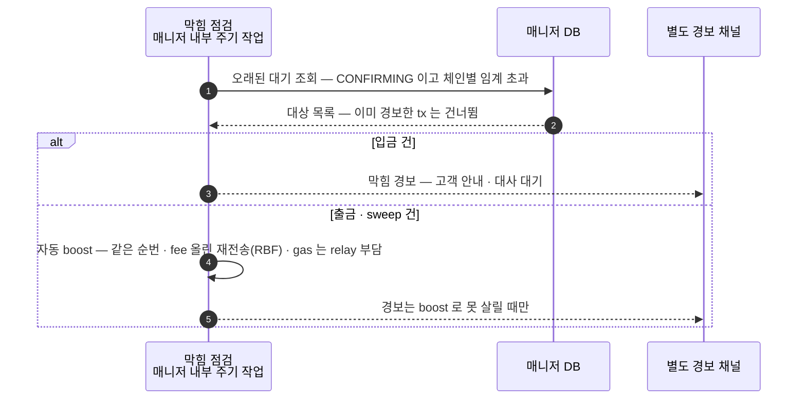

블록체인 매니저의 모든 흐름 — 계정·주소, 감지(웹훅), 입금, sweep, 출금, boost, 수수료·잔액·대사. 상태 enum 포함.
요청·응답의 필드 상세는 [블록체인 매니저 API](?cat=블록체인매니저&sub=API).

## 계정 생성 · 입금 주소 발급 · 조회

| 오퍼레이션 | 하는 일 | 멱등 |
|---|---|---|
| `createAccount(ref)` | vault 를 만들고 ref↔accountId 매핑을 반환한다. ref = DAW-CORE 계정 ID (고객 `ACT-` · 운영 `SYS-`) | 같은 ref → 같은 accountId. 매니저 DB `ref` UNIQUE 가 최종 방어 — 경합해도 이긴 값을 반환 |
| `createDepositAddress(accountId, asset)` | 자산 지갑을 활성화하고 입금 주소를 발급한다. EVM 은 자산당 주소 하나 | 같은 (accountId, asset) → 같은 주소 |
| `depositAddressOf(accountId, asset)` | 발급된 주소를 매니저 DB 에서 읽는다 — 벤더 왕복 없음 | 주소 있음 → 주소 · 미발급 → `data: null` · 계정 없음 → `404 ACCOUNT_NOT_FOUND` |

## 감지 — 웹훅 수신

온체인 상태 변경은 Fireblocks 웹훅으로 받는다. 매니저가 계열을 판정해 세 토픽으로 publish 하고, 백엔드는 토픽별 컨슈머로 consume 한다. 폴링은 없다.

수신·발행 규칙:

| 규칙 | 내용 |
|---|---|
| 서명 검증 | 모든 알림은 서명을 검증하고 통과한 것만 받는다 — JWKS 방식(`Fireblocks-Webhook-Signature` 헤더 · 공개키 자동 조회·로테이션). 발신 IP allowlist 를 겹친다 |
| 수신 확인 | 2xx 를 돌려줘야 전달 완료 — 아니면 벤더가 지수 백오프로 총 10회 재시도한다. 오류율이 높은 수신 endpoint 는 벤더가 자동 비활성화하므로 즉시 2xx + 비동기 처리 분리가 필수 |
| 유실 복구 | 재시도로도 못 받은 알림은 재전송 API(`resend_failed` — v2 는 30일)로 다시 받는다. 수신기 재기동 후 1회 호출한다 |
| 상태 전이만 publish | 체크포인트의 마지막 발행 상태와 비교해 앞으로 가는 전이만 발행한다. 같으면 생략, 과거로 돌아가면 무시 |
| 체크포인트는 publish 성공 후 | 기록 전에 죽으면 재발행된다 — 중복은 위 중복 반영 방지가 거른다 |
| 중복 반영 방지 | 같은 이벤트가 두 번 와도 한 번만 반영한다 — `txId`(또는 `externalTxId`) unique 로 가리고, 상태 전이만 반영한다 |
| 오프셋 커밋 | 원장 반영 성공 후에만 커밋한다. 실패하면 재소비된다 |
| 최종 안전망 | 주기 대사가 벤더 값과 기록을 대조해 닫는다 |

## 상태 enum

### TxStatus — 공통 상태 다섯

| TxStatus | 뜻 | 블록체인 상태 (Pending → Confirmed → Finalized) | Fireblocks 원어 | 함께 실리는 subStatus (대표) | networkStatus |
|---|---|---|---|---|---|
| `SUBMITTED` | 제출됨 — 서명·전파 준비 중, 체인 미등장. 출금에서만 관찰 | 아직 없음 → 전파되면 Pending | PENDING_SIGNATURE · QUEUED · BROADCASTING | — | 서명 단계엔 없음 → BROADCASTING |
| `CONFIRMING` | 체인에 등장, 컨펌 누적 중 — 미확정 | Confirmed — 블록에 포함, finality 전 | CONFIRMING | PENDING_BLOCKCHAIN_CONFIRMATIONS | CONFIRMING |
| `COMPLETED` | 확정 — DCCP 임계 컨펌 도달 | Finalized | COMPLETED | CONFIRMED | CONFIRMED |
| `REJECTED` | 거부·차단 — 임시. 사람 개입 여지 | 출금 차단은 체인에 없음 · 입금 동결은 Finalized | REJECTED · BLOCKED | AUTO_FREEZE · FROZEN_MANUALLY · REJECTED_AML_SCREENING | 출금은 없음 · 입금 동결은 CONFIRMED |
| `FAILED` | 영구 실패 — 사유 동반 | Pending 에서 증발 · revert 는 Confirmed 이후 | FAILED | DROPPED_BY_BLOCKCHAIN · 그 외 | FAILED · DROPPED |

판단은 TxStatus 다섯으로 한다. `REJECTED`(임시) ≠ `FAILED`(영구). subStatus 는 위 대표값(분기 필요한 최소 집합)만 보고 나머지는 로깅한다.

### EventType — 이벤트 분류 셋

| EventType | 뜻 | 토픽 |
|---|---|---|
| `DEPOSIT` | 고객 입금 — 매핑된 주소로 수신 | deposit-events |
| `WITHDRAWAL` | 외부 출금 | withdrawal-events |
| `INTERNAL` | delta 정산 | internal-events |

## 확정 기준 — DCCP

CONFIRMING 을 COMPLETED 로 바꾸는 임계 컨펌 수는 DCCP(확정 정책)가 정한다.

- 기본 임계 — 대부분의 체인 1 (이더리움·Base 포함) · ETC 372 · 컨트랙트 호출 3 권장. 한도: EVM 최소 1 · 이더리움 최대 100 · 신규 EVM L2 최대 30.
- 커스텀 임계는 정책 템플릿을 Fireblocks Support 에 제출해 검토·승인 후 반영된다. 요청 값은 Admin 이 정한다.
- **확정 판정은 status 만 보지 않는다** — `numOfConfirmations` 를 임계와 직접 비교한다. zero-confirmation 설정에서는 COMPLETED 가 블록 등장 시점에 먼저 뜰 수 있다.

## 입금

- 입금이 지나는 상태는 넷 — CONFIRMING · COMPLETED · REJECTED · FAILED. SUBMITTED 는 안 본다.
- **동결(REJECTED)** — subStatus `AUTO_FREEZE` · `FROZEN_MANUALLY` · `REJECTED_AML_SCREENING`. 돈은 체인에 도착·확정된 상태로 벤더 장부만 잠긴다. 해제(unfreeze)는 Admin 이 벤더 콘솔에서 하고, 상태 변경은 평소처럼 웹훅으로 잡힌다.
- **reorg 무효화(FAILED + `DROPPED_BY_BLOCKCHAIN`)** — 반영해 둔 잔액만 되돌리고 입금 기록은 보존한다. CONFIRMING 은 BROADCASTING 으로 되돌아가지 않는다.
- **귀속 불명** — 매핑에 없는 주소의 입금은 큐에 싣지 않고 별도 알림 채널로 통지한다. 수동 매핑 해소를 기다린다.

## sweep — 매니저 내부

입금이 확정되면 매니저가 내부에서 고객 vault 의 자산을 옴니버스 vault 로 옮긴다. 백엔드는 sweep 을 호출하지 않고 큐 이벤트도 받지 않는다. 고객 원장은 불변이다.

| vault | 역할 |
|---|---|
| 고객별 vault (intermediate) | 입금 식별·수신 전용 — 보관처 아님 |
| 옴니버스 vault (omnibus deposits) | sweep 으로 모이는 중앙 보관처 |
| 출금 풀 (withdrawal pool) | 출금 전용 — 복수 vault round-robin |

sweep 거래도 막힘 점검·boost 를 동일하게 탄다. 정합은 대사가 확인한다.

## 출금

승인 완료된 출금 지시를 DAW-CORE가 `POST /transactions` 로 제출한다. `externalTxId` 가 멱등 키 — 같은 키 재제출은 중복 전송되지 않는다.

서명은 두 겹이다:

| 서명 | 누가 | 강제하는 것 |
|---|---|---|
| 안쪽 — vault 승인 서명 | MPC — 벤더 share + Co-signer share. Callback Handler 검증 통과 건에만 share 를 보탠다 | 목적지·금액이 승인 기록과 다르면 서명이 만들어지지 않는다 |
| 바깥 — relay 거래 서명 | relay 가 자기 계정으로 서명·제출하고 gas 를 낸다 | relay 는 낼지 말지만 정한다 — 내용 위조 불가 |

### 서명 직전 검증 — Callback Handler 가 보는 것

네 항목 모두 DAW-CORE DB 읽기 전용 복제본으로 판정한다. 하나라도 어긋나면 deny — 서명이 만들어지지 않는다.

| 항목 | 확인하는 것 |
|---|---|
| 원문 일치 | 서명 요청의 chain·자산·금액·발신 vault·목적지가 접수·승인한 출금 지시와 같은가 |
| 요청 유효성 | 대응하는 출금 요청이 존재하고, 승인 완료 상태(트래블룰 확인 통과 포함)이며, 만료되지 않았는가 |
| 소비 상태 | 이 externalTxId 로 이미 서명이 만들어지지 않았는가 — 승인된 지시 1건에 서명 1번 |
| 운영 차단 상태 | 동결·비상 중지·체인 비활성에 걸리지 않는가 |

관문 밖에서 강제되는 것 — 고정 목적지 화이트리스트·한도는 벤더 정책(TAP), 고객 출금 주소는 접수 단계의 주소록 검사, 재제출 중복은 벤더의 externalTxId 차단.

## 막힘 점검 · 자동 boost

막힌 tx 는 변화가 없어 웹훅 알림이 오지 않는다 — 매니저의 주기 작업(예: 5분)이 자기 DB 에서 오래 CONFIRMING 인 건을 조회한다(벤더 호출 없음).

- boost 는 Admin 정책(대기 임계 · 최대 시도) 안에서 매니저가 자동 실행한다. 대체 거래(새 txId)는 원 txId 로 접어 발행한다 — 백엔드는 boost 를 모른다. 이력은 매니저 DB 에 남는다.
- relay 가 gas 를 못 대거나 최대 시도까지 안 풀리면 경보한다 — 사람이 relay 복구·수동 처리. cancel 은 이때의 최후수단이다.

## 수수료 관측 · 잔액 · 이력 · 대사

- **수수료** — 매니저 내부 주기 작업이 견적을 시계열로 기록한다. 제출 건에는 제출 시각의 시세를 대응시킨다. 실비 검증은 온체인 실측(gasUsed × 체결 단가)으로 하고, 월말 인보이스와 맞춘다.
- **잔액** — `balanceOf` 는 vault 잔액(가용·대기·잠김)을 준다. 대사 재료다 — 고객별 잔액은 DAW-CORE 원장이 담당한다.
- **이력** — `transactionsOf` 는 거래 시각(createdAt) 기준 목록(커서 페이지네이션), `transactionOf` 는 단건 조회.
- **대사** — 회계가 걸리는 숫자는 주기적으로 벤더 값과 직접 대조한다. 큐 경로와 무관하게 도는 독립 안전장치다.

## 원본 보관 — 일 배치

finalize 된 트랜잭션 원본을 일 배치로 매니저 DB(`bcm_raw_tx_l`)에 보관한다. 기존 웹훅 수신 → 번역 → 이벤트 경로는 건드리지 않는다.

## 매니저가 내보내는 신호

| 신호 | 내용 |
|---|---|
| heartbeat | 주기 작업(막힘 점검 등)별 실행 완료 시각 — 매니저 DB 에 기록 |
| 웹훅 수신 생존 | 마지막 수신 시각 · 수신 오류율 · 서명 검증 실패율 — 메트릭 |
| 판정 적체 | 수신 적재 대비 publish 지연 깊이 — 메트릭 |
| 벤더 호출 오류율 | 429 포함 — 메트릭 |

감시·경보 판정은 매니저 밖 모니터링이 한다.

## 미확정

- **rate limit 실제 한도** — 클라이언트측 상한(token bucket)·대사 배치 크기의 근거 — 벤더 확인 후 확정.
- **relay 의 stuck 자동 처리 여부** — 자동이면 막힘 점검의 boost 트리거를 뺀다 — 벤더 확인 후 확정.
- **7702 authorization 서명의 관문 통과 여부** — 이 서명이 TAP·Callback 경로를 지나는지 — 벤더 확인 후 확정.
- **귀속 불명 입금의 해소 절차** — 매핑 갱신을 누가 트리거하고 해소 후 이벤트를 다시 흘리는지 — DAW-CORE와 정합 후 확정.
