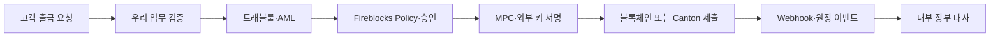

# 디지털 자산 플랫폼 온보딩

이 폴더는 우리 디지털 자산 플랫폼의 세 가지 기반을 한곳에 정리한다.
권장 읽기 순서와 세 문서를 관통하는 출금 흐름, 공통 용어를 안내한다.

- **트래블룰**: 누구에게 어떤 정보를 전달하고, 입출금 흐름의 어디에서 검사하는가
- **Canton Network**: 프라이버시 원장과 Holding 기반 자산을 어떻게 읽고 다루는가
- **Fireblocks**: 키·정책·승인·서명·체인 연동을 어떤 운영 모델로 제공하는가

## 권장 읽기 순서

### 1. [트래블룰](../트래블룰/00-overview.md)

규제·출금 흐름·IVMS101 전체 필드·솔루션 연동을 여러 문서로 나누어 다룬다.

### 2. [Canton Network](./02-canton-network.md) — 15~20분

자산이 기록되고 움직이는 원장 모델을 설명한다.

### 3. [Fireblocks 기능과 운영 모델](./03-fireblocks-features.md) — 15~20분

키와 트랜잭션을 실제 운영하는 플랫폼을 정리한다.

## 세 문서를 연결해서 보기

하나의 출금은 세 주제를 차례로 통과한다.

이 흐름에서 각 계층은 서로를 대체하지 않는다.

| 질문 | 주로 답하는 문서 |
|---|---|
| 상대 VASP에 어떤 신원 정보를 보내야 하는가? | 트래블룰 |
| 자산과 거래를 누가 볼 수 있으며 잔액은 어떻게 표현되는가? | Canton Network |
| 누가 거래를 승인하고 어떤 키로 서명하는가? | Fireblocks |
| 고객의 실제 의사와 내부 잔액이 맞는가? | 우리 업무 시스템의 책임 |

## 공통 용어

| 용어 | 이 문서 묶음에서의 의미 |
|---|---|
| **VASP** | 가상자산 이전·보관 등 규제 대상 서비스를 제공하는 사업자 |
| **Party** | Canton 원장에서 권리와 의무를 갖는 신원 |
| **Participant** | Party를 호스팅하고 관련 원장을 저장·검증하는 Canton 노드 |
| **Validator** | Canton Global Synchronizer에 연결되는 운영 역할·배포 묶음. 문맥에 따라 Participant를 포함 |
| **Workspace** | Fireblocks의 사용자·정책·키·감사 격리 단위 |
| **Vault Account** | Fireblocks workspace 안의 자산 운영 단위 |
| **Policy** | Fireblocks outgoing transaction의 허용·추가 승인·차단 규칙 |
| **Callback Handler** | API Co-signer가 자동 서명하기 전에 우리 로직으로 요청을 검증하는 서버 |
| **ACS** | Canton의 현재 Active Contract Set. Party가 볼 수 있는 활성 계약 집합 |
