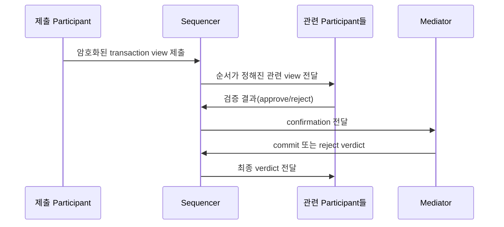
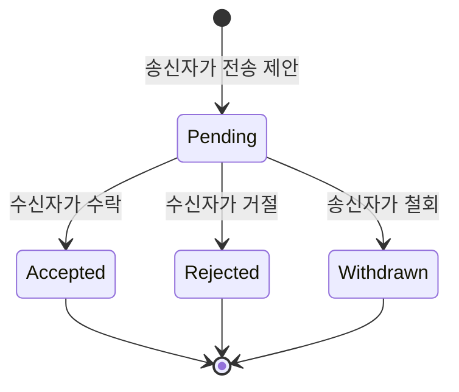

# Canton Network 온보딩

Canton의 선택적 공개, Party와 Holding 기반 원장, 수탁 시스템과 Fireblocks 연동에서 달라지는 설계 가정을 설명한다.

## 1. 왜 Canton인가

퍼블릭 블록체인은 모든 참여자가 같은 원장을 복제하고 검증한다. 투명성과 개방성에는 유리하지만, 기관 금융에는 곤란한 경우가 많다. 거래 상대, 보유 포지션, 가격, 담보 구성처럼 업무상 민감한 정보가 관계없는 참여자에게까지 공개될 수 있기 때문이다.

Canton은 이 문제를 **선택적 공개(selective disclosure)** 로 푼다. 하나의 트랜잭션을 여러 하위 뷰(view)로 나누고, 각 당사자에게 권한이 있는 뷰만 전달한다. 참가자는 자신과 관련된 상태만 저장하고 검증하며, Global Synchronizer는 모든 업무 데이터를 한곳에 모아 공개하지 않고 암호화된 메시지의 순서와 원자적 커밋을 조정한다.

짧게 말하면 다음과 같다.

> Canton에서는 “네트워크 전체가 모든 거래를 본다”가 아니라 “거래를 알아야 하는 당사자들이 필요한 부분을 함께 확정한다.”

이 구조는 프라이버시만을 위한 것이 아니다. 서로 다른 애플리케이션과 자산을 한 트랜잭션으로 묶어, 자산 인도와 대금 지급이 모두 성공하거나 모두 실패하는 원자적 결제(DvP)를 만들 수 있다.

## 2. 먼저 알아야 할 다섯 용어

| 용어 | 뜻 | 수탁 시스템에서의 의미 |
|---|---|---|
| **Party** | 원장 위에서 권리와 의무를 갖는 안정적인 신원 | 고객 계정 또는 수탁 지갑을 대표하는 주체 |
| **Participant** | Party를 호스팅하고 해당 Party가 볼 수 있는 원장을 저장·검증하는 노드 | Ledger API, 상태 조회, 트랜잭션 준비·제출 지점 |
| **Synchronizer** | Participant 사이의 메시지 순서와 원자적 확정을 조정하는 서비스 | 업무 원장의 중앙 저장소가 아니라 조정 계층 |
| **Contract** | Daml로 정의되며 생성된 뒤에는 바뀌지 않고, 행사되면 소비·보관될 수 있는 원장 객체 | 잔액, 전송 제안, 권리·의무가 객체로 존재 |
| **Holding** | Canton Token Standard에서 토큰 보유분을 나타내는 활성 계약 | “주소의 숫자 하나”가 아니라 여러 보유 조각의 집합 |

Party는 사람 이름이나 로그인 계정과 같지 않다. 애플리케이션 사용자는 한 개 이상의 Party를 통제할 수 있고, Party는 여러 Participant에 호스팅될 수 있다. 반대로 Participant는 여러 Party를 호스팅한다. **신원(Party), 노드(Participant), 사용자 인증 계정**을 같은 것으로 취급하면 안 된다.

## 3. EVM과 무엇이 다른가

EVM 계열 시스템에 익숙하면 보통 다음처럼 생각한다.

- 주소마다 현재 잔액이 있다.
- 전송은 송신 주소의 잔액을 줄이고 수신 주소의 잔액을 늘린다.
- 트랜잭션과 상태는 공개 원장에서 누구나 조회할 수 있다.
- 서명할 데이터는 nonce, 수신 주소, 금액, calldata를 보면 대체로 이해할 수 있다.

Canton의 원장 모델은 다르다. 활성 계약의 집합이 현재 상태이고, 계약은 생성 후 불변이다. 상태 변경은 기존 계약을 행사해 소비하고 새로운 계약을 만드는 방식으로 일어난다. 공식 문서는 이를 **extended UTXO(eUTXO) 모델**로 설명한다.

토큰 잔액도 단일 숫자가 아니라 Party가 소유한 여러 활성 `Holding` 계약의 합이다. 예를 들어 100 단위를 보유한 상태가 `40 + 35 + 25` 세 조각일 수 있다. 60을 보낼 때 어떤 조각을 입력으로 선택하고 거스름 보유분을 어떻게 만들지 관리해야 한다.

| 관점 | 일반적인 EVM 가정 | Canton에서의 관점 |
|---|---|---|
| 잔액 | 주소의 가변 숫자 | 활성 `Holding` 계약들의 합 |
| 상태 변경 | 계정 상태 갱신 | 기존 계약 소비 + 새 계약 생성 |
| 조회 | 공개 RPC와 인덱서 | Party 권한이 있는 ACS와 업데이트 스트림 |
| 프라이버시 | 별도 기술 없이는 전체 공개 | 계약·트랜잭션 뷰별 선택적 공개 |
| 송금 | 보통 한 번의 전송 호출 | 토큰 구현에 따라 제안 후 수락·거절 가능 |
| 서명 | 체인별 직렬화 데이터 | 준비된 트랜잭션의 전체 원장 효과를 나타내는 해시 |

따라서 `getBalance(address)` 하나로 자산 상태를 끝내거나, 블록 탐색기를 최종 장부로 간주하는 설계는 맞지 않는다.

## 4. 프라이버시는 어떻게 작동하는가

### 4.1 계약의 역할

Daml 계약에는 정보 공개와 행동 권한이 구분되어 있다.

- **Signatory**: 계약 생성에 동의해야 하고 계약을 항상 볼 수 있는 당사자다.
- **Observer**: 계약을 볼 수 있지만 그 사실만으로 선택(choice)을 실행할 수는 없다.
- **Controller**: 특정 choice를 실행할 권한이 있는 당사자다. 실행 결과도 볼 수 있다.
- **Stakeholder**: signatory와 observer를 합친 말이다.

“계약을 본다”와 “계약에 행동할 수 있다”는 다르다. API 권한 설계와 업무 권한 설계에서도 이 구분을 유지해야 한다.

### 4.2 트랜잭션 뷰

하나의 복합 거래에 여러 당사자가 있어도 모든 당사자가 전체 내용을 보지는 않는다. Canton은 트랜잭션을 하위 뷰로 분해하고, 각 Participant는 호스팅하는 Party가 볼 권한이 있는 뷰만 받는다. Synchronizer는 암호화된 메시지를 순서화하고 확인 결과를 중계한다.

예를 들어 A가 B에게 자산을 넘기고, 같은 원자적 거래 안에서 B가 C에게 다른 지급을 하더라도 A에게 B와 C 사이의 상세가 반드시 공개되는 것은 아니다. 다만 실제 가시성은 Daml 모델의 signatory, observer, controller 및 트랜잭션 의존관계에 따라 결정된다.

### 4.3 `fetch`도 공개 범위를 만든다

프라이버시는 “관련 Party만 본다”는 구호만으로 자동 완성되지 않는다. 트랜잭션에서 기존 계약을 `fetch`하면 그 계약을 원래 보지 못하던 트랜잭션 당사자에게도 해당 실행에 필요한 정보가 공개될 수 있다. 이를 divulgence라고 한다.

그래서 Daml 설계 리뷰에서는 기능뿐 아니라 다음을 함께 묻는다.

- 이 Party가 이 계약 전체를 알아야 하는가?
- 검증에 필요한 최소 필드만 별도 계약이나 뷰로 분리할 수 있는가?
- `fetch`가 의도하지 않은 상대에게 상업 정보를 노출하지 않는가?

## 5. Daml: 규칙이 데이터 타입에 들어간다

Daml은 Canton의 스마트 계약 언어다. 온보딩 단계에서 문법을 외울 필요는 없지만, 세 가지 개념은 알아야 한다.

1. **Template**은 계약 데이터와 참여자를 정의한다.
2. **Choice**는 누가 어떤 상태 전이를 실행할 수 있는지 정의한다.
3. **Transaction**은 계약 생성·행사의 트리이며, 권한·가시성·원자성이 함께 검증된다.

EVM에서 `require(msg.sender == owner)` 같은 검사를 함수 안에 반복해서 넣는다면, Daml은 signatory와 controller를 통해 권한을 계약 모델에 직접 드러낸다. 잘못된 Party가 choice를 실행하거나 필요한 동의가 빠진 트랜잭션은 Participant 검증 단계에서 거절된다.

이 때문에 Canton 연동은 단순한 코인 송금 API 작업이 아니다. 토큰 전송, 담보 설정, 배분, DvP 같은 업무가 어떤 계약을 만들고 어떤 choice를 행사하는지 이해해야 한다.

## 6. 합의와 확정

Canton은 업무 트랜잭션 검증과 메시지 순서 결정을 나눈다.

Sequencer는 인증된 메시지에 순서와 타임스탬프를 부여한다. 관련 Participant들은 자신의 뷰에 대해 권한, 계약 상태, 시간 제약 등을 검증한다. Mediator는 확인 응답을 모아 commit 또는 reject verdict를 낸다. 이 2단계 커밋이 관계된 뷰들을 원자적으로 확정한다.

공식 지갑 통합 가이드는 확정에 **통상 3~10초**가 걸린다고 설명했다. 이 값은 지갑·외부 서명 통합을 위한 일반적 안내이지 네트워크 SLA가 아니다. 서명 정책 승인, 외부 MPC 왕복, 혼잡, 참여 노드 상태가 전체 사용자 체감 시간을 늘릴 수 있다. 우리 시스템은 고정 타임아웃을 이 숫자에 맞추지 않고, 비동기 상태 추적과 멱등 재시도를 기본으로 삼는다.

## 7. 자산은 어떻게 움직이는가

### 7.1 Canton Token Standard

CIP-0056은 토큰마다 별도 구현을 알지 않아도 지갑과 앱이 공통 방식으로 보유분, 전송, 배분을 다룰 수 있게 하는 표준 API를 정의한다.

`Holding`은 보유분이고, `TransferInstruction`은 전송 지시다. 수신자의 사전 승인이 없는 2단계 전송은 다음처럼 이해할 수 있다.

Pending 동안 입력 보유분은 잠겨 중복 지출되지 않는다. 수신자는 수락해 자신의 Holding으로 만들거나 거절할 수 있고, 수신자가 행동하기 전에는 송신자가 철회할 수 있다. 사전 승인(pre-approval)을 설정한 경로는 한 번에 완료될 수 있다.

`OFFER`, `ACCEPT`, `REJECT`, `WITHDRAW` 같은 대문자 상태·동작 이름을 API에서 보더라도 모두 Canton 프로토콜의 고정 enum이라고 일반화해서는 안 된다. Fireblocks는 자신의 Canton API에 이와 같은 전송 유형을 노출한다. 반면 표준의 핵심 개념은 `TransferInstruction`과 Accept·Reject·Withdraw choice다.

### 7.2 취소는 “완료된 송금을 되돌리는 것”이 아니다

Withdraw는 아직 Pending인 제안을 회수하는 동작이다. 이미 Accepted되어 새 Holding이 생성된 전송을 취소하는 기능이 아니다. 완료 후 반환이 필요하면 반대 방향의 새로운 전송과 별도 승인·컴플라이언스 절차가 필요하다.

### 7.3 Traffic은 선충전 자원이다

Global Synchronizer를 통한 메시지 전송에는 Participant별 traffic 잔고가 사용된다. 추가 traffic은 Canton Coin을 사용해 미리 충전하며, 메시지 크기와 수신자 수에 따라 소비된다. Validator에는 목표 처리량과 최소 구매 간격에 따라 자동으로 top-up하는 기능도 있다.

따라서 가스비를 트랜잭션마다 고객 주소에서 즉석 계산하는 EVM식 모델과 다르다. 운영자는 다음을 감시해야 한다.

- Participant의 traffic 잔고와 자동 충전 상태
- 대량 수신자를 포함하는 업무의 traffic 증가
- 잔고 부족으로 제출이 중단되기 전의 경보

가격과 무료 traffic 파라미터는 바뀔 수 있으므로 이 문서에는 고정하지 않는다.

## 8. 수탁 시스템 체크리스트

### 8.1 입금 식별자는 주소만이 아니다

공식 지갑 통합 가이드는 하나의 수탁 Party로 들어오는 입금을 전송 metadata의 **memo**로 고객 계정과 연결하는 방식을 안내한다. XRP나 Stellar의 destination tag와 비슷한 운영 문제다.

- 고객에게 memo를 정확히 제시한다.
- memo가 없거나 잘못된 입금은 자동 반영하지 않는다.
- 자산·Party·memo·전송 지시 ID를 함께 대조한다.
- 이벤트 재처리에도 같은 입금이 이중 반영되지 않게 멱등 키를 둔다.

### 8.2 Holding 조각을 관리한다

잔액은 여러 Holding의 합이다. 출금 준비 시 사용할 조각을 예약하고, 동시에 다른 요청이 같은 Holding을 소비하지 못하게 해야 한다. 너무 많은 작은 조각은 조회와 트랜잭션 구성을 복잡하게 하므로 병합 정책도 필요하다.

업무 DB에는 적어도 `contract_id`, 자산 식별자, 금액, 소유 Party, 잠금·예약 상태, ledger offset을 연결해 둔다. 그러나 DB 숫자만을 원장의 진실로 취급하지 않고 ACS와 업데이트 스트림으로 계속 대사한다.

### 8.3 Party와 계정을 구분한다

공식 가이드는 수탁사에 **계정 또는 지갑당 Party 하나**를 목표로 하라고 권고하며, 입금마다 임시 Party를 만드는 방식은 피하라고 안내한다. 이는 프로토콜이 강제하는 제약은 아니다.

**우리 설계 원칙:** 고객 계정당 안정적인 Party 하나를 기본으로 한다. 예외적으로 omnibus Party와 memo를 쓰는 상품은 회계·프라이버시·운영 비용을 별도 검토한다. Party 생성은 느슨한 주소 발급 API로 노출하지 않는다.

### 8.4 자체 DB의 역할을 정확히 잡는다

Participant를 pruning해도 현재의 Active Contract Set(ACS)은 제거되지 않는다. 따라서 “pruning 때문에 현재 잔액을 살리려면 자체 DB가 필수”라는 설명은 맞지 않는다.

자체 DB가 필요한 이유는 다음과 같다.

- 고객·상품·memo와 온원장 객체의 매핑
- 검색 가능한 거래 이력과 감사 자료
- 출금 요청, 승인, 실패 사유 같은 오프레저 업무 상태
- webhook·업데이트 스트림 재처리와 멱등성
- 원장 offset, 예약 Holding, 대사 결과 관리

현재 원장 상태의 기준은 ACS이고, 업무 DB는 그 상태를 해석하고 운영 이력을 보존하는 계층이다.

### 8.5 서명 전 내용을 독립 검증한다

External Party 흐름에서는 Participant가 트랜잭션을 준비하고, 외부 키 보유자가 준비된 트랜잭션의 해시에 서명한 뒤 Participant가 이를 실행한다. 개인키는 Participant에 줄 필요가 없다.

하지만 “Participant가 만든 해시에 MPC가 서명했다”만으로 충분하지 않다. 서명 서비스는 준비 응답에서 원장 효과를 해석하고, 해시를 독립적으로 재계산해 다음을 확인해야 한다.

- 요청한 Party, 자산, 금액, 상대방이 맞는가?
- 예상하지 않은 계약 생성·행사나 추가 서명자가 들어갔는가?
- 정책 승인된 업무 요청과 동일한 트랜잭션인가?
- 유효 시간과 synchronizer가 의도한 값인가?

## 9. Fireblocks와 연결하는 방법

Fireblocks는 Canton에서 서로 다른 세 역할로 등장한다. 역할을 섞어 이해하지 않는 것이 중요하다.

1. **네트워크 거버넌스:** Fireblocks는 기준일 현재 Canton Foundation이 공개한 Super Validator 목록에 포함된다.
2. **수탁 플랫폼:** Canton 지갑, 정책 통제, 네이티브 자산 전송, 2단계 수신 제안, 고객 Validator 연결 등을 제공한다고 설명한다.
3. **외부 서명 드라이버:** 공식 Canton Wallet SDK는 Fireblocks signing provider를 포함하며, Wallet Gateway가 서명 요청을 Fireblocks 같은 provider로 전달할 수 있다.

실무 통합 경로는 크게 두 가지다.

| 경로 | 구조 | 적합한 경우 |
|---|---|---|
| Fireblocks 관리형 Canton 지원 | 우리 시스템 → Fireblocks API → Fireblocks의 Canton 인프라 | 노드 운영까지 벤더에 맡기고 빠르게 시작할 때 |
| Bring Your Own Validator | 우리 시스템 → 자체 Validator/Participant ↔ Fireblocks 서명·수탁 | 노드와 데이터 운영 주도권이 필요할 때 |

어느 경로든 Fireblocks 정책 승인과 Canton 트랜잭션 검증은 별개의 방어선이다. Fireblocks 정책이 “이 API 사용자에게 이 자산 출금을 허용한다”고 판단해도, 준비된 Daml 트랜잭션에 숨은 원장 효과를 애플리케이션이 검증해야 한다. 반대로 Canton 트랜잭션이 기술적으로 유효해도 고객 승인·한도·컴플라이언스 정책을 통과하지 못하면 서명해서는 안 된다.

## 10. 채택 현황과 우리 PoC

### 10.1 공개 네트워크 현황

**기준일: 2026-08-18.** Canton Foundation의 공개 명단에는 Digital Asset, DTCC, Fireblocks, Circle, Chainlink, Copper, Nasdaq, SBI, Tradeweb, Visa 등을 포함한 Super Validator 운영 주체가 올라와 있다. 이 명단은 기준일 당시의 거버넌스 참여·인프라 운영 현황이며, 각 기관이 동일한 상품을 상용 운영한다는 뜻은 아니다.

현재 명단 전체는 문서에 복제하지 않는다. 변동이 잦으므로 실제 검토 시 Foundation 원문을 조회한다.

### 10.2 Musubi PoC

Musubi는 Canton 위에서 기관 간 스테이블코인 FX를 원자적 DvP로 결제하려는 네트워크다. 공개 소개 자료 기준으로 일본·한국 기관과 **Canton testnet에서 PoC 검증 단계**에 있다.

**우리 PoC의 위치:** 우리는 Musubi의 DevNet/TestNet 환경에서 송금 한 건의 성공만 보려는 것이 아니다. 다음을 직접 관찰하고 검증한다.

- 두 통화 다리가 함께 완료되거나 함께 실패하는가?
- 무관한 Party에게 거래 상대·금액이 노출되지 않는가?
- Daml choice와 signatory 규칙이 잘못된 호출을 거절하는가?
- Holding, 전송 제안, 수락, 최종 ACS가 어떻게 변하는가?
- 노드월렛으로 시작한 서명 경로를 Fireblocks로 바꿀 때 책임 경계가 유지되는가?

PoC의 1차 환경은 운영망이 아니며, 여기서 관측한 지연시간이나 가용성을 mainnet 성능 보장으로 사용하지 않는다.

## 11. 핵심만 다시 보기

- Canton은 모든 데이터를 전체에 방송하지 않고, 관련 Party에게 필요한 트랜잭션 뷰만 공개한다.
- 현재 상태는 활성 계약의 집합이다. 잔액은 여러 `Holding`의 합이며 상태 변경은 계약 소비와 생성으로 표현된다.
- 전송은 구현과 사전 승인 여부에 따라 제안 후 Accept·Reject·Withdraw가 필요한 2단계 흐름일 수 있다.
- Party는 주소, 로그인 사용자, Participant와 서로 다른 개념이다.
- 수탁 시스템은 memo 입금, Holding 예약·병합, ACS 대사, 비동기 확정, 독립적인 서명 전 검증을 설계해야 한다.
- Fireblocks 정책 통제와 Canton 트랜잭션 의미 검증은 서로 대체하지 않는다.
