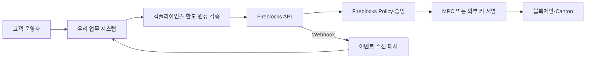
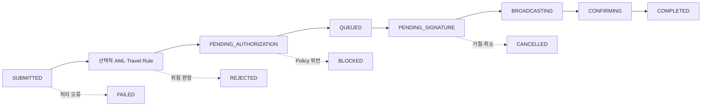

# Fireblocks 기능과 운영 모델

Fireblocks의 workspace, MPC, 정책·승인·자동 서명·API를 우리 시스템의 책임 경계와 함께 설명한다.

## 0. 왜 Fireblocks인가

디지털 자산 수탁을 직접 구축한다는 말은 개인키를 안전한 서버에 저장한다는 뜻에 그치지 않는다. 실제 운영에는 다음이 함께 필요하다.

- 키 생성·분산·백업·복구와 서명 장치의 수명주기
- 사용자 역할, 관리자 다중 승인, 거래별 승인 정책
- 블록체인별 주소·수수료·nonce·UTXO·확정 관리
- API 인증, 자동 서명, webhook 재처리, 감사 로그
- AML·트래블룰 같은 컴플라이언스 서비스 연결
- 장애·침해 시 동결, 복구, 책임 분리

Fireblocks는 이 기능을 workspace와 Vault를 중심으로 묶은 디지털 자산 운영 플랫폼이다. 우리에게 중요한 이유는 암호기술 하나가 아니라, **업무 요청을 정책과 다중 승인을 거쳐 서명하고 체인 상태까지 추적하는 운영 평면**을 제공한다는 데 있다.

다만 Fireblocks를 쓰는 것과 법적 의미의 수탁기관이 되는 것은 같은 말이 아니다. 라이선스, 고객 자산의 법적 보관 주체, 사고 배상과 규제 보고 책임은 계약과 관할 규정에 따라 별도로 정해야 한다.

### 우리 시스템에서의 위치



**우리 설계:** 고객 요청과 내부 장부를 Fireblocks 트랜잭션에 직접 동일시하지 않는다. 업무 시스템이 먼저 요청의 소유권, 잔액, 한도, 컴플라이언스, 멱등성을 검증하고 Fireblocks를 호출한다. Fireblocks의 정책과 서명은 두 번째 통제선이며, webhook 뒤에는 다시 체인·원장과 대사한다.

## 1부. 플랫폼

## 1. Workspace와 Vault 계층

Fireblocks의 기본 격리·거버넌스 단위는 **workspace**다. 사용자, 역할, Policy, MPC 키, 감사 로그와 설정이 workspace에 속한다. 계층은 다음처럼 이해하면 된다.

```text
Customer Domain
└─ Workspace (Hot/Cold, Mainnet/Testnet)
   └─ Vault Account
      └─ Asset Wallet (Vault별 자산 종류당 하나)
         └─ Deposit Address
```

- **Customer Domain**은 여러 workspace를 묶는 논리적 상위 단위다.
- **Workspace**는 운영·권한·정책의 경계다. Hot/Cold와 Mainnet/Testnet은 서로 다른 축이다.
- **Vault Account**는 고객, 부서, 상품, treasury 같은 보유·운영 단위다.
- **Asset Wallet**은 특정 Vault Account 안의 한 자산 지갑이다.
- **Deposit Address**는 체인별 입금 식별자다. 일부 체인은 tag나 memo도 함께 사용한다.

Vault Account는 단순한 폴더가 아니다. 트랜잭션 source와 destination, Policy 조건, 회계 매핑에 쓰이는 운영 객체다. Fireblocks는 고객별 Vault를 분리하는 방식과 입금을 모아 omnibus Vault로 sweep하는 방식을 모두 설명한다.

기본적으로 workspace 사용자는 같은 workspace의 모든 Vault Account를 볼 수 있다. 사람별로 강한 가시성 분리가 필요하면 별도 workspace 또는 Fireblocks API 위의 자체 UI를 고려해야 한다.

### Sandbox 주의

Developer Sandbox는 운영 workspace의 축소 복제판이 아니다. 별도의 세 역할만 제공하고, 모바일 서명 장치 없이 모든 트랜잭션을 자동 승인하는 등 거버넌스 모델이 다르다.

따라서 “Sandbox에서 승인 없이 성공했다”는 결과는 운영 Policy와 MPC 승인이 검증됐다는 증거가 아니다. 운영 전에는 Testnet/운영형 workspace에서 역할·Policy·Co-signer·Callback Handler를 같은 구조로 다시 시험한다.

## 2. MPC-CMP와 키 배치

Fireblocks의 기본 서명 모델은 MPC-CMP다. 완전한 개인키 한 개를 평상시 한 장소에 조립해 저장하는 대신, 여러 key share가 공동으로 서명한다.

기본 SaaS MPC에서는 고객 측 모바일 장치 또는 API Co-signer가 한 share를, Fireblocks의 독립 cloud co-signer들이 나머지 share를 보유해 서명에 참여한다. 모바일 방식은 사람의 확인에, API Co-signer는 고빈도 자동화에 적합하다.

여기서 자주 생기는 오해가 두 가지다.

1. **MPC는 승인 정책이 아니다.** 충분한 share가 암호학적으로 서명할 수 있다는 것과 그 거래가 업무상 허용된다는 것은 별개다.
2. **백업은 일상 서명 키가 아니다.** workspace key backup과 복구 절차는 비상 복구를 위한 것이며, 온라인 일상 처리에 사용하면 단일 침해 지점이 될 수 있다.

### 배포 변형

| 모델 | 키 통제 구조 | 특징 |
|---|---|---|
| **SaaS MPC** | 고객 측 share + Fireblocks cloud shares | 기본 운영 모델, Fireblocks가 서명에 암호학적으로 참여 |
| **Hosted MPC** | 고객 환경의 Primary·Guard Co-signer들이 전체 shares 보유 | 고객이 key shares를 전부 호스팅, 별도 HA·복구 책임 증가 |
| **Key Link** | 고객 HSM이 signing key 보유, Fireblocks는 정책·검증 평면 제공 | MPC가 아닌 외부 HSM 서명 모델, 지원 조건 별도 확인 |

Hosted MPC나 Key Link가 무조건 더 안전한 것은 아니다. 통제권을 더 가져오는 만큼 enclave/HSM 운영, 패치, 고가용성, 백업 격리와 재해복구도 고객 책임으로 이동한다.

## 3. 네 가지 진입면

| 진입면 | 주체 | 주 용도 | 핵심 통제 |
|---|---|---|---|
| **Console** | 운영자·관리자 | 설정, 조회, 수동 트랜잭션 | SSO/비밀번호, 2FA, 역할, Console IP allowlist |
| **Mobile app** | 서명자·관리자 | 트랜잭션 승인·서명, 설정 승인 | 장치 등록, 생체/PIN, MPC share |
| **REST API·SDK** | 우리 백엔드 | 조회, 트랜잭션 생성, 운영 자동화 | API user, RSA 키/JWT, API key, IP allowlist |
| **API Co-signer** | 고객 인프라의 자동 서명 서비스 | 자동 승인·MPC 서명 | enclave, 지정 Signer, Callback Handler |

API 인증용 RSA private key는 블록체인 자산을 직접 서명하는 MPC key share와 다르다. 전자는 Fireblocks API 요청 JWT를 서명하는 자격증명이고, 후자는 자산 트랜잭션 서명에 참여한다.

## 4. 트랜잭션의 수명주기

출금 한 건은 대체로 다음 경로를 지난다.



- `BLOCKED`는 Policy rule이 거래를 막은 경우다.
- `REJECTED`는 AML 판정이나 입금 동결처럼 컴플라이언스 처리와 연결될 수 있다.
- `CANCELLED`는 사용자·서명자·서드파티가 체인 전파 전에 취소·거절한 경우다.
- `FAILED`는 입력, 서명, Fireblocks, 서드파티 또는 블록체인 오류를 포함하는 넓은 실패 상태다.
- `COMPLETED`는 설정된 체인 확인 정책을 충족했다는 뜻이다. 연결된 외부 서비스의 모든 후속 업무까지 성공했다는 뜻으로 일반화하지 않는다.

상태 이름만 보고 회계 처리를 결정하지 말고 `subStatus`, `errorDescription`, blockchain transaction ID, confirmation, 원장 이벤트를 함께 본다. `externalTxId` 같은 고객 지정 멱등 식별자를 사용해 재시도가 새 출금을 만들지 않게 한다.

## 2부. 거버넌스와 통제

## 5. 사용자 역할

Hot workspace는 아홉 역할을 제공한다.

| 역할 | 핵심 책임 | 트랜잭션 서명 |
|---|---|---|
| **Owner** | workspace당 1명, 핵심 거버넌스·MPC provisioning·복구 | 가능 |
| **Admin** | 관리 + 승인 + 서명 | 가능 |
| **Non-Signing Admin** | 관리·승인, MPC share 없음 | 불가 |
| **Signer** | 거래 시작·승인·서명 | 가능 |
| **Approver** | 거래 시작·승인, 서명은 하지 않음 | 불가 |
| **Editor** | 조회·일부 편집·지정 signer가 있는 거래 시작 | 불가 |
| **Viewer** | 조회 전용 | 불가 |
| **Security Auditor** | 보안 설정·Policy를 포함한 감사용 조회 | 불가 |
| **Security Admin** | 사용자·2FA·IP·보안 설정 관리 | 불가 |

역할 이름만으로 실제 권한을 추정하지 않는다. 트랜잭션 유형, designated signer, approval group, workspace 종류에 따라 행동 가능 범위가 달라진다.

Owner는 일반 최고관리자 이상의 특수한 복구 주체다. Owner 이전, Owner 장치 문제, workspace 해제에는 Fireblocks Support의 신원 확인 절차가 개입할 수 있다. 조직은 휴가·퇴사·장기 부재·법인 변경을 포함한 Owner 승계 절차를 문서화해야 한다.

## 6. 승인 통제는 세 층이다

### 6.1 Admin Quorum

Admin Quorum은 workspace 설정 변경과 주소 allowlist 같은 관리 작업을 다수 승인으로 보호한다. Policy 변경이나 Quorum 자체 변경처럼 Owner 승인이 추가로 필요한 작업도 있다.

### 6.2 Approval Group

Approval Group은 특정 관리 작업을 지정된 사용자 그룹과 threshold에 위임한다. 주소 등록, Console IP, 일회성 주소, Policy, 사용자, Network 연결 등 작업별로 다른 그룹을 둘 수 있다. 그룹에 속해도 그 작업에 필요한 역할 권한이 없는 사용자는 threshold에 계산되지 않는다.

### 6.3 Transaction Authorization Policy

Policy는 outgoing transaction을 평가하는 rule engine이다. initiator, source, destination, asset, amount 같은 조건에 `Allow`, `Approved by`, `Block` 동작을 연결한다.

Policy는 위에서 아래로 평가하고 **처음 일치한 rule**에서 멈춘다. 마지막에는 삭제할 수 없는 block-all rule이 있어, 앞의 허용·승인 rule에 맞지 않으면 차단된다.

예를 들면 다음과 같이 설계할 수 있다.

```text
1. 고액 또는 누적 한도 초과 → 재무·보안 2인 승인
2. 승인된 상대방 + 일상 한도 이내 → 운영 1인 승인
3. 내부 treasury sweep → 지정 API signer로 자동 처리
4. 그 밖의 모든 거래 → Block
```

넓은 Allow rule을 위에 두면 아래의 고액 승인 rule은 영원히 실행되지 않는다. Policy 변경 시 rule 순서와 겹침을 테스트해야 한다.

### 세 층을 섞지 않는다

| 통제 | 주로 보호하는 것 |
|---|---|
| Admin Quorum | workspace 설정과 신뢰 경계의 변경 |
| Approval Group | 관리 작업별 승인 주체 위임 |
| Transaction Policy | 개별 outgoing transaction의 허용·승인·차단 |

한 층을 설정했다고 다른 층이 자동으로 안전해지는 것은 아니다.

## 7. API Co-signer와 Callback Handler

API Co-signer는 모바일 사용자 개입 없이 MPC 서명과 설정 승인을 자동화하는 고객 호스팅 컴포넌트다. Policy의 designated signer로 Co-signer와 짝지은 API user를 지정하면, 일치하는 거래가 해당 Co-signer로 전달된다.

Callback Handler는 Co-signer가 자동 서명하기 직전에 호출할 수 있는 고객의 HTTPS 검증 서버다. 여기서 우리 업무 원장, 고객 승인, 한도, 수취인, 원 요청 해시를 다시 검사해 `APPROVE` 또는 `REJECT`를 반환할 수 있다.

> **중요한 벤더 동작:** Callback Handler는 선택 사항이다. 설정하지 않으면 Co-signer는 그 API user에 도착한 요청을 자동으로 승인하거나 서명한다.

**우리 설계:** 운영 자동 서명 API user에는 Callback Handler를 필수로 둔다. Handler는 Fireblocks Policy를 복제하는 데 그치지 않고 다음을 검증한다.

- Fireblocks transaction ID와 `externalTxId`가 우리가 발행한 요청인가?
- source Vault, destination, 자산, 금액과 서명 대상이 원 요청과 같은가?
- 업무 요청이 아직 승인·유효 상태인가?
- 재시도·대체 거래가 원 거래와 안전하게 연결되는가?
- Canton·Raw Signing이라면 서명할 해시가 준비한 트랜잭션에서 재계산한 값과 같은가?

Handler 장애 시 무조건 승인하는 우회 경로를 만들지 않는다. Co-signer와 Handler의 네트워크를 제한하고 요청·응답 인증, 지연, 거절률을 감시한다.

## 8. 인증과 접근 통제

### Console 사용자

- 기업 IdP와 SSO를 연결하고, 역할은 최소 권한으로 배정한다.
- 2FA와 장치 등록 상태를 관리한다.
- Console IP allowlist를 운영하되 비상 접근 절차도 준비한다.
- Viewer와 Security Auditor를 운영자·서명자 역할과 분리한다.

### API 사용자

- API user마다 용도를 하나로 좁히고 RSA private key를 secret manager/HSM에 보관한다.
- production과 test 자격증명을 분리한다.
- API IP allowlist를 사용하고 NAT·DR 주소 변경 절차를 준비한다.
- 키 교체, 폐기, 호출량 이상 탐지를 자동화한다.
- 동일 API user를 여러 서비스가 공유하지 않는다.

Fireblocks의 인증·인가 구조는 API 요청자의 신원을 증명한다. 그 요청이 실제 고객 의사와 일치하는지는 우리 업무 시스템과 Callback Handler가 별도로 증명해야 한다.

## 9. 운영·비상·감사

### Workspace freeze

Owner, Admin, Non-Signing Admin, Security Admin은 비상시에 workspace를 freeze할 수 있다. freeze되면 사용자는 Viewer 수준으로 제한되지만 incoming transfer는 계속 들어올 수 있다. 해제는 Owner가 Fireblocks Support를 거치는 절차다.

그러므로 사고 대응 절차에는 다음이 있어야 한다.

1. 누가 어떤 증거로 freeze를 결정하는가?
2. 입금은 계속 감시·대사할 수 있는가?
3. Owner가 연락되지 않을 때 승계·지원 절차는 무엇인가?
4. 해제 전 어떤 키·API·Policy·장치를 교체하는가?

### Backup과 recovery

키 백업을 만들었다는 사실만 확인하지 말고, 격리된 복구 장비와 필요한 비밀들의 보관 주체를 분리한다. 복구 연습은 운영 workspace의 키를 노출하지 않는 절차로 수행하고, 결과와 참여자를 감사 기록으로 남긴다.

### Audit Log

Fireblocks Audit Log는 로그인, 사용자, Quorum, Policy, 키, API, wallet, transaction 등 관리 이벤트를 기록하고 API 조회를 제공한다.

**우리 설계:** Audit Log와 webhook을 SIEM·감사 저장소로 수집한다. Fireblocks 로그만으로 고객 승인과 내부 원장 변경을 설명할 수 없으므로, 우리 시스템의 request ID와 Fireblocks ID를 양쪽에 남긴다.

## 3부. 자산·연동·컴플라이언스

## 10. API와 Webhooks v2

API는 Vault·자산·주소·트랜잭션·Policy·사용자·Network·컴플라이언스 등 운영 표면을 제공한다. 기능 지원 여부는 체인, 자산, workspace 종류와 계약 플랜에 따라 다르므로 “Fireblocks 지원”을 단일 불리언으로 보지 않는다.

Webhook은 상태 변화 알림이지 유일한 사실 저장소가 아니다. Webhooks v2는 이벤트 유형, 전달 시도, metric, 개별·조건별 재전송 API를 제공한다.

수신기는 다음 원칙을 지킨다.

- Fireblocks 서명을 **원문 request body** 기준으로 검증한다.
- 빠르게 2xx를 응답하고 무거운 처리는 내부 queue에서 한다.
- notification ID와 resource ID로 중복을 제거한다.
- 이벤트 순서가 항상 상태 순서와 같다고 가정하지 않는다.
- 누락·실패 알림은 조회 API와 재전송 기능으로 복구한다.
- 정기적으로 Fireblocks API와 체인·원장 상태를 대사한다.

## 11. Fireblocks Network와 Smart Transfer

Fireblocks Network는 기관 고객들이 서로 검색·연결하고 자산을 이체하는 P2P 네트워크다. 양측의 Admin Quorum이 연결을 승인하며, Network 이체는 Automated Address Authentication을 이용해 주소 복사·공유 과정의 위변조 위험을 줄인다.

Network 연결은 법적 거래관계나 컴플라이언스 승인을 대신하지 않는다. 상대방 법인, 계약, 허용 자산, 입금 route를 우리 시스템에서 별도로 관리한다.

Smart Transfer는 Network로 연결된 당사자들이 ticket을 만들고 여러 자산 이동을 funding하는 정산 워크플로다. 일반 전송보다 복합적인 양자·중개 거래를 조정할 수 있지만, 온체인 원자성·취소 조건·counterparty 책임은 해당 ticket 구성과 자산 흐름을 구체적으로 검토해야 한다.

## 12. 컴플라이언스 기능

### AML과 Travel Rule

Fireblocks는 외부 AML provider와 Travel Rule provider를 연결하고 거래 상태·정책 흐름에 결과를 반영할 수 있다. 그러나 벤더 연동이 우리 법적 의무를 자동으로 완결하지는 않는다.

- 어느 거래를 어느 임계값과 관할 규칙으로 검사할지는 우리가 정한다.
- provider 장애·미응답·unknown 결과를 통과시킬지 차단할지 정책으로 정한다.
- 송·수신인 정보와 판정 근거의 보존·정정·접근 통제를 운영한다.
- 국내외 상대 VASP 도달성과 반환 절차를 관리한다.

트래블룰의 법적 의무와 직접 Validation API/TRLink 구분은 [트래블룰 온보딩](./01-travel-rule.md)을 따른다.

### Address Registry

Address Registry는 블록체인 주소를 통제하는 법인, 관할, LEI, 선언된 Travel Rule provider 같은 정보를 조회하는 기능이다. 기준일 현재 Early Access이며 Fireblocks Network 주소로 범위가 제한된다.

`not_found`는 개인지갑, 불법 주소, 미준수 상대방이라는 뜻이 아니다. Fireblocks 고객이 아니거나 opt-out했거나 지원 범위 밖일 수도 있다. 따라서 Registry 결과는 **상대방 발견과 교차 확인 신호**이지 주소 위험 판정이나 Travel Rule 완료 증명이 아니다.

## 13. 책임 경계

| 영역 | Fireblocks가 제공하는 것 | 우리가 책임질 것 |
|---|---|---|
| 키·서명 | MPC/외부 키 연동, 장치·Co-signer, 백업 기능 | 배포 모델 선택, 장치·HSM 운영, 복구 비밀 분리와 훈련 |
| 권한 | 역할, Quorum, Approval Group, Policy | 조직 직무 매핑, 최소권한, 부재·퇴사·승계 절차 |
| 거래 | 트랜잭션 생성·상태·체인 전파 | 고객 의사, 잔액·한도, 멱등성, 회계·원장 대사 |
| 자동 서명 | API Co-signer와 Callback Handler 연결 | Handler 로직, 요청 provenance, fail-close, HA와 감시 |
| 체인 지원 | 자산·주소·수수료·확정 추적 기능 | 실제 상품 지원 범위, 체인 리스크, 입출금 정책 |
| 컴플라이언스 | provider 연동과 screening 상태 | 법적 적용 판단, 임계값, 예외·반환·기록 정책 |
| 관측성 | Audit Log, API, Webhook | SIEM 보존, 중복·누락 처리, 독립 대사, 사고 대응 |

Fireblocks를 안전하게 쓰는 핵심은 “벤더가 다 해준다”가 아니라 **벤더가 제공하는 강한 통제를 우리 업무 원장과 독립적으로 연결하는 것**이다.

## 14. 핵심만 다시 보기

- Workspace가 권한·Policy·키·감사의 기본 경계이고, Vault Account가 자산 운영 단위다.
- MPC는 키를 분산하지만 업무 승인을 대신하지 않는다.
- Admin Quorum, Approval Group, Transaction Policy는 서로 다른 통제층이다.
- API Co-signer는 자동화를 제공하지만 Callback Handler가 없으면 요청을 자동 승인·서명할 수 있다.
- Webhook은 알림이므로 서명 검증, 멱등 처리, API·체인 대사가 필요하다.
- 법적 의무, 고객 원장, 업무 승인과 장애 대응의 최종 책임은 우리에게 남는다.
