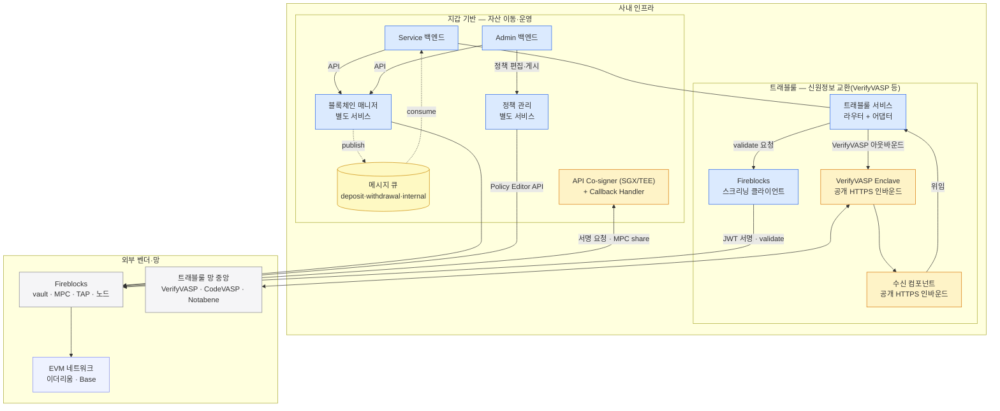

지갑 기반(블록체인 매니저)과 트래블룰의 배포 단위를 한 장에 모은다. 각 배치의 근거는 해당 시스템 장에 있고, 이 장은 그 결론만 조립한다.
구역은 사내 인프라와 외부 벤더·망 둘이다 — 트래블룰 구성요소도 지갑 기반과 **같은 망**에 있다.

## 한 장 그림

파랑 = 직접 만들고 운영하는 서비스, 노랑 = 벤더가 강제해서 우리 인프라 안에 두는 설치물, 회색 = 외부 벤더·망. 안쪽의 지갑 기반·트래블룰 묶음은 역할 구분일 뿐 망 경계가 아니다 — 둘은 같은 망에 있다.

## 배포 단위 목록

| 시스템 | 배포 단위 | 무엇 | 상세 |
|---|---|---|---|
| 지갑 기반 | Service 백엔드 | 고객 런타임 — 계정·주소·입금·출금·잔액 | [블록체인매니저 0장](../../블록체인매니저/설계/00-cast.md) |
| 지갑 기반 | Admin 백엔드 | 운영·거버넌스 — Service 와 물리 분리(배포·권한·감사 경계) | [블록체인매니저 0장](../../블록체인매니저/설계/00-cast.md) |
| 지갑 기반 | 블록체인 매니저 | 벤더 연동 전담 별도 서비스 — API 제공 · 내부 폴링 · 큐 publish | [블록체인매니저 0장](../../블록체인매니저/설계/00-cast.md) |
| 지갑 기반 | 메시지 큐 | 토픽 3개(deposit·withdrawal·internal) + 막힘 경보는 별도 채널 | [블록체인매니저 4장](../../블록체인매니저/설계/04-detect-confirm.md) |
| 지갑 기반 | 정책 관리 서비스 | 벤더 정책 편집·게시 대행 — 거래 제출 자격과 분리 | [정책관리 0장](../../정책관리/설계/00-scope.md) |
| 지갑 기반 | API Co-signer + Callback Handler | 보안 존(SGX/TEE) 설치물 — 키 share 공동서명 · 서명 직전 승인·거부 | [블록체인매니저 6장](../../블록체인매니저/설계/06-withdrawal.md) |
| 트래블룰 | 트래블룰 서비스 | 게이트 — 라우터 + 어댑터, 상대 VASP 와의 신원정보 교환 전담 | [트래블룰 12장](../../트래블룰/설계/12-physical-layout.md) |
| 트래블룰 | 수신 컴포넌트 | 상대 VASP 발신 수신 — 별도 배포·얇게 · 공개 HTTPS | [트래블룰 12장](../../트래블룰/설계/12-physical-layout.md) |
| 트래블룰 | VerifyVASP Enclave | 벤더 강제 설치물 — 키·PII · 공개 HTTPS | [트래블룰 12장](../../트래블룰/설계/12-physical-layout.md) |
| 트래블룰 | Fireblocks 스크리닝 클라이언트 | 전용 API user 로 validate 호출 — 자격은 시크릿 스토어/KMS 격리 | [트래블룰 8장](../../트래블룰/설계/08-gate-port.md) |
| 트래블룰 | CODE-Cipher | **조건부** — CODE 직접 어댑터를 붙일 때만 설치 | [트래블룰 6장](../../트래블룰/설계/06-verifyvasp-parallel-gate.md) |

## 저장소

| 저장소 | 소유 | 담는 진실 |
|---|---|---|
| 백엔드 DB | 두 백엔드 | 회계 진실 — 고객 원장·귀속·출금 지시 상태. 벤더가 바뀌어도 남는다 |
| 매니저 DB | 블록체인 매니저 | 벤더 번역·운영 상태 — ref↔vault↔주소 매핑 · 이벤트 체크포인트 |
| 대기함 | 월렛 백엔드 | 트래블룰 사전 검증·승인 기록 — 입금 대조의 재료 |
| 시크릿 스토어/KMS | 인프라 공통 | 전용 API user 자격(API키·RSA 서명키) — 서비스 밖 격리 |

## 경계의 요점

- **공개 인바운드는 트래블룰 쪽 둘뿐** — VerifyVASP Enclave 와 수신 컴포넌트. 나머지 사내 구성 요소는 전부 아웃바운드만 연다.
- **벤더 API user 자격은 서비스마다 분리** — 매니저(거래 제출)·정책 관리(정책 편집)·스크리닝 클라이언트(validate). 한 서비스가 장악돼도 다른 자격으로 번지지 않는다.
- **자산 이동 경로와 트래블룰 검증 경로는 분리** — validate 호출은 제출·전파 경로를 타지 않는다.

## 열린 결정

1. **런타임 환경** — 사내 구성 요소의 실행 기반(컨테이너 오케스트레이션·클라우드/온프렘)은 아직 어느 장에도 없다.
2. **큐 구현체** — 토픽·파티션 키(계정 단위)·오프셋 커밋은 확정, 제품 선정은 미정.
3. **정책 관리 코드베이스** — 완전 별도 vs 매니저와 같은 코드베이스의 별도 배포 단위 ([정책관리 0장](../../정책관리/설계/00-scope.md) 열린 결정).

## 관련

- [블록체인매니저 0장 — 구성 요소](../../블록체인매니저/설계/00-cast.md)
- [트래블룰 12장 — 물리 배치](../../트래블룰/설계/12-physical-layout.md)
- [정책관리 0장 — 범위와 경계](../../정책관리/설계/00-scope.md)
