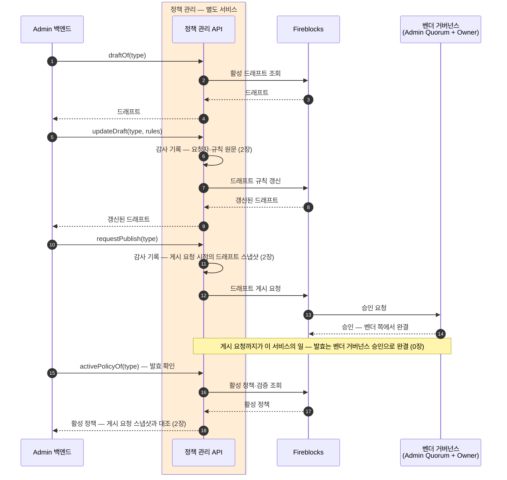

정책 변경 한 건이 지나는 길 — 드래프트 갱신, 게시 요청, 벤더 거버넌스 승인, 발효 확인.
Admin 백엔드가 부르는 오퍼레이션과 벤더 표면 매핑, 시퀀스를 정리한다.

## 오퍼레이션

```kotlin
fun activePolicyOf(type: PolicyType): PolicyView        // 활성 정책·검증 결과 조회
fun draftOf(type: PolicyType): PolicyDraft              // 활성 드래프트 조회
fun updateDraft(type: PolicyType, rules: DraftRules): PolicyDraft   // 드래프트 규칙 갱신
fun requestPublish(type: PolicyType): PublishReceipt    // 게시 요청 — 발효는 벤더 거버넌스 승인
fun screeningPolicyOf(kind: ScreeningKind): PolicyView  // AML·트래블룰 스크리닝 정책 조회 (읽기 전용)
```

`rules` 는 벤더 규칙 구조 그대로 운반한다 — 이 서비스는 규칙을 파싱·번역하지 않고 감사 기록(2장)과 전달만 한다.

## 벤더 표면 매핑

Policy Editor **V2** 를 기준으로 한다 — 드래프트와 게시 요청이 분리돼 있어 갱신 → 게시 요청 → 승인 흐름과 맞는다. Beta 표면은 쓰지 않는다.

| 오퍼레이션 | 벤더 표면 |
|---|---|
| `activePolicyOf` | 활성 정책 및 검증 조회 (정책 유형별) |
| `draftOf` | 활성 드래프트 조회 (정책 유형별) |
| `updateDraft` | 드래프트 규칙 업데이트 |
| `requestPublish` | 드래프트 게시 요청 |
| `screeningPolicyOf` | AML · Travel Rule 스크리닝 정책 조회 (Compliance) |

## 변경 한 건의 시퀀스



## 규칙

- **승인 대기 상태의 정본은 벤더다** — 게시 요청 뒤 승인이 어디까지 왔는지는 벤더 Console 이 보여준다. 이 서비스는 요청 사실과 시점만 기록한다.
- **발효 확인은 재조회로 한다** — 승인이 끝난 뒤 `activePolicyOf` 로 활성 정책을 받아 게시 요청 시점의 스냅샷과 대조한다(2장). 다르면 벤더 쪽에서 수정된 채 승인된 것이라 경보 대상이다.
- 스크리닝 정책(AML·트래블룰)은 조회만 — 편집 표면이 생기면 별도 결정.

## 관련

- [0장 — 범위와 경계](00-scope.md)
- [2장 — 감사와 자격](02-audit-access.md)
