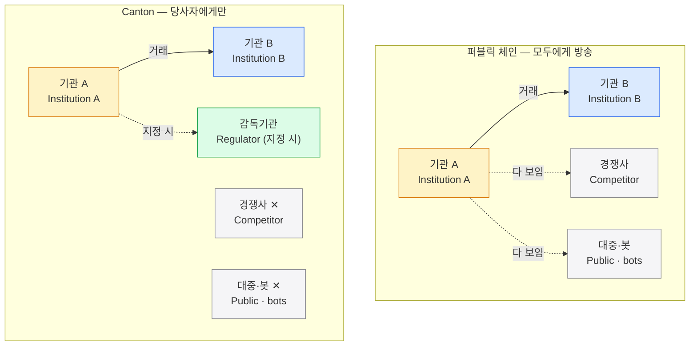

Canton은 공개-허가형 프라이버시 보존 네트워크로, 한 거래를 그 거래의 당사자에게만 전달한다.
퍼블릭 체인이 모든 거래를 전원에게 방송하는 것과 달리, Canton에서 무관한 제3자가 보는 것은 0건이다.

## 한 가지 원리 — 거래는 당사자에게만 간다

이 코스를 관통하는 원리는 하나다. **거래는 그 거래의 당사자에게만 간다.**

퍼블릭 체인은 모든 거래를 모두에게 방송한다. 금액·상대·잔액·타이밍이 경쟁사에게도, 대중과 봇에게도 보인다. Canton은 반대다. Canton은 **공개-허가형 프라이버시 보존 네트워크**다 — 누구나 규칙에 따라 참여할 수 있지만(공개-허가형), 한 거래는 **그 거래의 당사자에게만** 전달된다(프라이버시 보존).

처음 보는 용어가 나와도 괜찮다. 이 원리 하나만 잡으면 나머지는 단계마다 풀린다.

## 누가 이 코스를 읽나 — 대상·전제·읽는 법

| 구분 | 내용 |
|---|---|
| **대상** | Canton·Daml을 처음 보는 개발자·기획자. 기관 간 정산(DvP)을 예로 개념부터 코드까지 한 흐름으로 따라간다. |
| **전제** | 블록체인·분산원장 **기초 개념** 정도면 된다. 몰라도 따라올 수 있게 썼다. Daml 문법 선행 지식은 필요 없다. |
| **읽는 법** | 각 장은 **개념**을 그림으로 먼저 보고, **개발자 시점** 블록에서 실제 Daml·파티·choice로 잇는다. 개발이 급하지 않으면 개발자 블록은 건너뛰어도 된다. |

처음 보는 말이 나와도 지금 외울 필요 없다. **파티·밸리데이터(참여자 노드)·Synchronizer**는 4장에서, **시퀀서·미디에이터** 상세는 6장에서, **signatory(서명자)·observer(관찰자)·propose-accept(제안-수락)**는 5장·9장에서 정식으로 다룬다.

## 코스 지도 — 이 12장이 다루는 것

개념 → 코드 순서로 열두 장이 한 흐름으로 이어진다. 각 장은 다음을 다룬다.

- **0장 개요** — 한 가지 원리(당사자에게만)와 코스 안내.
- **1장 문제** — 퍼블릭 체인이 **왜** 기관 금융에 안 맞는지.
- **2장 세 기둥** — Canton의 해법을 떠받치는 세 축.
- **3장 한 거래 뷰** — 한 거래가 당사자별 **뷰(view)**로 쪼개지는 방식.
- **4장 파티·구성요소** — 파티, 밸리데이터(참여자 노드), Synchronizer 등 등장 요소.
- **5장 Daml** — 템플릿·choice·signatory(서명자)로 규칙을 쓰는 언어.
- **6장 아키텍처** — 시퀀서·미디에이터를 포함한 망 구조.
- **7장 원장 모델** — eUTXO(확장 UTXO)·ACS(활성 컨트랙트 집합)로 보는 상태.
- **8장 트랜잭션 흐름** — 한 거래가 제출되어 확정되기까지.
- **9장 정산·프라이버시** — DvP(정산)·PvP와 프라이버시가 맞물리는 지점.
- **10장 수수료** — Canton Coin(CC)·Amulet과 트래픽(traffic) 과금.
- **11장 신뢰 모델** — 선택적 신뢰로 짜는 신뢰 경계.

## 쉬운 한 컷 — 누가 거래를 보나

같은 거래 한 건을 두고, 퍼블릭 체인과 Canton에서 누가 그것을 보는지 대비한다.

퍼블릭 체인에서는 기관 A와 B의 거래 한 건이 경쟁사·대중·봇 **누구에게나** 보인다 — 금액·상대·잔액·타이밍이 함께 새어 나간다. Canton에서는 같은 거래를 **당사자 A·B**(와 지정된 감독기관)만 본다. 경쟁사도, 대중도, 봇도 그 거래에 닿지 못한다 — 무관한 제3자가 보는 것은 **0건**이다.

## 다음으로

여기까지가 이 코스를 관통하는 한 가지 원리다. 다음 장에서는 퍼블릭 체인이 **왜** 기관 금융에 안 맞는지(1장 문제)를 짚고, 이어서 Canton의 해법(2장 세 기둥)과 한 거래의 처리 과정을 차례로 본다.
