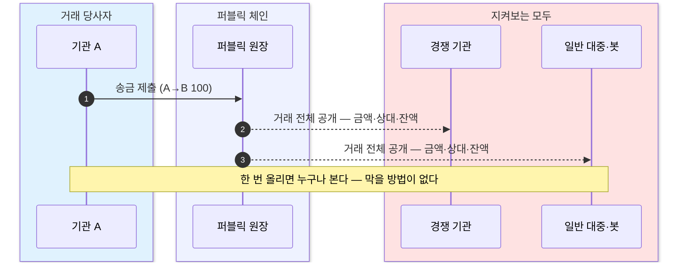

퍼블릭 블록체인의 힘은 모두가 같은 장부를 검증한다는 데 있지만 그 대가가 완전한 투명성이라, 금액·상대·잔액·타이밍이 누구에게나 드러나 기관 금융에서는 결격이 된다.
가리면 남이 검증 못 하고 검증하게 하면 드러나는 프라이버시 ↔ 무결성의 택일 딜레마를 짚고, 이를 동시에 푸는 2장으로 넘긴다.

## 힘의 대가는 완전한 투명성

퍼블릭 블록체인의 힘은 **모두가 같은 장부를 검증**한다는 데 있다. 그 대가가 **완전한 투명성**이다 — 거래 금액, 거래 상대, 잔액, 타이밍이 누구에게나 보인다.

- 거래 패턴만 모아도 그 기관의 **포지션과 전략이 드러난다**. 그래서 이 투명성은 기관 금융에서 강점이 아니라 **결격 사유**가 된다.
- 주소는 익명이라 "**KYC를 통과한 상대와만 거래**" 같은 규제 요건을 강제하기도 어렵다. 누가 상대인지 주소만으로는 묶이지 않기 때문이다.

## 한 번 올리면 누구나 본다

퍼블릭 체인에서는 한 거래가 제출되는 순간 경쟁 기관도, 일반 대중·봇도 그 내용을 그대로 본다. 막을 방법이 없다.

한 건이 원장에 올라가는 순간 그 내용은 **거래 당사자의 손을 떠난다**. 경쟁 기관은 금액과 상대를 그대로 읽어 포지션을 역산하고, 대중·봇은 같은 정보로 앞질러 움직인다. 공개 범위를 거래자가 고를 수 없다는 것 — 이것이 퍼블릭 체인의 기본값이다.

## 핵심 딜레마 — 프라이버시 ↔ 무결성

문제의 뿌리는 하나다.

- **가리면** 다른 참여자가 검증할 수 없다.
- **검증하게 하려면** 내용이 드러나야 한다.

즉 **프라이버시**와 **무결성**은 지금까지 둘 중 하나를 골라야 하는 관계였다. 기관이 쓸 수 있으려면 둘 다 필요한데, 퍼블릭 체인의 설계로는 택일이 강제된다.

이 택일을 깨는 것 — 가려도 검증되고, 검증해도 안 드러나게 하는 것 — 이 다음 2장의 세 기둥이 하는 일이다.
