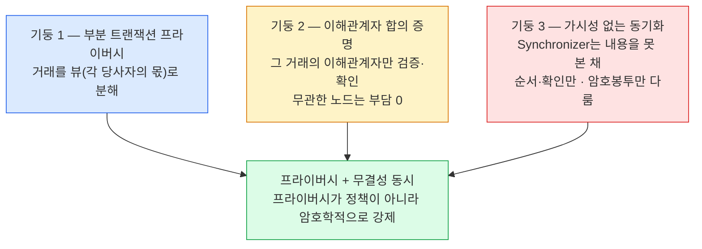

Canton은 거래를 통째로 공유하지 않고 검증에 필요한 사람에게 필요한 조각만 준다.
이 발상을 상호 의존적인 세 기둥으로 구현해 프라이버시와 무결성을 동시에 세운다.

## 발상 — 통째로가 아니라 필요한 조각만

Canton의 발상은 하나다. **거래를 통째로 공유하지 말고, 검증에 필요한 사람에게 필요한 조각만 주자.** 이를 세 가지 아키텍처 기둥으로 구현하는데, 셋은 상호 의존적이라 따로 떼면 성립하지 않는다.

## 세 기둥

| 기둥 | 이름 | 하는 일 |
|---|---|---|
| **기둥 1** | 부분 트랜잭션 프라이버시 | 거래를 **뷰(view)**(각 당사자의 몫)로 분해한다. 트랜잭션 자체가 누가 무엇을 보는지 정의한다 (상세는 3장). |
| **기둥 2** | 이해관계자 합의 증명 | 전역 검증이 아니라 **그 거래의 이해관계자만** 검증·확인한다. 전역 공개 없이도 무결성이 서고, 무관한 노드는 부담이 없다. |
| **기둥 3** | 가시성 없는 동기화 | Synchronizer(시퀀서+미디에이터)가 **내용을 못 본 채** 순서와 확인만 맞춘다 — 암호봉투만 다룬다. |

셋은 서로를 떠받친다. 뷰로 조각을 나눠도(기둥 1) 그 조각을 이해관계자만 검증하지 않으면(기둥 2) 프라이버시가 새고, 조각을 나르는 동기화 계층이 내용을 읽으면(기둥 3) 다시 전역 공개로 돌아간다.

## 세 기둥이 만드는 것

세 기둥은 각자 다른 층을 맡지만 결론은 하나로 모인다 — 프라이버시와 무결성을 함께 세운다. 셋 다 갖춰졌을 때 프라이버시는 운영 정책이나 접근 통제 같은 **약속**이 아니라 **암호학적으로 강제되는 성질**이 된다. 볼 수 없게 막는 게 아니라, 애초에 볼 것이 주어지지 않는다.

## 왜 기둥 3이 특히 중요한가

마지막 기둥이 핵심이다. Synchronizer는 자기가 순서를 매기는 거래의 **내용을 읽지 못하므로 부정행위 자체가 불가능**하다. 순서·타임스탬프·라우팅은 알지만 금액·상대는 암호화돼 있다.

그래서 Synchronizer는 **"믿을 수 있는 중개자"가 아니라 "믿을 필요가 없는 중개자"**다. 신뢰를 요구하는 게 아니라, 신뢰가 필요 없도록 설계된 것이다 — 내용을 못 보는 중개자는 내용을 가지고 장난칠 수단이 없다.
